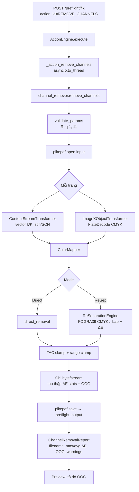
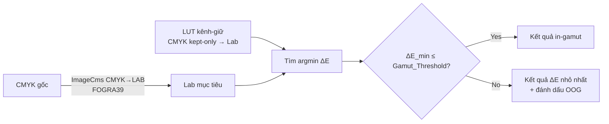

# Design Document — Channel Remover with color re-separation

## Overview

`Channel_Remover` là một action prepress mới cho phép in một file CMYK bằng ít mực hơn (4→3 hoặc 4→2) bằng cách bỏ một hoặc nhiều kênh process (C/M/Y/K). Tính năng cung cấp hai chế độ:

- **Direct_Removal_Mode** — đặt mọi `Removed_Channel` về 0, giữ nguyên `Kept_Channel`.
- **Re_Separation_Mode** — với mỗi màu CMYK gốc, chuyển sang Lab qua ICC FOGRA39 (LittleCMS2 / `PIL.ImageCms`), rồi tìm tổ hợp CMYK chỉ dùng `Kept_Channel` có `Delta_E` nhỏ nhất. Màu không tái tạo được (ΔE > `Gamut_Threshold`) bị đánh dấu `Out_Of_Gamut_Region` và preview tô đỏ.

### Quyết định thiết kế nền tảng

Thiết kế bám sát các quy ước đã có trong codebase để giảm rủi ro và đảm bảo nhất quán:

1. **Tái dùng kỹ thuật quét byte-level content stream** của `app/core/overprint_black.py` và `app/core/preserve_black.py`. Hai module này đã có vòng lặp quét token an toàn (bỏ qua string literal `( )`, hex string `< >`, dict `<< >>`, comment `%`, inline image `BI…EI`) và quản lý stack graphics state qua `q`/`Q`. `Channel_Remover` tổng quát hoá kỹ thuật này thành một scanner **biến đổi (transform) tại chỗ** thay vì chỉ chèn token. KHÔNG dùng regex thô trên content stream (Req 5.1, 5.2).
2. **ICC qua `PIL.ImageCms`** (backend LittleCMS2) — đúng thư viện `app/core/softproof.py` đang dùng (`getOpenProfile`, `buildTransform`, `applyTransform`). Không tự cài thư viện màu mới. Profile FOGRA39 lấy từ `settings.ICC_PROFILE_DIR / settings.DEFAULT_CMYK_PROFILE` (`app/assets/icc/FOGRA39.icc`).
3. **Đăng ký như một action** trong `app/core/action_engine.py`: thêm khoá `REMOVE_CHANNELS` vào `AVAILABLE_ACTIONS` và một handler `_action_remove_channels`, theo đúng mẫu `_action_set_black_overprint` (gọi hàm core đồng bộ qua `asyncio.to_thread`). Output ghi vào `RESULTS_DIR/preflight_output`, tải qua `GET /preflight/download/{filename}` (Req 9).
4. **pikepdf** để mở/ghi PDF và truy cập XObject ảnh (đồng bộ với toàn bộ core hiện có).

### Phạm vi MVP

Trong phạm vi: vector `k`/`K`, `scn`/`SCN` (DeviceCMYK), ảnh CMYK FlateDecode (DeviceCMYK & ICCBased 4 kênh), spot color (skip/convert), TAC clamp, OCG ẩn (option), preview OOG đỏ. Ngoài phạm vi: ảnh JPEG-CMYK (DCTDecode) — bỏ qua + cảnh báo; quy trình spectral/OpenColor.

## Architecture



### Thành phần và trách nhiệm

| Thành phần | Vị trí | Trách nhiệm |
|---|---|---|
| `remove_channels()` | `app/core/channel_remover.py` (mới) | Điều phối: validate → duyệt trang → ghi output → trả report |
| `ColorMapper` | cùng file | Áp một phép biến đổi CMYK→CMYK cho một màu đơn (chọn Direct/ReSep), rồi clamp |
| `ReSeparationEngine` | cùng file | FOGRA39 CMYK↔Lab qua ImageCms; build LUT kênh-giữ; tìm argmin ΔE; phân loại OOG |
| `ContentStreamTransformer` | cùng file | Quét byte-level (tái dùng kỹ thuật `overprint_black`), biến đổi toán hạng của `k`/`K`/`scn`/`SCN` |
| `ImageXObjectTransformer` | cùng file | Decode FlateDecode CMYK → biến đổi pixel (numpy + LUT) → encode lại |
| `REMOVE_CHANNELS` action | `app/core/action_engine.py` | Đăng ký + handler `_action_remove_channels` |
| Preview OOG | tái dùng `softproof`/`separations` raster | Render trang + tô đỏ vùng OOG |

### Luồng tái tách màu (Re_Separation_Mode)



`ReSeparationEngine` xây một **LUT thuận** một lần cho mỗi tập `Kept_Channel`: liệt kê các tổ hợp CMYK chỉ-dùng-kênh-giữ trên lưới bước (mặc định 5%, các kênh bỏ = 0), chuyển mỗi tổ hợp sang Lab qua FOGRA39, lưu `(Lab → CMYK kept-only)`. Với mỗi màu gốc, tìm điểm LUT có ΔE nhỏ nhất (CIE76). Cache theo tập kênh-giữ + bước lưới để dùng lại giữa vector và ảnh, và đảm bảo tính xác định (idempotent).

## Components and Interfaces

### `app/core/channel_remover.py`

```python
# Hằng số / cấu hình
PROCESS_CHANNELS = ("C", "M", "Y", "K")     # vị trí 0..3 trong tuple CMYK
DEFAULT_TAC_LIMIT = 360.0                    # % (Req 8.1)
DEFAULT_GAMUT_THRESHOLD = 5.0                # ΔE (Req: Gamut_Threshold mặc định 5)
DEFAULT_GRID_STEP = 5.0                       # % bước lưới LUT kênh-giữ

@dataclass
class ChannelRemovalParams:
    kept_channels: tuple[str, ...]            # tập con của {C,M,Y,K}, 1..3 phần tử
    mode: str                                 # "direct" | "reseparate"
    tac_limit: float = DEFAULT_TAC_LIMIT
    gamut_threshold: float = DEFAULT_GAMUT_THRESHOLD
    spot_handling: str = "skip"               # "skip" | "convert"
    process_hidden_layers: bool = False       # Req 12
    grid_step: float = DEFAULT_GRID_STEP

@dataclass
class ChannelRemovalReport:
    output_filename: str | None
    max_delta_e: float
    avg_delta_e: float
    out_of_gamut_count: int
    total_colors: int
    warnings: list[str]
    identical_to_original: bool               # False nếu tồn tại OOG (Req 4.4)

def remove_channels(input_path: str, output_path: str,
                    params: dict) -> ChannelRemovalReport:
    """Điểm vào chính. Luôn ghi output_path (kể cả bản sao khi không đổi)."""

def validate_params(params: dict) -> ChannelRemovalParams:
    """Req 1.3 (giữ cả 4 → từ chối), 1.4 (bỏ cả 4 → từ chối), 1.2 (1..3 OK)."""
```

### `ColorMapper`

```python
class ColorMapper:
    def __init__(self, params: ChannelRemovalParams,
                 engine: "ReSeparationEngine | None"): ...

    def map_color(self, cmyk: tuple[float, float, float, float]
                  ) -> tuple[tuple[float, float, float, float], float, bool]:
        """Trả (cmyk_kết_quả, delta_e, is_out_of_gamut).

        - direct: removed→0, kept giữ nguyên (Req 2.1, 2.2); delta_e báo cáo = ΔE đo được.
        - reseparate: argmin ΔE trên LUT kênh-giữ (Req 3.1, 3.3, 3.4).
        - Sau cùng: clamp range 0..100 và clamp TAC ≤ tac_limit (Req 8.2, 8.3).
        """
```

### `ReSeparationEngine`

```python
class ReSeparationEngine:
    def __init__(self, icc_path: str, kept_channels, grid_step: float): ...

    def to_lab(self, cmyk) -> tuple[float, float, float]:
        """CMYK→Lab qua FOGRA39 (ImageCms.buildTransform inMode='CMYK', outMode='LAB')."""

    def best_kept_only(self, target_lab) -> tuple[tuple, float]:
        """Trả (cmyk_kept_only, delta_e_min) — argmin trên LUT đã cache."""

    @staticmethod
    def delta_e_cie76(lab1, lab2) -> float: ...
```

Chi tiết ImageCms (đồng bộ `softproof.py`):
- `fogra = ImageCms.getOpenProfile(icc_path)`
- `lab = ImageCms.createProfile("LAB")`
- `tf = ImageCms.buildTransform(fogra, lab, "CMYK", "LAB", renderingIntent=ImageCms.Intent.RELATIVE_COLORIMETRIC)`
- Áp cho ảnh nhỏ 1×N pixel để chuyển hàng loạt màu (vector) hoặc cho cả ảnh XObject.

### `ContentStreamTransformer`

Tổng quát hoá `_scan_and_insert` của `overprint_black.py`. Giữ nguyên bộ quét token an toàn (`_WS`, `_DELIM`, nhánh `(`/`<`/`%`/`BI…EI`), stack `q`/`Q` theo dõi color space hiện hành của fill/stroke để biết `scn`/`SCN` có đang ở DeviceCMYK không.

```python
def transform_content_stream(data: bytes, mapper: ColorMapper,
                             cs_resources: dict) -> tuple[bytes, list[ColorHit]]:
    """Quét byte-level; với k/K (4 toán hạng) và scn/SCN (DeviceCMYK, 4 toán hạng),
    thay thế CHÍNH XÁC khoảng byte của 4 toán hạng số bằng giá trị đã map.
    Không sửa byte ngoài khoảng toán hạng đó (Req 5.5). Trả thêm danh sách ColorHit
    (cmyk_gốc, delta_e, oog) để tổng hợp report."""
```

Theo dõi color space để phân biệt `scn` DeviceCMYK (Req 5.4): đọc `cs`/`CS` operator và `/Resources/ColorSpace`; chỉ map khi color space hiện hành là `DeviceCMYK` (hoặc ICCBased N=4) và có đúng 4 toán hạng số. Spot/Separation/DeviceN xử lý theo `spot_handling` (Req 7).

### `ImageXObjectTransformer`

```python
def transform_image_xobject(xobj, pdf, mapper: ColorMapper) -> ImageHit | None:
    """Req 6: chỉ xử lý FlateDecode + (DeviceCMYK | ICCBased 4 kênh).
    - Decode → numpy array (H, W, 4).
    - Áp LUT/map vector hoá cho mọi pixel.
    - Encode lại FlateDecode, GIỮ NGUYÊN Width/Height/4 kênh/filter (Req 6.2).
    - DCTDecode → trả None + warning (Req 6.3)."""
```

### Đăng ký action (`action_engine.py`)

```python
# AVAILABLE_ACTIONS
"REMOVE_CHANNELS": {
    "title": "Gỡ kênh màu (Channel Remover)",
    "description": "Bỏ kênh process C/M/Y/K với chế độ xóa thẳng hoặc bù màu (re-separation) qua FOGRA39.",
    "engine": "pikepdf",
},

async def _action_remove_channels(self, pdf_path, output_path, params) -> bool:
    from app.core.channel_remover import remove_channels
    def _work():
        return remove_channels(pdf_path, output_path, params or {})
    report = await asyncio.to_thread(_work)
    # đính report (max/avg ΔE, OOG, warnings) vào log message
    return True
```

API `POST /preflight/fix` đã hỗ trợ `params` nên không cần endpoint mới. `FixResponse.output_filename` trả tên file để tải qua `GET /preflight/download/{filename}` (Req 9.2). Bổ sung các trường report (max/avg ΔE, OOG count, warnings) vào response để UI hiển thị cảnh báo (Req 4).

## Data Models

### CMYK & vị trí kênh

Màu CMYK biểu diễn bằng tuple `(c, m, y, k)` thang **0..100 (%)** trong logic; toán hạng `k`/`K`/`scn` trong PDF là 0..1 nên nhân/chia 100 ở biên đọc/ghi. Tập `Kept_Channel` là tập con của chỉ số `{0:C, 1:M, 2:Y, 3:K}`.

### Phép biến đổi màu

- **Direct**: `out[i] = in[i]` nếu `i ∈ kept`, ngược lại `0`.
- **Re-separation**: `out = argmin_{x ∈ KeptLUT} ΔE(Lab(in), Lab(x))`, trong đó `KeptLUT` chỉ chứa các tổ hợp có `x[i]=0 ∀ i ∉ kept`.
- **Clamp**: mỗi kênh `clamp(v, 0, 100)`; nếu `Σ out > tac_limit` thì scale giảm đồng đều các kênh > 0 để `Σ out = tac_limit` (giữ tỉ lệ tương đối, ưu tiên giữ hue).

### `ColorHit` / `ImageHit`

```python
@dataclass
class ColorHit:
    source_cmyk: tuple[float, float, float, float]
    result_cmyk: tuple[float, float, float, float]
    delta_e: float
    out_of_gamut: bool

@dataclass
class ImageHit:
    xobj_name: str
    pixels: int
    max_delta_e: float
    out_of_gamut_pixels: int
```

`ChannelRemovalReport.max_delta_e`/`avg_delta_e` tổng hợp trên toàn bộ `ColorHit` + đại diện pixel ảnh (Req 4.1). `out_of_gamut_count` đếm hit có `out_of_gamut=True`. `identical_to_original = (out_of_gamut_count == 0)` để không tuyên bố "giống hệt" khi có OOG (Req 4.4).

### Tham số (params dict từ API)

```jsonc
{
  "kept_channels": ["C", "M", "K"],   // 1..3 phần tử
  "mode": "reseparate",                // "direct" | "reseparate"
  "tac_limit": 360,
  "gamut_threshold": 5,
  "spot_handling": "skip",            // "skip" | "convert"
  "process_hidden_layers": false,
  "grid_step": 5
}
```

## Correctness Properties

*A property is a characteristic or behavior that should hold true across all valid executions of a system — essentially, a formal statement about what the system should do. Properties serve as the bridge between human-readable specifications and machine-verifiable correctness guarantees.*

### Property 1: Direct removal zeroes removed channels and preserves kept channels

*For any* màu CMYK gốc và *for any* tập `Kept_Channel` hợp lệ (1..3 phần tử), khi áp `Direct_Removal_Mode`, mỗi `Removed_Channel` của kết quả phải bằng 0 và mỗi `Kept_Channel` phải giữ nguyên giá trị gốc (xét trước bước clamp TAC).

**Validates: Requirements 2.1, 2.2**

### Property 2: Result color validity invariant

*For any* màu CMYK gốc, *for any* mode và *for any* `tac_limit` hợp lệ, màu kết quả phải thoả đồng thời: mọi `Removed_Channel` bằng 0; mọi kênh nằm trong [0, 100]; và tổng phủ mực (TAC) ≤ `tac_limit`.

**Validates: Requirements 3.2, 8.2, 8.3**

### Property 3: Re-separation chooses the minimum Delta_E kept-only combination

*For any* màu CMYK gốc, ở `Re_Separation_Mode` kết quả phải là tổ hợp chỉ-dùng-`Kept_Channel` có `Delta_E` nhỏ nhất so với màu gốc trên lưới ứng viên: không tồn tại ứng viên kept-only nào khác có `Delta_E` nhỏ hơn kết quả.

**Validates: Requirements 3.1**

### Property 4: In-gamut colors reproduce within threshold

*For any* màu CMYK chỉ dùng các `Kept_Channel` (do đó nằm trong gamut của tập kênh-giữ) dùng làm màu gốc, áp `Re_Separation_Mode` cho ra kết quả có `Delta_E` ≤ `Gamut_Threshold`.

**Validates: Requirements 3.3, 13.1**

### Property 5: Out-of-gamut classification, warning, and honesty

*For any* màu CMYK gốc, cờ `out_of_gamut` của kết quả bằng đúng `(Delta_E_min > Gamut_Threshold)` và kết quả vẫn là tổ hợp `Delta_E` nhỏ nhất; *for any* file đầu vào, nếu tồn tại ít nhất một màu `Out_Of_Gamut` thì report phải chứa cảnh báo OOG và `identical_to_original` phải bằng `False`.

**Validates: Requirements 3.4, 4.2, 4.4**

### Property 6: Aggregate Delta_E statistics are correct

*For any* tập màu đã xử lý, `max_delta_e` trong report bằng giá trị `Delta_E` lớn nhất của tập và `avg_delta_e` bằng trung bình cộng `Delta_E` của tập.

**Validates: Requirements 4.1**

### Property 7: Scanner only modifies CMYK color operands

*For any* content stream, sau khi biến đổi, mọi byte KHÔNG thuộc khoảng 4 toán hạng số của một toán tử màu CMYK được biến đổi đều giữ nguyên bytewise; cụ thể, mọi chuỗi giống toán tử màu nằm trong string literal `( )`, inline image (`BI`/`ID`…`EI`), hoặc comment `%` đều không bị thay đổi.

**Validates: Requirements 5.2, 5.5**

### Property 8: Vector CMYK color operators are transformed

*For any* content stream chứa toán tử `k`/`K` với 4 toán hạng, hoặc `scn`/`SCN` đang ở color space DeviceCMYK (hoặc ICCBased 4 kênh) với 4 toán hạng, các toán hạng CMYK đó sau biến đổi bằng đúng `map_color(cmyk)` theo mode đã chọn.

**Validates: Requirements 5.3, 5.4**

### Property 9: Image XObject transform maps pixels and preserves structure

*For any* `CMYK_Image_XObject` dùng FlateDecode với DeviceCMYK hoặc ICCBased 4 kênh, mỗi pixel kết quả bằng `map_color` của pixel gốc, và ảnh kết quả giữ nguyên Width, Height, số kênh (4) và bộ lọc FlateDecode.

**Validates: Requirements 6.1, 6.2**

### Property 10: Skip option preserves spot colors

*For any* content stream chứa toán tử/color space Separation hoặc DeviceN, khi `spot_handling = "skip"`, mọi byte của các toán tử và color space đó giữ nguyên bytewise.

**Validates: Requirements 7.2**

### Property 11: Re-separation is idempotent on kept-only colors

*For any* màu CMYK chỉ dùng `Kept_Channel` (trong gamut), áp `Re_Separation_Mode` hai lần liên tiếp cho ra cùng một màu kết quả: `map(map(x)) == map(x)`.

**Validates: Requirements 13.3**

### Property 12: All pages are processed; no-op pages preserved

*For any* PDF nhiều trang, phép gỡ kênh được áp cho mọi trang (mọi màu CMYK trên mọi trang đều được map); với trang không chứa `Process_Channel` cần biến đổi, nội dung trang giữ nguyên và trang vẫn xuất hiện trong file kết quả.

**Validates: Requirements 11.3, 11.4**

### Property 13: Preview/output parity within threshold

*For any* trang kết quả, `Delta_E` giữa raster preview và raster output cho cùng một vùng phải ≤ `Gamut_Threshold`.

**Validates: Requirements 10.2**

### Property 14: Kept-channel set validity

*For any* tập con của {C, M, Y, K}: nếu kích thước thuộc [1, 3] thì `validate_params` chấp nhận; nếu kích thước bằng 0 (bỏ cả 4) hoặc bằng 4 (giữ cả 4) thì bị từ chối với thông báo tương ứng.

**Validates: Requirements 1.2, 1.3, 1.4**

## Error Handling

| Tình huống | Xử lý | Yêu cầu |
|---|---|---|
| File 0 byte | `validate_input` ném lỗi mô tả "file rỗng"; không tạo output | 11.1 |
| File không phải PDF hợp lệ | `pikepdf.open` thất bại → bắt và trả lỗi "PDF không hợp lệ" | 11.2 |
| Giữ cả 4 kênh | `validate_params` từ chối: "không có kênh nào bị gỡ" | 1.3 |
| Bỏ cả 4 kênh (kept rỗng) | `validate_params` từ chối: "phải giữ ít nhất một kênh" | 1.4 |
| File không có nội dung CMYK | Ghi bản sao hợp lệ + warning "không có kênh nào bị thay đổi" | 11.5 |
| Ảnh DCTDecode (JPEG-CMYK) | Bỏ qua ảnh + warning "JPEG-CMYK chưa hỗ trợ ở phiên bản này" | 6.3 |
| ICC FOGRA39 không tìm thấy | Ném `FileNotFoundError` rõ ràng (giống `_action_convert_to_cmyk`) | 3.1 |
| `scn`/`SCN` không ở DeviceCMYK (Separation/DeviceN/Pattern) | Không map ở chế độ skip; theo `spot_handling` ở chế độ convert | 7.2, 7.3 |
| TAC kết quả vượt limit | Clamp giảm tỉ lệ các kênh > 0 về `tac_limit` | 8.2 |

Mẫu xử lý lỗi bám theo `ActionEngine.execute`: exception được bắt, trả `ActionResult(success=False, error=repr(e), log=[...])`, không để lộ chi tiết nhạy cảm; thông điệp tiếng Việt như các action khác. Mọi nhánh đều đảm bảo `output_path` được ghi khi xử lý "no-op" thành công (bản sao hợp lệ) để đồng bộ quy ước `force_pure_black_to_gray`/`apply_black_overprint`.

## Testing Strategy

Môi trường: chạy toàn bộ test bằng venv dự án `backend\venv\Scripts\python.exe` (Req 13.4).

### Property-based testing

PBT phù hợp với tính năng này vì lõi là các **hàm thuần**: phép biến đổi màu CMYK→CMYK, chuyển đổi CMYK↔Lab + `Delta_E`, scanner content stream, và clamp TAC — tất cả đều có thuộc tính phổ quát (invariant, round-trip, idempotence, argmin, bảo toàn cấu trúc).

- Thư viện: **Hypothesis** (đã dùng trong dự án — xem `backend/.hypothesis/`). KHÔNG tự cài đặt PBT từ đầu.
- Tối thiểu **100 iterations** mỗi property test.
- Mỗi test gắn comment tham chiếu property theo định dạng: `# Feature: channel-remover, Property {number}: {property_text}`.
- Mỗi Correctness Property (1..14) hiện thực bằng **một** property test.
- Generators:
  - Màu CMYK: 4 float trong [0, 100]; biến thể "kept-only" (kênh bỏ = 0) cho Property 4, 11.
  - Tập kênh-giữ: tập con của {C, M, Y, K} (gồm cả rỗng và đủ 4 cho Property 14).
  - Content stream tổng hợp: chèn token màu thật + token màu giả trong `( )`, `BI…EI`, `%` (Property 7, 8, 10).
  - Ảnh CMYK: numpy `(H, W, 4)` ngẫu nhiên, encode FlateDecode (Property 9).
- `Delta_E` đo bằng LittleCMS2 qua `PIL.ImageCms` với FOGRA39 thật (Property 4, 5, 13 — Req 13.1).

### Unit tests (ví dụ & edge case)

- Validate params: giữ cả 4 / bỏ cả 4 / TAC mặc định 360 / spot_handling hợp lệ (Req 1.1, 1.3, 1.4, 7.1, 8.1).
- Edge: file 0 byte, PDF không hợp lệ, file không CMYK → bản sao + warning (Req 11.1, 11.2, 11.5).
- Ảnh DCTDecode bị bỏ qua + warning (Req 6.3).
- Spot convert-first với spot đã biết → CMYK rồi gỡ kênh (Req 7.3).
- OCG ẩn: option tắt giữ nguyên / bật áp gỡ kênh (Req 12.2, 12.3).
- Preview tô đỏ vùng OOG (Req 4.3).

### Integration & smoke tests

- **Raster (pypdfium2)**: render file output, tách separations (tái dùng `SeparationEngine`), xác nhận kênh bỏ ≈ 0 và file render được (Req 13.2).
- **Parity**: render preview và output trên cùng artifact raster, đo `Delta_E` per-region ≤ `Gamut_Threshold` (Req 10.2 — cũng là Property 13).
- **API**: `POST /preflight/fix` với `action_id=REMOVE_CHANNELS` → ghi vào `RESULTS_DIR/preflight_output`, `output_filename` tải được qua `GET /preflight/download/{filename}` (Req 9.1, 9.2).
- **Smoke**: `REMOVE_CHANNELS` có trong `AVAILABLE_ACTIONS` và có handler `_action_remove_channels` (Req 9.3).
