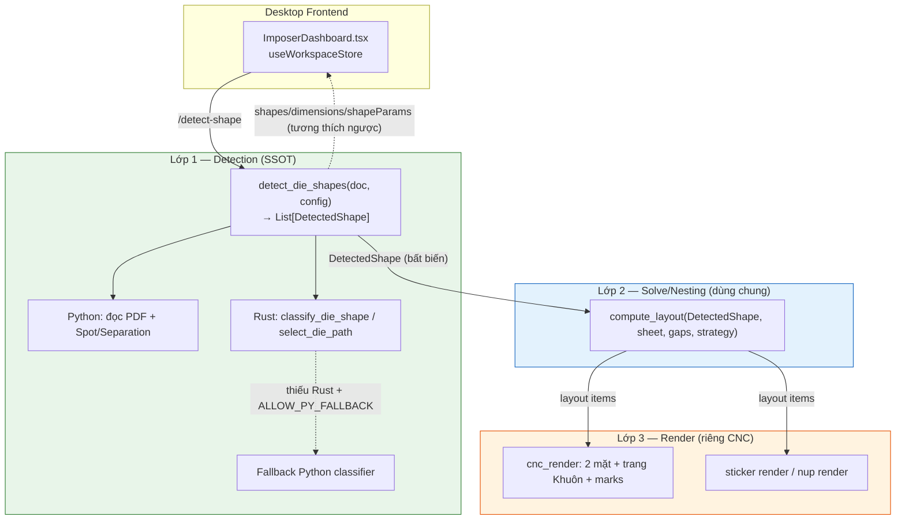
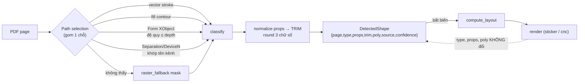
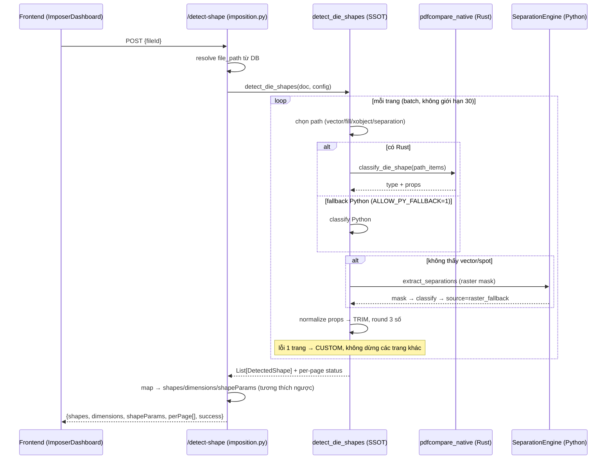
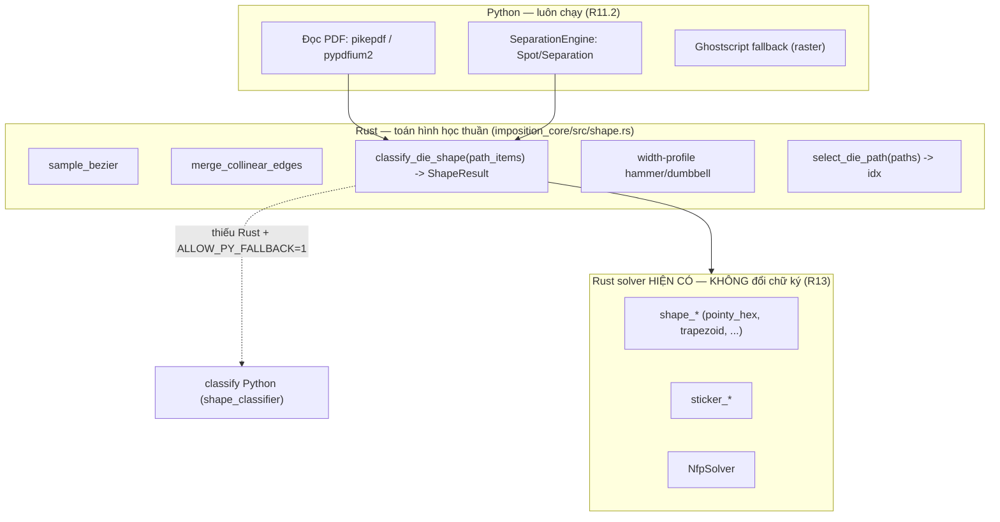

# Design Document — Die Shape Detection SSOT

## Overview

Tài liệu thiết kế này hiện thực hoá nguyên lý **"Detect once, flow everywhere"** cho cơ chế nhận diện hình học đường khuôn bế dùng chung giữa **Bình Tem Bế** (Sticker die-cut) và **Bình Bế Rớt CNC** (CNC routed die-cut, 2 mặt + trang Khuôn).

Vấn đề cốt lõi đã audit (xem `requirements.md`): `shape_type` hiện bị phân loại tới **3 lần** ở 3 nơi độc lập (`/detect-shape`, `compute_sticker_layout_for_page`, `get_optimal_head_to_tail_overlap`), heuristic chọn đường khuôn giòn, lỗi một trang làm hỏng cả file, preview lệch output, CNC gang bin-pack chữ nhật làm mất hình thật, và tồn tại 2 enum `ShapeType` trùng lặp.

Giải pháp đích là một **kiến trúc 3 lớp** với một **contract `DetectedShape`** chuẩn hoá làm nguồn sự thật duy nhất (SSOT):

- **Lớp 1 — Detection (SSOT):** một hàm `detect_die_shapes(doc, config) -> List[DetectedShape]` gom mọi heuristic chọn-path; phân loại đúng một lần; chuẩn hoá props về đơn vị TRIM.
- **Lớp 2 — Solve/Nesting (dùng chung):** `compute_layout(detected_shape, sheet, gaps, strategy)` cho Tem Bế, N-up die-cut và CNC gang. Không tái phân loại.
- **Lớp 3 — Render CNC (riêng):** 2 mặt (front/back lật gương), trang Khuôn, boong/duplex marks — chỉ thêm hành vi, không đụng `shape_type`.

`DetectedShape` chảy **bất biến** từ Lớp 1 → Lớp 2 → Lớp 3. Không lớp nào dưới Detection được phân loại lại.

> **Phạm vi thiết kế.** Tài liệu này tập trung vào: contract dữ liệu, ranh giới lớp, hợp nhất heuristic nhận diện, cô lập lỗi theo trang, propagate bất biến, parity preview==output, CNC gang dùng hình thật, gộp enum, ranh giới Rust/Python, và chiến lược kiểm thử. Không thay đổi thuật toán nesting/NFP đã có, không thay đổi cơ chế license. (Truy vết: toàn bộ Requirements 1–15.)

### Bản đồ Requirement → Mục thiết kế

| Requirement | Mục thiết kế chính |
|---|---|
| R1 Contract DetectedShape | Data Models §`DetectedShape`; Components §Detection |
| R2 Detect một lần | Architecture §Ranh giới lớp; Components §Layout |
| R3 Robust path selection | Components §`detect_die_shapes`; §Path selection pipeline |
| R4 Per-page error isolation | Error Handling §Per-page isolation |
| R5 Không giới hạn 30 trang | Components §Batch processing |
| R6 Lan truyền bất biến | Architecture §Data flow; Components §`compute_layout` |
| R7 Parity preview==output | Components §Parity; Testing §Parity |
| R8 CNC gang dùng hình thật | Components §CNC gang qua compute_layout |
| R9 Bảo toàn đặc thù CNC | Components §CNC Render Layer |
| R10 Thống nhất enum | Data Models §`ShapeType`; Migration Phase 0 |
| R11 Rust classifier + fallback | Components §Rust/Python boundary |
| R12 Fail-fast Rust cho layout | Components §Rust policy; Error Handling |
| R13 Không hồi quy solver Rust | Components §Rust boundary; Testing |
| R14 Tương thích ngược | Data Models §Backward-compat mapping |
| R15 Khả năng kiểm thử | Testing Strategy; Correctness Properties |

---

## Architecture

### Kiến trúc 3 lớp



**Bất biến kiến trúc (Architectural Invariant) — Truy vết R2:**
1. Chỉ Lớp 1 được gọi `classify_shape`/`detect_shape`. Lớp 2 và Lớp 3 đọc `type`/`props` từ `DetectedShape`, không gọi hàm phân loại (R2.1–R2.4).
2. NFP chỉ lấy `base_poly` từ `DetectedShape`, không được ghi đè `type` (R2.5, R2.6).
3. Lớp 3 chỉ thêm hành vi render (2 mặt, Khuôn, marks), không sửa `type`/`props`/`poly` (R9.1).

### Luồng dữ liệu `shape_type` (detect → contract → layout → render)



`shape_type` được xác định **đúng một lần** tại bước `classify`. Mọi lớp sau chỉ đọc lại từ `DetectedShape`. (Truy vết R1.1–R1.3, R2.1–R2.6, R6.1–R6.3.)

### Sequence cho endpoint `/detect-shape`



(Truy vết R3, R4, R5, R11, R14.1.)

### Vị trí mã nguồn (module map)

| Lớp | File | Vai trò sau tái cấu trúc |
|---|---|---|
| L1 | `backend/app/workers/die_detection.py` *(mới)* | Chứa `detect_die_shapes`, contract `DetectedShape`, path-selection hợp nhất |
| L1 | `backend/app/workers/shape_types.py` *(mới)* | Enum `ShapeType` thống nhất (SSOT enum) |
| L1 | `backend/app/workers/shape_classifier.py` | Wrapper Python mỏng + fallback; import enum từ `shape_types` |
| L1 | `backend/app/workers/shape_analyzer.py` | Chỉ còn raster-mask helpers; bỏ enum trùng, import từ `shape_types` |
| L1 | `backend/app/core/separations.py` | Giữ nguyên (Python I/O Spot/Separation) |
| L2 | `backend/app/workers/imposition_layout.py` *(mới/gộp)* | `compute_layout(DetectedShape, ...)` — facade dùng chung |
| L2 | `sticker_imposer_pkg/layout_compute.py` | Bỏ re-classify + NFP override; nhận `DetectedShape` |
| L2 | `nup_diecut.py` | NFP chỉ trả `base_poly`; bỏ classify lần 3 |
| L3 | `cnc_layout.py`, `cnc_render.py` | Gang đi qua `compute_layout`; giữ 2 mặt + Khuôn |
| Rust | `imposition_core/src/shape.rs` | Thêm `classify_die_shape`, `select_die_path` (không đổi solver cũ) |
| Bind | `native/` (pdfcompare_native) | Expose binding mới; giữ binding solver cũ |
| FE | `useWorkspaceStore.ts`, `ImposerDashboard.tsx`, `processHandlers.ts` | Tiêu thụ per-page status; bỏ guard `success` toàn cục |

---

## Components and Interfaces

### Lớp 1 — `detect_die_shapes` (SSOT)

```python
# backend/app/workers/die_detection.py

from dataclasses import dataclass, field
from typing import Optional
from app.workers.shape_types import ShapeType  # enum thống nhất (R10)

@dataclass(frozen=True)
class DetectionConfig:
    """Cấu hình nhận diện (R3.3, R3.7, R5.3, R11, R7.5)."""
    die_channel_names: tuple[str, ...] = (
        "CutContour", "Dieline", "Thru-cut", "Kiss", "Crease",
    )                                   # khớp full-name, case-insensitive (R3.7)
    max_xobject_depth: int = 10         # giới hạn đệ quy Form XObject (R3.3, R3.4)
    batch_size: int = 50                # ngưỡng xử lý theo lô, hợp lệ 10..500 (R5.3)
    raster_fallback_dpi: int = 144      # DPI cho mask fallback (R3.8)
    parity_tol_mm: float = 0.1          # dung sai parity mặc định (R7.3, R7.5)
    classifier_tol_mm: float = 0.01     # dung sai Rust==Python (R11.5)

@dataclass(frozen=True)
class PageDetectionStatus:
    """Trạng thái nhận diện 1 trang để trả về frontend (R4.6, R5.5)."""
    page: int                  # 0-based
    ok: bool
    source: str                # vector|xobject|separation|raster_fallback|custom
    error: Optional[str] = None

@dataclass(frozen=True)
class DetectionResult:
    shapes: list["DetectedShape"]
    statuses: list[PageDetectionStatus]
    total_pages: int
    success_pages: int
    failed_pages: tuple[int, ...]   # số thứ tự 1-based các trang lỗi (R5.5)


def detect_die_shapes(
    doc,                              # tài liệu PDF đã mở (pikepdf/pypdfium2 wrapper)
    config: DetectionConfig = DetectionConfig(),
) -> DetectionResult:
    """NGUỒN SỰ THẬT DUY NHẤT cho hình học đường khuôn (R2.1, R3.1).

    - Xử lý MỌI trang theo lô (R5): không giới hạn 30 trang.
    - Mỗi trang trong một scope cô lập lỗi (R4): lỗi 1 trang → CUSTOM.
    - Gom toàn bộ heuristic chọn-path vào hàm này (R3.1).
    - Trả về đúng N DetectedShape theo thứ tự trang (R1.1, R5.1).
    """
```

**Pipeline chọn đường khuôn (gom 1 chỗ — R3.1):** thứ tự ưu tiên có quyết định (deterministic) để cùng file → cùng kết quả (R3.10):

```python
def _select_die_path(page, config) -> "PathCandidate | None":
    # 1) Separation/DeviceN theo TÊN kênh (full-name, case-insensitive) (R3.6, R3.7, R3.9)
    #    — không phụ thuộc tên trùng Cyan/Magenta/Yellow/Black.
    # 2) Vector stroke die-line (heuristic stroke-only, area lớn nhất).
    # 3) Fill contour: nếu đường khuôn là vùng tô → lấy biên (contour) (R3.2).
    # 4) Đệ quy Form XObject ≤ max_xobject_depth (R3.3, R3.4).
    # 5) Union nhiều subpath cùng tên kênh trước classify (R3.5).
    # → nếu vẫn không thấy: trả None để gọi raster fallback (R3.8).
```

Hàm nội bộ chính:

| Hàm | Trách nhiệm | Truy vết |
|---|---|---|
| `_iter_die_paths_recursive(page, depth, config)` | Đệ quy Form XObject, dừng tại `max_xobject_depth`, log cảnh báo khi chạm giới hạn | R3.3, R3.4 |
| `_match_separation_channels(resources, names)` | Khớp tên kênh Separation/DeviceN, full-name + case-insensitive | R3.6, R3.7, R3.9 |
| `_union_subpaths(paths)` | Hợp nhất subpath cùng kênh thành 1 đa giác trước classify | R3.5 |
| `_fill_contour(path)` | Trích biên vùng tô khi đường khuôn là fill | R3.2 |
| `_raster_fallback(page, dpi)` | Mask raster → contour khi không có vector/spot, gán `source=raster_fallback` | R3.8 |
| `_classify(path_items)` | Gọi Rust `classify_die_shape`, fallback Python (R11) | R11.1, R11.3 |
| `_normalize_to_trim(props, poly, trim)` | Chuẩn hoá props/poly về TRIM, round 3 số | R1.2 |
| `_build_detected_shape(...)` | Lắp ráp + validate đủ 7 trường | R1.1, R1.4, R1.7 |

### Lớp 2 — `compute_layout` (dùng chung)

```python
# backend/app/workers/imposition_layout.py

from app.workers.imposition_rust_policy import require_rust

def compute_layout(
    shape: "DetectedShape",
    sheet_usable_w: float,           # points
    sheet_usable_h: float,           # points
    gap_x: float,
    gap_y: float,
    strategy: str = "optimal_auto",
    secondary_gap: float | None = None,
) -> dict:
    """Solver nesting DÙNG CHUNG cho Tem Bế, N-up die-cut, CNC gang (R8.2).

    Contract:
      - KHÔNG gọi classify_shape/detect_shape (R2.2).
      - Dùng shape.type + shape.props NGUYÊN VẸN (R6.2): không sửa, không
        tái trích từ path.
      - NFP chỉ lấy base_poly từ shape.poly; KHÔNG ghi đè shape.type (R2.5, R2.6).
      - Đầu ra mang lại type/props/poly == đầu vào (R6.3).
      - require_rust() được gọi TRƯỚC mọi phép tính layout (R12.1).
    """
    require_rust("compute_layout")                      # fail-fast (R12.1, R12.2)
    _validate_layout_input(shape)                       # R6.6, R2.7
    base_poly = shape.poly                              # NFP chỉ đọc poly (R2.5)
    result = _solve(shape.type, shape.props, base_poly, # gọi Rust solver hiện có
                    sheet_usable_w, sheet_usable_h,
                    gap_x, gap_y, strategy, secondary_gap)
    # Bất biến: gắn lại type/props/poly y nguyên (R6.3)
    result["type"] = shape.type
    result["props"] = shape.props
    result["poly"] = shape.poly
    return result
```

**Thay đổi `layout_compute.py` (Truy vết R6.2, RC-4):** Bỏ toàn bộ logic re-classify + force re-extract props + NFP override. Hàm `compute_sticker_layout_for_page` trở thành adapter mỏng: nhận `DetectedShape` (thay vì `page` + override rời rạc), gọi `compute_layout`.

```python
def compute_sticker_layout_for_page(detected: "DetectedShape",
                                    sheet_usable_w, sheet_usable_h,
                                    gap_x, gap_y, strategy="optimal_auto",
                                    secondary_gap=None) -> dict:
    return compute_layout(detected, sheet_usable_w, sheet_usable_h,
                          gap_x, gap_y, strategy, secondary_gap)
```

**Thay đổi `nup_diecut.py` (Truy vết R2.5, R2.6):** `get_optimal_head_to_tail_overlap` **không** còn gọi `classify_shape`. Nó chỉ tính NFP params và trả `base_poly`; `type`/`props` luôn đến từ `DetectedShape`.

### Lớp 3 — CNC Render Layer

```python
# backend/app/workers/cnc_render.py (sửa _layout_for)

def _layout_for(sub_front_idxs, detected_by_page):
    """CNC gang VÀ S&R đều đi qua compute_layout (R8.1, R8.2)."""
    if is_sr and len(sub_front_idxs) == 1:
        fi = sub_front_idxs[0]
        return compute_layout(detected_by_page[fi], usable_w, usable_h,
                              gap_x, gap_y, strategy=sr_strategy)
    # CNC gang: mỗi mẫu giữ DetectedShape riêng, xếp theo poly thật (R8.3, R8.5, R8.6)
    return build_cnc_gang_layout(
        [detected_by_page[fi] for fi in sub_front_idxs],
        usable_w, usable_h, gap,
        margin_left=margin_left, margin_bottom=margin_bottom, margin_top=margin_top,
    )
```

`build_cnc_gang_layout` thay cho `build_cnc_front_layout` cũ (vốn nhận `(page_idx, trim_w, trim_h, qty)` và bin-pack chữ nhật — RC-5). Phiên bản mới nhận `List[DetectedShape]`, dùng `poly` thật cho mỗi mẫu khác `RECTANGLE`/`CUSTOM`, và đảm bảo số mẫu/tờ **không nhỏ hơn** bin-pack chữ nhật bao của `trim` (R8.5).

Phần render giữ nguyên (R9): `run_cnc_two_sided` vẫn xuất Mặt trước → [Mặt sau lật gương theo `cncFlipEdge`] → trang Khuôn; gộp đường bế mọi mẫu vào trang Khuôn; bỏ qua ô không có đường bế hợp lệ. Các hành vi này chỉ thuộc lớp Render và không chạm `type`/`props`/`poly`.

### Ranh giới Rust/Python



**Binding interface (Rust ↔ Python qua `pdfcompare_native`):**

```rust
// imposition_core/src/shape.rs — THÊM MỚI (không đụng solver cũ — R13.4)

pub struct DiePathItem { /* line | cubic | rect, toạ độ f64 */ }

pub struct ClassifyResult {
    pub shape_type: ShapeType,      // enum thống nhất (R10)
    pub props: ShapeProps,          // toạ độ/kích thước f64
    pub confidence: f64,            // [0.0, 1.0] (R1.5)
}

/// Phân loại hình từ path items (port logic Python sang Rust thuần) (R11.1).
pub fn classify_die_shape(items: &[DiePathItem]) -> ClassifyResult { /* ... */ }

/// Chọn đường khuôn lớn nhất/đúng nhất giữa nhiều path (R3.1).
pub fn select_die_path(paths: &[Vec<DiePathItem>]) -> Option<usize> { /* ... */ }
```

```python
# backend/app/workers/shape_classifier.py — wrapper mỏng + fallback (R11.3, R11.4)

from app.workers.shape_types import ShapeType

def classify_die_shape(path_items) -> dict:
    """Ưu tiên Rust; fallback Python khi IMPOSITION_ALLOW_PY_FALLBACK=1."""
    from app.workers.imposition_rust_policy import RUST_AVAILABLE, ALLOW_FALLBACK
    if RUST_AVAILABLE:
        import pdfcompare_native
        return pdfcompare_native.classify_die_shape(_to_native(path_items))
    if ALLOW_FALLBACK:
        return _classify_python(path_items)          # đường dẫn Python hiện có
    raise RuntimeError(
        "Không có đường dẫn phân loại khả dụng: Rust thiếu và "
        "IMPOSITION_ALLOW_PY_FALLBACK đang TẮT."     # R11.4
    )
```

**Chính sách fail-fast cho lớp layout (R12):** `compute_layout` và mọi entry tính layout gọi `require_rust()` (đã có trong `imposition_rust_policy.py`) **trước** mọi phép tính. Hành vi giữ nguyên: thiếu Rust + fallback tắt → raise ngay (R12.2); fallback bật → log đúng một cảnh báo parity (R12.4).

**Không hồi quy solver Rust (R13):** Các hàm `shape_*`, `sticker_*`, `NfpSolver` trong `imposition_core` **giữ nguyên** chữ ký, kiểu trả về và hành vi lỗi. Classifier là module **bổ sung** cạnh chúng, không sửa file solver hiện hữu ngoài việc thêm hàm mới.

### Parity preview == output (R7)

Cả đường dẫn preview (`/preview-layout`) và đường dẫn output (`nup_engine`/`cnc_render`) gọi **cùng** `compute_layout` với **cùng** đối tượng `DetectedShape` (cùng giá trị các trường) → cùng bố cục (R7.2). Một hàm `assert_parity(preview_items, output_items, tol)` so từng phần tử theo dung sai (≤ 0.1 mm vị trí/kích thước, ≤ 0.01° góc — R7.3); vượt dung sai → trả lỗi nêu rõ phần tử (R7.4); cấu hình thiếu/ngoài khoảng → dùng mặc định + log cảnh báo (R7.5).

---

## Data Models

### Enum `ShapeType` thống nhất (R10)

Một định nghĩa duy nhất tại `backend/app/workers/shape_types.py`, đúng **11** giá trị (R10.4). Mọi nơi import từ đây; bỏ 2 enum trùng ở `shape_classifier.py` và `shape_analyzer.py` (R10.1–R10.3).

```python
# backend/app/workers/shape_types.py — SSOT enum (R10.1)
from enum import Enum

class ShapeType(Enum):
    CIRCLE_ELLIPSE = "Tròn/Elip"
    TRIANGLE       = "Tam giác"
    RECTANGLE      = "Vuông/Chữ nhật"
    PENTAGON       = "Ngũ giác"
    HEXAGON        = "Lục giác"
    DUMBBELL       = "Tạ tay"
    HAMMER         = "Búa"
    TRAPEZOID      = "Hình thang"
    PARALLELOGRAM  = "Bình hành"
    ARROW          = "Mũi tên"
    CUSTOM         = "Đặc biệt"
```

**Ánh xạ enum cũ → thống nhất (R10.5):** `shape_analyzer.ShapeType` (9 giá trị, không có `TRAPEZOID`/`PARALLELOGRAM`) và `shape_classifier.ShapeType` (11 giá trị) đều ánh xạ theo TÊN tới enum mới. Tham chiếu giá trị ngoài tập 11 → lỗi tại import-time (R10.6) qua một test khẳng định danh sách thành viên.

### Contract `DetectedShape` (R1)

```python
# backend/app/workers/die_detection.py
from dataclasses import dataclass
from app.workers.shape_types import ShapeType

@dataclass(frozen=True)
class Trim:
    w: float    # points, > 0.0 và ≤ 14400.0 (R1.6)
    h: float

@dataclass(frozen=True)
class DetectedShape:
    page: int                       # 0-based (R1.1)
    type: ShapeType                 # đúng 1 giá trị enum thống nhất (R1.3)
    props: dict                     # chuẩn hoá về TRIM, round 3 số (R1.2)
    trim: Trim                      # {w,h} points (R1.6)
    poly: tuple[tuple[float, float], ...]   # toạ độ chuẩn hoá về TRIM
    source: str                     # vector|xobject|separation|raster_fallback|custom
    confidence: float               # [0.0, 1.0] (R1.5)

    def __post_init__(self):
        # Validate đủ 7 trường, không null (R1.1)
        # 0.0 <= confidence <= 1.0 (R1.5)
        # 0.0 < trim.w,h <= 14400.0 (R1.6)
        # source thuộc tập hợp lệ
        ...
```

**Quy tắc tạo (R1.4, R1.7):**
- Không phân loại được → `type=CUSTOM`, `source="custom"`, vẫn đầy đủ đối tượng (R1.4).
- Chuẩn hoá `props` hoặc tính `trim` thất bại → **không** tạo `DetectedShape` một phần; trả chỉ báo lỗi nêu trường gây lỗi (R1.7) — trang đó được lớp gọi đánh dấu `CUSTOM` qua cơ chế cô lập lỗi (R4.2).

### JSON Schema (truyền frontend ↔ backend ↔ worker)

`DetectedShape` serialize JSON để qua boundary process (worker chạy `multiprocessing`) và qua HTTP:

```json
{
  "$schema": "http://json-schema.org/draft-07/schema#",
  "title": "DetectedShape",
  "type": "object",
  "required": ["page", "type", "props", "trim", "poly", "source", "confidence"],
  "additionalProperties": false,
  "properties": {
    "page": { "type": "integer", "minimum": 0 },
    "type": {
      "type": "string",
      "enum": ["CIRCLE_ELLIPSE","TRIANGLE","RECTANGLE","PENTAGON","HEXAGON",
               "DUMBBELL","HAMMER","TRAPEZOID","PARALLELOGRAM","ARROW","CUSTOM"]
    },
    "props": { "type": "object" },
    "trim": {
      "type": "object",
      "required": ["w", "h"],
      "properties": {
        "w": { "type": "number", "exclusiveMinimum": 0, "maximum": 14400 },
        "h": { "type": "number", "exclusiveMinimum": 0, "maximum": 14400 }
      }
    },
    "poly": {
      "type": "array",
      "items": { "type": "array", "items": { "type": "number" }, "minItems": 2, "maxItems": 2 }
    },
    "source": {
      "type": "string",
      "enum": ["vector","xobject","separation","raster_fallback","custom"]
    },
    "confidence": { "type": "number", "minimum": 0.0, "maximum": 1.0 }
  }
}
```

### Mapping tương thích ngược (R14)

Endpoint `/detect-shape` vẫn trả `shapes`, `dimensions`, `shapeParams` (cùng tên + kiểu frontend đang tiêu thụ — R14.1), thêm `perPage` cho per-page status (R4.6):

```python
def to_legacy_response(result: DetectionResult) -> dict:
    return {
        "shapes":      [s.type.name for s in result.shapes],          # List[str]
        "dimensions":  [{"w": s.trim.w, "h": s.trim.h} for s in result.shapes],
        "shapeParams": [s.props for s in result.shapes],              # List[dict]
        "perPage":     [{"page": st.page, "ok": st.ok,
                         "source": st.source, "error": st.error}
                        for st in result.statuses],                   # R4.6, R5.5
        "success": True,   # luôn True khi hoàn tất; trang lỗi → CUSTOM, không fail toàn cục (R4.7)
    }
```

**Chiều ngược (frontend → backend) — R14.2, R14.3:** `detectedShapesByPage` / `detectedShapeParamsByPage` / `detectedDimensionsByPage` (đã có trong `useWorkspaceStore.ts`) được ánh xạ sang `DetectedShape` bởi `from_legacy_settings(settings) -> dict[int, DetectedShape]`, không loại trang nào (R14.2). Dữ liệu không ánh xạ được → từ chối yêu cầu, nêu trường gây lỗi, giữ nguyên job (R14.3).

**Tương thích endpoint khởi tạo job (R14.4):** `/impose-start`, `/nup-start`, `/sticker-start` giữ nguyên tham số và tập trường phản hồi. File không die-cut → mỗi trang `type=CUSTOM`, layout giống luồng cũ trong dung sai parity (R14.5).

---

## Correctness Properties

*Một property (tính chất) là một đặc tính hoặc hành vi phải luôn đúng trên mọi lần thực thi hợp lệ của hệ thống — về bản chất là một phát biểu hình thức về điều hệ thống PHẢI làm. Properties là cầu nối giữa đặc tả cho con người đọc và các bảo đảm đúng đắn kiểm chứng được bằng máy.*

Phần lớn lõi của tính năng này (nhận diện, chuẩn hoá, lan truyền bất biến, parity, đối chiếu Rust/Python, cô lập lỗi) là **logic thuần** với các property phổ quát rõ ràng, nên property-based testing (PBT) rất phù hợp. Các tiêu chí thuộc tổ chức mã (gộp enum, gom heuristic một chỗ), side-effect log, hay performance được xử lý bằng smoke/example/integration test thay vì PBT (xem Testing Strategy).

Sau bước prework, các property trùng lặp đã được hợp nhất (ví dụ mọi tiêu chí "type/props/poly không đổi" gộp thành một property lan truyền bất biến duy nhất).

### Property 1: DetectedShape luôn well-formed

*For any* tài liệu PDF đầu vào và cấu hình hợp lệ, mọi `DetectedShape` do `detect_die_shapes` trả về SHALL có đủ bảy trường không null; `type` thuộc enum `ShapeType` thống nhất; `confidence` ∈ [0.0, 1.0]; `trim.w` và `trim.h` là số thực trong khoảng (0.0, 14400.0]; và mọi giá trị số trong `props` bằng chính nó khi làm tròn 3 chữ số thập phân.

**Validates: Requirements 1.1, 1.2, 1.3, 1.5, 1.6**

### Property 2: Lan truyền bất biến xuống mọi lớp dưới Detection

*For any* `DetectedShape` hợp lệ, khi nó đi qua `compute_layout` (Lớp 2), qua bước tính NFP, và qua lớp Render CNC (Lớp 3), các trường `type`, `props`, và `poly` ở đầu ra SHALL bằng đúng (so sánh theo giá trị) các trường tương ứng ở đầu vào, và không lớp nào dưới Detection thực hiện phân loại lại.

**Validates: Requirements 2.2, 2.3, 2.6, 6.2, 6.3, 8.1, 9.1**

### Property 3: Nhận diện có tính quyết định (determinism / idempotence)

*For any* tài liệu PDF đầu vào và cấu hình cố định, chạy `detect_die_shapes` nhiều lần (≥ 3 lần) SHALL cho chuỗi `DetectedShape` giống hệt nhau về thứ tự, `type`, và `source` ở mọi lần chạy; và mọi solver Rust hình học hiện có khi chạy ≥ 100 lần với cùng đầu vào SHALL cho kết quả giống hệt giữa các lần.

**Validates: Requirements 3.10, 13.3, 15.1**

### Property 4: Cô lập lỗi theo từng trang

*For any* file nhiều trang trong đó một tập con bất kỳ các trang gây lỗi nhận diện, mọi trang không lỗi SHALL cho `DetectedShape` giống hệt kết quả khi xử lý file không có trang lỗi, mỗi trang lỗi SHALL nhận `type = CUSTOM` và `source = custom`, và việc xử lý file SHALL hoàn tất mà không phát sinh lỗi ở cấp file.

**Validates: Requirements 4.1, 4.3, 4.4, 5.4, 15.4**

### Property 5: Biểu diễn tương đương cho cùng một đường khuôn

*For any* hình đường khuôn tham chiếu, các biểu diễn tương đương của nó — dựng bằng vùng tô (fill) thay vì nét (stroke), lồng trong Form XObject ở độ sâu bất kỳ không vượt giới hạn cấu hình, hoặc bị chia thành nhiều subpath cùng tên kênh — SHALL được nhận diện ra cùng `type` và `poly` (sai lệch hình học = 0 so với hình tham chiếu).

**Validates: Requirements 3.2, 3.3, 3.5, 15.5**

### Property 6: Khớp tên kênh khuôn full-name, case-insensitive, độc lập CMYK

*For any* tên kênh Spot_Color, hàm khớp kênh khuôn SHALL trả về khớp khi và chỉ khi tên kênh bằng (không phân biệt hoa thường) một tên trong danh sách cấu hình theo toàn bộ tên kênh — kể cả khi tên đó trùng "Cyan"/"Magenta"/"Yellow"/"Black" — và SHALL không khớp khi tên kênh chỉ chứa một tên cấu hình như chuỗi con.

**Validates: Requirements 3.7, 3.9**

### Property 7: Chia lô phủ đủ mọi trang, không sót không lặp

*For any* tổng số trang N (1 ≤ N ≤ giới hạn kiểm thử) và `batch_size` hợp lệ (10..500), hợp của tất cả các lô do bộ chia lô tạo ra SHALL bằng đúng tập {0, 1, …, N−1}, mỗi trang xuất hiện đúng một lần, và mỗi lô có kích thước không vượt `batch_size`.

**Validates: Requirements 5.3**

### Property 8: Xử lý đủ N trang theo đúng thứ tự

*For any* file có N trang, `detect_die_shapes` SHALL trả về đúng N đối tượng `DetectedShape` với `page` lần lượt là 0..N−1 theo đúng thứ tự trang của file, không phụ thuộc N có vượt 30 hay không.

**Validates: Requirements 5.1, 5.2, 6.4**

### Property 9: Parity preview == output

*For any* file đầu vào và bộ tham số bình (khổ trang, hàng/cột, gutter, lề, góc xoay, thứ tự bình), bố cục tính cho đường dẫn preview và đường dẫn output SHALL có cùng số phần tử và cùng thứ tự phần tử, với sai lệch (x, y, width, height) của mỗi phần tử ≤ dung sai cấu hình (mặc định 0.1 mm) và sai lệch góc xoay ≤ 0.01 độ.

**Validates: Requirements 7.1, 7.3, 15.2**

### Property 10: Bố cục đồng nhất giữa Tem Bế, N-up và CNC qua compute_layout

*For any* `DetectedShape` và cấu hình tờ giống nhau, bố cục tạo ra qua đường Tem Bế, đường N-up die-cut, và đường CNC (gang hoặc S&R một mẫu) SHALL đồng nhất trong giới hạn dung sai cấu hình (cùng số mẫu trên tờ và cùng vị trí lồng ghép).

**Validates: Requirements 8.2, 8.4, 14.5**

### Property 11: Xếp theo poly không tệ hơn bin-pack hình chữ nhật

*For any* mẫu có `type` khác `RECTANGLE` (bao gồm `CUSTOM` với `poly` ≥ 3 đỉnh) và một khổ tờ bất kỳ, số mẫu trên mỗi tờ khi xếp theo `poly` thật SHALL không nhỏ hơn số mẫu khi bin-pack theo hình chữ nhật bao của `trim`.

**Validates: Requirements 6.5, 8.3, 8.5, 8.6**

### Property 12: Đối chiếu classifier Rust và Python

*For any* tập path items hình học hợp lệ, phân loại bằng đường dẫn Rust và bằng đường dẫn Python SHALL cho cùng một giá trị `type`, và mọi thuộc tính số kèm theo (toạ độ, kích thước) SHALL sai khác không vượt dung sai cấu hình (mặc định 0.01 mm).

**Validates: Requirements 11.5, 15.3**

### Property 13: Round-trip lật gương Mặt sau

*For any* danh sách placement Mặt trước và giá trị `cncFlipEdge` ∈ {long, short}, áp dụng phép lật gương hai lần liên tiếp SHALL khôi phục danh sách placement về trạng thái ban đầu (vị trí và hướng xoay), và một lần lật SHALL phản chiếu theo đúng trục xác định bởi `cncFlipEdge`.

**Validates: Requirements 9.4**

### Property 14: Thứ tự trang đầu ra theo chế độ CNC

*For any* đơn vị bình CNC, khi chế độ 2 mặt bật, các trang xuất ra cho đơn vị đó SHALL theo đúng thứ tự Mặt trước → Mặt sau → trang Khuôn; khi chế độ một mặt bật, SHALL theo đúng thứ tự Mặt trước → trang Khuôn.

**Validates: Requirements 9.2, 9.3**

### Property 15: require_rust được gọi trước mọi phép tính layout

*For any* entry tính layout (`compute_layout`, đường preview, đường output, CNC), `require_rust` SHALL được gọi trước phép tính layout đầu tiên, và không nhánh thực thi nào bỏ qua bước kiểm tra này.

**Validates: Requirements 12.1**

### Property 16: Ánh xạ enum cũ → enum thống nhất

*For any* giá trị thuộc tập enum `ShapeType` cũ (ở `shape_classifier.py` hoặc `shape_analyzer.py`), ánh xạ tương thích SHALL cho đúng một giá trị hợp lệ thuộc enum `ShapeType` thống nhất (11 giá trị), không có giá trị cũ nào ánh xạ ra ngoài tập này.

**Validates: Requirements 10.5**

### Property 17: Round-trip mapping legacy ↔ DetectedShape

*For any* dữ liệu hợp lệ `detectedShapesByPage` / `detectedShapeParamsByPage` / `detectedDimensionsByPage` theo trang, ánh xạ sang `DetectedShape` rồi quay lại dạng legacy SHALL giữ đủ mọi trang (không sót, không thêm) và bảo toàn `type` cùng kích thước của từng trang.

**Validates: Requirements 14.2**

---

## Error Handling

### Cô lập lỗi theo trang (R4, R5.4)

```python
def detect_die_shapes(doc, config):
    shapes, statuses, failed = [], [], []
    for page_idx in range(len(doc)):          # MỌI trang, không giới hạn (R5.1, R5.2)
        try:
            shape = _detect_one_page(doc[page_idx], config)   # scope cô lập (R4.1)
            shapes.append(shape)
            statuses.append(PageDetectionStatus(page_idx, True, shape.source))
        except Exception as e:
            logger.error("[DETECT] Trang %d lỗi: %s", page_idx + 1, e)  # log số 1-based (R4.5)
            shapes.append(_custom_shape(doc, page_idx))   # CUSTOM + source=custom (R4.2)
            statuses.append(PageDetectionStatus(page_idx, False, "custom", str(e)))
            failed.append(page_idx + 1)                    # 1-based (R5.5)
    return DetectionResult(shapes, statuses, len(doc),
                           len(doc) - len(failed), tuple(failed))
```

- Lỗi một trang **không** lan ra trang khác; kết quả trang đã thành công giữ nguyên (R4.1, R4.3).
- Tất cả trang lỗi → mọi trang `CUSTOM`, vẫn hoàn tất cấp file (R4.7).
- Trả `perPage` để frontend cập nhật cả khi có trang `CUSTOM` (R4.6).

### Validation contract (R1.7, R6.6, R2.7)

| Tình huống | Hành vi | Truy vết |
|---|---|---|
| Normalize `props` / tính `trim` thất bại | Không tạo `DetectedShape` một phần; raise nêu trường gây lỗi → lớp gọi đánh dấu trang `CUSTOM` | R1.7 |
| `DetectedShape` thiếu/rỗng `type` hoặc `props` đến lớp dưới | `_validate_layout_input` raise nêu trường thiếu; không phân loại thay thế; input không đổi | R2.7 |
| `CUSTOM` + `poly` rỗng/<3 đỉnh | Từ chối trang, báo lỗi "poly không hợp lệ", giữ nguyên `DetectedShape` đầu vào | R6.6 |
| Vượt giới hạn đệ quy XObject | Dừng tại cấp giới hạn, giữ shape đã trích, log cảnh báo | R3.4 |

### Fail-fast Rust cho lớp layout (R12)

`require_rust()` (đã có trong `imposition_rust_policy.py`) chạy ở đầu mọi entry layout:
- Thiếu Rust + `IMPOSITION_ALLOW_PY_FALLBACK` tắt → `RuntimeError` ngay, **không** tính Python, **không** output một phần (R12.2).
- Fallback bật + Rust thiếu → ghi đúng **một** cảnh báo parity trước khi tính Python (R12.4).
- Classifier (R11.4): thiếu Rust + fallback tắt → raise "không có đường dẫn phân loại khả dụng", không sinh `type`.

### Đối chiếu parity & classifier

- Parity vượt dung sai → trả lỗi nêu rõ phần tử và loại sai lệch (R7.4); config dung sai thiếu/ngoài khoảng → dùng mặc định + log cảnh báo (R7.5).
- Classifier Rust ≠ Python (khác `type` hoặc vượt dung sai) → ghi nhận một mục mismatch và báo hai đường dẫn khác kết quả (R11.6).

### Lỗi CNC đặc thù (R9)

- 2 mặt + số trang lẻ → raise yêu cầu số trang chẵn, **không** tạo trang đầu ra nào (R9.5).
- Ô không có đường bế hợp lệ → bỏ qua ô, log, tiếp tục các ô còn lại (R9.7).

---

## Testing Strategy

### Cách tiếp cận kép

- **Property tests** (≥ 100 iterations mỗi property) phủ các tính chất phổ quát ở mục Correctness Properties. Dùng thư viện **Hypothesis** (đã hiện diện trong repo: `backend/.hypothesis/`) cho Python; classifier Rust dùng **proptest** trong `imposition_core`.
- **Unit/example tests** cho hành vi cụ thể và edge case.
- **Integration/smoke tests** cho tổ chức mã, side-effect, performance.

KHÔNG hiện thực PBT từ đầu — dùng Hypothesis/proptest. Mỗi property test gắn tag tham chiếu design property.

**Định dạng tag:** `# Feature: die-shape-detection-ssot, Property {number}: {property_text}`

```python
# Feature: die-shape-detection-ssot, Property 2: Lan truyền bất biến...
@given(shape=detected_shapes())
@settings(max_examples=200)
def test_propagation_invariant(shape):
    out = compute_layout(shape, 1000.0, 1400.0, 5.0, 5.0)
    assert out["type"] == shape.type
    assert out["props"] == shape.props
    assert out["poly"] == shape.poly
```

### Generators (Hypothesis strategies)

| Strategy | Sinh ra | Phục vụ property |
|---|---|---|
| `detected_shapes()` | `DetectedShape` hợp lệ mọi `type`, `props` round 3 số, `poly` ≥ 3 đỉnh | P1, P2, P9, P10, P11 |
| `die_paths()` | path items (line/cubic/rect) cho hình đã biết `type` | P5, P6, P12 |
| `path_representations(shape)` | biến thể fill/stroke/xobject-depth/multi-subpath của cùng hình | P5 |
| `channel_names()` | tên kênh hoa/thường + chuỗi con + trùng CMYK | P6 |
| `page_counts()` | N ∈ [1, giới hạn] + `batch_size` ∈ [10,500] | P7, P8 |
| `fault_injected_docs()` | doc N trang với tập trang lỗi ngẫu nhiên | P3, P4 |
| `placement_lists()` | danh sách placement Mặt trước + `cncFlipEdge` | P13 |

### Ánh xạ Property → Test

| Property | Loại test | Ghi chú |
|---|---|---|
| P1 well-formed | PBT | invariant cấu trúc/biên |
| P2 lan truyền bất biến | PBT | qua layout + render + NFP |
| P3 determinism/idempotence | PBT | ≥3 lần detect, ≥100 lần solver (R15.1, R13.3) |
| P4 per-page isolation | PBT | fault injection (R15.4) |
| P5 biểu diễn tương đương | PBT | so tham chiếu, sai lệch = 0 (R15.5) |
| P6 channel matching | PBT | full-name, case-insensitive |
| P7 batch coverage | PBT | hàm chia lô thuần |
| P8 đủ N trang/thứ tự | PBT | |
| P9 parity preview==output | PBT | dung sai 0.1mm/0.01° (R15.2) |
| P10 đồng nhất 3 đường | PBT | |
| P11 poly ≥ rect | PBT | bất đẳng thức số mẫu |
| P12 Rust==Python | PBT (model-based) | proptest mirror Hypothesis (R15.3) |
| P13 mirror round-trip | PBT | |
| P14 thứ tự trang CNC | PBT | |
| P15 require_rust trước tính | PBT | spy nhiều entry |
| P16 enum map cũ→mới | PBT | trên thành viên enum cũ |
| P17 legacy round-trip | PBT | |

### Unit / Example tests

- R1.4, R1.7, R2.7, R6.6, R3.4: edge case validation (trang rỗng, thiếu trường, poly<3, vượt depth).
- R3.6, R3.8: Separation `CutContour` → `source=separation`; raster-only → `source=raster_fallback`.
- R4.5, R4.6, R5.5: log số trang; cấu trúc `perPage`/`failed_pages`.
- R7.4, R7.5, R11.4, R11.6, R12.2, R12.4: nhánh lỗi/log fail-fast & parity mismatch.
- R9.5, R9.7, R9.6: 2 mặt trang lẻ → lỗi; ô không cut → bỏ qua; trang Khuôn chỉ chứa cut.
- R10.4: enum đúng 11 giá trị; R10.6: tham chiếu sai → lỗi khởi tạo.
- R11.1, R11.2, R11.3, R12.3, R13.1, R14.1, R14.4: ví dụ behaviour & schema đầu ra.

### Smoke / Integration tests

- R3.1, R10.1, R10.2, R10.3, R13.4: grep/static test khẳng định gom heuristic một chỗ, enum một định nghĩa, không import enum cũ, chữ ký solver Rust không đổi.
- R13.2, R13.5: regression so snapshot baseline (≤1e-6) và benchmark thời gian (≤110%).
- `/detect-shape`, `/impose-start`/`/nup-start`/`/sticker-start`: integration test tương thích ngược end-to-end.

---

## Migration / Phases

Mỗi phase tự đứng được (self-contained), backward compatible, và được sắp theo thứ tự an toàn — phase sau dựa trên bất biến phase trước đã thiết lập.

### Phase 0 — Đặt nền: contract + enum + parity guard

- Tạo `shape_types.py` (enum thống nhất 11 giá trị) và ánh xạ enum cũ → mới (R10).
- Định nghĩa `DetectedShape`, `DetectionConfig`, JSON schema, mapping legacy (R1, R14).
- Thêm `assert_parity` + cấu hình dung sai (R7) làm "guard" để các phase sau không phá parity.
- Test: P1, P16, P17; smoke gộp enum (R10.1–R10.4).
- **Backward compatible:** chưa đổi luồng runtime; chỉ thêm module + test.

### Phase 1 — Gộp Detection (SSOT)

- Tạo `die_detection.py::detect_die_shapes`: gom path-selection (vector/fill/xobject/separation/raster), union subpath, đệ quy XObject, per-page isolation, batch không giới hạn 30 (R3, R4, R5).
- Sửa `/detect-shape`: xoá logic inline chọn-path, gọi `detect_die_shapes`, bỏ `max_pages=30`, đổi `success=false` toàn cục → per-page status (R4.6, R5, R14.1).
- `shape_analyzer.py` chỉ còn raster helpers; bỏ enum trùng.
- Test: P3, P4, P5, P6, P7, P8 + edge cases R1.4/R1.7/R3.4/R3.8.
- **Backward compatible:** response vẫn có `shapes/dimensions/shapeParams` (thêm `perPage`); frontend cũ vẫn đọc được.

### Phase 2 — Layout tin Detection (bỏ re-classify)

- Tạo `compute_layout(DetectedShape, ...)`; sửa `layout_compute.py` bỏ re-classify + force-extract + NFP override (RC-4, R2, R6).
- `nup_diecut.py`: NFP chỉ trả `base_poly`, không classify (R2.5, R2.6).
- Frontend: `useWorkspaceStore`/`ImposerDashboard`/`processHandlers` tiêu thụ per-page status, bỏ guard `success` toàn cục.
- Test: P2, P9, P10, P15 + R6.6.
- **Backward compatible:** `compute_sticker_layout_for_page` giữ tên (adapter mỏng); endpoint job không đổi tham số.

### Phase 3 — Hợp nhất CNC gang

- Thay `build_cnc_front_layout` → `build_cnc_gang_layout(List[DetectedShape], ...)`; CNC gang + S&R đều qua `compute_layout` (R8).
- Giữ nguyên render 2 mặt + trang Khuôn + marks (R9); không chạm `type`/`props`/`poly`.
- Test: P11, P13, P14 + edge R9.5/R9.6/R9.7.
- **Backward compatible:** `run_cnc_two_sided` giữ chữ ký + thứ tự trang đầu ra.

### Phase 4 — Port Rust classifier + fallback

- Thêm `classify_die_shape`, `select_die_path` vào `imposition_core/src/shape.rs`; expose qua `pdfcompare_native` (R11.1).
- Wrapper Python mỏng + fallback khi `IMPOSITION_ALLOW_PY_FALLBACK=1` (R11.3, R11.4).
- Giữ `require_rust` fail-fast cho layout (R12); KHÔNG đổi chữ ký solver Rust hiện có (R13).
- Test: P12 (Rust==Python, proptest + Hypothesis), regression R13.1/R13.2/R13.3/R13.5/R13.6.
- **Backward compatible:** thiếu Rust + fallback bật → vẫn chạy bằng Python (đường dẫn Phase 1–3 đã hoạt động độc lập với Rust classifier).

### Thứ tự an toàn (vì sao)

Phase 0 thiết lập contract + parity guard trước, để mọi thay đổi sau được kiểm bằng parity test. Phase 1 tạo SSOT nhưng giữ output API cũ. Phase 2 chuyển layout sang tin Detection (an toàn vì Detection đã ổn định ở Phase 1). Phase 3 hợp nhất CNC trên nền layout đã dùng chung. Phase 4 tối ưu Rust sau cùng — rủi ro cao nhất nhưng đã có fallback Python và parity guard bảo vệ, nên không phá vỡ các phase trước.
