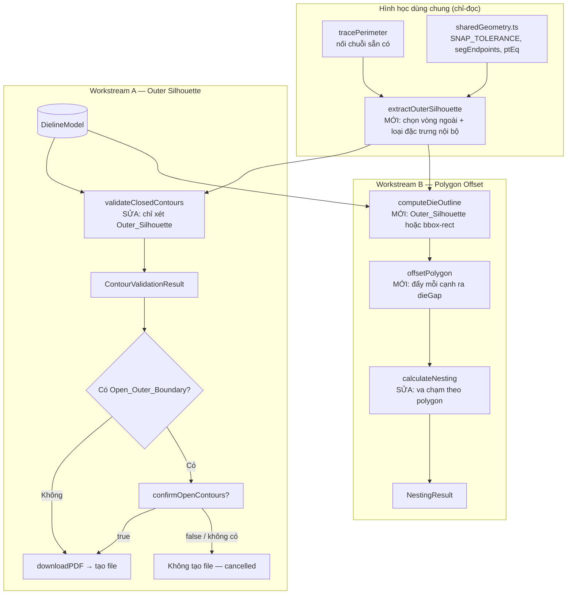
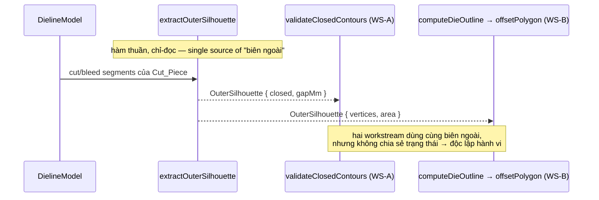

# Design Document — Dieline Hardening (Giai đoạn 2)

## Overview

Tài liệu này thiết kế **Giai đoạn 2** của sáng kiến củng cố chất lượng module tạo khuôn bế phía client (`desktop/src/lib/dieline/`). Spec xử lý **đúng hai giới hạn đã biết** mà Giai đoạn 1 cố ý dời sang, được tổ chức thành hai **workstream độc lập về mã và dữ liệu**:

| WS | Tên | Vấn đề Giai đoạn 1 để lại | Cách tiếp cận Giai đoạn 2 |
|----|-----|---------------------------|---------------------------|
| **A** | Outer Silhouette | `validateClosedContours` coi MỌI đầu mút `CUT`/`BLEED` không-khớp là "biên hở". Với `rte`/`slb`/`envelope`, các đặc trưng cắt hở nội bộ hợp lệ (relief slit, thumb-cut) bị báo nhầm → cổng xuất hỏi xác nhận giả trên mọi lần xuất. | Trích xuất **biên ngoài cùng (Outer_Silhouette)** của mỗi `Cut_Piece` bằng cách tái dùng `tracePerimeter`, và chỉ kiểm tra khép kín trên biên ngoài đó — bỏ qua đặc trưng cắt nội bộ. |
| **B** | Polygon Offset | `nestingEngine` coi `dieGap` là khoảng hở giữa **bounding box** (`cellW = dieW + gap`), không phải offset polygon thực; `nestingTypes.ts` còn ghi chú "known limitation Giai đoạn 2". | Hiện thực **Polygon_Offset thực** — đẩy mỗi cạnh của `Die_Outline` ra ngoài theo pháp tuyến một lượng `dieGap`, dùng làm vùng keep-out để lồng khuôn sát theo hình dạng. |

Bất biến xuyên suốt (Requirement 4, 8, 9): **không** thay đổi hình học đầu ra của 8 generator (golden-master Giai đoạn 1 phải tiếp tục pass), **không** thay đổi chữ ký công khai theo cách phá vỡ mã gọi, giữ **503 test** hiện có ở trạng thái pass (ngoại trừ các test nesting được cập nhật tường minh), 0 lời gọi mạng, 0 thay đổi backend, không thêm phụ thuộc ngoài phạm vi. Toàn bộ chạy phía client bằng TypeScript thuần với `vitest` + `fast-check`.

### Ranh giới giữa hai Workstream

WS-A chỉ động đến đường kiểm tra biên dạng/cổng xuất (`contourValidator.ts`, `exportPDF.ts`). WS-B chỉ động đến thuật toán lồng khuôn (`nestingEngine.ts`, chú thích `nestingTypes.ts`). Chúng chỉ chia sẻ **khái niệm** "đường biên ngoài của một khuôn" (Outer_Silhouette ⇄ Die_Outline). Để giữ độc lập về mã, logic trích xuất biên ngoài được đặt ở một hàm thuần dùng chung (`extractOuterSilhouette`) mà cả hai workstream gọi như một thư viện chỉ-đọc — một thay đổi ở workstream này KHÔNG làm đổi hành vi quan sát được của workstream kia (Requirement 9, ranh giới).

## Architecture

### Sơ đồ thành phần (Giai đoạn 2)



### Nguyên tắc thiết kế chủ đạo

1. **Tái dùng, không nối chuỗi lần hai (Requirement 1.2):** Việc trích xuất biên ngoài dựng trên `tracePerimeter` sẵn có; phần thêm mới chỉ là *chọn vòng ngoài cùng* và *lọc đặc trưng nội bộ* — đây là chọn lọc/lọc, KHÔNG phải một thuật toán chaining thứ hai.
2. **Chỉ-đọc, không biến đổi model (Requirement 4.2):** Mọi hàm hình học mới chỉ đọc dữ liệu model; không ghi `panels`, `allPaths`, `params`, `boundingBox`, `warnings`, và không ghi `Panel.outline`. Outer_Silhouette là cấu trúc tính riêng, không lưu vào model.
3. **Tương thích ngược đo được (Requirement 4.3, 8.4):** Giữ nguyên số/kiểu tham số bắt buộc và kiểu trả về của `validateClosedContours`, `downloadPDF`, `calculateNesting`; chỉ thêm tham số tùy chọn nếu cần. Quyết định/cancel được phơi bày qua một hàm cổng thuần tách riêng để vừa quan sát được vừa không đổi chữ ký công khai.
4. **Offset là phép toán thuần, xác định (Requirement 6.3, 6.6):** `offsetPolygon` là hàm thuần, snap theo `SNAP_TOLERANCE`, cho kết quả bit-identical với cùng đầu vào.
5. **Không-kém-hơn Giai đoạn 1 (Requirement 8.1):** Với khuôn chữ nhật, kết quả lồng khuôn trùng khít Giai đoạn 1 trong dung sai 0,001 mm.

## Components and Interfaces

### Hình học dùng chung — `extractOuterSilhouette` (mới, trong `contourValidator.ts`)

Hàm thuần trích xuất biên ngoài cùng của một `Cut_Piece`, là nền tảng cho CẢ hai workstream.

```typescript
export interface OuterSilhouette {
    /** Chuỗi đỉnh biên ngoài cùng (khép kín nếu gapMm ≤ SNAP_TOLERANCE) */
    vertices: Point2D[];
    /** Khoảng hở đầu-cuối đo được của biên ngoài (mm) */
    gapMm: number;
    /** Diện tích bao (shoelace, trị tuyệt đối) của biên ngoài, mm² */
    area: number;
    /** true nếu gapMm ≤ SNAP_TOLERANCE */
    closed: boolean;
}

/**
 * Trích xuất Outer_Silhouette từ các đoạn CUT/BLEED của một Cut_Piece.
 * Tái dùng tracePerimeter để nối chuỗi (Requirement 1.2). KHÔNG biến đổi đầu vào.
 *  - Trả về null nếu Cut_Piece không có đoạn CUT/BLEED (chỉ CREASE) — Requirement 1.5.
 */
export function extractOuterSilhouette(cutBleedSegs: PathSegment[]): OuterSilhouette | null;
```

Thuật toán (xác định, dựa quy tắc khách quan trong Requirement 1):

1. Nếu `cutBleedSegs` rỗng → trả `null` (Cut_Piece chỉ-CREASE không có biên ngoài cần kiểm — Requirement 1.5).
2. Gọi `tracePerimeter(cutBleedSegs)` thu được chuỗi đỉnh ứng viên `C` (tái dùng, Requirement 1.2).
3. **Chọn vòng ngoài cùng (Requirement 1.1):** Outer_Silhouette là vòng có **diện tích bao lớn nhất** chứa trọn mọi đỉnh `CUT`/`BLEED` còn lại trong dung sai `SNAP_TOLERANCE`. Tính diện tích shoelace của `C` (đóng vòng ảo đầu↔cuối).
4. **Loại Interior_Cut_Feature (Requirement 1.3, 1.4):** Một đầu mút được phân loại *thuộc biên ngoài* CHỈ KHI nằm trên vòng `C` trong `SNAP_TOLERANCE` (Requirement 1.4). Một đoạn là Interior_Cut_Feature khi nó có đầu mút KHÔNG nằm trên biên ngoài (ngoài `SNAP_TOLERANCE`) **VÀ** nằm bên trong vùng diện tích mà biên ngoài bao quanh (point-in-polygon). Các đoạn như vậy bị loại khỏi biên ngoài (không tính là đầu cắt hở) trước khi đo khoảng hở.
5. **Đo khoảng hở (Requirement 2.1):** `gapMm = Euclid(vertices[0], vertices[n-1])` của biên ngoài đã lọc. `closed = gapMm ≤ SNAP_TOLERANCE` (giá trị đúng bằng `SNAP_TOLERANCE` ⇒ khép kín).
6. **Trace không khép được (Requirement 1.6):** Nếu vòng ngoài hở, giữ nguyên chuỗi đỉnh hở một cách xác định và giữ `gapMm` đo được (mm) để Requirement 2 dùng.

> **Lý do trích xuất biên ngoài sửa được cảnh báo giả:** Phiên bản Giai đoạn 1 đánh dấu *mọi* đầu mút `CUT`/`BLEED` không-khớp là hở. Relief slit (rte/slb) và thumb-cut (envelope) kết thúc giữa vật liệu nên đầu mút của chúng không-khớp ⇒ bị báo hở giả. Bằng cách chỉ xét đầu mút *trên biên ngoài cùng*, các đặc trưng nội bộ (nằm trong vùng bao) bị loại khỏi phép kiểm khép kín (Requirement 2.2).

### Workstream A — `validateClosedContours` (sửa, `contourValidator.ts`)

Giữ nguyên chữ ký công khai (Requirement 4.3) và các kiểu kết quả Giai đoạn 1:

```typescript
export interface OpenContourWarning {
    panelName: string;
    panelLabel: string;
    gapMm: number;        // khoảng hở biên NGOÀI đo được (mm)
    cutPieceIndex: number;
}
export interface ContourValidationResult {
    allClosed: boolean;
    openContours: OpenContourWarning[];
}
export function validateClosedContours(model: DielineModel): ContourValidationResult;
```

Luồng sửa đổi:

1. Gom đoạn `CUT`/`BLEED` toàn model, phân nhóm thành Cut_Piece bằng union-find theo endpoint trùng (`SNAP_TOLERANCE`) — **giữ nguyên** logic Giai đoạn 1.
2. Với mỗi Cut_Piece: gọi `extractOuterSilhouette(componentSegs)`.
   - `null` (chỉ-CREASE) → bỏ qua, không cảnh báo (Requirement 1.5).
   - `closed === true` → khép kín, kể cả khi còn Interior_Cut_Feature hở bên trong (Requirement 2.2). Không cảnh báo.
   - `closed === false` (Open_Outer_Boundary) → tạo `OpenContourWarning` với `gapMm` của biên ngoài (Requirement 2.3, 3.4).
3. **Panel đại diện (Requirement 2.3):** Panel chứa **nhiều đoạn `CUT`/`BLEED` của biên ngoài đó nhất**; đồng hạng → Panel có chỉ số (index trong `model.panels`) thấp nhất.
4. Dùng đúng `SNAP_TOLERANCE` (0,01 mm) của `sharedGeometry` (Requirement 2.4). Lặp lại nhiều lần cho kết quả giống hệt (Requirement 2.5).
5. Toàn bộ chỉ đọc model — không mutate, không ghi `Panel.outline` (Requirement 4.2).

### Workstream A — Cổng xuất `downloadPDF` (sửa, `exportPDF.ts`)

Giữ nguyên chữ ký (Requirement 4.3):

```typescript
export async function downloadPDF(
    model: DielineModel,
    filename?: string,
    confirmOpenContours?: (warnings: OpenContourWarning[]) => Promise<boolean>,
): Promise<void>;
```

Để vừa **quan sát được kết quả** (file created / cancelled — Requirement 3.2, 3.6) vừa **giữ kiểu trả về `Promise<void>`** (Requirement 4.3), tách phần quyết định cổng thành một hàm thuần testable, còn `downloadPDF` orchestrate dựa trên nó:

```typescript
export type ExportGateDecision =
    | { kind: 'created' }                                 // tất cả biên ngoài khép kín
    | { kind: 'cancelled'; warnings: OpenContourWarning[] }; // có Open_Outer_Boundary & chưa xác nhận

/** Hàm thuần: quyết định cổng dựa trên validation + kết quả callback (đã resolve). */
export function decideExportGate(
    result: ContourValidationResult,
    confirmed: boolean,
): ExportGateDecision;
```

Luồng `downloadPDF`:
1. `validateClosedContours(model)`.
2. Nếu `allClosed` → tạo file, không hỏi (Requirement 3.1, 3.2).
3. Nếu có Open_Outer_Boundary → hiển thị cảnh báo liệt kê panel + `gapMm` (Requirement 3.3); chỉ ghi file khi `confirmOpenContours` trả về `true` (Requirement 3.5). Không có callback hoặc callback trả `false` → **không ghi bất kỳ đầu ra nào**, model không đổi, kết thúc ở trạng thái `cancelled` (Requirement 3.6).

`decideExportGate` là điểm quan sát được cho test cổng mà không phá vỡ chữ ký công khai của `downloadPDF`.

### Workstream B — `computeDieOutline` (mới, `nestingEngine.ts`)

```typescript
/** Đường biên ngoài thực của một khuôn dùng làm đầu vào lồng khuôn. */
export function computeDieOutline(model: DielineModel | undefined, bbox: BBox): Point2D[];
```

Quy tắc (Requirement 5.1, 6.7):
- Dùng Outer_Silhouette của khuôn khi **"sẵn có"** = `vertices.length ≥ 3` **VÀ** `area > 0` **VÀ** `gapMm ≤ SNAP_TOLERANCE`.
- Ngược lại (hoặc khi `< 3` đỉnh phân biệt / `area ≤ 0,001 mm²`) → đa giác chữ nhật suy ra từ `boundingBox`: `[(0,0),(w,0),(w,h),(0,h)]`.

### Workstream B — `offsetPolygon` (mới, `nestingEngine.ts`)

```typescript
/**
 * Polygon_Offset — đẩy mỗi cạnh của outline ra ngoài theo pháp tuyến một
 * lượng `offset = max(0, dieGap)` (Minkowski-style outward offset). Hàm thuần.
 */
export function offsetPolygon(outline: Point2D[], offset: number): Point2D[];
```

Hành vi (Requirement 5, 6):
- **Kẹp âm:** `offset < 0` → coi như `0`, không thu nhỏ outline (Requirement 5.7, 6.8).
- **Chuẩn hóa hướng:** Xác định hướng (CW/CCW) bằng dấu shoelace để pháp tuyến luôn hướng RA NGOÀI (tăng diện tích) — Requirement 5.2.
- **Đẩy cạnh + nối góc:** Mỗi cạnh dịch ra `offset` theo pháp tuyến ngoài; góc lồi nối bằng giao điểm cạnh đã dịch (miter), kẹp miter để tránh nhọn vô hạn.
- **Lõm/tự cắt (Requirement 5.6):** Khi outline non-convex khiến offset tự cắt cục bộ, tạo đa giác offset **không tự cắt** bao trọn outline gốc đã giãn `dieGap` — mọi đỉnh gốc nằm trong/trên biên offset. Phương án hiện thực: hợp (union) các đa giác cạnh-đã-giãn rồi lấy biên ngoài, đảm bảo bao phủ (không để lọt vùng va chạm) thay vì tối ưu hình dạng.
- **Hình chữ nhật (Requirement 6.4):** mỗi cạnh ra đúng `dieGap`, mỗi chiều tăng `2×dieGap` (trong 0,001 mm).
- **Snap + xác định (Requirement 6.6, 6.3):** Snap mọi tọa độ theo `SNAP_TOLERANCE`; cùng đầu vào → cùng số đỉnh, cùng thứ tự, tọa độ bit-identical.
- **Đơn vị mm (Requirement 6.5):** đầu ra cùng đơn vị mm như đầu vào.

### Workstream B — `calculateNesting` (sửa, `nestingEngine.ts`)

Giữ nguyên chữ ký và kiểu (Requirement 8.4):

```typescript
export function calculateNesting(bbox: BBox, config: NestingConfig, params?: BoxParams): NestingResult;
```

Tích hợp va chạm theo polygon:
- Tính `outline = computeDieOutline(...)` một lần cho khuôn.
- Với mỗi góc xoay thuộc `{0°, 90°, 180°, 270°}` (Requirement 7.4, 7.5): xoay `outline` TRƯỚC, rồi `offsetPolygon(rotated, dieGap)` SAU, dùng cùng `offset = dieGap` cho mọi góc.
- **Vị ngữ va chạm (Requirement 5.3, 5.4, 7.2):** Hai khuôn A, B không va chạm ⇔ vùng keep-out offset của một khuôn KHÔNG chồng lấn outline gốc của khuôn kia (diện tích giao ≤ 0,01 mm²) — tương đương khoảng cách nhỏ nhất giữa hai outline gốc ≥ `dieGap`. Cách này cho **đúng** một lượng `dieGap` khoảng hở (không phải `2×dieGap`), nên trùng khít Giai đoạn 1 cho hình chữ nhật (Requirement 8.1) đồng thời thỏa Requirement 5.4 (≥ `dieGap − 0,01 mm`).
- **`dieGap = 0` (Requirement 5.5):** cho phép tiếp xúc biên chung, diện tích giao ≤ 0,01 mm².
- **Trong vùng in (Requirement 7.3):** mọi khuôn đặt nằm trọn vùng in khả dụng (sau khi trừ lề + cắn nhíp), không điểm nào của Die_Outline vượt biên quá 0,01 mm.
- **Không-kém Giai đoạn 1 (Requirement 7.1, 8.1):** Với outline chữ nhật, offset rectangle giãn đều ⇒ khoảng cách origin = `dieW + dieGap` ⇒ trùng `cellW` Giai đoạn 1. Với outline không-chữ-nhật, va chạm theo polygon cho phép xếp sát hơn ⇒ số khuôn ≥ phương án Bounding_Box_Gap cùng cấu hình.
- **Xác định (Requirement 8.5):** cùng đầu vào → kết quả `NestingResult` giống hệt.

> **Quyết định thiết kế (giải quyết căng thẳng 5.3 ↔ 8.1):** Requirement 5.3 mô tả "offset ∩ offset". Nếu offset CẢ HAI khuôn một lượng `dieGap` đầy đủ rồi yêu cầu không chồng, khoảng hở thực thành `2×dieGap`, mâu thuẫn Requirement 8.1 (trùng khít Giai đoạn 1 với khoảng hở `dieGap`) và làm Requirement 6.4 (offset mỗi cạnh đúng `dieGap`) bất khả thi đồng thời. Thiết kế giải quyết bằng cách: `offsetPolygon` vẫn đẩy đúng `dieGap` mỗi cạnh (giữ 6.4), nhưng vị ngữ va chạm so **keep-out-của-một** với **outline-gốc-của-khuôn-kia** (đối xứng) ⇒ khoảng hở đúng `dieGap`. Đây là cách diễn giải nhất quán duy nhất giữa 5.3, 5.4, 6.4, 7.2 và 8.1.

### Workstream B — Tài liệu `dieGap` (sửa, `nestingTypes.ts`)

Cập nhật JSDoc của `dieGap` để phản ánh `dieGap` nay là Polygon_Offset thực theo từng cạnh và **gỡ** ghi chú "known limitation Giai đoạn 2" (Requirement 8.3). Không thêm/đổi/gỡ trường công khai (Requirement 8.4).

## Data Models

### Kiểu mới (đều thuần dữ liệu, không phụ thuộc framework)

```typescript
// WS-A: kết quả trích xuất biên ngoài
interface OuterSilhouette { vertices: Point2D[]; gapMm: number; area: number; closed: boolean; }

// WS-A: quyết định cổng xuất (testable, không đổi chữ ký downloadPDF)
type ExportGateDecision =
    | { kind: 'created' }
    | { kind: 'cancelled'; warnings: OpenContourWarning[] };
```

`OpenContourWarning` và `ContourValidationResult` **giữ nguyên** từ Giai đoạn 1 (Requirement 4.3). WS-B dùng `Point2D[]` cho `Die_Outline` và đa giác offset; không thêm kiểu công khai mới vào `nestingTypes.ts` (Requirement 8.4).

### Hằng số dung sai

| Hằng số | Giá trị | Dùng cho | Yêu cầu |
|---------|---------|----------|---------|
| `SNAP_TOLERANCE` | 0,01 mm | Khép kín biên ngoài, snap offset, va chạm cạnh | 1.1, 2.1, 2.4, 6.6 |
| Dung sai vị trí | 0,001 mm | Trùng khít Giai đoạn 1, offset chữ nhật, area dieGap=0 | 6.2, 6.4, 8.1 |
| Dung sai chồng lấn | 0,01 mm² | Không va chạm giữa Die_Outline | 5.3, 5.5, 7.2 |
| Dung sai gap | 0,01 mm | `|gapMm − d|`, khoảng cách ≥ dieGap | 3.4, 5.4 |

### Luồng dữ liệu — chia sẻ biên ngoài giữa hai workstream




## Correctness Properties

*Một thuộc tính (property) là đặc tính hoặc hành vi phải đúng trên mọi lần thực thi hợp lệ của hệ thống — về bản chất là một phát biểu hình thức về việc hệ thống phải làm gì. Các thuộc tính đóng vai trò cầu nối giữa đặc tả con người đọc được và các đảm bảo đúng đắn máy kiểm chứng được.*

Mỗi thuộc tính dưới đây được suy ra từ phần prework. Lập luận chuyển đổi nêu ngắn gọn ngay trước mỗi thuộc tính. Tiêu chí cấu trúc (SMOKE), golden-master và luồng UI/cổng (EXAMPLE/EDGE_CASE) được xử lý trong Testing Strategy, không thành property.

### Workstream A — Outer Silhouette

Lập luận: 1.1/1.3/1.4/2.1/2.2/2.5/3.4 cùng mô tả MỘT bất biến phân loại biên ngoài. Có thể kiểm bằng cách bắt đầu từ model có biên ngoài khép kín, (a) thêm đặc trưng cắt nội bộ → vẫn kín; (b) dịch một đầu mút *trên biên ngoài* một lượng `d > Snap` → hở với `gapMm ≈ d`.

### Property 1: Phân loại khép kín dựa trên biên ngoài (bỏ qua đặc trưng cắt nội bộ)

*For any* DielineModel hợp lệ có mọi Outer_Silhouette khép kín, `validateClosedContours` trả về `allClosed = true` và `openContours` rỗng, kể cả khi mỗi Cut_Piece còn chứa các Interior_Cut_Feature hở (đầu mút không nằm trên biên ngoài và nằm trong vùng bao); *for any* model thu được bằng cách dịch một đầu mút THUỘC Outer_Silhouette đi `d > SNAP_TOLERANCE`, validator trả `allClosed = false` với một cảnh báo có `gapMm` thỏa `|gapMm − d| ≤ 0,01 mm`; và đánh giá cùng một model nhiều lần cho kết quả giống hệt.

**Validates: Requirements 1.1, 1.3, 1.4, 2.1, 2.2, 2.5, 3.4**

Lập luận: 2.3 là quy tắc chọn panel đại diện xác định khi biên ngoài hở.

### Property 2: Panel đại diện của biên ngoài hở là xác định

*For any* DielineModel có ít nhất một Open_Outer_Boundary, mỗi `OpenContourWarning` xác định Panel đại diện là Panel chứa nhiều đoạn `CUT`/`BLEED` của biên ngoài hở đó nhất (đồng hạng → Panel có chỉ số thấp nhất), và kết quả này không đổi giữa các lần đánh giá.

**Validates: Requirements 2.3**

Lập luận: 4.2 là bất biến chỉ-đọc của validator áp dụng cho mọi model; cũng phủ phần "model không đổi" của 3.6.

### Property 3: Validator và cổng xuất không biến đổi model

*For any* DielineModel hợp lệ, gọi `validateClosedContours(model)` (và chạy cổng xuất tới trạng thái `cancelled`) không làm thay đổi `panels`, `allPaths`, `params`, `boundingBox`, `warnings`, và không ghi vào bất kỳ `Panel.outline` nào — model sau lời gọi sâu-bằng (deep-equal) model trước lời gọi.

**Validates: Requirements 4.2, 3.6**

Lập luận: 3.1 (và phần không-lỗi của 1.5) tổng quát hóa thành: mọi generator — gồm rte/slb/envelope vốn chứa đặc trưng cắt nội bộ — đều cho biên ngoài khép kín, nên cổng xuất không hỏi xác nhận giả.

### Property 4: Mọi generator cho biên ngoài khép kín (loại bỏ cảnh báo giả)

*For any* generator trong 8 generator và *for any* bộ `params` hợp lệ, mọi Cut_Piece của `DielineModel` có Outer_Silhouette khép kín (`gapMm ≤ SNAP_TOLERANCE`) hoặc không có biên ngoài (Cut_Piece chỉ-CREASE), do đó `validateClosedContours` trả `allClosed = true`.

**Validates: Requirements 3.1, 1.5**

### Workstream B — Polygon Offset

Lập luận: 5.2/5.6/6.1 cùng yêu cầu đa giác offset bao trọn outline gốc (kể cả outline lõm), lệch ra ngoài biên ≤ Snap.

### Property 5: Đa giác offset bao trọn outline gốc

*For any* Die_Outline hợp lệ (≥ 3 đỉnh phân biệt, diện tích > 0) và *for any* `dieGap ≥ 0`, mọi đỉnh của outline gốc nằm bên trong hoặc trên biên đa giác `offsetPolygon(outline, dieGap)`, với sai lệch về phía ngoài biên không vượt quá `SNAP_TOLERANCE` (0,01 mm), và đa giác offset không tự cắt.

**Validates: Requirements 5.2, 5.6, 6.1**

Lập luận: 6.2 là bất biến đơn điệu diện tích với trường hợp đặc biệt `dieGap = 0` bảo toàn diện tích.

### Property 6: Offset không làm giảm diện tích

*For any* Die_Outline hợp lệ và *for any* `dieGap ≥ 0`, diện tích của `offsetPolygon(outline, dieGap)` ≥ diện tích outline gốc; và khi `dieGap = 0`, hai diện tích bằng nhau trong dung sai 0,001 mm².

**Validates: Requirements 6.2**

Lập luận: 6.3 (được hỗ trợ bởi snap 6.6) là tính xác định của phép offset.

### Property 7: Offset là xác định và bit-identical

*For any* Die_Outline (cùng dãy đỉnh, cùng thứ tự) và *for any* `dieGap`, gọi `offsetPolygon` hai lần cho ra đa giác có cùng số đỉnh, cùng thứ tự đỉnh, và mỗi tọa độ tương ứng trùng khít (lệch 0 mm), nhờ snap theo `SNAP_TOLERANCE`.

**Validates: Requirements 6.3, 6.6**

Lập luận: 6.4 là trường hợp chữ nhật — offset đúng `dieGap` mỗi cạnh.

### Property 8: Offset hình chữ nhật giãn đúng dieGap mỗi cạnh

*For any* Die_Outline là hình chữ nhật và *for any* `dieGap ≥ 0`, `offsetPolygon` trả về một hình chữ nhật có mỗi cạnh dịch ra ngoài đúng `dieGap` (mỗi chiều tăng `2 × dieGap`) trong dung sai 0,001 mm.

**Validates: Requirements 6.4**

Lập luận: 5.3/5.4/5.5/7.2 cùng là bất biến clearance/không-va-chạm giữa các khuôn đã đặt.

### Property 9: Các khuôn đã đặt không va chạm và giữ đúng khoảng hở dieGap

*For any* `NestingResult` do `calculateNesting` tạo ra, với mọi cặp khuôn đã đặt khác nhau: vùng keep-out offset của một khuôn không chồng lấn Die_Outline gốc của khuôn kia (diện tích giao ≤ 0,01 mm²), tương đương khoảng cách nhỏ nhất giữa hai Die_Outline gốc ≥ `dieGap − 0,01 mm`; khi `dieGap = 0` cho phép tiếp xúc biên chung (diện tích giao ≤ 0,01 mm²).

**Validates: Requirements 5.3, 5.4, 5.5, 7.2**

Lập luận: 7.3 là bất biến mọi khuôn nằm trọn vùng in khả dụng.

### Property 10: Mọi khuôn đặt nằm trong vùng in khả dụng

*For any* `NestingResult`, mọi Die_Outline đã đặt (đã xoay, theo vị trí) nằm hoàn toàn trong vùng in khả dụng (khổ in trừ lề và cắn nhíp), không điểm nào vượt ra ngoài biên vùng in quá 0,01 mm.

**Validates: Requirements 7.3**

Lập luận: 7.1 là quan hệ metamorphic giữa chế độ offset polygon và chế độ Bounding_Box_Gap.

### Property 11: Lồng theo hình dạng không kém Bounding_Box_Gap

*For any* khuôn có Die_Outline không-chữ-nhật và *for any* cấu hình lồng (cùng khổ in, lề, cắn nhíp, `dieGap`, tập góc xoay), số khuôn đặt được bằng Polygon_Offset ≥ số khuôn đặt được bằng Bounding_Box_Gap.

**Validates: Requirements 7.1**

Lập luận: 7.4/7.5 yêu cầu offset áp dụng SAU khi xoay tới đúng tập góc {0°, 90°, 180°, 270°}.

### Property 12: Offset áp dụng sau khi xoay, chỉ với góc được hỗ trợ

*For any* Die_Outline và *for any* góc `θ ∈ {0°, 90°, 180°, 270°}`, đa giác keep-out dùng trong lồng khuôn bằng `offsetPolygon(rotate(outline, θ), dieGap)` (xoay trước, offset sau, cùng `offset = dieGap`); và mọi khuôn trong `NestingResult` chỉ mang góc xoay thuộc tập đó.

**Validates: Requirements 7.4, 7.5**

Lập luận: 8.1 là so sánh model-based với hành vi Giai đoạn 1 khi mọi outline là chữ nhật.

### Property 13: Trường hợp chữ nhật tương đương Giai đoạn 1

*For any* khuôn có Die_Outline chữ nhật và *for any* cấu hình lồng, `calculateNesting` (Giai đoạn 2) tạo cùng tập khuôn trên cùng khổ in với hành vi Bounding_Box_Gap Giai đoạn 1: mỗi khuôn ở cùng vị trí trong dung sai 0,001 mm và cùng góc xoay thuộc {0°, 90°, 180°, 270°}.

**Validates: Requirements 8.1**

Lập luận: 8.5 là tính xác định của toàn bộ kết quả lồng khuôn.

### Property 14: Kết quả lồng khuôn là xác định

*For any* đầu vào lồng khuôn (cùng `bbox`, `config`, `params`), `calculateNesting` tạo ra `NestingResult` giống hệt nhau qua các lần gọi (cùng `positions`, `countPerSheet`, `rows`, `cols`, và các trường còn lại).

**Validates: Requirements 8.5**

## Error Handling

| Tình huống | Xử lý | Yêu cầu |
|------------|-------|---------|
| Phát hiện Open_Outer_Boundary khi xuất | Hiển thị cảnh báo liệt kê panel đại diện + `gapMm`; chặn ghi file tới khi `confirmOpenContours` trả `true`; không có callback → không ghi file (cancelled) | 2.3, 3.3, 3.5, 3.6 |
| Người dùng hủy/từ chối xác nhận | Không tạo bất kỳ đầu ra nào (không ghi file một phần), model giữ nguyên, cổng kết thúc `cancelled` | 3.6 |
| Mọi biên ngoài khép kín | Bỏ qua xác nhận, tạo file trực tiếp (`created`) | 3.1, 3.2 |
| Cut_Piece chỉ-CREASE | `extractOuterSilhouette` trả `null` → không kiểm, không cảnh báo | 1.5 |
| `tracePerimeter` không khép được vòng ngoài | Giữ chuỗi đỉnh hở xác định + `gapMm` đo được; phân loại hở theo Requirement 2 | 1.6 |
| Outline không hợp lệ để offset (< 3 đỉnh phân biệt hoặc diện tích ≤ 0,001 mm²) | `computeDieOutline` dùng đa giác chữ nhật suy ra từ `boundingBox` làm đầu vào offset | 6.7 |
| `dieGap < 0` | `offsetPolygon` kẹp `offset = 0`, không thu nhỏ outline gốc | 5.7, 6.8 |
| Outline lõm gây tự cắt khi offset | Tạo đa giác offset không tự cắt bao trọn outline gốc đã giãn `dieGap` (ưu tiên bao phủ, không để lọt vùng va chạm) | 5.6 |

Nguyên tắc: cổng xuất **fail safe** — khi nghi ngờ biên ngoài hở mà chưa được xác nhận tường minh, KHÔNG tạo file (giữ hành vi an toàn Giai đoạn 1). Phép offset **fail closed** về phía bao phủ — khi không offset chính xác được hình lõm, bao trọn rộng hơn để không bao giờ báo "không va chạm" sai.

## Testing Strategy

### Cách tiếp cận kép (Dual Testing)

- **Property-based tests** (`fast-check`) cho các bất biến hình học/đại số biến thiên theo input (Property 1–14).
- **Example/unit tests** cho luồng cổng xuất (`decideExportGate`, mock `confirmOpenContours`, mock writer), chọn nguồn Die_Outline, và các trường hợp fallback.
- **Golden-master/snapshot** cho ổn định hình học 8 generator (tái dùng baseline Giai đoạn 1).
- **Smoke/regression** cho ràng buộc cấu trúc, chữ ký công khai, tài liệu, và 503 test hiện có.

### Thư viện PBT và cấu hình (Requirement 9.4, 9.5)

- Dùng `fast-check` đã thiết lập từ Giai đoạn 1 — **không thêm phụ thuộc mới** (Requirement 9.3), **không** tự hiện thực engine PBT.
- Mỗi property test chạy **tối thiểu 100 iterations**: `fc.assert(prop, { numRuns: 100, seed: <seed ghi nhận> })` với **seed cố định/được ghi nhận** để tái lập (Requirement 9.4).
- Mỗi property test gắn nhãn comment tham chiếu design property:
  `// Feature: dieline-hardening-phase2, Property {number}: {property_text}`
- Property hình học theo generator (Property 4) chạy riêng từng loại trong 8 generator để counterexample chỉ rõ generator; thông báo lỗi gồm tên generator + phản ví dụ shrunk + seed (Requirement 9.5).

### Generator dữ liệu test

- Tái dùng `arbBoxParams(boxType)` (qua `validateParams`) cho Property 4 — bao phủ cả rte/slb/envelope (loại từng báo cảnh báo giả).
- `arbSimplePolygon` / `arbRectangle` / `arbConcavePolygon` cho Property 5–8, 12 — gồm đa giác lồi, lõm, suy biến (để phủ edge case 5.7, 6.7, 6.8), và `dieGap` trong dải gồm 0 và âm.
- `arbNestingInput` (bbox + NestingConfig + params, gồm khuôn chữ nhật và không-chữ-nhật, `dieGap = 0`) cho Property 9–14.
- Phép nhiễu loạn endpoint (dịch một đỉnh biên ngoài `d > Snap`; thêm relief slit/thumb-cut nội bộ) cho Property 1.

### Ánh xạ Property → Test

| Property | Loại test | File | Yêu cầu |
|----------|-----------|------|---------|
| 1 | PBT (phân loại + nhiễu loạn biên ngoài + đặc trưng nội bộ) | `contourValidator.test.ts` | 1.1, 1.3, 1.4, 2.1, 2.2, 2.5, 3.4 |
| 2 | PBT (panel đại diện xác định) | `contourValidator.test.ts` | 2.3 |
| 3 | PBT (deep-equal model trước/sau) | `contourValidator.test.ts` | 4.2, 3.6 |
| 4 | PBT × 8 generator | `contourValidator.test.ts` | 3.1, 1.5 |
| 5 | PBT (bao trọn, gồm lõm) | `polygonOffset.test.ts` | 5.2, 5.6, 6.1 |
| 6 | PBT (đơn điệu diện tích) | `polygonOffset.test.ts` | 6.2 |
| 7 | PBT (xác định bit-identical) | `polygonOffset.test.ts` | 6.3, 6.6 |
| 8 | PBT (offset chữ nhật) | `polygonOffset.test.ts` | 6.4 |
| 9 | PBT (clearance/không-va-chạm) | `nestingEngine.test.ts` | 5.3, 5.4, 5.5, 7.2 |
| 10 | PBT (trong vùng in) | `nestingEngine.test.ts` | 7.3 |
| 11 | PBT (metamorphic count) | `nestingEngine.test.ts` | 7.1 |
| 12 | PBT (xoay rồi offset, tập góc) | `nestingEngine.test.ts` | 7.4, 7.5 |
| 13 | PBT (model-based vs Giai đoạn 1) | `nestingEngine.test.ts` | 8.1 |
| 14 | PBT (xác định kết quả lồng) | `nestingEngine.test.ts` | 8.5 |

### Example/Unit/Smoke tests (không phải PBT)

| Tiêu chí | Loại | Mô tả |
|----------|------|-------|
| 3.2, 3.3, 3.5 | EXAMPLE (mock) | `decideExportGate`: allClosed → `created`; có biên hở + confirm `false`/không callback → `cancelled` (không ghi); confirm `true` → ghi. Mock writer + `confirmOpenContours`. |
| 1.2 | SMOKE | `extractOuterSilhouette` import & gọi `tracePerimeter`; không có vòng nối chuỗi (chaining) trùng lặp. |
| 2.4 | SMOKE | Validator dùng `SNAP_TOLERANCE` import từ `sharedGeometry`. |
| 4.1, 4.4 | EXAMPLE (golden master) | Snapshot `panels`/`allPaths` 8 generator khớp baseline Giai đoạn 1 (tọa độ ≤ 0,001 mm); là điều kiện gate cho bất biến hình học. |
| 4.3, 8.4 | SMOKE | `validateClosedContours`/`downloadPDF`/`calculateNesting` giữ chữ ký; 0 lỗi TS mới; mã gọi hiện có không sửa. |
| 5.1, 6.7 | EXAMPLE | `computeDieOutline`: Outer_Silhouette sẵn có → dùng nó; suy biến/không hợp lệ → bbox-rect. |
| 5.7, 6.8 | EDGE_CASE | `dieGap < 0` → kết quả bằng `dieGap = 0` (không thu nhỏ). |
| 8.2 | SMOKE/process | Test nesting đổi do offset được cập nhật tường minh kèm giá trị kỳ vọng mới; không nới dung sai đã ghim (0,001 mm vị trí, 0,01 mm² chồng lấn). |
| 8.3 | EXAMPLE (static) | Đọc nguồn `nestingTypes.ts`: JSDoc `dieGap` mô tả Polygon_Offset thực; KHÔNG còn cụm "known limitation Giai đoạn 2". |
| 9.1 | SMOKE/regression | `vitest run` đầy đủ: 503 test pass (trừ test nesting cập nhật tường minh theo 8.2), 0 fail/0 skip mới, lặp lại giống hệt. |
| 9.2, 9.3, 9.6 | SMOKE | Review: client-only TS, 0 network/backend; không thêm dep ngoài phạm vi; không có tính năng Giai đoạn 2 ngoài hai workstream. |
| 9.5 | EXAMPLE | Nhãn property gồm tên generator/khuôn; dựa shrink + seed của fast-check để báo phản ví dụ tối giản. |

### Cân bằng unit vs property

- Property test gánh phần phủ rộng đầu vào (≥ 100 mẫu, seed ghi nhận) cho ba nhóm bất biến Requirement 9.4 bắt buộc (phân loại biên ngoài, offset bao trọn, không-chồng offset) cùng các bất biến phái sinh.
- Unit/example test chỉ tập trung vào luồng cổng xuất, chọn nguồn outline, fallback và điều kiện biên — tránh trùng vai trò property test.
- Toàn bộ 503 test hiện có được giữ nguyên và phải tiếp tục pass, ngoại trừ các test nesting được cập nhật tường minh theo Requirement 8.2.
