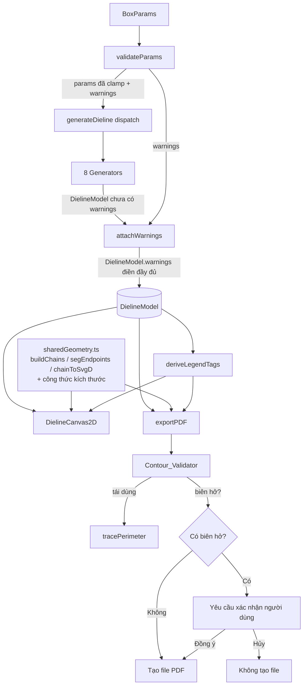
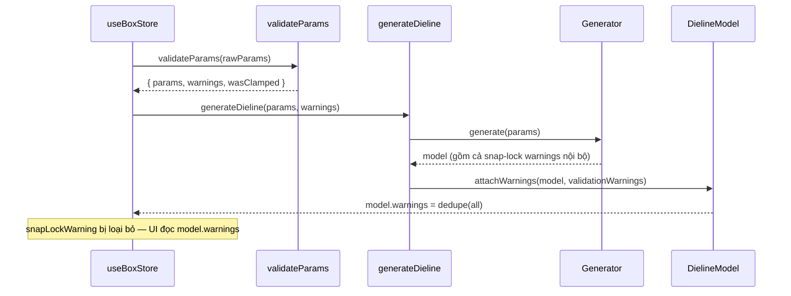

# Design Document — Dieline Hardening (Giai đoạn 1)

## Overview

Tài liệu thiết kế này mô tả cách hiện thực 6 workstream củng cố chất lượng cho module tạo khuôn bế phía client (`desktop/src/lib/dieline/`), bám sát `requirements.md`. Mục tiêu xuyên suốt là **tăng độ tin cậy của file bế xuất ra** và **chống phân kỳ mã (drift)** giữa các module, **mà không** thay đổi hình học đúng đắn của 8 generator hiện có và **không** làm hỏng 102 test đang pass.

Toàn bộ thay đổi chạy ở phía client bằng TypeScript thuần (React + Zustand + Three.js), xuất file qua jsPDF + svg2pdf.js. Không có lời gọi mạng và không có thay đổi backend (Requirement 7.1).

Sáu workstream và cách tiếp cận thiết kế tương ứng:

| # | Workstream | Cách tiếp cận |
|---|------------|---------------|
| 1 | Kiểm tra biên dạng khép kín trước khi xuất | Thành phần mới `Contour_Validator` tái dùng `tracePerimeter`, chặn xuất khi có biên hở chưa được xác nhận |
| 2 | Bổ sung kiểm thử hình học | Bộ test mới `geometry.test.ts` + property-based test (≥ 50 mẫu/generator) bằng `fast-check` |
| 3 | Đổ cảnh báo nhất quán vào `DielineModel.warnings` | Tập trung gắn warnings tại lớp dispatch (`generateDieline`), Canvas đọc duy nhất từ model |
| 4 | Loại bỏ trùng lặp mã (chống drift) | Module mới `sharedGeometry.ts` chứa logic nối chuỗi + công thức kích thước dùng chung |
| 5 | Làm rõ tag BLEED | Chọn phương án (B) — legend suy ra từ tag thực có trong file |
| 6 | Sửa mô tả `dieGap` | Chỉ sửa chú thích trong `nestingTypes.ts`, giữ nguyên logic |

### Quyết định cho các Câu hỏi mở (Open Decisions)

- **BLEED (Requirement 5):** Chọn **phương án (B) — gỡ BLEED khỏi legend khi không có đoạn BLEED nào**. Lý do: đúng tinh thần "củng cố chất lượng" của Giai đoạn 1, không phát sinh hình học mới (giữ nguyên đầu ra generator theo Requirement 7.3). Thiết kế tổng quát hóa thành: **legend luôn được suy ra (derived) từ tập tag thực sự xuất hiện trong file**, nên nếu sau này một generator phát ra đoạn BLEED thật, legend tự hiển thị BLEED mà không cần sửa thêm.
- **dieGap (Requirement 6):** Chọn **chỉ sửa tài liệu/chú thích và ghi chú giới hạn đã biết cho Giai đoạn 2**. Không thay đổi câu lệnh thực thi nào trong `nestingEngine.ts` (Requirement 6.4).

## Architecture

### Sơ đồ thành phần (sau khi củng cố)



### Nguyên tắc thiết kế chủ đạo

1. **Một nguồn sự thật (single source of truth):** Logic nối chuỗi, công thức kích thước, và quy tắc legend nằm ở đúng một nơi (`sharedGeometry.ts`). Export và Canvas chỉ gọi lại, không giữ bản sao.
2. **Warnings gắn liền với model:** Mọi cảnh báo (từ `validateParams` và từ quá trình sinh) được tập trung vào `DielineModel.warnings`. UI chỉ đọc từ đây.
3. **Cổng kiểm tra trước khi xuất (export gate):** `Contour_Validator` chạy trước khi ghi file; biên hở chưa xác nhận sẽ chặn việc tạo file.
4. **Không đổi hình học:** Tất cả thay đổi là refactor/bổ sung kiểm tra; đầu ra `panels`/`allPaths` của generator giữ nguyên trong dung sai 0.001 mm (Requirement 7.3).
5. **Legend là dẫn xuất, không phải hằng số:** Tập tag hiển thị được tính từ file, đảm bảo set-equality với tag thực (Requirement 5.5).

## Components and Interfaces

### 1. Shared_Geometry_Module (`sharedGeometry.ts`) — Mới

Module dùng chung loại bỏ trùng lặp giữa `exportPDF.ts` và `DielineCanvas2D.tsx` (Requirement 4).

```typescript
// desktop/src/lib/dieline/sharedGeometry.ts
import { PathSegment, Point2D, PathTag, DielineModel, BoxParams } from './types';

/** Dung sai khớp endpoint khi nối chuỗi — DUY NHẤT một hằng số dùng chung */
export const SNAP_TOLERANCE = 0.01; // mm

/** So sánh 2 điểm trong dung sai SNAP_TOLERANCE */
export function ptEq(a: Point2D, b: Point2D, tol?: number): boolean;

/** Lấy [điểm đầu, điểm cuối] của một segment (xử lý cả bezier) */
export function segEndpoints(seg: PathSegment): [Point2D, Point2D];

/** Một chuỗi segment liên tục cùng tag */
export interface Chain { tag: PathTag; segs: PathSegment[]; }

/** Gom segment nối tiếp (cùng tag, endpoint trùng trong SNAP_TOLERANCE) thành chains */
export function buildChains(segments: PathSegment[]): Chain[];

/** Chuyển 1 chain thành chuỗi SVG `d` (M…L…C…Z) — đóng Z nếu khép kín */
export function chainToSvgD(chain: PathSegment[]): string;

/** Công thức kích thước dùng chung (FH/SF của Envelope, …) — đầu ra thuần số */
export interface EnvelopeDims { FH: number; SF: number; }
export function computeEnvelopeDims(params: BoxParams): EnvelopeDims;

/** Tập tag thực sự xuất hiện trong allPaths (cho legend — Requirement 5) */
export function deriveLegendTags(model: DielineModel): Set<PathTag>;
```

Ghi chú hiện thực:
- `buildChains`, `segEndpoints`, `chainToSvgD` được **di chuyển nguyên trạng (verbatim)** từ `exportPDF.ts`; phiên bản trùng lặp trong `DielineCanvas2D.tsx` bị xóa và thay bằng import. Cả hai vốn đã cùng thuật toán và cùng dung sai 0.01mm, nên việc hợp nhất giữ nguyên đầu ra ký-tự-theo-ký-tự (Requirement 4.5, 4.6).
- `computeEnvelopeDims` rút công thức `FH`/`SF` hiện đang lặp lại ở `buildDimensionSvg` (export) và `DimensionAnnotations` (canvas).
- `SNAP_TOLERANCE` thay thế các literal `0.01` rải rác để đảm bảo `Contour_Validator` và `Chain_Builder` dùng cùng một giá trị (Requirement 1.5).

### 2. Contour_Validator (`contourValidator.ts`) — Mới

Kiểm tra mỗi Cut_Piece có khép kín không, trước khi xuất (Requirement 1).

```typescript
// desktop/src/lib/dieline/contourValidator.ts
import { DielineModel, Panel } from './types';

export interface OpenContourWarning {
    panelName: string;       // Panel chứa biên hở
    panelLabel: string;      // Nhãn hiển thị
    gapMm: number;           // Khoảng hở đầu-cuối đo được (mm)
    cutPieceIndex: number;   // Chỉ số Cut_Piece trong panel
}

export interface ContourValidationResult {
    allClosed: boolean;                 // true nếu 0 biên hở
    openContours: OpenContourWarning[]; // danh sách biên hở (rỗng nếu tất cả khép kín)
}

/**
 * Kiểm tra tính khép kín của mọi Cut_Piece trong model.
 * Dùng SNAP_TOLERANCE (0.01mm) — cùng giá trị Chain_Builder dùng.
 * Tái sử dụng tracePerimeter để nối các đoạn cắt (KHÔNG hiện thực thuật toán nối thứ hai).
 */
export function validateClosedContours(model: DielineModel): ContourValidationResult;
```

Ghi chú hiện thực:
- Với mỗi panel, lọc các segment `CUT`/`BLEED` (bỏ `CREASE`) tạo thành biên ngoài của Cut_Piece, rồi gọi `tracePerimeter` để nối thành chuỗi đỉnh (Requirement 1.6 — tái dùng, không viết thuật toán nối thứ hai).
- Khoảng hở = khoảng cách Euclid giữa điểm đầu và điểm cuối chuỗi đã nối. Nếu > `SNAP_TOLERANCE` (0.01mm) → đánh dấu hở và ghi `gapMm` (Requirement 1.1, 1.2).
- Các góc bị `Connect_Corner` biến đổi tọa độ nằm trong biên panel đóng nên được kiểm tra cùng cơ chế (Requirement 1.7).

Tích hợp vào Export_Module (`exportPDF.ts`):

```typescript
export async function downloadPDF(
    model: DielineModel,
    filename?: string,
    confirmOpenContours?: (warnings: OpenContourWarning[]) => Promise<boolean>,
): Promise<void>;
```

Luồng cổng kiểm tra:
1. Gọi `validateClosedContours(model)`.
2. Nếu `allClosed === true` → tiến hành tạo file ngay, không hỏi (Requirement 1.8).
3. Nếu có biên hở → hiển thị cảnh báo (toast/dialog) liệt kê panel + khoảng hở (Requirement 1.2, 1.3); chỉ ghi file khi `confirmOpenContours` trả về `true` (Requirement 1.4). Mặc định (không truyền callback) → coi như chưa xác nhận và không ghi file.

### 3. Warnings Consolidation (Requirement 3)

Tập trung gắn warnings ở lớp dispatch thay vì để rải rác.

```typescript
// desktop/src/lib/dieline/attachWarnings.ts (hoặc trong generateDieline)
export function attachWarnings(model: DielineModel, validationWarnings: string[]): DielineModel;
```

Quy tắc:
- `generateDieline(params)` gọi `validateParams` (lấy `warnings`), gọi generator, rồi gán hợp nhất warnings vào `model.warnings` (Requirement 3.1, 3.2).
- Cảnh báo snap-lock phát sinh trong sinh mô hình cũng đi vào `model.warnings`, **không** còn dùng trường riêng `snapLockWarning` (Requirement 3.3).
- Hợp nhất loại bỏ trùng lặp theo nội dung chuỗi (dedupe), giữ đúng và đủ tập cảnh báo (Requirement 3.2, 3.6).
- Nếu không có cảnh báo → `model.warnings = []` (mảng rỗng, không null/undefined) (Requirement 3.5).
- Nếu `validateParams` ném lỗi → không tạo model với `warnings` thiếu/sai, mà ném lỗi cho phía gọi (Requirement 3.7).
- `DielineCanvas2D.tsx` đọc cảnh báo hiển thị **chỉ** từ `model.warnings`; `useBoxStore.snapLockWarning` được loại bỏ hoặc trở thành dẫn xuất từ `model.warnings` (Requirement 3.4).

### 4. BLEED Legend (Requirement 5) — Phương án (B)

- `deriveLegendTags(model)` quét `model.allPaths`, trả về tập `PathTag` thực sự xuất hiện.
- Canvas và Export render legend bằng cách lặp qua `deriveLegendTags(model)` thay vì hằng số `PATH_STYLES` đầy đủ (Requirement 5.1, 5.2, 5.4).
- Đảm bảo set-equality hai chiều giữa legend và tag trong file (Requirement 5.5, 5.6). Vì các generator hiện không phát BLEED, legend sẽ chỉ hiện CUT + CREASE.
- Bản đồ style (`PATH_STYLES`/`TAG_STYLES`) vẫn giữ đầy đủ định nghĩa cho 3 tag để phương án (A) tương lai hoạt động; chỉ phần *hiển thị legend* là dẫn xuất.

### 5. dieGap Documentation (Requirement 6)

Chỉ sửa JSDoc của `dieGap` trong `nestingTypes.ts`:

```typescript
/**
 * Khoảng hở dao bế giữa các bounding box của hai khuôn liền kề (mm).
 * LƯU Ý: Hiện tại nestingEngine hiện thực dieGap như khoảng hở giữa các
 * bounding box, KHÔNG phải phép offset polygon thực theo từng cạnh.
 * Offset polygon thực là giới hạn đã biết, dự kiến xử lý ở Giai đoạn 2.
 */
dieGap: number;
```

Không sửa bất kỳ câu lệnh thực thi nào trong `nestingEngine.ts` (Requirement 6.1–6.4).

### 6. Geometry Test Harness (Requirement 2)

File mới `geometry.test.ts` + helper hình học, dùng `fast-check` cho property-based test (xem Testing Strategy).

```typescript
// desktop/src/lib/dieline/geometryHelpers.ts (helper test, thuần hàm)
export function polygonArea(points: Point2D[]): number;          // shoelace
export function polygonIntersectionArea(a: Point2D[], b: Point2D[]): number;
export function pointToSegmentDist(p: Point2D, a: Point2D, b: Point2D): number;
export function contourGap(cutSegments: PathSegment[]): number;  // dùng tracePerimeter
export function expectedFlatArea(params: BoxParams): number;     // công thức kỳ vọng/generator
```

## Data Models

### Bổ sung/điều chỉnh kiểu

`DielineModel.warnings` đã tồn tại (optional) trong `types.ts`. Thiết kế **siết invariant**: sau `generateDieline`, `warnings` **luôn** là `string[]` (có thể rỗng), không bao giờ `undefined` (Requirement 3.5). Khai báo type giữ optional để tương thích, nhưng giá trị thực luôn được điền.

Các kiểu mới (đều thuần dữ liệu, không phụ thuộc framework):

```typescript
// Kết quả kiểm tra biên dạng
interface OpenContourWarning { panelName: string; panelLabel: string; gapMm: number; cutPieceIndex: number; }
interface ContourValidationResult { allClosed: boolean; openContours: OpenContourWarning[]; }

// Chuỗi segment dùng chung
interface Chain { tag: PathTag; segs: PathSegment[]; }

// Công thức kích thước Envelope dùng chung
interface EnvelopeDims { FH: number; SF: number; }
```

### Hằng số dung sai (tập trung)

| Hằng số | Giá trị | Dùng cho | Yêu cầu |
|---------|---------|----------|---------|
| `SNAP_TOLERANCE` | 0.01 mm | Nối chuỗi (export/canvas) + kiểm tra biên hở trước xuất | 1.1, 1.5 |
| `GEOMETRY_TOLERANCE` | 0.001 mm | Test khép kín, fold kinematics, hồi quy hình học | 2.1, 2.4, 7.3 |
| `OVERLAP_AREA_TOLERANCE` | 0.01 mm² | Test chồng lấn panel | 2.2 |
| `AREA_REL_TOLERANCE` | 0.1% | Test diện tích phẳng | 2.3 |

### Luồng dữ liệu của Warnings



## Correctness Properties

*Một thuộc tính (property) là đặc tính hoặc hành vi phải đúng trên mọi lần thực thi hợp lệ của hệ thống — về bản chất là một phát biểu hình thức về việc hệ thống phải làm gì. Các thuộc tính đóng vai trò cầu nối giữa đặc tả con người đọc được và các đảm bảo đúng đắn máy kiểm chứng được.*

Mỗi thuộc tính dưới đây được suy ra từ phần prework. Lập luận chuyển đổi được nêu ngắn gọn ngay trước mỗi thuộc tính. Các tiêu chí mang tính cấu trúc (SMOKE) và golden-master/UI (EXAMPLE/EDGE_CASE) được xử lý trong phần Testing Strategy, không thành property.

Lập luận: 1.1/1.2 mô tả hành vi phân loại của validator trên mọi model — có thể kiểm bằng cách bắt đầu từ model khép kín rồi nhiễu loạn một endpoint. 1.8 là mặt còn lại (mọi biên kín → allClosed). 1.5 là tính nhất quán hằng số được thể hiện qua hành vi này.

### Property 1: Validator phân loại đúng tính khép kín của biên dạng

*For any* DielineModel hợp lệ, `validateClosedContours` trả về `allClosed = true` và `openContours` rỗng; *for any* model thu được bằng cách dịch chuyển một endpoint của một Cut_Piece đi một lượng `d > SNAP_TOLERANCE`, validator phải báo `allClosed = false`, và `openContours` phải chứa đúng panel bị nhiễu cùng `gapMm` xấp xỉ `d` (trong dung sai SNAP_TOLERANCE).

**Validates: Requirements 1.1, 1.2, 1.5, 1.8**

Lập luận: 2.1 và 1.7 đều yêu cầu mọi Cut_Piece khép kín; 1.7 chỉ thu hẹp vào các góc do Connect_Corner biến đổi của RTE/SLB, vốn là tập con của "8 generator". Dùng dung sai chặt hơn 0.001mm.

### Property 2: Mọi Cut_Piece do generator sinh ra đều khép kín

*For any* generator trong 8 generator và *for any* bộ `params` hợp lệ, mỗi Cut_Piece của `DielineModel` tạo thành một Closed_Contour với khoảng hở đầu-cuối ≤ 0.001 mm, và mọi điểm cuối của mỗi cạnh trùng điểm đầu cạnh kế tiếp trong 0.001 mm.

**Validates: Requirements 2.1, 1.7**

Lập luận: 2.2 là bất biến không-chồng-lấn áp dụng cho mọi cặp panel của mọi model.

### Property 3: Các Panel không chồng lấn

*For any* generator và *for any* bộ `params` hợp lệ, với mọi cặp Panel khác nhau của `DielineModel`, diện tích phần giao của hai đa giác Panel ≤ 0.01 mm² (cho phép tiếp xúc chung biên).

**Validates: Requirements 2.2**

Lập luận: 2.3 là quan hệ metamorphic giữa diện tích đo được và công thức kỳ vọng theo params.

### Property 4: Diện tích phẳng khớp công thức kỳ vọng

*For any* generator và *for any* bộ `params` hợp lệ, tổng diện tích phẳng đo được của khuôn bế lệch so với giá trị tính từ công thức kỳ vọng theo `params` không quá 0.1% tương đối.

**Validates: Requirements 2.3**

Lập luận: 2.4 là bất biến cấu trúc cây gập theo mọi params.

### Property 5: Nhất quán động học gập (fold kinematics)

*For any* generator và *for any* bộ `params` hợp lệ, với mỗi Panel có `pivotEdge`, khoảng cách từ mỗi đầu mút của `pivotEdge` tới đoạn biên chung giữa Panel đó và Panel cha của nó ≤ 0.001 mm.

**Validates: Requirements 2.4**

Lập luận: 3.1/3.2/3.3/3.5/3.6 cùng mô tả một bất biến tổng hợp về `DielineModel.warnings`: luôn là mảng, chứa đúng và đủ tập cảnh báo hợp nhất (validateParams + sinh mô hình), khử trùng lặp, và xác định.

### Property 6: Warnings được hợp nhất đầy đủ, chính xác và xác định

*For any* bộ `params` hợp lệ, sau `generateDieline(params)`: `model.warnings` luôn là một mảng (rỗng nếu không có cảnh báo, không bao giờ null/undefined), và bằng đúng tập hợp đã khử trùng lặp của các cảnh báo từ `validateParams(params)` hợp với các cảnh báo (gồm snap-lock) phát sinh trong quá trình sinh mô hình; sinh hai lần cùng `params` cho `warnings` giống hệt nhau theo nội dung.

**Validates: Requirements 3.1, 3.2, 3.3, 3.5, 3.6**

Lập luận: 4.5 yêu cầu Export và Canvas — vì cùng gọi Shared_Geometry_Module — tạo ra đầu ra khớp nhau.

### Property 7: Export và Canvas cho đầu ra hình học khớp nhau

*For any* DielineModel hợp lệ, chuỗi SVG `d` tạo bởi đường đi Export (`buildChains` + `chainToSvgD` từ `sharedGeometry`) giống ký-tự-theo-ký-tự với chuỗi tạo bởi đường đi Canvas, và mọi giá trị ghi chú kích thước dùng chung (ví dụ `FH`/`SF`) bằng nhau trong sai số 0.001 mm.

**Validates: Requirements 4.5**

Lập luận: 5.1/5.4/5.5/5.6 cùng quy về một đẳng thức tập hợp giữa tag hiển thị trong legend và tag thực có trong file.

### Property 8: Legend bằng đúng tập tag thực có trong file

*For any* DielineModel, tập `PathTag` do `deriveLegendTags(model)` trả về (tức tập tag hiển thị trong legend) bằng đúng (đẳng thức tập hợp hai chiều) tập các `PathTag` thực sự xuất hiện trên các `PathSegment` trong `model.allPaths`.

**Validates: Requirements 5.1, 5.4, 5.5, 5.6**

Lập luận: 7.3 là bất biến ổn định hình học (golden master + xác định) của mỗi generator theo mọi params.

### Property 9: Hình học generator ổn định và xác định (chống hồi quy)

*For any* generator và *for any* bộ `params` hợp lệ, `panels` và `allPaths` đầu ra có cùng số lượng và cùng thứ tự phần tử so với baseline đã ghi, và mỗi tọa độ điểm tương ứng lệch không quá 0.001 mm; sinh hai lần cùng `params` cho kết quả đồng nhất.

**Validates: Requirements 7.3**

Lập luận: 4.7 (và mặt lỗi của 3.7) yêu cầu phát hiện input không hợp lệ và không tạo kết quả một phần.

### Property 10: Module dùng chung từ chối model không hợp lệ

*For any* DielineModel không hợp lệ (thiếu segment hoặc chứa chuỗi không khép kín vượt SNAP_TOLERANCE), Shared_Geometry_Module phải báo lỗi cho phía gọi và không trả về chuỗi SVG hay giá trị kích thước một phần.

**Validates: Requirements 4.7**

## Error Handling

| Tình huống | Xử lý | Yêu cầu |
|------------|-------|---------|
| Phát hiện biên dạng cắt hở khi xuất | Hiển thị cảnh báo liệt kê panel + `gapMm`; chặn ghi file tới khi người dùng xác nhận tường minh; nếu không có callback xác nhận → không ghi file | 1.2, 1.3, 1.4 |
| Tất cả biên khép kín | Bỏ qua bước xác nhận, ghi file trực tiếp | 1.8 |
| `validateParams` ném lỗi khi kiểm tra params | `generateDieline` lan truyền lỗi cho phía gọi; **không** trả về model với `warnings` thiếu/sai | 3.7 |
| Shared_Geometry_Module nhận model không hợp lệ (thiếu segment / chuỗi không khép kín) | Ném lỗi/return lỗi rõ ràng; không tạo SVG hay giá trị kích thước một phần | 4.7 |
| Legend lệch tập tag (về lý thuyết không xảy ra do dẫn xuất) | `deriveLegendTags` luôn tính lại từ `allPaths`, tự khớp tập tag thực | 5.6 |
| Khổ trải rất lớn (> 2000mm) | Giữ cảnh báo `console.warn` hiện có (không thay đổi hành vi) | 7.3 (không hồi quy) |

Nguyên tắc: lỗi kiểm tra (validation) phải **fail loud** (ném lỗi hoặc chặn xuất), không bao giờ tạo file/đầu ra một phần một cách âm thầm — đây chính là rủi ro mà Giai đoạn 1 muốn loại bỏ.

## Testing Strategy

### Cách tiếp cận kép (Dual Testing)

- **Property-based tests** (dùng `fast-check`) cho các thuộc tính hình học/đại số biến thiên theo `params` (Property 1–10).
- **Example/unit tests** cho luồng UI, cổng xác nhận, điều kiện lỗi, và nội dung tài liệu.
- **Golden-master/snapshot** cho ổn định chuỗi SVG sau refactor.
- **Smoke/regression** cho các ràng buộc cấu trúc và 102 test hiện có.

### Thư viện PBT

- Thêm `fast-check` làm **devDependency**. Đây là phụ thuộc phục vụ trực tiếp workstream 2 (geometry tests), nằm trong phạm vi 6 workstream nên không vi phạm Requirement 7.5.
- **Không** tự hiện thực engine property-based từ đầu.
- Mỗi property test chạy **tối thiểu 100 iterations** (`fc.assert(prop, { numRuns: 100 })`), thỏa và vượt mức tối thiểu 50 mẫu/generator của Requirement 2.6.
- Mỗi property test gắn nhãn comment tham chiếu design property, theo định dạng:
  `// Feature: dieline-hardening, Property {number}: {property_text}`

### Generator dữ liệu test

- Một `arbBoxParams(boxType)` của `fast-check` sinh `params` hợp lệ cho từng loại hộp, **đi qua `validateParams`** để đảm bảo nằm trong miền hợp lệ; bao phủ các edge case (giá trị biên min/max, `L≈W`, auto-size `0`) thông qua phân phối của generator.
- Mỗi property hình học (Property 2–5, 9) chạy riêng cho từng loại trong 8 generator để counterexample chỉ rõ generator (Requirement 2.7, 7.4).

### Ánh xạ Property → Test

| Property | Loại test | File | Yêu cầu |
|----------|-----------|------|---------|
| 1 | PBT (validator + nhiễu loạn endpoint) | `contourValidator.test.ts` | 1.1, 1.2, 1.5, 1.8 |
| 2 | PBT × 8 generator | `geometry.test.ts` | 2.1, 1.7 |
| 3 | PBT × 8 generator | `geometry.test.ts` | 2.2 |
| 4 | PBT × 8 generator | `geometry.test.ts` | 2.3 |
| 5 | PBT × 8 generator | `geometry.test.ts` | 2.4 |
| 6 | PBT | `warnings.test.ts` | 3.1, 3.2, 3.3, 3.5, 3.6 |
| 7 | PBT | `sharedGeometry.test.ts` | 4.5 |
| 8 | PBT | `legend.test.ts` | 5.1, 5.4, 5.5, 5.6 |
| 9 | PBT (golden master + xác định) | `regression.test.ts` | 7.3 |
| 10 | PBT (input không hợp lệ) | `sharedGeometry.test.ts` | 4.7 |

### Example/Unit/Smoke tests (không phải PBT)

| Tiêu chí | Loại | Mô tả |
|----------|------|-------|
| 1.3, 1.4 | EXAMPLE (mock) | Mock `confirmOpenContours`: false → không ghi file; true → ghi. Xác minh callback nhận danh sách cảnh báo. |
| 1.6 | SMOKE | `contourValidator` import & dùng `tracePerimeter`; không có vòng nối trùng lặp. |
| 2.7, 7.4 | EXAMPLE | Thông báo lỗi/nhãn property chứa tên generator; dựa counterexample shrink của fast-check. |
| 3.4 | SMOKE | `DielineCanvas2D` không tham chiếu `snapLockWarning`; chỉ đọc `model.warnings`. |
| 3.7 | EDGE_CASE | Ép `validateParams` ném lỗi → `generateDieline` ném lỗi, không trả model lỗi. |
| 4.1–4.4 | SMOKE | `sharedGeometry` export đủ hàm; `exportPDF`/`DielineCanvas2D` import từ đó, không định nghĩa cục bộ. |
| 4.6 | EXAMPLE (golden master) | Snapshot chuỗi SVG + giá trị kích thước cho các DielineModel mẫu, so khớp baseline trước refactor (char-identical, kích thước ≤ 0.001mm). |
| 5.2, 5.3 | SMOKE | Ghi nhận quyết định (B) trong design; không có nhánh sinh BLEED. |
| 6.1–6.3 | EXAMPLE (static) | Đọc nguồn `nestingTypes.ts`: không còn cụm "offset polygon ra ngoài mỗi bên"; có mô tả gap giữa bounding box; có ghi chú known limitation Giai đoạn 2. |
| 6.4, 7.1, 7.2, 7.5, 7.6 | SMOKE/regression | `vitest run` giữ 102 test pass (0 fail, 0 skip mới); review không đổi logic nesting/backend/dependency ngoài phạm vi; không có tính năng Giai đoạn 2. |

### Cân bằng unit vs property

- Property test gánh phần phủ rộng đầu vào (≥ 100 mẫu/generator).
- Unit test chỉ tập trung vào ví dụ cụ thể, điểm tích hợp (cổng xuất file), và điều kiện lỗi — tránh viết quá nhiều unit test trùng vai trò property test.
- Toàn bộ 102 test cấu trúc hiện có được giữ nguyên và phải tiếp tục pass (Requirement 2.5, 7.2).
