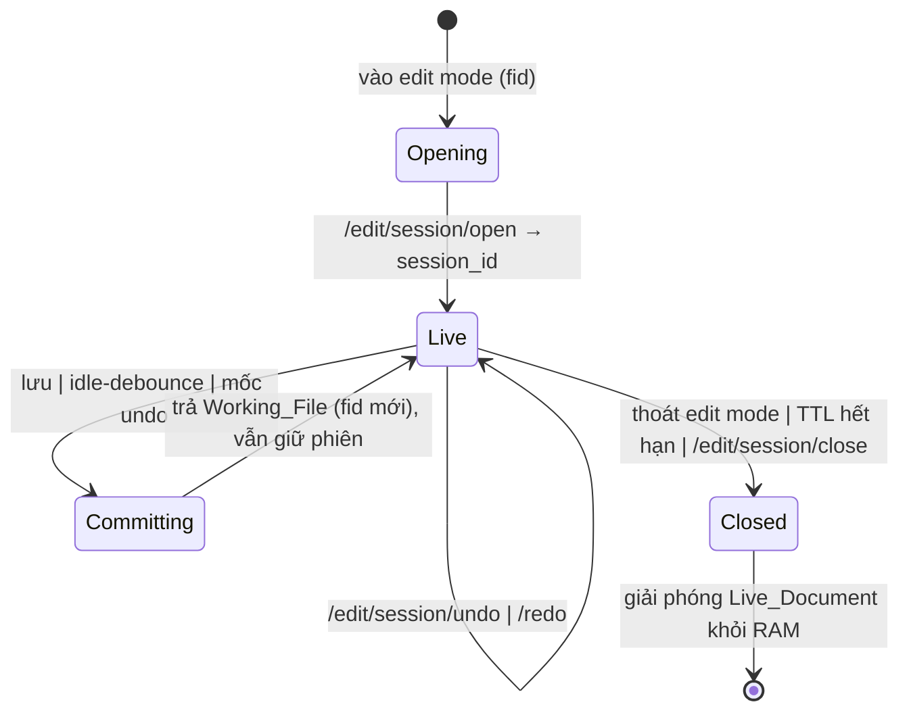

# Design Document — Phiên chỉnh sửa PDF trong bộ nhớ (`pdf-edit-session`)

> Thiết kế kỹ thuật cho tối ưu hiệu năng phương án "C": giữ một `pikepdf.Pdf` SỐNG theo phiên ở backend, áp thao tác in-memory, render tăng tiến theo vùng clip, chỉ ghi đĩa (Commit) khi cần. Bám sát `requirements.md` đã duyệt và tái dùng nguyên trạng kiến trúc `pdf-object-edit`.

## Overview

**Mục tiêu:** thao tác chỉnh sửa (move/resize/rotate/editText/add/delete) phản hồi gần như tức thì (file thường < ~300ms) thay vì ~5s, bằng cách tách "trạng thái chỉnh sửa" (live pikepdf trong RAM) khỏi "vật chất hóa ra đĩa" (Commit).

**Bất biến giữ nguyên (kế thừa `pdf-object-edit`):**
- **pikepdf = đường GHI DUY NHẤT (color-safe).** Mọi thay đổi nội dung đi qua `Stream_Editor`. PDFium chỉ ĐỌC/RENDER (cấm `FPDFPage_GenerateContent`).
- **KHÔNG ghi đè file gốc.** Commit luôn ra Working_File mới trong `edit_output`.
- Tái dùng nguyên trạng: `Stream_Editor` (delete/move/resize/rotate/edit_text/add), `Geometry_Reader.list_objects`, schema `EditOp`, `edit_io.save_working_file` (đã `compress_streams=False`), `pageBox`/CropBox.

**Ý tưởng cốt lõi:** mỗi thao tác chỉ: áp in-memory → render PNG vùng clip → trả về. Không tạo file, không để Rust mở lại file, không refetch `/edit/objects`. Việc ghi đĩa hoãn lại (Defer_Commit) cho tới khi lưu / rảnh tay / cần mốc undo bền.

**Giới hạn minh bạch:** file CỰC LỚN (315MB) vẫn bị giới hạn render bản thân trang (~vài giây — giải nén ảnh là cố hữu); clip giảm payload/giải-mã-FE, không xóa được giới hạn raster nền.

## Architecture

### Luồng cũ vs luồng phiên

```
LUỒNG CŨ (Legacy_Commit_Flow) — mỗi op:
  FE op → POST /edit/transform → pikepdf open(fid) → mutate → SAVE working file (đĩa)
       → đăng ký fid mới → FE đổi pdfUrl → Rust MỞ LẠI file mới → render CẢ TRANG
       → FE refetch /edit/objects
  Chi phí: save + Rust reopen + render full + refetch  (~5s file 315MB; lag cả file nhẹ)

LUỒNG PHIÊN (mới) — mỗi op:
  FE op → POST /edit/session/op → apply lên Live_Document (RAM) → render PNG vùng CLIP
       → trả {previewPng, clipRect, opResult{bbox mới}}
  FE: dán PNG lên đúng vùng clip + cập nhật editObjects tại chỗ (KHÔNG refetch, KHÔNG đổi pdfUrl)
  Commit (chỉ khi: lưu / idle-debounce / mốc undo) → SAVE working file → đổi sang tile Rust
```

### Vòng đời phiên



### Thành phần & ranh giới

```
Frontend (LivePageFrame / ImpositionTab / useEditSession)
   │  POST /edit/session/{open,op,undo,redo,commit}  DELETE /edit/session/{sid}
   ▼
Backend FastAPI (edit.py)  ──uses──>  edit_session.py (SESSIONS store, TTL)
   │                                      │ giữ pikepdf.Pdf SỐNG
   │                                      ├─ Stream_Editor (pikepdf GHI color-safe)
   │                                      ├─ Geometry_Reader (PDFium ĐỌC bbox)
   │                                      └─ render clip (PDFium read-only → PNG)
   └─ Commit ──> edit_io.save_working_file (đĩa, compress_streams=False) ──> UploadedFile(fid)
                                                                              ▼
                                            FE đổi pdfUrl → Tile_Renderer (Rust/PDFium từ path)
```

### Thread-safety (quan trọng)
FastAPI chạy handler đồng bộ trong threadpool (`run_in_executor` như `_execute`). pikepdf/PDFium **không thread-safe trên cùng document**:
- `_STORE_LOCK` chỉ bảo vệ map phiên (tạo/xóa/tra), giữ ngắn.
- Mỗi `EditSession.lock` tuần tự hóa MỌI thao tác đụng `pdf` của phiên đó (op/undo/redo/commit/render) — Yêu cầu 2.5. Phiên khác chạy song song được.

### TTL & dọn RAM (Yêu cầu 9)
- `SESSION_TTL = 30 phút` kể từ `last_access`.
- **Lazy sweep** mỗi lần tra phiên (rẻ) + **background sweep** asyncio mỗi 5 phút trong `lifespan` (tùy chọn).
- Đóng/dọn phiên: `pdf.close()` + xóa khỏi map → giải phóng RAM; giữ nguyên file gốc + Working_File đã commit (Yêu cầu 9.3).

## Components and Interfaces

### Backend — endpoints mới `/edit/session/*`
Mở rộng `backend/app/api/routes/edit.py`. Tất cả `Depends(require_license)`, chạy threadpool có timeout (tái dùng pattern `_execute`).

| Endpoint | Mục đích | Response chính |
|---|---|---|
| `POST /edit/session/open` | Mở phiên từ `fid` | `{session_id, page_count}` |
| `POST /edit/session/op` | Áp 1 EditOp in-memory + render clip | `{preview, clipRect, opResult, full, canUndo, canRedo}` |
| `POST /edit/session/commit` | Ghi Working_File mới | `EditResponse` (output_fid/url/path) |
| `POST /edit/session/undo` | Hoàn tác op gần nhất | như `/op` |
| `POST /edit/session/redo` | Làm lại op | như `/op` |
| `DELETE /edit/session/{sid}` | Đóng phiên, giải phóng RAM | `{closed: true}` |

**Map lỗi → HTTP:** phiên không tồn tại/đã dọn → **410 Gone** (FE bắt → fallback Legacy); `ObjectMapError`→409; `GlyphCoverageError`→422; `ValueError`→422; timeout→504; file gốc mất→404.

### Backend — module mới `app/core/edit_session.py`
Hàm chính (mọi hàm đụng `pdf` giữ `session.lock`):
- `open_session(fid) -> EditSession` — đọc file gốc, giữ `baseline_bytes` + mở `pikepdf` từ bytes; đảm bảo ≤1 phiên/fid (đóng phiên cũ nếu có).
- `apply_op(session, op) -> opResult` — resolve target từ bytes in-memory (xem dưới) → `Stream_Editor.*` → append `op_log`, clear `redo_stack`, `dirty=True`.
- `render_clip(session, op, scale, clip_pad) -> (png_b64, clipRect|None, full)` — save bytes → PDFium render trang → crop theo Clip_Region; fallback full-page.
- `undo(session)` / `redo(session)` — baseline + replay (xem Data Models).
- `commit(session) -> output_path` — `edit_io.save_working_file` + đăng ký UploadedFile.
- `close_session(sid)` / `sweep_expired()`.

**Resolve target trên Live_Document (quyết định):** dùng `pdf.save(BytesIO)` → PDFium `list_objects` trên bytes hiện tại (giống `/edit/preview`). Nhất quán tuyệt đối với trạng thái phiên; tái dùng bytes này cho cả bước render → chỉ save 1 lần/op. (Phương án thay thế: cache+cập-nhật-drawIndex — loại vì dễ lệch khi add/delete.)

### Backend — sửa `edit.py`
- Tách `_render_clip_blocking(pdf_bytes, page, scale, clipRect|None)` từ `_render_preview_blocking` (thêm crop theo clip).
- Giữ NGUYÊN các endpoint Legacy (`/edit/objects`, `/edit/delete`, `/edit/transform`, `/edit/text`, `/edit/add`, `/edit/preview`).

### Frontend — hook mới `desktop/src/hooks/useEditSession.ts`
Quản lý `sessionId`, `openSession(fid)`, `applyOp(op, scale)`, `undo()/redo()`, `commit()`, `closeSession()`, timer debounce-commit, cờ `sessionFailed` (bắt 410 → fallback). Trả dữ liệu để FE dán overlay + cập nhật overlay objects.

### Frontend — sửa `LivePageFrame.tsx`
- Vào edit mode: `openSession(selectionFileId)` (sau khi có fid — tái dùng effect auto-upload đã thêm).
- `commitEditTransform`/`commitEditObjectText`/`commitAddTextObject` → gọi `applyOp(op)` thay `sendEditAndPreview`:
  - Nhận `{preview, clipRect, opResult}` → thêm **lớp ảnh overlay** tại `clipRect×scale` (state mới `editPreviewOverlays`).
  - Cập nhật `editObjects` tại chỗ từ `opResult.bbox` (KHÔNG refetch).
  - Ghost dashed real-time giữ nguyên (CSS) trong lúc kéo.
- Undo/redo (Ctrl+Z/Y) khi `isObjectEditMode` → `useEditSession.undo/redo`.
- Commit (debounce/lưu) → `onEditCommit(output_*)` → đổi pdfUrl → gỡ overlay SAU khi tile mới `onload` (chống nháy).
- `sessionFailed` → mọi op rơi về `sendEditAndPreview` + `useObjectEditHistory` cũ.

### Frontend — sửa `editGeometry.ts` + `ImpositionTab.tsx`
- `editGeometry.ts`: thêm hàm thuần `clipRectPdfToCanvas(clipRect, pageHeightPt, bx0, by0, scale)` + unit test (vitest) chống regression tọa độ (gồm CropBox lệch gốc).
- `ImpositionTab.tsx`: mở/đóng phiên theo vòng đời edit mode; commit khi lưu.

### Files thêm/sửa (tổng hợp)
- Backend MỚI: `app/core/edit_session.py`. SỬA: `app/api/routes/edit.py`, `app/main.py` (sweep tùy chọn).
- Frontend MỚI: `desktop/src/hooks/useEditSession.ts`. SỬA: `LivePageFrame.tsx`, `editGeometry.ts`, `ImpositionTab.tsx`.

## Data Models

### EditSession (backend, `edit_session.py`)
```python
@dataclass
class EditSession:
    session_id: str
    source_fid: str            # fid gốc (UploadedFile.id) — fallback/định danh
    source_path: str           # đường dẫn file gốc trên đĩa (chỉ-đọc)
    pdf: pikepdf.Pdf           # Live_Document — SỐNG trong RAM
    baseline_bytes: bytes      # bytes file gốc (undo = replay từ baseline)
    op_log: list[EditOp]       # op đã áp (undo/redo + commit)
    redo_stack: list[EditOp]   # op đã undo, chờ redo
    lock: threading.Lock       # tuần tự hóa thao tác trong CÙNG phiên
    last_access: float         # epoch — TTL
    dirty: bool                # có thay đổi chưa commit?
    last_commit_path: str|None # Working_File commit gần nhất (đồng bộ tile)
```
`SESSIONS: dict[session_id, EditSession]` + `_STORE_LOCK`; phụ trợ `by_fid: dict[fid, session_id]` (≤1 phiên/fid).

### Request/Response schema (Pydantic, `edit.py`)
```python
class SessionOpenReq(BaseModel): fid: str
class SessionOpenResp(BaseModel): session_id: str; page_count: int

class SessionOpReq(BaseModel):
    session_id: str
    op: EditOp                  # tái dùng schema EditOp
    render_scale: float = 2.0   # px/point để render preview (≈ zoom×dpr)
    clip_pad_pt: float = 8.0    # lề an toàn quanh clip (point)

class SessionOpResp(BaseModel):
    success: bool
    preview: str                # data:image/png;base64,... (vùng clip hoặc full)
    clipRect: list[float] | None # [x0,y0,x1,y1] POINT, gốc Page_Box-relative; None = full
    full: bool                  # True nếu render toàn trang (fallback)
    page: int
    opResult: dict              # gồm bbox MỚI để FE cập nhật overlay tại chỗ
    canUndo: bool; canRedo: bool
```

### Clip_Region & tọa độ (Yêu cầu 3, 4)
- Clip = bbox đối tượng mục tiêu (SAU op) hợp nhất + `clip_pad_pt`; với `move`/`add` gộp cả vùng CŨ + MỚI (xóa "bóng ma").
- Quy đổi qua **Page_Box** (CropBox, fallback MediaBox) để khớp ảnh PDFium (render theo CropBox).
- FE dán overlay tại `clipRectPdfToCanvas(...)` (canvas px) — cùng công thức `editGeometry.ts`, tolerance ≤ 1.0pt.

### Undo/Redo: baseline + replay (Data model & quyết định)
- Giữ `baseline_bytes` cố định + `op_log`.
- **Undo**: `pikepdf.open(BytesIO(baseline_bytes))` → replay `op_log[:-1]` → thay `pdf`; op bỏ → `redo_stack`.
- **Redo**: pop `redo_stack` → áp lên `pdf` → push `op_log`.
- Op mới sau undo → `redo_stack.clear()`.
- Trade-off: undo O(n) op (chấp nhận vì không phải thao tác nóng); tránh phình RAM snapshot file lớn. Tối ưu sau: checkpoint bytes mỗi K=10 op.

### Defer_Commit & debounce (Yêu cầu 5)
- `commit`: `save_working_file(pdf, build_working_file_path(...))` → `_register_working_file` → `EditResponse` (output_fid/url/path) y Legacy; `dirty=False`.
- Commit khi: (1) người dùng Lưu; (2) idle debounce ~1.5s sau op cuối (mốc bền + cho tile thật); (3) trước khi đóng nếu `dirty`. Gộp nếu có op mới (Yêu cầu 5.6).

### Render Clip — quyết định
- v1: render TOÀN TRANG bằng PDFium ở `scale` rồi **crop ảnh (PIL)** theo Clip_Region. Lý do: pypdfium2 `render()` không nhận rect tùy ý đơn giản; chi phí chính ở giải nén ảnh (không giảm được bằng clip). Crop giảm payload PNG + chi phí dán/giải-mã FE (lợi rõ), giữ code đơn giản.
- Fallback toàn trang khi không xác định bbox giới hạn (Yêu cầu 3.6): `clipRect=None, full=true`.
- Tối ưu sau (task tùy chọn): `FPDF_RenderPageBitmap` matrix dịch + bitmap nhỏ bằng clip để giảm cả raster.

### Đồng bộ Preview_Image ↔ tile Rust (Yêu cầu 8)
- Trong phiên: nền = tile Rust (file commit gần nhất/gốc) + lớp overlay PNG các vùng clip đã sửa (đè đúng tọa độ).
- Commit xong: FE đổi `pdfUrl` sang Working_File mới (`__editCommit`) → Rust render tile thật → gỡ overlay clip SAU khi tile mới `onload`.
- Cả preview lẫn tile cùng bắt nguồn từ một `op_log` áp lên cùng baseline → khớp ≤1.0pt.

## Correctness Properties

Kiểm trên **logic phiên** (store, apply, op_log/undo/redo, commit) với PDF in-memory ngẫu nhiên có CMYK/spot/overprint/ICC (chi phí thấp, hợp PBT):

### Property 1: Tương đương in-memory ↔ commit (Round-trip / Model-based)
Với mọi chuỗi Edit_Op, áp qua phiên rồi Commit cho Working_File tương đương với áp cùng chuỗi qua Legacy_Commit_Flow tuần tự (nội dung + Color_Operators). **Validates: Requirements 2.1, 6.2, 11.2**

### Property 2: Bảo toàn màu Untouched_Object (Invariant)
Với mọi Edit_Op Apply_In_Memory, tập Color_Operators của Untouched_Object bằng nhau trước/sau (cả in-memory lẫn sau Commit). **Validates: Requirements 2.6, 6.2**

### Property 3: Round-trip màu CMYK/spot (Round-trip)
Object dùng `k`/`scn` qua Apply_In_Memory → Commit giữ nguyên operator, giá trị màu và định nghĩa colorspace. **Validates: Requirements 6.3**

### Property 4: Undo/Redo idempotent theo cặp (Round-trip)
Với mọi Edit_Op, Undo rồi Redo cho trạng thái tương đương sau Edit_Op ban đầu (Color_Operators + BBox trong tolerance ≤ 1.0pt). **Validates: Requirements 7.5**

### Property 5: Op_Log nhất quán khi lỗi/timeout (Invariant)
Với mọi Edit_Op bị hủy do lỗi/timeout, Op_Log và trạng thái Live_Document khớp nhau (op bị hủy không xuất hiện như đã áp); op hợp lệ kế tiếp vẫn đúng. **Validates: Requirements 10.1, 10.2, 10.3**

### Property 6: Tương đương vùng clip ↔ toàn trang (Metamorphic)
Với mọi Edit_Op tác động vùng giới hạn, Preview_Image của Clip_Region khớp hình học với cùng vùng trong ảnh render toàn trang, tolerance ≤ 1.0pt. **Validates: Requirements 3.5**

> Render đúng pixel của PDFium và Rust mở file đúng → integration test 1–3 ví dụ (KHÔNG PBT). Mục tiêu < ~300ms → benchmark (KHÔNG PBT).

## Error Handling

- Mọi endpoint phiên qua `asyncio.wait_for(EDIT_TIMEOUT_SECONDS)`; timeout → 504, giữ nguyên `pdf` (op CHƯA append log) (Yêu cầu 10.1, 10.3).
- Op áp lỗi (`ObjectMapError`/`GlyphCoverageError`/`ValueError`) → giữ nguyên `pdf`, không vào op_log, trả lỗi mô tả (Yêu cầu 10.2).
- **410 session-gone** khi Session_Id không còn (đóng/dọn TTL) → tín hiệu FE fallback Legacy (Yêu cầu 9.5, 11.1).
- Commit ra đĩa thất bại → giữ nguyên `pdf` trong RAM, báo lỗi để thử lại (Yêu cầu 10.5).
- Bảo toàn màu: nếu op không map được duy nhất → hủy, giữ Live_Document, báo lỗi (KHÔNG áp kết quả sai màu) (Yêu cầu 6.5).
- Legacy endpoints giữ nguyên → fallback luôn dùng được (Yêu cầu 11.3, 11.4).

## Testing Strategy

**PBT (backend `tests/`) — engine phiên trên PDF in-memory ngẫu nhiên:**
1. `test_session_commit_equiv_legacy_pbt.py` (Property 1)
2. `test_session_color_preservation_pbt.py` (Property 2)
3. `test_session_cmyk_roundtrip_pbt.py` (Property 3)
4. `test_session_undo_redo_pbt.py` (Property 4)
5. `test_session_oplog_consistency_pbt.py` (Property 5)

**Integration (1–3 ví dụ):**
- `test_session_clip_render_matches_full.py`: open→op(move)→render clip ≡ vùng tương ứng của full (Property 6); commit → file mở lại khớp.
- `test_session_undo_redo_e2e.py`: open→op×N→undo/redo→commit.
- `test_session_fallback.py`: session-gone (410) → kết quả Legacy tương đương.

**Benchmark/đo (không PBT):** op move file ≤20MB < ~300ms; xác nhận không refetch/không reopen mỗi op.

**Frontend (vitest):** `editGeometry.test.ts` thêm ca `clipRectPdfToCanvas` (gồm CropBox lệch gốc); `useEditSession` mock fetch: open/op/commit/fallback-410.

## Mapping Design → Requirements

| Mục thiết kế | Yêu cầu |
|---|---|
| Architecture (store, lock, TTL) | 1, 2.5, 9 |
| Components/endpoints + Error Handling | 1, 2, 5, 7, 10, 11 |
| apply in-memory + op_log (Components/Data) | 2, 6.1, 10.2, 10.3 |
| Clip render + tọa độ (Data Models) | 3, 4 |
| Undo/redo baseline+replay (Data Models) | 7 |
| Defer-commit/debounce (Data Models) | 5 |
| Đồng bộ preview↔tile (Data Models) | 8 |
| FE tích hợp (Components) | 4, 11, 12 |
| Testing Strategy | 6 (Properties 1–6) |
