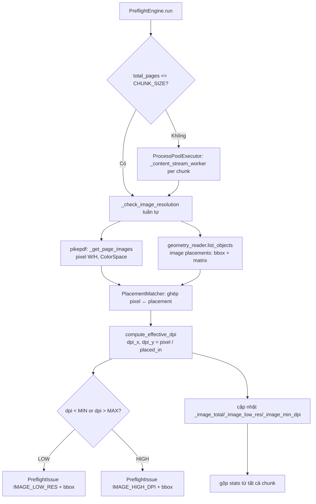
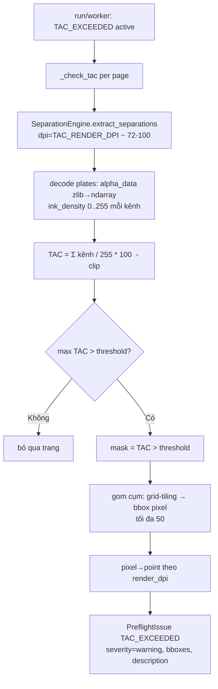
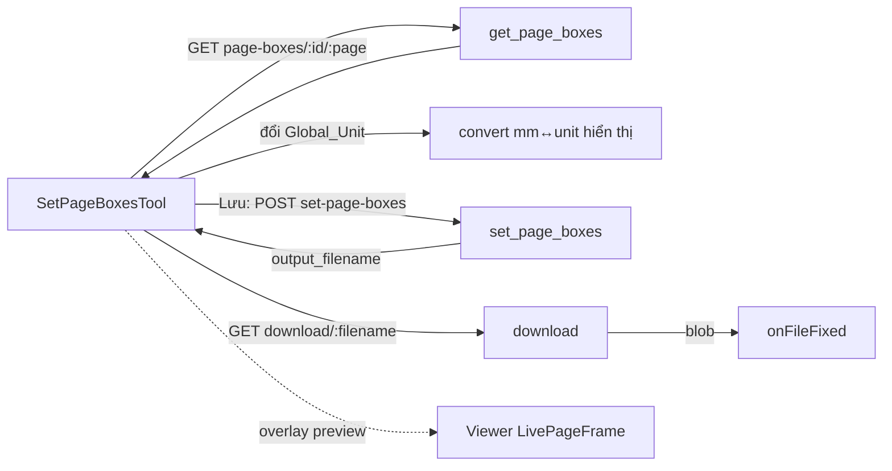

# Design Document — Preflight Depth Upgrade

## Overview

Tính năng này hoàn thiện ba năng lực preflight của PrynX bằng cách **mở rộng** các linh kiện đã có, không tái sinh:

1. **DPI hiệu dụng thật** — thay phép ước lượng "ảnh phủ kín MediaBox" trong `ImageRulesMixin._check_image_resolution` bằng phép tính dựa trên kích thước đặt ảnh thật trên trang (CTM × placement). Nguồn hình học là `geometry_reader.list_objects` (PDFium, read-only) đã dùng cho `/edit`; thuộc tính pixel (`/Width`, `/Height`, `/ColorSpace`) tiếp tục đọc qua pikepdf.
2. **Rule TAC / Ink-Limit** — thêm `rule_id = "TAC_EXCEEDED"` dùng `SeparationEngine` tách kênh CMYK(+spot) ở DPI thấp, cộng kênh thành ma trận TAC %, so ngưỡng `TAC_Threshold`, gom vùng vượt thành bbox và quy đổi pixel→point.
3. **UI Set Page Boxes** — hoàn thiện frontend cho `GET /preflight/page-boxes` và `POST /preflight/set-page-boxes` đã có, hiển thị/sửa 5 box theo Global_Unit, chọn phạm vi trang, preview overlay, lưu qua `onFileFixed`. Giữ nguyên auto-trim/add-bleed.

Ba ràng buộc kiến trúc xuyên suốt:
- **Mọi đường GHI PDF đi qua pikepdf** — KHÔNG dùng PDFium để ghi (PDFium chỉ đọc hình học).
- **Tái dùng linh kiện** — `geometry_reader`, `SeparationEngine`, `PageBoxesEngine`, các mixin `PreflightEngine`, các endpoint sẵn có.
- **Giữ `ProcessPoolExecutor`** và ngưỡng `CHUNK_SIZE = 10` cho đường file lớn.

### Nghiên cứu & quyết định chính

**Nguồn kích thước đặt ảnh: `geometry_reader.list_objects` (PDFium) làm nguồn chính.**

Có hai ứng viên:

| Tiêu chí | `geometry_reader.list_objects` (PDFium) | `pdf_content_parser.parse_content_stream` (CTM stack thủ công) |
|---|---|---|
| Cung cấp bbox đã biến đổi | Có — `FPDFPageObj_GetBounds` trả bbox cuối cùng theo hệ PDF | Không trực tiếp cho ảnh; parser hiện chỉ dựng path vector, KHÔNG xử lý `Do`/ảnh |
| Cung cấp CTM | Có — `FPDFPageObj_GetMatrix` trả `[a,b,c,d,e,f]` của object | Có CTM stack nhưng bỏ qua toán tử `Do` (ảnh) |
| Form XObject lồng nhau | PDFium "phẳng hóa" — bounds object ảnh đã gồm CTM của Form cha | Phải tự nhân CTM Form, parser hiện chưa duyệt vào Form |
| Xoay/nghiêng | Bao trong bbox + có matrix để tính độ dài cạnh | Có CTM, phải tự tính |
| Đã kiểm chứng | Đang dùng cho `/edit` (đường đọc chính) | Chỉ dùng cho vector drawing |
| Read-only an toàn | Có (đã nêu rõ trong docstring) | Có |

**Chốt:** dùng `geometry_reader.list_objects` vì (a) đã trả `bbox` cuối cùng theo hệ PDF và `matrix` của từng image-object, (b) PDFium tự phẳng hóa Form XObject lồng nhau nên bounds ảnh đã phản ánh tích CTM Form×placement, (c) là đường đọc hình học đã được kiểm chứng. `pdf_content_parser` KHÔNG được mở rộng cho ảnh để tránh viết lại bộ phân tích `Do`/Form (vi phạm Yêu cầu 17.1). Khi PDFium không trả được matrix/bbox cho một object, ta dùng độ dài hai vector cạnh từ `matrix` (xử lý xoay/nghiêng), và nếu vẫn thiếu thì bỏ qua placement (Yêu cầu 4.2).

**Ghép pixel ↔ placement.** `geometry_reader` trả các image-object theo `drawIndex` (thứ tự vẽ = thứ tự gặp toán tử `Do` đã phẳng hóa). pikepdf trả các XObject ảnh theo tên trong `/Resources/XObject`. Ta ghép bằng cách: với mỗi image-object từ geometry_reader, tra pixel `/Width`×`/Height` và `/ColorSpace` từ XObject ảnh **theo kích thước pixel + thứ tự xuất hiện**. Để chính xác, `geometry_reader` được mở rộng nhẹ để trả thêm tên XObject của ảnh (qua `FPDFImageObj_GetImageMetadata`/ `FPDFImageObj_GetImageDataDecoded` nếu khả dụng) — xem Components. Nếu không lấy được tên, fallback ghép theo pixel `width/height` PDFium báo cáo trùng với `/Width`,`/Height` pikepdf.

## Architecture

### Sơ đồ luồng dữ liệu — DPI hiệu dụng



### Sơ đồ luồng dữ liệu — TAC / Ink-Limit



### Sơ đồ luồng — UI Set Page Boxes



## Components and Interfaces

### 1. Backend — DPI hiệu dụng

#### 1.1 `geometry_reader` (mở rộng nhẹ, read-only)

Thêm một helper chuyên cho preflight để liệt kê **chỉ placement ảnh** kèm tên XObject, không phá API `list_objects` hiện có.

```python
# backend/app/core/geometry_reader.py

def list_image_placements(pdf_path: str, page_index: int) -> list[dict]:
    """
    Liệt kê tất cả placement ẢNH của một trang (read-only, PDFium).
    PDFium tự phẳng hóa Form XObject lồng nhau → bbox/matrix đã gồm CTM Form cha.

    Returns: list các dict:
      {
        "draw_index": int,          # thứ tự vẽ (Do) đã phẳng hóa
        "bbox": [x0, y0, x1, y1],   # hệ PDF bottom-left, point — vùng đặt thật
        "matrix": [a, b, c, d, e, f] | None,  # CTM của image-object
        "xobject_name": str | None, # tên /Im.. nếu lấy được
        "pixel_w": int | None,      # FPDFImageObj metadata nếu khả dụng
        "pixel_h": int | None,
      }
    Không phát sinh lỗi; object lỗi → bỏ qua (debug log).
    """
```

Ghi chú triển khai: tái dùng vòng lặp `FPDFPage_GetObject` đã có; lọc `raw_type == FPDF_PAGEOBJ_IMAGE`; lấy bounds + matrix như `list_objects`; thử `FPDFImageObj_GetImageMetadata(obj, page, &meta)` để lấy `width/height` và (nếu có) tên. Helper này KHÔNG ghi, KHÔNG gọi `GenerateContent`.

#### 1.2 `PlacementMatcher` (hàm thuần trong `images.py`)

```python
# backend/app/core/preflight_rules/images.py

def _match_placements_to_images(
    placements: list[dict],     # từ list_image_placements
    images: list[dict],         # từ _get_page_images (pikepdf): name,width,height,colorspace,obj
) -> list[dict]:
    """
    Ghép mỗi placement (geometry_reader) với một image XObject (pikepdf).
    Chiến lược ghép, ưu tiên giảm dần:
      1) Theo xobject_name nếu placement.xobject_name khớp images[].name
      2) Theo (pixel_w, pixel_h) placement khớp (width, height) pikepdf
      3) Theo thứ tự xuất hiện còn lại (greedy by draw_index)
    Returns list các dict gộp:
      { "placement": <placement>, "image": <image|None> }
    Placement không ghép được image → image=None (vẫn giữ để tính nếu có pixel từ PDFium).
    """
```

#### 1.3 Hàm tính DPI thuần (mới, dễ test)

```python
# backend/app/core/preflight_rules/images.py

MIN_PLACED_PT = 1.0  # ngưỡng tối thiểu mỗi chiều (point) — Yêu cầu 4.1

def _placed_size_from_matrix(matrix: list[float]) -> tuple[float, float]:
    """
    Tính (width_pt, height_pt) của ảnh đơn vị (1×1) sau biến đổi CTM.
    Ảnh PDF được vẽ trong không gian đơn vị [0,1]×[0,1]; cạnh ngang = |(a,b)|,
    cạnh dọc = |(c,d)| (độ dài hai vector cạnh sau CTM) → đúng cả khi xoay/nghiêng.
      width_pt  = hypot(a, b)
      height_pt = hypot(c, d)
    """
    a, b, c, d, _, _ = matrix
    return (math.hypot(a, b), math.hypot(c, d))

def _placed_size_from_bbox(bbox: list[float]) -> tuple[float, float]:
    """Fallback khi không có matrix: dùng bề rộng/cao bbox trục (axis-aligned)."""
    return (abs(bbox[2] - bbox[0]), abs(bbox[3] - bbox[1]))

def compute_effective_dpi(
    pixel_w: int, pixel_h: int, placed_w_pt: float, placed_h_pt: float
) -> tuple[float, float, float] | None:
    """
    DPI = pixel / (placed_pt / 72).
    Trả (dpi_x, dpi_y, effective_dpi=min(dpi_x,dpi_y)).
    Trả None nếu pixel < 1 hoặc placed_pt < MIN_PLACED_PT (Yêu cầu 4.1).
    """
    if pixel_w < 1 or pixel_h < 1:
        return None
    if placed_w_pt < MIN_PLACED_PT or placed_h_pt < MIN_PLACED_PT:
        return None
    dpi_x = pixel_w / (placed_w_pt / 72.0)
    dpi_y = pixel_h / (placed_h_pt / 72.0)
    return (dpi_x, dpi_y, min(dpi_x, dpi_y))
```

#### 1.4 `_check_image_resolution` (sửa)

Chữ ký giữ nguyên để tương thích worker:

```python
def _check_image_resolution(self, doc, active_rules: set, page_nums: list[int] = None) -> list[PreflightIssue]:
    """
    Thay đổi so với hiện tại:
      - Vẫn dùng pikepdf cho pixel/colorspace và các rule màu/OPI (giữ nguyên).
      - Với mỗi trang: gọi list_image_placements(doc._path, page_idx) một lần,
        ghép placement↔image, rồi tính DPI theo placement (không còn giả định phủ trang).
      - _image_total đếm theo SỐ PLACEMENT đã đánh giá (Yêu cầu 2.5).
      - Mỗi issue IMAGE_LOW_RES/IMAGE_HIGH_DPI gắn bbox = vùng đặt placement (Yêu cầu 2.3).
      - IMAGE_HIGH_DPI giữ guard: chỉ phát khi placement-size khả dụng (Yêu cầu 5.4).
      - Color/OPI/RGB/Spot vẫn duyệt theo image XObject như cũ (đếm 1 lần/ảnh, không nhân placement).
    """
```

Quy tắc đếm: `_image_total` += 1 cho **mỗi placement** được đánh giá DPI (có pixel + placed-size hợp lệ). Các rule màu (`COLOR_RGB_DETECTED`, `COLOR_SPOT_DETECTED`, `IMAGE_NOT_EMBEDDED`) vẫn phát theo XObject ảnh (một lần), giữ nguyên hành vi (Yêu cầu 5.1).

`doc._path` đã được gán trong `run()` và worker, dùng làm đường dẫn cho `list_image_placements`.

#### 1.5 Worker `_content_stream_worker`

Không đổi chữ ký. Vì `_check_image_resolution` đọc `doc._path`, worker đã `doc._path = pdf_path` nên `list_image_placements` chạy được trong tiến trình con. Stats `image_total/image_low_res/image_min_dpi` đã được gộp ở `run()` — giữ nguyên cơ chế (Yêu cầu 3.2).

### 2. Backend — Rule TAC / Ink-Limit

#### 2.1 Hằng & cấu hình

```python
# images.py hoặc module mới preflight_rules/ink.py (mixin)
TAC_RENDER_DPI = 100          # render thấp cho phân tích (Yêu cầu 9.2)
TAC_DEFAULT_THRESHOLD = 300   # % (Yêu cầu 7.1)
TAC_THRESHOLD_MIN = 100
TAC_THRESHOLD_MAX = 400
TAC_MAX_BBOXES = 50           # Yêu cầu 8.2
TAC_TILE_PX = 16              # kích thước ô grid-tiling để gom vùng
```

#### 2.2 `InkRulesMixin` (mixin mới, đăng ký vào `PreflightEngine`)

```python
# backend/app/core/preflight_rules/ink.py
class InkRulesMixin:
    def _check_tac(
        self, doc, page_nums: list[int] = None, tac_threshold: int = TAC_DEFAULT_THRESHOLD
    ) -> list[PreflightIssue]:
        """
        Với mỗi trang mục tiêu:
          1) SeparationEngine().extract_separations(doc._path, page, dpi=TAC_RENDER_DPI)
             (gọi đồng bộ qua asyncio.run/await helper — xem ghi chú async).
          2) Giải nén từng plate: zlib.decompress(base64.b64decode(alpha_data)) → ndarray uint8
             reshape (h, w). Cộng tất cả plate (CMYK + spot) → tac_sum (float).
          3) tac_pct = tac_sum / 255 * 100  (mỗi kênh 0..255 = 0..100%).
          4) max_tac = tac_pct.max(); nếu max_tac <= threshold → bỏ qua trang.
          5) mask = tac_pct > threshold; area_pct = mask.mean()*100.
          6) bboxes_px = _cluster_mask_to_bboxes(mask, TAC_TILE_PX, TAC_MAX_BBOXES).
          7) bboxes_pt = [_px_bbox_to_pdf_point(b, w, h, page_h_pt, render_dpi) ...].
          8) PreflightIssue(TAC_EXCEEDED, severity="warning", page, bboxes=bboxes_pt,
                 description=f"TAC tối đa {round(max_tac)}% > ngưỡng {threshold}%. "
                             f"Diện tích vượt ~{round(area_pct)}% trang.",
                 auto_fixable=False).
        Lỗi tách kênh 1 trang → PreflightIssue INTERNAL_ERROR cho trang đó, tiếp tục (Yêu cầu 9.3).
        """

    @staticmethod
    def _cluster_mask_to_bboxes(mask, tile_px: int, max_bboxes: int) -> list[list[int]]:
        """
        Gom vùng True thành bbox pixel bằng grid-tiling (đơn giản, ổn định):
          - Chia mask thành lưới ô tile_px × tile_px.
          - Ô có bất kỳ pixel True → ô "nóng".
          - Gộp các ô nóng kề nhau (4-neighbour, union-find/flood fill) thành cụm.
          - Mỗi cụm → bbox [px0, py0, px1, py1] (hệ pixel top-left, gốc trên-trái ảnh).
          - Nếu số cụm > max_bboxes → giữ max_bboxes cụm có diện tích lớn nhất.
        Trả [] nếu không có ô nóng.
        """

    @staticmethod
    def _px_bbox_to_pdf_point(bbox_px, img_w, img_h, page_h_pt, render_dpi) -> list[float]:
        """
        Quy đổi bbox pixel (top-left origin) → point (PDF bottom-left). (Yêu cầu 8.4)
          scale = 72 / render_dpi
          x0 = px0 * scale; x1 = px1 * scale
          y_top = py0 * scale; y_bot = py1 * scale
          # lật trục y: PDF gốc dưới-trái
          y0 = page_h_pt - y_bot; y1 = page_h_pt - y_top
        Trả [x0, y0, x1, y1].
        """
```

Ghi chú async: `SeparationEngine.extract_separations` là `async`. Trong đường tuần tự (đồng bộ) và trong worker tiến trình, gọi qua `asyncio.run(engine.extract_separations(...))`. Để tránh chi phí Ghostscript, gọi với `use_ghostscript=False` mặc định; chỉ bật GS khi `_detect_spot_inks` thấy spot (hành vi auto-detect sẵn có của engine), bảo đảm spot được cộng vào TAC (Yêu cầu 9.4).

#### 2.3 Tích hợp `PreflightEngine`

- `InkRulesMixin` thêm vào danh sách kế thừa của `PreflightEngine`.
- Thêm `"TAC_EXCEEDED"` vào `ALL_RULES`.
- Dispatch trong `run()` (cả nhánh tuần tự và file lớn) và trong `_content_stream_worker`:

```python
if "TAC_EXCEEDED" in active_rules:
    issues += self._check_tac(doc, tac_threshold=self._tac_threshold)
# trong worker: engine._tac_threshold = tac_threshold (truyền qua tham số worker)
```

- `run(pdf_path, rules=None, tac_threshold=300)` — thêm tham số; `_content_stream_worker(pdf_path, page_nums, active_rules, tac_threshold)` — thêm tham số tương ứng, truyền vào `executor.submit`.

#### 2.4 Validate ngưỡng (Yêu cầu 7.2, 7.3)

```python
def _normalize_tac_threshold(value) -> int:
    """100..400 → int(value); ngoài khoảng/không phải số → TAC_DEFAULT_THRESHOLD (300)."""
```

#### 2.5 API `inspect` (Yêu cầu 7.4)

```python
class InspectByIdRequest(BaseModel):
    file_id: str
    rules: Optional[List[str]] = None
    tac_threshold: Optional[int] = 300   # mới
```

`inspect_pdf` truyền `tac_threshold=_normalize_tac_threshold(request.tac_threshold)` vào `engine.run(...)`. `PreflightReportResponse` không đổi schema (Yêu cầu 5.3). Bổ sung `tac_threshold` áp dụng vào `summary` để UI hiển thị (Yêu cầu 11.4) — `summary` là `dict` tự do nên không phá schema.

#### 2.6 Auto-fix (Yêu cầu 10)

`TAC_EXCEEDED.auto_fixable = False` mặc định. Lý do nêu trong `description`: giảm tổng mực (ví dụ Under Color Removal/GCR) làm thay đổi diện mạo màu, rủi ro cao và phụ thuộc hồ sơ ICC đầu ra; cần can thiệp thủ công hoặc chuyển đổi ICC có kiểm soát. Nếu sau này cung cấp auto-fix, đường ghi phải qua pikepdf (giữ CMYK/spot), KHÔNG dùng pdfium (Yêu cầu 10.2, 17.4).

### 3. Frontend — Set Page Boxes UI

Mở rộng `PageBoxesTool.tsx` thành component có hai chế độ: (a) **Manual Boxes** (mới) và (b) **Auto trim + bleed** (giữ nguyên hành vi hiện có). Tách phần manual thành component con `SetPageBoxesPanel` trong cùng file để dễ bảo trì.

Global_Unit lấy từ `useAppSettingsStore().measurementUnit` (`'mm' | 'cm' | 'inch'`), bổ sung `'pt'` vào danh sách hiển thị nội bộ của panel (không bắt buộc sửa store; panel cho chọn pt cục bộ và mặc định theo measurementUnit).

#### 3.1 Hằng số quy đổi (Yêu cầu 16.3)

```typescript
// 1 inch = 25.4 mm; 1 pt = 1/72 inch → 1 pt = 25.4/72 mm
const MM_PER_UNIT: Record<Unit, number> = {
  mm: 1,
  cm: 10,
  inch: 25.4,
  pt: 25.4 / 72,
};
const toMm = (v: number, u: Unit) => v * MM_PER_UNIT[u];
const fromMm = (mm: number, u: Unit) => mm / MM_PER_UNIT[u];
const roundMm2 = (mm: number) => Math.round(mm * 100) / 100; // khớp backend 2 chữ số
```

#### 3.2 Trạng thái & API client

```typescript
type Unit = 'pt' | 'mm' | 'inch' | 'cm';
type BoxType = 'mediabox' | 'cropbox' | 'trimbox' | 'bleedbox' | 'artbox';
type RectMm = { x0: number; y0: number; x1: number; y1: number };

interface BoxMm { x0:number; y0:number; x1:number; y1:number; width:number; height:number }
interface PageBoxesResponse {
  page: number; total_pages: number;
  mediabox: BoxMm; cropbox: BoxMm; trimbox: BoxMm; bleedbox: BoxMm; artbox: BoxMm;
  has_trimbox: boolean; has_bleedbox: boolean; has_artbox: boolean; has_cropbox: boolean;
}

// GET /preflight/page-boxes/{file_id}/{page}
async function fetchPageBoxes(fileId: string, page: number): Promise<PageBoxesResponse>;

// POST /preflight/set-page-boxes
interface SetPageBoxesBody { file_id: string; box_type: BoxType; rect_mm: RectMm; pages: number[] | null; }
async function postSetPageBoxes(body: SetPageBoxesBody): Promise<{ success: boolean; output_filename?: string; detail?: string }>;
```

#### 3.3 Validate phía UI

```typescript
// Yêu cầu 13.3, 13.4, 14.4, 14.5
function validateRectUnit(r: {x0:number;y0:number;x1:number;y1:number}): string | null {
  if ([r.x0,r.y0,r.x1,r.y1].some(n => Number.isNaN(n) || !Number.isFinite(n)))
    return 'Giá trị nhập không phải số hợp lệ';
  if (r.x1 <= r.x0) return 'x1 phải lớn hơn x0';
  if (r.y1 <= r.y0) return 'y1 phải lớn hơn y0';
  return null;
}

function resolvePages(scope: 'single'|'range'|'all', start: number, end: number, total: number):
  { pages: number[] | null } | { error: string } {
  if (scope === 'all') return { pages: null };           // Yêu cầu 14.2
  if (scope === 'single') {
    if (start < 1 || start > total) return { error: `Trang hợp lệ: 1–${total}` };
    return { pages: [start] };
  }
  // range
  if (start > end) return { error: 'Trang bắt đầu phải ≤ trang kết thúc' }; // 14.5
  if (start < 1 || end > total) return { error: `Trang hợp lệ: 1–${total}` }; // 14.4
  return { pages: Array.from({length: end-start+1}, (_,i)=>start+i) };       // 14.3 (1-indexed)
}
```

#### 3.4 Luồng lưu (Yêu cầu 15.2)

```
ensureUploaded() → fileId
validate rect (đơn vị hiện tại) → convert sang mm (roundMm2)
resolvePages(scope) → pages
POST set-page-boxes { file_id, box_type, rect_mm, pages }
 → output_filename
GET download/{output_filename} → blob
onFileFixed(blob, `pagebox_${pdfFile.name}`)
```

Lỗi gọi API → hiển thị thông báo, **giữ nguyên** giá trị đang nhập (Yêu cầu 15.4).

#### 3.5 Preview overlay (Yêu cầu 15.1)

Panel phát một sự kiện overlay (qua `useWorkspaceStore` hoặc prop callback `onPreviewBoxes(rectPt[])`) để viewer (`LivePageFrame`) vẽ khung 5 box bằng SVG `rect` chồng lên trang đang xem. Toạ độ chuyển từ mm → point → toạ độ viewer theo scale hiện có của viewer. Đây là overlay thuần frontend, không ghi file.

### 4. Frontend — Hiển thị & điều hướng lỗi DPI/TAC (Yêu cầu 11)

Panel báo cáo preflight hiện có render danh sách `issues`. Bổ sung:
- Hiển thị `IMAGE_LOW_RES`, `IMAGE_HIGH_DPI`, `TAC_EXCEEDED` với `page`, `description`, `severity` (đã có cơ chế chung).
- Khi chọn issue có `bbox`/`bboxes` → điều hướng trang + highlight vùng (tái dùng cơ chế highlight sẵn có); không có vùng → chỉ nhảy trang (Yêu cầu 11.3).
- Hiển thị `TAC_Threshold` áp dụng (đọc từ `summary.tac_threshold`) luôn hiển thị (Yêu cầu 11.4), kèm đơn vị rõ ràng: DPI cho ảnh, % cho TAC (Yêu cầu 16.4).

## Data Models

### PreflightIssue (không đổi cấu trúc — Yêu cầu 5.3)
Dùng nguyên `bbox` cho DPI (một vùng đặt), `bboxes` cho TAC (nhiều vùng). Không thêm trường mới.

### Image placement (nội bộ, không lên API)
```python
{
  "draw_index": int,
  "bbox": [x0, y0, x1, y1],        # point, PDF bottom-left
  "matrix": [a, b, c, d, e, f] | None,
  "xobject_name": str | None,
  "pixel_w": int | None,
  "pixel_h": int | None,
}
```

### TAC analysis (nội bộ)
```python
{
  "page": int,
  "max_tac_pct": float,
  "area_pct": float,
  "bboxes_pt": list[[x0, y0, x1, y1]],  # ≤ 50
  "render_dpi": int,
}
```

### Mở rộng API request/summary
- `InspectByIdRequest.tac_threshold: Optional[int] = 300`.
- `report.summary["tac_threshold"]: int` (giá trị đã chuẩn hoá đang áp dụng).
- `image_summary` giữ nguyên `{ total, low_res, min_dpi }`; `min_dpi = 0` khi không có placement nào (Yêu cầu 4.5).

### UI state (Set Page Boxes)
```typescript
{
  fileId: string;
  page: number;            // trang đang xem để GET boxes
  unit: Unit;              // mặc định = measurementUnit
  boxes: Record<BoxType, {x0:number;y0:number;x1:number;y1:number}>; // theo unit hiện tại
  inherited: Record<BoxType, boolean>;  // từ has_* (đảo: !has_* và != mediabox)
  editing: BoxType;
  scope: 'single'|'range'|'all';
  rangeStart: number; rangeEnd: number;
  error: string;
}
```

## Correctness Properties

*Một property (tính chất) là một đặc trưng hoặc hành vi phải luôn đúng trên mọi lần thực thi hợp lệ của hệ thống — về bản chất là một phát biểu hình thức về điều phần mềm phải làm. Properties là cầu nối giữa đặc tả người-đọc-được và bảo đảm đúng-đắn máy-kiểm-chứng-được.*

PBT áp dụng cho phần lõi thuần hàm của tính năng này: số học DPI, tính kích thước đặt từ CTM (bất biến theo xoay/nghiêng), cộng/ngưỡng TAC, quy đổi pixel→point, chuẩn hoá ngưỡng, và quy đổi đơn vị box (round-trip). Các phần PDFium/SeparationEngine/UI tương tác được kiểm bằng integration/example test (xem Testing Strategy).

### Property 1: Effective DPI đúng công thức và lấy min

*Với mọi* `pixel_w ≥ 1`, `pixel_h ≥ 1`, `placed_w_pt ≥ MIN_PLACED_PT`, `placed_h_pt ≥ MIN_PLACED_PT`, hàm `compute_effective_dpi` trả `dpi_x = pixel_w/(placed_w_pt/72)`, `dpi_y = pixel_h/(placed_h_pt/72)` (trong sai số số học), và `effective_dpi = min(dpi_x, dpi_y) ≤ dpi_x` và `≤ dpi_y`.

**Validates: Requirements 1.1, 1.3**

### Property 2: Kích thước đặt từ CTM bằng độ dài hai vector cạnh và bất biến theo xoay

*Với mọi* ma trận tỉ lệ `[sx, 0, 0, sy, e, f]` (sx,sy > 0) và *với mọi* góc xoay θ, kích thước đặt tính từ CTM đã xoay bằng `_placed_size_from_matrix` thoả `width_pt = |(a,b)| = sx`, `height_pt = |(c,d)| = sy` (trong sai số), tức kích thước đặt KHÔNG đổi khi áp thêm phép xoay/nghiêng thuần lên ma trận tỉ lệ.

**Validates: Requirements 1.2, 4.4**

### Property 3: Phân loại ngưỡng DPI phát đúng issue theo từng placement, có guard

*Với mọi* danh sách placement (mỗi placement có pixel và kích thước đặt khả dụng hoặc không), số lượng `IMAGE_LOW_RES` phát ra bằng số placement có `effective_dpi < MIN_IMAGE_DPI`, số lượng `IMAGE_HIGH_DPI` bằng số placement có `effective_dpi > MAX_IMAGE_DPI`; và KHÔNG có `IMAGE_HIGH_DPI` nào được phát cho placement mà kích thước đặt không khả dụng (guard).

**Validates: Requirements 1.4, 1.5, 2.2, 5.4**

### Property 4: Placement suy biến bị bỏ qua

*Với mọi* placement có `pixel_w < 1` hoặc `pixel_h < 1` hoặc kích thước đặt mỗi chiều `< MIN_PLACED_PT`, `compute_effective_dpi` trả `None` và placement đó KHÔNG phát issue DPI nào.

**Validates: Requirements 4.1**

### Property 5: Bất biến đếm placement và gộp thống kê chunk

*Với mọi* tập kết quả chunk `[(image_total, image_low_res, image_min_dpi), ...]`, bộ gộp cho ra `Σ image_total`, `Σ image_low_res`, và `min(image_min_dpi)`; và tổng số placement đánh giá bằng tổng số placement hợp lệ trên tất cả trang (độc lập việc một XObject xuất hiện nhiều lần).

**Validates: Requirements 2.1, 2.5, 3.2**

### Property 6: Mô tả issue DPI chứa pixel và DPI đã làm tròn

*Với mọi* placement vi phạm ngưỡng, `description` của issue chứa chuỗi kích thước pixel `"{pixel_w}×{pixel_h}"` và giá trị `effective_dpi` làm tròn đến số nguyên.

**Validates: Requirements 1.6**

### Property 7: TAC bằng tổng kênh và đơn điệu theo phủ mực

*Với mọi* tập mảng kênh CMYK(+spot) cùng kích thước (mỗi phần tử 0..255), `tac_pct = (Σ kênh)/255*100` tại từng điểm; và *với mọi* gia tăng giá trị bất kỳ kênh nào tại một điểm (không giảm các kênh khác), `tac_pct` tại điểm đó không giảm (đơn điệu không-giảm theo phủ mực). Kênh spot đóng góp vào tổng giống kênh process.

**Validates: Requirements 6.2, 9.4**

### Property 8: Phân loại ngưỡng TAC và nội dung báo cáo

*Với mọi* ma trận `tac_pct` và `threshold`, issue `TAC_EXCEEDED` (severity `warning`) được phát khi và chỉ khi `max(tac_pct) > threshold`; khi phát, `description` chứa `max(tac_pct)` làm tròn và `threshold`, và `area_pct` bằng tỉ lệ phần tử `tac_pct > threshold` nhân 100.

**Validates: Requirements 6.3, 6.4, 6.5**

### Property 9: Chuẩn hoá ngưỡng TAC

*Với mọi* giá trị đầu vào: nếu là số trong `[100, 400]` thì `_normalize_tac_threshold` trả chính giá trị đó (ép kiểu nguyên); ngược lại (ngoài khoảng hoặc không phải số) trả `300`.

**Validates: Requirements 7.1, 7.2, 7.3**

### Property 10: Gom vùng TAC bị giới hạn và quy đổi pixel→point đúng

*Với mọi* `mask` nhị phân và `render_dpi > 0`, `_cluster_mask_to_bboxes` trả tối đa `TAC_MAX_BBOXES (=50)` bbox; và *với mọi* bbox pixel hợp lệ, `_px_bbox_to_pdf_point` quy đổi với `scale = 72/render_dpi`, lật trục y theo `page_h_pt`, cho bbox point nằm trong `[0, page_w_pt] × [0, page_h_pt]` và đảo ngược lại khôi phục bbox pixel ban đầu (trong sai số làm tròn).

**Validates: Requirements 8.1, 8.2, 8.4**

### Property 11: Quy đổi đơn vị box round-trip và làm tròn 2 chữ số mm

*Với mọi* giá trị số hữu hạn `v` và *với mọi* đơn vị `u ∈ {pt, mm, inch, cm}`, `fromMm(toMm(v, u), u) == v` (trong sai số dấu phẩy động); `toMm`/`fromMm` dùng hệ số chuẩn (`1 inch = 25.4 mm`, `1 pt = 25.4/72 mm`); và `roundMm2(x)` cho cùng kết quả với `round(x, 2)` của backend.

**Validates: Requirements 12.2, 12.4, 13.1, 13.5, 16.1, 16.3**

### Property 12: Xác thực rectangle box

*Với mọi* rectangle `{x0, y0, x1, y1}`, `validateRectUnit` trả lỗi khi bất kỳ giá trị nào không hữu hạn (NaN/Infinity), hoặc khi `x1 ≤ x0`, hoặc khi `y1 ≤ y0`; và trả `null` (hợp lệ) khi và chỉ khi cả bốn giá trị hữu hạn và `x1 > x0` và `y1 > y0`.

**Validates: Requirements 13.3, 13.4**

### Property 13: Phân giải phạm vi trang

*Với mọi* `total ≥ 1`: khi `scope = all` → `pages = null`; khi `scope = single` và `1 ≤ start ≤ total` → `pages = [start]`; khi `scope = range` và `1 ≤ start ≤ end ≤ total` → `pages = [start, start+1, …, end]` (1-indexed, liên tục); mọi trường hợp `start > end` hoặc trang ngoài `[1, total]` → trả lỗi (không gửi).

**Validates: Requirements 14.2, 14.3, 14.4, 14.5**

## Error Handling

### DPI / Image rules
- **Thiếu CTM hoặc bbox placement (Yêu cầu 4.2):** bỏ qua placement, ghi `logger.debug`, không phát issue, không dừng vòng lặp.
- **Trang thiếu MediaBox hợp lệ (Yêu cầu 4.3):** `continue` sang trang kế, không phát lỗi.
- **`list_image_placements` ném lỗi cho một trang:** bắt lỗi cục bộ, coi như trang không có placement; các rule màu/OPI vẫn chạy theo pikepdf như cũ.
- **Không có placement nào toàn tài liệu (Yêu cầu 4.5):** `_image_min_dpi` chuẩn hoá về `0` (giữ logic sentinel→0 hiện có).
- **Chunk lỗi trong multiprocessing (Yêu cầu 3.4):** worker bắt exception, trả `PreflightIssue(INTERNAL_ERROR, page=chunk[0])`, các chunk khác tiếp tục (giữ cơ chế hiện có).

### TAC rule
- **SeparationEngine lỗi cho một trang (Yêu cầu 9.3):** bắt exception trong `_check_tac`, phát `PreflightIssue(INTERNAL_ERROR, page=p)`, tiếp tục trang còn lại.
- **Giải nén plate lỗi / kích thước kênh không khớp:** bỏ qua trang đó với `INTERNAL_ERROR`, không sập toàn báo cáo.
- **Không gom được vùng đáng tin (Yêu cầu 8.3):** vẫn phát `TAC_EXCEEDED` mức trang với `bboxes = []`.
- **Ngưỡng không hợp lệ (Yêu cầu 7.3):** `_normalize_tac_threshold` thay bằng 300, không ném lỗi.

### Set Page Boxes UI
- **Validate thất bại (Yêu cầu 13.3, 13.4, 14.4, 14.5):** chặn gửi, hiển thị thông báo lỗi tiếng Việt, giữ nguyên input.
- **API `set-page-boxes` thất bại (Yêu cầu 15.4):** bắt lỗi fetch/`detail`, hiển thị `❌ {message}`, KHÔNG xoá giá trị đang nhập.
- **`GET page-boxes` thất bại:** hiển thị lỗi, cho phép thử lại; không crash panel.
- **`download` thất bại sau khi set thành công:** thông báo lỗi tải file, vẫn giữ `output_filename` để thử lại.

### API layer
- `inspect_pdf` giữ `try/except` hiện có; `tac_threshold` luôn đi qua `_normalize_tac_threshold` nên không bao giờ truyền giá trị xấu xuống engine.

## Testing Strategy

### Cách tiếp cận kép
- **Property tests** (lõi thuần hàm): triển khai 13 property ở trên.
- **Unit/example tests**: ca cụ thể, edge case, lỗi.
- **Integration tests**: PDFium flatten Form lồng nhau, parity tuần tự↔multiprocessing, SeparationEngine thật.

### Thư viện PBT
- **Backend (Python):** Hypothesis (đã có sẵn `backend/.hypothesis/`).
- **Frontend (TypeScript):** fast-check (cho Property 11, 12, 13 — quy đổi đơn vị, validate rect, phân giải phạm vi trang).

### Cấu hình
- Mỗi property test chạy **tối thiểu 100 iteration** (Hypothesis: `@settings(max_examples=100)`; fast-check: `{ numRuns: 100 }`).
- Mỗi property test gắn comment tham chiếu property thiết kế.
- Tag format: **Feature: preflight-depth-upgrade, Property {number}: {property_text}**

### Ánh xạ property → vị trí test
- Property 1, 3, 4, 6 → `backend/tests/test_image_dpi_props.py` (hàm `compute_effective_dpi`, phát issue).
- Property 2 → `backend/tests/test_placed_size_props.py` (`_placed_size_from_matrix`, xoay/nghiêng).
- Property 5 → `backend/tests/test_chunk_stats_props.py` (bộ gộp + đếm placement).
- Property 7, 8 → `backend/tests/test_tac_props.py` (cộng kênh, đơn điệu, ngưỡng, mô tả).
- Property 9 → `backend/tests/test_tac_threshold_props.py` (`_normalize_tac_threshold`).
- Property 10 → `backend/tests/test_tac_bbox_props.py` (gom cụm ≤ 50, quy đổi pixel→point).
- Property 11, 12, 13 → `desktop/src/components/preprocess-tools/__tests__/setPageBoxes.props.test.ts` (fast-check).

### Unit/Example tests
- **DPI:** ảnh phủ một phần trang; ảnh tiled nhiều placement; ảnh đặt lệch; `min_dpi == 0` khi không có ảnh (Yêu cầu 4.5); regression các rule ảnh khác (GIF, progressive JPEG, OPI, RGB, Spot — Yêu cầu 5.1).
- **TAC:** trang dưới ngưỡng (không issue); trang vượt ngưỡng; trang có spot; mặc định 300 khi không truyền (Yêu cầu 7.1); `auto_fixable == False` (Yêu cầu 10.1, 10.3).
- **API:** `inspect` truyền `tac_threshold` xuống engine (Yêu cầu 7.4); schema `PreflightIssueResponse` không đổi (Yêu cầu 5.3).
- **UI:** render 5 box (Yêu cầu 12.1); đánh dấu kế thừa từ `has_*` (Yêu cầu 12.3); đổi unit cập nhật ngay (Yêu cầu 16.2); payload `set-page-boxes` đúng shape (Yêu cầu 13.2); thành công→`onFileFixed` (Yêu cầu 15.2); thất bại→giữ input (Yêu cầu 15.4); preview overlay vẽ khung (Yêu cầu 15.1); auto-trim/add-bleed vẫn chạy (Yêu cầu 15.5); hiển thị TAC_Threshold + nhãn đơn vị (Yêu cầu 11.4, 16.4); nhảy trang + highlight theo bbox (Yêu cầu 11.1, 11.2, 11.3).

### Integration tests
- **Form XObject lồng nhau (Yêu cầu 2.4):** PDF mẫu có ảnh trong Form lồng; xác nhận kích thước đặt phản ánh tích CTM Form×placement (PDFium flatten).
- **Parity tuần tự ↔ multiprocessing (Yêu cầu 2.5, 3.1, 3.3):** file > `CHUNK_SIZE` trang; so khớp multiset issue và stats giữa hai đường chạy.
- **TAC file lớn (Yêu cầu 9.1):** xác nhận đi qua `ProcessPoolExecutor`, lỗi một trang→`INTERNAL_ERROR` và tiếp tục (Yêu cầu 9.3).
- **Smoke (Yêu cầu 6.1, 9.2, 15.3, 17.x):** `"TAC_EXCEEDED" in ALL_RULES`; `TAC_RENDER_DPI` thấp; `set_boxes` ghi qua pikepdf; không có đường ghi pdfium; `CHUNK_SIZE` không đổi.

### Files thay đổi (tóm tắt)
- `backend/app/core/geometry_reader.py` — thêm `list_image_placements` (read-only).
- `backend/app/core/preflight_rules/images.py` — `_match_placements_to_images`, `_placed_size_from_matrix`, `_placed_size_from_bbox`, `compute_effective_dpi`, sửa `_check_image_resolution`.
- `backend/app/core/preflight_rules/ink.py` — **mới**: `InkRulesMixin` (`_check_tac`, `_cluster_mask_to_bboxes`, `_px_bbox_to_pdf_point`), `_normalize_tac_threshold`.
- `backend/app/core/preflight_models.py` — thêm `"TAC_EXCEEDED"` vào `ALL_RULES`.
- `backend/app/core/preflight_engine.py` — kế thừa `InkRulesMixin`; dispatch TAC trong `run()` (tuần tự + file lớn) và `_content_stream_worker`; thêm tham số `tac_threshold`.
- `backend/app/api/routes/preflight.py` — `InspectByIdRequest.tac_threshold`; truyền `_normalize_tac_threshold` vào `engine.run`; ghi `summary["tac_threshold"]`.
- `desktop/src/components/preprocess-tools/PageBoxesTool.tsx` — thêm `SetPageBoxesPanel` (xem/sửa 5 box, validate, scope trang, preview, lưu), giữ auto-trim/add-bleed.
- `desktop/src/stores/appSettingsStore.ts` — (tùy chọn) mở rộng `measurementUnit` để bao gồm `'pt'` nếu muốn dùng chung; nếu không, panel xử lý `'pt'` cục bộ.
- Component báo cáo preflight (hiển thị issue) — bổ sung điều hướng/highlight cho DPI/TAC và hiển thị TAC_Threshold.
