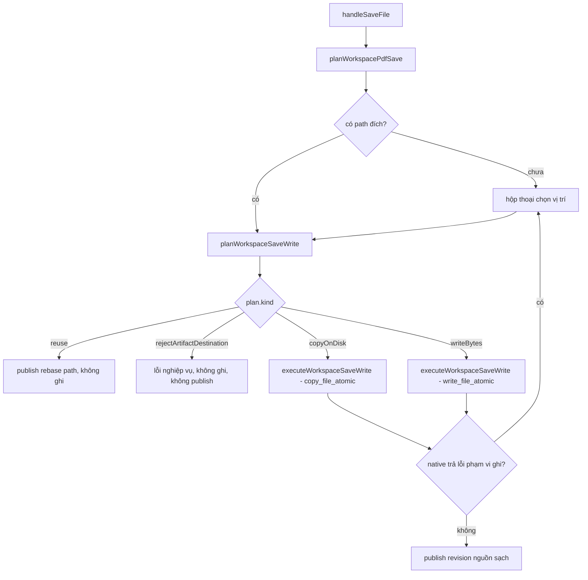

# Design Document

## Overview

Spec này đóng phần bằng chứng còn thiếu của F2b, không mở lại phần logic đã đạt.

Đã có trong cây mã (lô trước, đã verify đỏ-trước/xanh-sau):

- `desktop/src/lib/workspaceFileSave.ts` — `workspacePathCompareKey`, `isSameWorkspacePath`, và hai predicate `canReuseExistingWorkspaceSource` / `isUnsafeWorkspaceArtifactDestination` so path đã chuẩn hoá.
- `desktop/src-tauri/src/lib.rs` — `disk_compare_key`, `resolves_to_same_disk_file`, `validate_disk_copy_request` fail-closed khi nguồn trùng đích.
- 12 test predicate TS + 3 test Rust.

Thiết kế này thêm ba thứ:

1. **Tách quyết định ghi ra khỏi component** để hợp đồng Save As test được mà không mount `ImpositionTab`.
2. **Nâng oracle cùng-một-file ở tầng native** từ so chuỗi canonical sang định danh file thật của Windows, đóng ca ổ mạng map và hardlink.
3. **Test artifact và provenance** chứng minh trạng thái sau khi từ chối là nguyên vẹn.

## Bối cảnh đã truy vết

### Chuỗi vé thuê artifact

Truy vết bằng `file:dòng`, đây là lý do ca nguy hiểm nghiêm trọng hơn một lỗi nhãn:

| Bước | Vị trí |
|---|---|
| Token nằm trên `File` đang là working file | `artifactLease.ts:14` `readArtifactLeaseToken` |
| Tab gom token của current + history | `ImpositionTab.tsx:1350` `collectArtifactLeaseTokens([file, ...history, ...objectEditPast, ...objectEditFuture])` |
| Owner của tab đồng bộ tập token mong muốn | `ImpositionTab.tsx:1394` `owner.sync(artifactLeaseTokens)` |
| Owner claim/renew/release với backend | `artifactLease.ts:44` `POST /artifacts/{action}` |
| Publish revision đã lưu **tước** token | `workspaceFileSave.ts` `createSavedWorkspaceRevision` → `createSavedSourceFile`; test hiện có khẳng định `readArtifactLeaseToken(saved)` là `undefined` |

Hệ quả của ca nguy hiểm: nếu Save As chấp nhận đích trùng artifact tạm rồi publish revision, token bị tước khỏi `file`, `collectArtifactLeaseTokens` không còn trả nó, owner release, và vòng dọn artifact phía backend được phép xoá — **chính file mà người dùng vừa tưởng là đã lưu**. Không chỉ sai provenance mà là đường mất dữ liệu.

**Proof gap:** thời điểm và điều kiện xoá thật của vòng dọn backend chưa được đo trong spec này. Chuỗi trên là đọc code, không phải quan sát runtime. Requirement 2.4 vì vậy được kiểm ở mức bất biến frontend (token còn trên working file sau khi từ chối), không khẳng định hành vi reaper.

### Vì sao không mount ImpositionTab để test

`handleSaveFile` là `useCallback` tại `ImpositionTab.tsx:3370` với khoảng ba mươi dependency, nằm trong component đọc `useWorkspaceStore`, `useImposerSettingsStore`, `useAppSettingsStore`, `useAuthStore`, `useEditSession`, `AcrobatViewer` và loader PDF. Mount nó trong vitest để kiểm một nhánh từ chối là đắt và giòn. Codebase đã có mẫu tốt hơn: `planWorkspacePdfSave` trả **plan** rồi component thực thi. Thiết kế này đi tiếp đúng mẫu đó.

## Architecture

### Tách quyết định ghi thành plan + executor



Điểm then chốt: nhánh `rejectArtifactDestination` là **một giá trị plan**, không phải exception mang chuỗi. Nó không bao giờ đi vào `catch` nên không thể bị nhánh fallback hiểu nhầm thành lỗi phạm vi ghi. Đây là cách đóng Requirement 1.3 mà không dựa vào việc thông báo tiếng Việt tình cờ không chứa `not allowed`.

### Oracle cùng-một-file hai tầng

Hai tầng có mục đích khác nhau, không phải trùng lặp:

| Tầng | Cách làm | Trả lời được | Không trả lời được |
|---|---|---|---|
| TS `isSameWorkspacePath` | Chuẩn hoá chuỗi: hoa/thường, `/` và `\`, phân cách trùng, `.`, `..`, giữ tiền tố UNC | Đủ để chặn sớm và cho thông báo tốt trước khi gọi native | Tên 8.3, junction, symlink, hardlink, ổ map |
| Rust, biên tin cậy | Định danh file thật của Windows | Mọi ca trên | Ca đích chưa tồn tại (khi đó không thể trùng file) |

TS không được nâng lên mức native: nó chạy trong WebView, không có handle file, và mọi thứ nó kết luận đều chỉ là gợi ý. Native mới là nơi cưỡng chế.

### Nâng oracle native lên định danh file

Hiện `disk_compare_key` dùng `std::fs::canonicalize` rồi hạ hoa/thường. Nó đã đóng 8.3, junction và symlink, nhưng còn hở ổ mạng map so với UNC và hardlink cùng volume.

`Win32_Storage_FileSystem` đã bật trong `desktop/src-tauri/Cargo.toml` nên dùng được `GetFileInformationByHandle` mà **không thêm dependency hay feature mới**. Oracle đúng của Windows là bộ ba `dwVolumeSerialNumber` + `nFileIndexHigh` + `nFileIndexLow`.

Thuật toán `resolves_to_same_disk_file(source, target)`:

1. Nếu `target` không tồn tại trên đĩa thì trả `false` ngay. Đích chưa tồn tại không thể là file nguồn đang tồn tại. Đây cũng là đường đi của phần lớn lượt Save As nên không phát sinh chi phí.
2. Mở handle chỉ-đọc cho cả hai với `FILE_FLAG_BACKUP_SEMANTICS` và share mode đầy đủ, để không khoá file người dùng đang mở ở phần mềm khác.
3. Lấy `BY_HANDLE_FILE_INFORMATION` cho cả hai. Nếu trùng cả ba trường thì là cùng một file.
4. Nếu bất kỳ bước mở handle hoặc truy vấn thất bại, **rơi về so sánh `disk_compare_key` hiện có**, không kết luận là hai file khác nhau. Đây là Requirement 3.5: resolve thất bại không được biến thành cho phép ghi.

Giữ `disk_compare_key` làm fallback thay vì bỏ nó. Nó vẫn là lớp phòng thủ khi handle không mở được vì quyền hoặc file đang bị khoá.

## Components and Interfaces

### `desktop/src/lib/workspaceFileSave.ts` (mở rộng)

```ts
export type WorkspaceSaveWritePlan =
  | { kind: 'reuseExistingSource' }
  | { kind: 'rejectArtifactDestination' }
  | { kind: 'copyOnDisk'; sourcePath: string; destPath: string }
  | { kind: 'writeBytes'; destPath: string };

export interface WorkspaceSaveWriteInput {
  /** Working file hiện tại, đã đọc lại từ store sau khi commit edit-session. */
  file: File;
  /** Đích người dùng chọn hoặc path ghi đè từ plan trước. */
  destPath: string;
  /** Path là artifact phù du của backend hoặc temp upload. */
  isTransientPath: boolean;
  /** Đã bake xoay hoặc thứ tự trang vào bytes mới. */
  didBake: boolean;
}

export function planWorkspaceSaveWrite(
  input: WorkspaceSaveWriteInput,
): WorkspaceSaveWritePlan;
```

Thứ tự quyết định trong `planWorkspaceSaveWrite`, cố ý đặt `reject` trước `copy`:

1. `canReuseExistingWorkspaceSource` đúng thì `reuseExistingSource`.
2. `isUnsafeWorkspaceArtifactDestination` đúng thì `rejectArtifactDestination`.
3. Không bake và `file.path` có thật thì `copyOnDisk`.
4. Còn lại thì `writeBytes`.

### Executor tách khỏi React

```ts
export interface WorkspaceSaveWritePorts {
  copyOnDisk: (sourcePath: string, destPath: string) => Promise<void>;
  writeBytes: (destPath: string, bytes: Uint8Array) => Promise<void>;
  readBytes: () => Promise<Uint8Array>;
}

export type WorkspaceSaveWriteOutcome =
  | { kind: 'written' }
  | { kind: 'reused' }
  | { kind: 'rejected'; messageKey: string };

export function executeWorkspaceSaveWrite(
  plan: WorkspaceSaveWritePlan,
  ports: WorkspaceSaveWritePorts,
): Promise<WorkspaceSaveWriteOutcome>;
```

Executor không import Tauri, không đụng state React. Nhờ đó test khẳng định được điều quan trọng nhất của Requirement 1.1 và 2: với plan `rejectArtifactDestination`, **không port nào được gọi** và `readBytes` cũng không chạy, nên file lớn không bị đọc vô ích.

`messageKey` là khoá i18n, không phải chuỗi cứng. Text hiển thị đi qua `desktop/src/i18n/` theo quy ước dự án.

### `ImpositionTab.tsx` sau khi tách

`performWrite` hiện tại trở thành:

1. Gọi `planWorkspaceSaveWrite`.
2. `rejectArtifactDestination` thì `setError` bằng khoá i18n và trả về `false`, không publish, không đổi `isSaved`, không đổi tiêu đề tab.
3. Ngược lại gọi `executeWorkspaceSaveWrite` với ports bọc `invoke`.
4. Giữ nguyên nhánh `catch` cho lỗi phạm vi ghi từ native. Chuỗi `forbidden path` / `not allowed` vẫn do Rust sinh cho `write_file_atomic` và `copy_file_atomic`, nên phần đó **không đổi hành vi**.

### `desktop/src-tauri/src/lib.rs`

```rust
/// Định danh file thật của Windows: volume serial + file index.
/// Trả None khi không mở được handle hoặc không truy vấn được.
fn windows_file_identity(path: &std::path::Path) -> Option<(u32, u32, u32)>;

/// Nguồn và đích cùng trỏ một file trên đĩa.
/// Ưu tiên định danh thật; thất bại thì rơi về `disk_compare_key`.
fn resolves_to_same_disk_file(source: &std::path::Path, target: &std::path::Path) -> bool;
```

`validate_disk_copy_request` giữ nguyên chữ ký và vị trí gọi. Chỉ phần thân của `resolves_to_same_disk_file` mạnh lên, nên ba test Rust hiện có vẫn là hợp đồng hợp lệ và phải tiếp tục xanh.

## Data Models

### `WorkspaceSaveWritePlan`

Union rời rạc, đúng một nhánh cho mỗi lượt lưu. Đặt `rejectArtifactDestination` thành **giá trị dữ liệu** thay vì exception là quyết định thiết kế trung tâm: nhánh từ chối vì thế không thể lẫn vào luồng lỗi phạm vi ghi.

| Nhánh | Trường | Ý nghĩa |
|---|---|---|
| `reuseExistingSource` | — | Đích chính là source sạch hiện tại và không có gì để bake. Không ghi, chỉ rebase path khi publish. |
| `rejectArtifactDestination` | — | Đích trùng file artifact tạm app-owned. Không ghi, không publish. |
| `copyOnDisk` | `sourcePath`, `destPath` | Copy đĩa→đĩa, không đọc bytes vào WebView. |
| `writeBytes` | `destPath` | Ghi bytes đã bake. |

### `WorkspaceSaveWriteInput`

| Trường | Kiểu | Nguồn tại call site |
|---|---|---|
| `file` | `File` | `store.getState().file` đọc lại sau khi commit edit-session, không dùng closure `file` |
| `destPath` | `string` | `savePlan.overwritePath` hoặc kết quả hộp thoại |
| `isTransientPath` | `boolean` | `file.isTempUploadPath` hoặc `isEphemeralBackendPath(file.path)` |
| `didBake` | `boolean` | Có áp xoay hoặc thứ tự trang vào bytes mới |

### `WorkspaceSaveWriteOutcome`

`written` | `reused` | `rejected` kèm `messageKey`. `messageKey` là khoá i18n; text tiếng Việt nằm trong `desktop/src/i18n/`, không hardcode trong lib.

### Định danh file Windows

Bộ ba lấy từ `BY_HANDLE_FILE_INFORMATION`:

| Trường | Kiểu | Vai trò |
|---|---|---|
| `dwVolumeSerialNumber` | `u32` | Phân biệt volume; ổ map và UNC của cùng share cho cùng giá trị |
| `nFileIndexHigh` | `u32` | Nửa cao của chỉ số file trong volume |
| `nFileIndexLow` | `u32` | Nửa thấp |

Hai path là cùng một file khi và chỉ khi trùng cả ba. `None` nghĩa là không kết luận được, không phải "khác nhau".

### Đơn vị và bất biến dữ liệu

- Path luôn là chuỗi tuyệt đối theo quy ước Windows. Không có path tương đối nào đi vào plan.
- `workspacePathCompareKey` trả chuỗi đã hạ hoa/thường, dấu phân cách `\`, giữ tiền tố `\\` của UNC. Nó là khoá so sánh, không phải path dùng để mở file.
- Provenance là metadata trên `File` (`isGenerated`, `isTempUploadPath`), không suy từ tên file.

## Correctness Properties

Các bất biến dưới đây đúng với mọi đầu vào, phù hợp làm property test bên cạnh test ví dụ.

### Property 1: Từ chối không có tác dụng phụ

Với mọi input mà plan là `rejectArtifactDestination`, số lần gọi mỗi port của executor bằng 0. Không đọc bytes, không chạm đĩa.

**Validates: Requirements 1.1, 2.1, 2.2**

### Property 2: Chuẩn hoá path là idempotent

`workspacePathCompareKey(workspacePathCompareKey(p)) === workspacePathCompareKey(p)` với mọi `p`.

**Validates: Requirements 3.1**

### Property 3: Quan hệ cùng-một-file phản xạ và đối xứng

`isSameWorkspacePath(p, p)` đúng với mọi `p` không rỗng, và `isSameWorkspacePath(a, b) === isSameWorkspacePath(b, a)`.

**Validates: Requirements 3.1**

### Property 4: Biến thể path vô hại không đổi kết luận

Với mọi path `p` và mọi phép biến đổi trong tập {đổi hoa/thường, `\`→`/`, nhân đôi dấu phân cách, chèn `\.\`, thêm dấu phân cách cuối}, `isSameWorkspacePath(p, biếnĐổi(p))` vẫn đúng.

**Validates: Requirements 3.1, 3.6**

### Property 5: Không chặn oan

Nếu hai path có khoá chuẩn hoá khác nhau và không trỏ cùng một file trên đĩa, plan không bao giờ là `rejectArtifactDestination`.

**Validates: Requirements 3.2, 4.4**

### Property 6: Provenance sạch chỉ sinh ra khi ghi thành công

Revision mất `isGenerated`, `isTempUploadPath` và vé thuê artifact chỉ ở đường outcome `written` hoặc `reused`. Đường `rejected` giữ nguyên mọi metadata của working file.

**Validates: Requirements 2.3, 2.4, 2.5**

### Property 7: Fail-closed khi không kết luận được

Nếu `windows_file_identity` trả `None` cho bất kỳ phía nào, `resolves_to_same_disk_file` phải đi tiếp bằng `disk_compare_key` chứ không trả `false` ngay.

**Validates: Requirements 3.5**

### Property 8: Hai đường ghi loại trừ nhau

Với mọi input, đúng một trong hai đường được dùng: `copyOnDisk` chỉ khi `didBake` sai và `file.path` tồn tại; `writeBytes` trong mọi ca ghi còn lại. Không input nào dùng cả hai.

**Validates: Requirements 4.5**

## Error Handling

| Ca | Nơi chặn | Người dùng thấy | Không được xảy ra |
|---|---|---|---|
| Đích trùng artifact tạm, frontend nhận ra | `planWorkspaceSaveWrite` | Thông báo tiếng Việt qua khoá i18n, hướng chọn vị trí khác | Gọi native, publish revision, mở lại hộp thoại |
| Đích trùng nguồn, chỉ native nhận ra | `validate_disk_copy_request` | Lỗi nghiệp vụ nổi qua `catch`, không lặp hộp thoại | Trả `Ok`, tạo `.tmp`, đổi bytes |
| Đích ngoài vùng cho phép ghi | Rust sensitive-path | Hộp thoại chọn lại vị trí (hành vi cũ) | Mất thay đổi |
| Không mở được handle để so định danh | `resolves_to_same_disk_file` fallback | Không thấy gì nếu hai file khác nhau | Cho ghi vì resolve thất bại |

Thông báo cho ca artifact cố ý **không** chứa `not allowed` hay `forbidden path`. Sau khi tách plan thì điều này không còn là chốt duy nhất, nhưng vẫn giữ như một lớp nữa và có test khẳng định.

## Testing Strategy

Mọi test chạy trên máy Windows thật của dự án. `node_modules` chứa binary Windows nên vitest và tsc không chạy được trong VM Linux.

### TS — `desktop/src/lib/workspaceFileSave.test.ts` (mở rộng)

| Ca | Requirement |
|---|---|
| Plan cho generated hoặc temp chọn trùng path là `rejectArtifactDestination` | 1.1 |
| Plan reject với path lệch case ổ đĩa, lệch dấu phân cách, có `..` | 1.1, 3.1 |
| Executor với plan reject: không gọi `copyOnDisk`, `writeBytes`, `readBytes` | 1.1, 2.1, 2.2 |
| Source sạch chọn lại chính nó và không bake là `reuseExistingSource` | 1.6 |
| Không bake và có path đĩa là `copyOnDisk`; có bake là `writeBytes` | 4.5 |
| Path khác file thật cho ra `copyOnDisk`, không reject oan | 3.2, 4.4 |
| Working file sau khi reject vẫn giữ `isGenerated`, `isTempUploadPath` và vé thuê artifact | 2.3, 2.4 |
| Revision publish sau khi lưu thành công thì sạch provenance và sạch vé | 2.5 |

### Rust — `desktop/src-tauri/src/lib.rs`, module `disk_copy_request_tests`

| Ca | Requirement |
|---|---|
| Ba test hiện có tiếp tục xanh sau khi đổi oracle | 4.3 |
| Hardlink tới cùng file bị nhận ra là cùng một file | 3.3 |
| Junction tới thư mục chứa file bị nhận ra | 3.3 |
| Sau khi từ chối: bytes nguyên vẹn, thư mục chỉ còn fixture, không `.tmp` | 2.1, 2.2 |
| Đích chưa tồn tại trong thư mục con vẫn qua | 4.4 |

Tạo hardlink và junction cần quyền phù hợp. Nếu môi trường không cho, test phải `skip` có thông báo rõ và ghi vào proof gap, **không** được đổi thành assert yếu hơn rồi báo xanh.

Ca ổ mạng map (Requirement 3.4) không dựng được bằng fixture cục bộ. Kế hoạch: kiểm bằng thao tác tay có ghi lại, hoặc ghi thành giới hạn còn lại nếu không có share thật để thử. Không suy từ tài liệu của `GetFileInformationByHandle`.

### Ma trận verify trước khi báo xong

1. `cd desktop && npm run typecheck`
2. `cd desktop && npx vitest run src/lib/workspaceFileSave.test.ts`
3. `cd desktop && npm run test`
4. `cd desktop\src-tauri && cargo test --lib disk_copy_request_tests`
5. `cd desktop\src-tauri && cargo check --lib`
6. `cd desktop && npm run lint`

Runtime `run_dev.bat` là bước riêng của người dùng, xem mục dưới.

## Chuỗi thao tác runtime để nâng lên RUNTIME

Không suy từ unit test. Phải chạy đúng chuỗi này trên `run_dev.bat`:

1. Mở một PDF khách từ Home bằng picker.
2. Chạy một công cụ sinh kết quả để tab có working file là artifact tạm, ví dụ Bình trang hoặc Tách file.
3. Ctrl+Shift+S để Save As, điều hướng tới đúng thư mục `uploads` của sidecar và chọn chính file `<uuid>.pdf` đang là working file.
4. Kỳ vọng: thông báo tiếng Việt rõ ràng, hộp thoại **không** mở lại, tiêu đề tab không đổi, cờ đã-lưu không bật.
5. Kiểm file `<uuid>.pdf` còn nguyên kích thước và không có `.tmp` trong thư mục đó.
6. Save As lần nữa tới một thư mục khách bình thường. Kỳ vọng lưu được, tiêu đề đổi theo tên mới.
7. Lặp bước 3 nhưng gõ tay đường dẫn với ký tự ổ đĩa viết thường và dấu `/`. Kỳ vọng vẫn bị từ chối.

## Rủi ro và cách giảm

| Rủi ro | Giảm thiểu |
|---|---|
| Tách `performWrite` chạm đường lưu nóng của người dùng | Plan là hàm thuần, executor không có state; nhánh `catch` lỗi phạm vi ghi giữ nguyên; chạy full vitest và ca runtime trước khi chốt |
| Đổi trigger fallback từ so chuỗi sang plan làm mất nhánh chọn lại vị trí | Không bỏ so chuỗi. Lỗi phạm vi ghi vẫn từ Rust dưới dạng chuỗi và vẫn đi qua `catch` như cũ |
| Mở handle file làm khoá file người dùng đang mở ở Illustrator hoặc Corel | Share mode đầy đủ, chỉ đọc thông tin, đóng handle ngay |
| Oracle mới chặn oan một luồng hợp lệ | Luồng ghi đè hợp lệ không đi qua `copy_file_atomic`: không bake thì đã `reuseExistingSource`, có bake thì đi `write_file_atomic`. Có test đối chứng âm cho cả hai |
| Chi phí thêm cho lượt Save As bình thường | Đích chưa tồn tại thì trả `false` trước khi mở handle. Một lần trên mỗi lượt lưu, không nằm trong vòng lặp |

## Phạm vi không thuộc thiết kế này

- Các finding khác của Lô F về provenance metadata cho Recent và dirty.
- Vòng dọn artifact phía backend và chính sách hết hạn lease.
- Luồng `saveBlob.ts`: ghi bytes in-memory nên không có ca nguồn trùng đích.
- `documentWindow.ts`: đích là staging tự sinh có nonce, không do người dùng chọn.