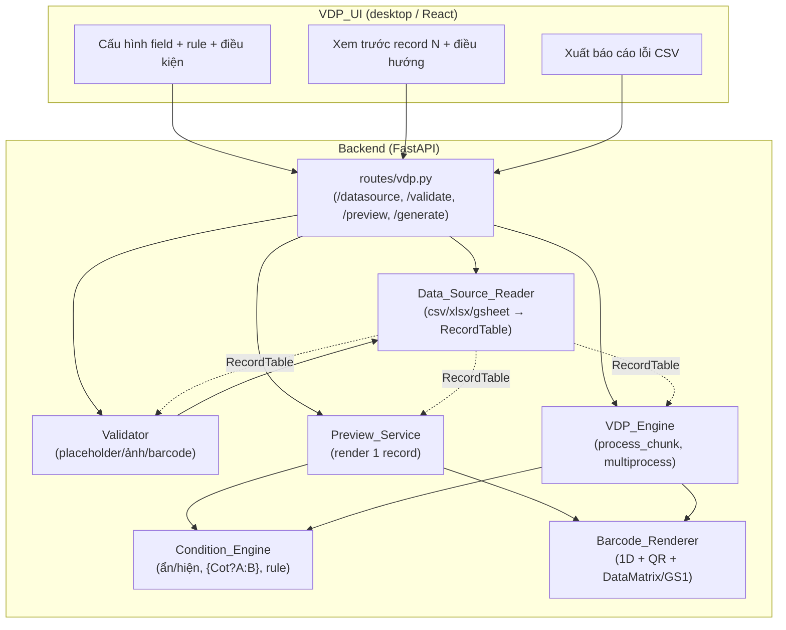
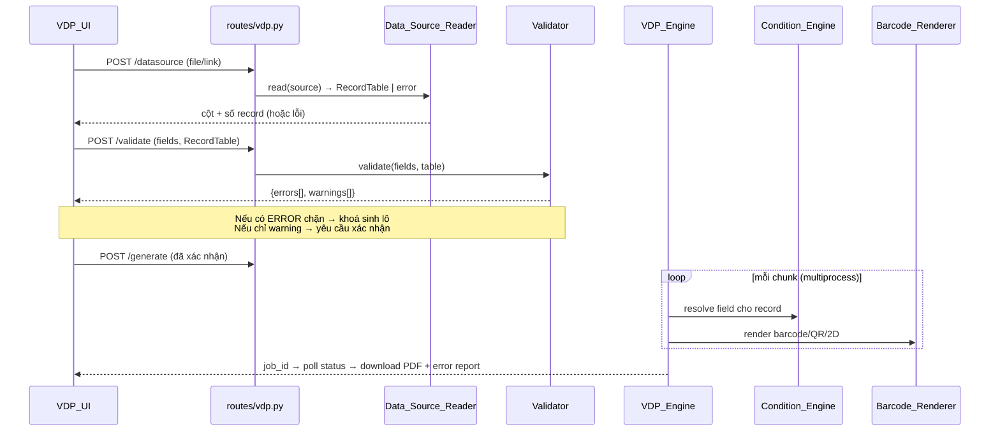
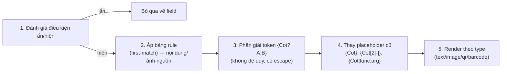

# Design Document — VDP Upgrade (PrynX)

## Overview

Tài liệu thiết kế này mô tả cách hiện thực 5 hạng mục Tier-1 nâng cấp engine VDP của PrynX cùng các yêu cầu bảo toàn parity, tương thích ngược và hiệu năng, theo `requirements.md`.

Nguyên tắc thiết kế cốt lõi:

1. **Tách lớp đọc dữ liệu khỏi engine render.** Tạo một lớp `Data_Source_Reader` mới chuẩn hoá mọi nguồn (CSV/Excel/Google Sheets) về cùng một cấu trúc `RecordTable` (danh sách cột + danh sách dòng `dict`). Lớp này thuần (pure) và không phụ thuộc ReportLab/PDF, nên dễ kiểm thử bằng property-based testing.
2. **Mở rộng cơ chế token hiện có thay vì thay thế.** `Condition_Engine` bọc quanh hàm `_substitute` hiện tại trong `vdp_engine.py`, thêm điều kiện ẩn/hiện, token nội tuyến `{Cot?A:B}` và bảng rule, nhưng **đặt sau cùng** đường thay placeholder cũ để field không dùng tính năng mới giữ nguyên kết quả (Req 7).
3. **Bổ sung barcode 2D như một nhánh render mới trong `Barcode_Renderer`,** không động vào nhánh 1D/QR hiện hữu (Req 3.8, 7.3).
4. **Dùng một lõi merge duy nhất cho cả preview và sinh lô.** `Preview_Service` gọi cùng hàm dựng-một-trang (single-record render) mà `process_chunk` dùng, đảm bảo parity tuyệt đối preview ↔ output (Req 4.4, 6.3).
5. **Validate là một pass thuần dữ liệu chạy TRƯỚC khi sinh lô,** không tạo trang PDF nào (Req 5.7).

Mọi quy đổi toạ độ tiếp tục neo theo hằng số `CSS_TO_PT_FACTOR = 0.75` (= 72/96) đang dùng, và đen người dùng `#000000` tiếp tục map về CMYK `(0,0,0,1)` pure-K qua `hex_to_cmyk` hiện có.

### Phạm vi nghiên cứu đã thực hiện

- **Mã nguồn hiện trạng:** `backend/app/workers/vdp_engine.py` (`process_chunk`, `_substitute`, `_TOKEN_RE`, `hex_to_cmyk`, `run_vdp_engine`), `backend/app/schemas/vdp.py` (`VdpField`), `backend/app/api/routes/vdp.py` (job store, `/generate`, `/status`, `/download`, `/upload`, `/fonts`), và frontend `desktop/src/components/preprocess-tools/DataMergeTool.tsx` + `LivePageFrame.tsx` (parsing CSV bằng PapaParse, quy đổi `×96/72`, lưu field theo "CSS-mm").
- **Thư viện sẵn có (`backend/requirements.txt`):** `reportlab==4.2.0`, `segno==1.6.6`, `python-barcode==0.16.1`, `pikepdf`, `pypdfium2`, `httpx==0.27.0`. ReportLab 4.2 đã có sẵn widget DataMatrix ECC200 (`reportlab.graphics.barcode.ecc200datamatrix.ECC200DataMatrix`) và `Code128` — nên barcode 2D ECC200 và nền GS1-128 không cần thư viện ngoài.
- **Thiếu và phải bổ sung:** `openpyxl` (đọc `.xlsx`, kể cả tên sheet và merged cell). Việc nhận diện encoding/delimiter sẽ tự hiện thực bằng heuristic thuần Python (không bắt buộc thêm `chardet`), nhưng có thể thêm `charset-normalizer` nếu cần độ tin cậy cao hơn.
- **Google Sheets:** lấy dữ liệu qua URL export CSV công khai (`https://docs.google.com/spreadsheets/d/{id}/export?format=csv&gid={gid}`) bằng `httpx`; không tích hợp OAuth (ngoài phạm vi Tier-1).

## Architecture

### Vị trí các thành phần



### Luồng xử lý một lô (batch)



### Thứ tự xử lý một field cho một record (Req 2.11)

Đây là điểm tích hợp then chốt giữa `Condition_Engine` và đường render hiện tại. Thứ tự CỐ ĐỊNH:



Khi field không có điều kiện, không khớp rule và không chứa token `{Cot?...}`, các bước 1–3 là no-op và bước 4 chính là `_substitute` hiện tại — đảm bảo Req 7.3 (kết quả không đổi).

## Components and Interfaces

### 1. Data_Source_Reader (`backend/app/workers/vdp_datasource.py` — mới)

Lớp thuần, không import ReportLab. Trả về `RecordTable` hoặc `DataSourceError`.

```python
# Kết quả chuẩn hoá dùng chung cho mọi định dạng nguồn (Req 1.10)
class RecordTable:
    columns: list[str]          # tên cột duy nhất, theo thứ tự xuất hiện
    rows: list[dict[str, str]]  # mỗi dict: column -> giá trị (string)

class DataSourceError(Exception):
    code: str       # 'EMPTY' | 'NO_HEADER' | 'DETECT_FAILED' | 'GSHEET_FORBIDDEN' | ...
    message: str    # thông báo tiếng Việt mô tả nguyên nhân

# API chính
def read_source(kind: str, payload: bytes | str, *, sheet: str | None = None,
                has_header: bool = True) -> RecordTable: ...

# Hàm con thuần (đơn vị PBT)
def detect_encoding(raw: bytes) -> str            # {'utf-8','utf-8-sig','windows-1258'} (Req 1.6)
def detect_delimiter(header_line: str) -> str     # {',',';','\t'} (Req 1.5)
def normalize_columns(header: list[str]) -> list[str]   # khử trùng tên + ô rỗng (Req 1.11)
def parse_delimited(text: str, delimiter: str, has_header: bool) -> RecordTable  # (Req 1.1,1.10)
def read_xlsx(data: bytes, sheet: str | None) -> RecordTable                     # openpyxl (Req 1.2,1.3,1.12)
def list_xlsx_sheets(data: bytes) -> list[str]                                   # (Req 1.3)
def fetch_gsheet_csv(url: str) -> bytes                                          # httpx (Req 1.4,1.13)
```

**Quyết định thiết kế:**
- `detect_delimiter` chọn ký tự trong `{',',';','\t'}` cho **số cột lớn nhất và ổn định** trên dòng tiêu đề; nếu hoà hoặc số cột = 1 cho mọi ứng viên → ném `DETECT_FAILED` (Req 1.8).
- `detect_encoding` thử lần lượt UTF-8-SIG (BOM) → UTF-8 (strict) → Windows-1258; chọn encoding đầu tiên giải mã không lỗi. Nếu không có encoding nào giải mã sạch → `DETECT_FAILED` (Req 1.6, 1.8). Ưu tiên này đảm bảo tiếng Việt có dấu được giữ nguyên Unicode (Req 1.7).
- `normalize_columns`: ô tiêu đề rỗng → `"Cột {i}"`; tên trùng → thêm hậu tố `"_2"`, `"_3"`… theo lần xuất hiện, đảm bảo không mất cột (Req 1.11).
- Dòng tiêu đề = **dòng KHÔNG rỗng đầu tiên**; dòng hoàn toàn rỗng bị bỏ qua (Req 1.10).
- `read_xlsx`: dùng `openpyxl` ở chế độ `read_only`; merged cell gán giá trị ô trên-trái, các ô còn lại để rỗng (Req 1.12).
- `fetch_gsheet_csv`: chuyển link thành URL export CSV; HTTP 4xx/redirect login → `GSHEET_FORBIDDEN` (Req 1.13).

### 2. Condition_Engine (`backend/app/workers/vdp_conditions.py` — mới)

Hàm thuần, gọi từ cả `process_chunk` và `Preview_Service`.

```python
# Toán tử so sánh hỗ trợ (Req 2.9)
Operator = Literal['eq', 'ne', 'contains', 'empty', 'not_empty']

class FieldCondition:        # ẩn/hiện
    column: str
    operator: Operator
    value: str
    action: Literal['show_if', 'hide_if']

class Rule:                  # bảng rule
    column: str
    operator: Operator
    value: str
    result: str              # nội dung hoặc đường dẫn ảnh thay thế

def compare(cell: str, operator: Operator, value: str) -> bool:
    # So sánh dạng chuỗi, strip 2 đầu, không phân biệt hoa/thường;
    # 'empty' = chuỗi rỗng sau strip (Req 2.9)

def is_visible(conds: list[FieldCondition], row: dict) -> bool:        # (Req 2.1, 2.2)
def apply_rules(rules: list[Rule], row: dict) -> str | None:          # first-match (Req 2.5, 2.6)
def resolve_inline(text: str, row: dict) -> str:                       # {Cot?A:B} (Req 2.3,2.4,2.10)

# Điều phối toàn field theo thứ tự cố định (Req 2.11)
def resolve_field_content(field: dict, row: dict) -> ResolvedField | Hidden | ConditionError
```

**Quyết định thiết kế:**
- `resolve_inline` quét trái→phải, mỗi token `{Cot?A:B}`: lấy `Cot`, nếu cột tồn tại và `compare(cell,'not_empty','')` → nhánh `A`, ngược lại nhánh `B`. Nhánh được coi là **literal**, KHÔNG phân giải đệ quy token điều kiện lồng (Req 2.3, 2.4).
- Escape: trong nhánh, chuỗi `\:`, `\}`, `\\` → `:`, `}`, `\`; ký tự escape không bị coi là ranh giới token (Req 2.10). Điều này đòi hỏi parser quét ký tự (không dùng regex đơn) để xử lý đúng escape.
- Cột không tồn tại trong điều kiện/rule/token → trả `ConditionError(column, reason)` để engine gắn nhãn lỗi record + ghi báo cáo (Req 2.7).
- Sau `resolve_inline`, kết quả đi qua `_substitute` cũ cho placeholder thường (Req 2.8, 2.11 bước 4).

### 3. Barcode_Renderer (mở rộng trong `vdp_engine.py` + `backend/app/workers/vdp_gs1.py` — mới)

```python
# Parse + validate chuỗi GS1 thành danh sách AI (Req 3.2,3.3,3.4)
class AIElement:
    ai: str            # '01','17','10','21',...
    data: str
    fixed_len: bool

def parse_gs1(raw: str) -> list[AIElement]:           # tách AI; lỗi → GS1Error
def validate_ai(el: AIElement) -> None:               # định dạng + độ dài (Req 3.4)
def build_gs1_payload(elems: list[AIElement]) -> str: # chèn FNC1 đầu + giữa AI biến độ dài (Req 3.2,3.3)
def human_readable(elems: list[AIElement]) -> str:    # '(01)...(17)...' (Req 3.10)
def gtin_check_digit(body13: str) -> str:             # mod-10 (Req 3.6)

# Render (gọi trong process_chunk, nhánh field.type == 'barcode')
def render_2d(c, field, value, rect): ...             # DataMatrix ECC200 / GS1 DataMatrix (Req 3.1,3.3,3.7,3.11)
```

**Quyết định thiết kế:**
- DataMatrix dùng `reportlab.graphics.barcode.ecc200datamatrix.ECC200DataMatrix` (ECC200) — không thêm dep (Req 3.1).
- GS1-128 = `Code128` với FNC1 chèn ở đầu và giữa các AI có độ dài thay đổi; nếu nguyên thuỷ ReportLab không nhận FNC1 trực tiếp, dùng lớp mã hoá codeword thủ công bao quanh widget Code128.
- AI hỗ trợ tối thiểu: `01` GTIN 14 chữ số, `17` YYMMDD 6 chữ số, `10` lô 1–20 ký tự chữ-số, `21` serial 1–20 ký tự chữ-số (Req 3.4). AI/định dạng sai → nhãn ERR + báo cáo, KHÔNG sinh mã sai chuẩn (Req 3.5).
- Quiet zone + màu CMYK dùng cùng quy đổi `CSS_TO_PT_FACTOR` như QR/1D (Req 3.7). Module ECC200 ≥ 0.254 mm và quiet zone ≥ 1 module; khung quá nhỏ → ERR (Req 3.11).
- Loại barcode chưa hỗ trợ → ERR nêu rõ loại (Req 3.9); nhánh 1D + QR giữ nguyên (Req 3.8).

### 4. Preview_Service (`backend/app/workers/vdp_preview.py` — mới) + route

```python
def render_record_preview(template_path: str, fields: list[dict], row: dict,
                           record_idx: int, template_page_count: int) -> PreviewResult
# PreviewResult: { image_png: bytes, field_errors: [{field, kind: 'MISSING'|'ERR', rect}] }

def clamp_index(requested: int, total: int) -> tuple[int, bool]:   # (Req 4.5)
```

**Quyết định thiết kế:**
- Tách hàm dựng-một-trang dùng chung giữa `process_chunk` và preview (refactor `process_chunk` để gọi `render_one_record(c, fields, row, ...)`), đảm bảo cùng toạ độ/CMYK/xoay (Req 4.4, 6.3, 6.4).
- `clamp_index`: `< 1` → record 1; `> total` → record cuối; cờ `clamped=True` để UI thông báo (Req 4.5). `total == 0` → không sinh preview, báo nguồn rỗng (Req 4.10).
- Lỗi field trong preview trả về kèm `rect` để UI hiển thị dấu hiệu đúng vị trí (Req 4.6).
- UI gọi preview bất đồng bộ; quá 2 giây hiện chỉ báo xử lý (Req 4.3, 8.5) — xử lý ở `VDP_UI`.

### 5. Validator (`backend/app/workers/vdp_validate.py` — mới) + route

```python
class Issue:
    severity: Literal['error', 'warning']
    record_idx: int | None     # None = lỗi cấu hình toàn cục
    field: str | None
    reason: str

def validate_batch(fields: list[dict], table: RecordTable) -> list[Issue]
```

**Quyết định thiết kế — phân loại nghiêm trọng:**
- ERROR chặn: cột thiếu cho placeholder/field (Req 5.1, 5.2); giá trị barcode sai symbology gồm EAN13=13 số, EAN8=8 số, GS1 AI đúng định dạng (Req 5.5, 5.6); nguồn chưa nạp/0 record (Req 5.8, 5.11).
- WARNING (không chặn, cần xác nhận): ảnh biến đổi thiếu file — kiểm TOÀN BỘ record, không lấy mẫu (Req 5.3, 5.4, 5.9).
- Chỉ trả tập issue, **không sinh trang nào** (Req 5.7). Không lỗi & không cảnh báo → cho chạy ngay (Req 5.10).

### 6. API routes mới (`backend/app/api/routes/vdp.py`)

| Method | Path | Mục đích | Requirements |
|---|---|---|---|
| POST | `/vdp/datasource` | Đọc nguồn → cột + số record (hoặc lỗi) | 1.* |
| GET | `/vdp/datasource/sheets` | Liệt kê sheet của `.xlsx` | 1.3 |
| POST | `/vdp/validate` | Trả `{errors[], warnings[]}` | 5.* |
| POST | `/vdp/preview` | Render record N → PNG + field_errors | 4.1–4.6, 4.9, 4.10 |
| POST | `/vdp/error-report` | Sinh CSV báo cáo lỗi | 4.7, 4.8 |
| POST | `/vdp/generate` | (đã có) sinh lô | 3,6,7,8 |

Mọi route giữ `Depends(require_license)` như hiện tại.

## Data Models

### VdpField (mở rộng `backend/app/schemas/vdp.py`)

Thêm trường tuỳ chọn, **mặc định giữ hành vi cũ** (Req 7):

```python
class VdpFieldCondition(BaseModel):
    column: str
    operator: Literal['eq','ne','contains','empty','not_empty']
    value: str = ''
    action: Literal['show_if','hide_if'] = 'show_if'

class VdpRule(BaseModel):
    column: str
    operator: Literal['eq','ne','contains','empty','not_empty']
    value: str = ''
    result: str

class VdpField(BaseModel):
    # ... mọi trường hiện có giữ nguyên ...
    conditions: Optional[list[VdpFieldCondition]] = None   # Req 2.1, 2.2
    rules: Optional[list[VdpRule]] = None                  # Req 2.5, 2.6
    # barcodeType nhận thêm: 'datamatrix' | 'gs1-128' | 'gs1-datamatrix'  (Req 3)
    gs1HumanReadable: Optional[bool] = False               # Req 3.10
```

### RecordTable (mục 1)

Bất biến quan trọng: `len(columns) == len(set(columns))` (tên duy nhất), và mọi `row` chỉ chứa khoá thuộc `columns`.

### Issue / PreviewResult / DataSourceError

Đã mô tả ở Components. Tất cả là dữ liệu thuần (serializable JSON) để truyền qua API và kiểm thử.

### Hằng số bảo toàn parity

| Hằng số | Giá trị | Nơi dùng |
|---|---|---|
| `CSS_TO_PT_FACTOR` | `0.75` (72/96) | `process_chunk`, `Preview_Service` (Req 6.1, 6.3) |
| `MM_TO_PTS` | `2.83465` | quy đổi mm→pt |
| đen pure-K | `#000000 → (0,0,0,1)` | `hex_to_cmyk` (Req 6.2) |
| X-dimension tối thiểu | `0.254 mm` | barcode 2D (Req 3.11) |
| template index | `record_idx % template_page_count` | gán trang (Req 7.4) |

## Correctness Properties

*A property is a characteristic or behavior that should hold true across all valid executions of a system — essentially, a formal statement about what the system should do. Properties serve as the bridge between human-readable specifications and machine-verifiable correctness guarantees.*

Phần này được xây dựng từ prework phân loại từng acceptance criteria. Sau prework, các property logic trùng/bao hàm đã được hợp nhất (ví dụ điều kiện ẩn + hiện gộp thành một property `is_visible`; preview↔engine về toạ độ, màu và xoay gộp thành một property parity; các bất biến của lô gộp thành một property bảo toàn + chịu lỗi). Các criteria thuộc UI cảm tính, integration HTTP, hoặc regression golden không có "for all" có ý nghĩa được kiểm bằng example/integration trong Testing Strategy thay vì property.

### Property 1: CSV round-trip bảo toàn dữ liệu (kể cả tiếng Việt)

*For any* RecordTable hợp lệ, việc tuần tự hoá thành CSV rồi `parse_delimited` lại SHALL cho ra RecordTable có cùng danh sách cột và cùng các dòng, giữ nguyên mọi codepoint Unicode tiếng Việt có dấu.

**Validates: Requirements 1.1, 1.7**

### Property 2: XLSX round-trip bảo toàn dữ liệu

*For any* RecordTable hợp lệ, ghi thành workbook `.xlsx` rồi `read_xlsx` lại SHALL phục hồi cùng cột và cùng dòng.

**Validates: Requirements 1.2**

### Property 3: Liệt kê và chọn sheet trong XLSX

*For any* workbook nhiều sheet với tên phân biệt, `list_xlsx_sheets` SHALL trả đúng tập tên sheet, và `read_xlsx` với một sheet được chọn SHALL trả đúng dữ liệu của sheet đó.

**Validates: Requirements 1.3**

### Property 4: Merged cell gán về ô trên-trái

*For any* workbook có các vùng merge, sau `read_xlsx` mỗi vùng SHALL có giá trị tại ô trên-trái còn các ô khác trong vùng để rỗng.

**Validates: Requirements 1.12**

### Property 5: Nhận diện delimiter đúng

*For any* danh sách cột (≥2 cột) nối bằng một delimiter trong `{',',';','\t'}`, `detect_delimiter` áp lên dòng tiêu đề SHALL trả đúng delimiter đã dùng.

**Validates: Requirements 1.5**

### Property 6: Nhận diện encoding round-trip

*For any* văn bản Unicode (gồm tiếng Việt) được encode bằng một encoding trong `{UTF-8, UTF-8 BOM, Windows-1258}`, `detect_encoding` rồi giải mã SHALL phục hồi đúng văn bản gốc.

**Validates: Requirements 1.6, 1.7**

### Property 7: Khử trùng tên cột không mất cột

*For any* danh sách tiêu đề (gồm tên trùng và/hoặc ô rỗng), `normalize_columns` SHALL trả danh sách có cùng độ dài với toàn bộ tên duy nhất.

**Validates: Requirements 1.11**

### Property 8: Cấu trúc RecordTable đồng nhất và quy tắc dòng tiêu đề

*For any* bảng dữ liệu được chèn các dòng hoàn toàn rỗng ở vị trí bất kỳ, kết quả parse SHALL loại bỏ mọi dòng rỗng, lấy dòng KHÔNG rỗng đầu tiên làm tiêu đề, và cùng một bảng nguồn biểu diễn dưới CSV hay XLSX SHALL cho RecordTable bằng nhau.

**Validates: Requirements 1.10**

### Property 9: Điều kiện ẩn/hiện đúng ngữ nghĩa

*For any* tập điều kiện và record, `is_visible` SHALL trả về kết quả khớp đúng định nghĩa `compare` của tập điều kiện đó (thoả điều kiện ẩn ⇒ không vẽ; thoả điều kiện hiện ⇒ vẽ).

**Validates: Requirements 2.1, 2.2**

### Property 10: Token `{Cot?A:B}` chọn nhánh literal, không đệ quy

*For any* record và token `{Cot?A:B}`, `resolve_inline` SHALL thay token bằng nhánh `A` khi giá trị `Cot` sau strip khác rỗng và bằng nhánh `B` khi rỗng, với nhánh được diễn giải là văn bản literal (không phân giải đệ quy token điều kiện lồng bên trong).

**Validates: Requirements 2.3, 2.4**

### Property 11: Bảng rule áp dụng theo first-match

*For any* bảng rule và record trong đó có ≥1 rule khớp, `apply_rules` SHALL trả `result` của rule khớp ĐẦU TIÊN theo thứ tự khai báo và bỏ qua các rule khớp còn lại.

**Validates: Requirements 2.5, 2.6**

### Property 12: Ngữ nghĩa toán tử so sánh

*For any* cặp giá trị ô và giá trị so sánh, `compare` với mỗi toán tử trong `{eq, ne, contains, empty, not_empty}` SHALL so sánh dưới dạng chuỗi sau khi cắt khoảng trắng hai đầu, không phân biệt hoa/thường, trong đó `empty` đúng khi và chỉ khi chuỗi rỗng sau strip.

**Validates: Requirements 2.9**

### Property 13: Escape trong nhánh token điều kiện

*For any* nhánh chứa các chuỗi thoát `\:`, `\}`, `\\`, `resolve_inline` SHALL giải mã chúng thành `:`, `}`, `\` theo nghĩa đen và KHÔNG coi các ký tự này là ranh giới/kết thúc token.

**Validates: Requirements 2.10**

### Property 14: Tương thích ngược với cơ chế thay placeholder cũ

*For any* field KHÔNG dùng tính năng mới (không điều kiện, không rule, không token `{Cot?A:B}`, không barcode 2D) và record bất kỳ, kết quả của pipeline mới (`Condition_Engine` + `Barcode_Renderer`) SHALL bằng kết quả của cơ chế cũ (`_substitute` và symbology 1D/QR hiện có).

**Validates: Requirements 2.8, 7.3**

### Property 15: GS1 payload chèn FNC1 đúng vị trí và parse lại được

*For any* dãy AI hợp lệ, `build_gs1_payload` SHALL đặt FNC1 ở vị trí khởi đầu và chỉ chèn FNC1 trước các AI có độ dài thay đổi đứng sau, và việc parse lại payload (bỏ FNC1) SHALL phục hồi đúng dãy AI ban đầu.

**Validates: Requirements 3.2, 3.3**

### Property 16: Kiểm tra định dạng/độ dài AI

*For any* phần tử AI thuộc tập hỗ trợ (`01` GTIN 14 số, `17` YYMMDD 6 số, `10` lô 1–20 ký tự chữ-số, `21` serial 1–20 ký tự chữ-số), `validate_ai` SHALL chấp nhận đúng dữ liệu hợp lệ và báo lỗi với dữ liệu vi phạm độ dài, tập ký tự hoặc định dạng ngày.

**Validates: Requirements 3.4**

### Property 17: Tính chữ số kiểm tra GTIN

*For any* phần thân 13 chữ số, `gtin_check_digit` SHALL trả về đúng chữ số kiểm tra theo thuật toán mod-10 chuẩn, và GTIN 14 số ghép lại SHALL hợp lệ.

**Validates: Requirements 3.6**

### Property 18: Quiet zone barcode 2D dùng cùng hệ quy đổi với 1D

*For any* giá trị quiet zone (mm), công thức quy đổi quiet zone sang point của barcode 2D SHALL bằng công thức của barcode 1D/QR (`giá_trị × MM_TO_PTS × CSS_TO_PT_FACTOR`).

**Validates: Requirements 3.7**

### Property 19: Chuỗi human-readable GS1

*For any* dãy AI, `human_readable` SHALL trả về chuỗi nối `(AI)dữ_liệu` theo đúng thứ tự các AI.

**Validates: Requirements 3.10**

### Property 20: Ngưỡng kích thước module/quiet zone barcode 2D

*For any* kích thước khung và số module, hàm kiểm tra fit của barcode 2D SHALL báo ERR khi và chỉ khi X-dimension < 0.254 mm hoặc quiet zone < 1 module.

**Validates: Requirements 3.11**

### Property 21: Giới hạn chỉ số record xem trước

*For any* chỉ số yêu cầu và tổng số record ≥ 1, `clamp_index` SHALL trả về một chỉ số trong `[1, total]` (về 1 khi < 1, về `total` khi > `total`) và đặt cờ `clamped` đúng bằng việc chỉ số yêu cầu nằm ngoài khoảng.

**Validates: Requirements 4.5**

### Property 22: Dấu hiệu lỗi field trong preview đặt đúng vị trí

*For any* record có field bị MISSING hoặc ERR, `PreviewResult.field_errors` SHALL liệt kê mỗi field lỗi kèm `rect` khớp với vùng của chính field đó.

**Validates: Requirements 4.6**

### Property 23: Báo cáo lỗi CSV round-trip

*For any* tập issue MISSING/ERR, báo cáo CSV sinh ra SHALL có đúng một dòng cho mỗi issue gồm chỉ số dòng record, tên field và lý do, và việc đọc lại CSV SHALL phục hồi đúng tập issue.

**Validates: Requirements 4.7**

### Property 24: Parity preview ↔ engine (toạ độ, màu, xoay)

*For any* field (gồm các góc xoay 0/90/180/270) và record, vị trí (rect), phép biến đổi xoay và màu CMYK do `Preview_Service` tính SHALL bằng đúng những giá trị do `VDP_Engine` tính, vì cả hai dùng chung hàm render-một-record.

**Validates: Requirements 4.4, 6.3, 6.4**

### Property 25: Quy đổi toạ độ theo CSS_TO_PT_FACTOR

*For any* field thuộc bất kỳ loại nào, toạ độ và kích thước point SHALL bằng giá trị frontend nhân `MM_TO_PTS × 0.75`.

**Validates: Requirements 6.1**

### Property 26: Màu đen pure-K

*For any* mã hex xám thuần (R=G=B), `hex_to_cmyk` SHALL trả `c=m=y=0`; cụ thể `#000000` SHALL cho `(0, 0, 0, 1)` (không thành rich black).

**Validates: Requirements 6.2**

### Property 27: Validate cột tham chiếu tồn tại

*For any* tập field và RecordTable, `validate_batch` SHALL phát sinh lỗi cột-thiếu khi và chỉ khi một placeholder/field tham chiếu cột không có trong bảng, và lỗi đó SHALL nêu tên cột thiếu cùng field liên quan.

**Validates: Requirements 5.1, 5.2**

### Property 28: Kiểm tra ảnh biến đổi trên TOÀN BỘ record

*For any* RecordTable trong đó có `k` record tham chiếu file ảnh không tồn tại, `validate_batch` SHALL sinh đúng `k` cảnh báo (quét mọi record, không lấy mẫu), mỗi cảnh báo nêu chỉ số record và đường dẫn ảnh thiếu.

**Validates: Requirements 5.3, 5.4**

### Property 29: Validate giá trị barcode theo symbology

*For any* field barcode và giá trị, `validate_batch` SHALL báo lỗi khi và chỉ khi giá trị không hợp lệ với symbology (EAN13 ≠ 13 chữ số, EAN8 ≠ 8 chữ số, hoặc AI GS1 sai định dạng), và lỗi SHALL nêu chỉ số record, field và lý do.

**Validates: Requirements 5.5, 5.6**

### Property 30: Quyết định cổng (gating) trước khi sinh lô

*For any* tập issue, `gating_state` SHALL là `block` khi và chỉ khi tồn tại issue mức error, là `needs_confirmation` khi và chỉ khi có cảnh báo nhưng không có error, và là `allow` khi và chỉ khi tập issue rỗng.

**Validates: Requirements 5.8, 5.9, 5.10**

### Property 31: Công thức gán template cho record

*For any* chỉ số record ≥ 0 và số trang template ≥ 1, trang template được chọn SHALL bằng `record_idx % template_page_count`.

**Validates: Requirements 7.4**

### Property 32: Chia chunk bảo toàn dữ liệu

*For any* độ dài dữ liệu và kích thước chunk, việc nối liên tiếp các chunk SHALL khôi phục đúng dữ liệu gốc theo thứ tự, không trùng và không sót record.

**Validates: Requirements 8.1**

### Property 33: Bảo toàn và chịu lỗi khi sinh lô

*For any* tập dữ liệu trộn lẫn record hợp lệ và record gây lỗi (cột thiếu ⇒ MISSING, render lỗi ⇒ ERR), việc sinh lô SHALL hoàn tất, sinh đúng một trang cho mỗi record (không bỏ sót), gắn nhãn đúng cho mọi field lỗi mà không ảnh hưởng record khác, và mọi record lỗi SHALL xuất hiện trong báo cáo lỗi.

**Validates: Requirements 8.2, 8.3, 8.4, 8.6**

## Error Handling

### Lớp đọc dữ liệu (Data_Source_Reader)

| Tình huống | Mã lỗi | Hành vi |
|---|---|---|
| File rỗng / chỉ dòng trống | `EMPTY` / `NO_HEADER` | Ném `DataSourceError`, KHÔNG tạo RecordTable (Req 1.9) |
| Không nhận diện được delimiter/encoding | `DETECT_FAILED` | Thông báo mô tả nguyên nhân, KHÔNG tạo bảng (Req 1.8) |
| Link Google Sheets không công khai | `GSHEET_FORBIDDEN` | Nêu thiếu quyền, KHÔNG tạo bảng (Req 1.13) |
| Cột trùng/ô header rỗng | (không lỗi) | Tự khử trùng tên, giữ đủ cột (Req 1.11) |

Mọi `DataSourceError` được route `/vdp/datasource` chuyển thành HTTP 400 với `detail` là thông báo tiếng Việt.

### Condition_Engine

- Tham chiếu cột không tồn tại trong điều kiện/rule/token → trả `ConditionError(column, reason)`; engine gắn nhãn lỗi cho record và ghi vào báo cáo (Req 2.7), không làm hỏng các field/record khác.
- Token dị dạng (thiếu `?` hoặc `:`) được giữ nguyên như văn bản (không ném), nhất quán với triết lý "không nuốt text thường" của `_substitute`.

### Barcode_Renderer

- AI không hợp lệ / dữ liệu sai định dạng → nhãn `ERR` + lý do trong báo cáo, KHÔNG sinh mã sai chuẩn (Req 3.5).
- Loại symbology chưa hỗ trợ → `ERR` nêu rõ tên loại (Req 3.9).
- Khung quá nhỏ để đạt X-dimension ≥ 0.254 mm hoặc quiet zone ≥ 1 module → `ERR` thay vì sinh mã không quét được (Req 3.11).
- Nhãn ERR được vẽ tại vị trí field (như cơ chế `ERR:` hiện có trong `process_chunk`) để không phá layout các field khác.

### Engine sinh lô (VDP_Engine)

- Một field render lỗi (exception) → bắt tại vòng lặp field, gắn `ERR`, tiếp tục field/record kế (Req 8.3) — giữ nguyên khối `try/except` hiện có.
- Field thiếu giá trị cột → nhãn `MISSING` (Req 8.4).
- Toàn lô hoàn tất cho record hợp lệ kể cả khi có record lỗi (Req 8.6).

### Validator (chặn trước)

- Phân tách rõ `error` (chặn) và `warning` (cần xác nhận); trả toàn bộ issue trước khi sinh trang nào (Req 5.7, 5.8, 5.9).
- Nguồn chưa nạp / 0 record là lỗi chặn (Req 5.11).

### Preview_Service

- Chỉ số ngoài khoảng → kẹp về biên + thông báo (Req 4.5).
- 0 record → không render, báo nguồn rỗng (Req 4.10).
- Lỗi render một field trong preview không làm sập toàn preview; field lỗi được đánh dấu kèm `rect` (Req 4.6).

## Testing Strategy

### Cách tiếp cận kép

- **Property-based tests:** phủ 33 property ở trên — phần lõi logic thuần (parser, condition engine, GS1, validator, quy đổi toạ độ, gating, bảo toàn lô).
- **Unit/example tests:** ví dụ cụ thể, ca biên và điều kiện lỗi đã phân loại `EXAMPLE`/`EDGE_CASE` trong prework.
- **Integration tests:** fetch Google Sheets (mock `httpx`), wiring multiprocess.
- **Regression/golden tests:** tương thích ngược output (Req 7.1, 7.2) và 7 loại 1D + QR (Req 3.8).

### Thư viện và cấu hình PBT

- **Ngôn ngữ/thư viện:** Python với **Hypothesis** (đã có sẵn — thư mục `backend/.hypothesis` chứng tỏ dự án đang dùng). KHÔNG tự hiện thực PBT.
- **Số vòng lặp tối thiểu:** mỗi property test chạy ≥ **100 ví dụ** (`@settings(max_examples=100)` hoặc cao hơn).
- **Mỗi property test gắn comment tham chiếu** theo định dạng:
  `# Feature: vdp-upgrade, Property {number}: {property_text}`
- **Mỗi correctness property hiện thực bằng MỘT property-based test.**
- Vị trí test: `backend/tests/vdp/test_*_properties.py`.

### Generators (Hypothesis strategies) chính

- `record_tables()`: sinh `columns` (gồm tên trùng, ô rỗng, ký tự tiếng Việt có dấu) và `rows`.
- `vietnamese_text()`: chuỗi gồm dải Unicode Latin mở rộng + tổ hợp dấu tiếng Việt — dùng cho Property 1, 6.
- `gs1_sequences()`: dãy AI hợp lệ và không hợp lệ cho mỗi AI hỗ trợ — Property 15, 16, 17, 19.
- `vdp_fields()`: sinh field mọi loại với/không tính năng mới — Property 14, 24, 25.
- `issue_sets()`: tập issue error/warning — Property 23, 30.
- Các generator cố ý bao gồm ca biên: chuỗi toàn khoảng trắng, ký tự `:`, `}`, `\` (Property 13), non-ASCII, dữ liệu rỗng, khung field nhỏ hơn trang (Property 20).

### Đánh giá khả năng áp dụng PBT

Tính năng này **rất phù hợp PBT** vì phần lớn logic là hàm thuần biến đổi dữ liệu (parse nguồn, thay token, parse/validate GS1, validate, quy đổi toạ độ, phân chia lô). Các phần KHÔNG dùng PBT và lý do:

- **Render PDF/ảnh thực tế và bố cục trực quan:** kiểm bằng golden/snapshot (Req 7.1, 7.2, 3.8) thay vì PBT.
- **Fetch Google Sheets (Req 1.4, 1.13):** I/O ngoài → integration test với mock.
- **Hành vi UI bất đồng bộ và chỉ báo > 2 giây (Req 4.1–4.3, 4.9, 8.5):** test tương tác UI/ví dụ.
- **Đảm bảo "validate chạy trước khi sinh trang" (Req 5.7):** test ví dụ xác nhận không sinh artifact PDF.
