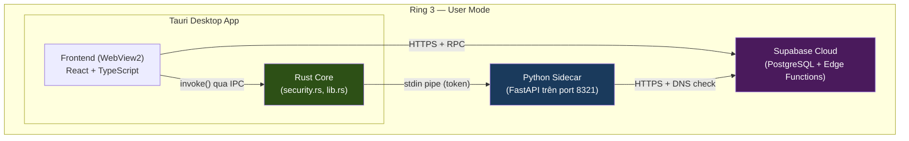
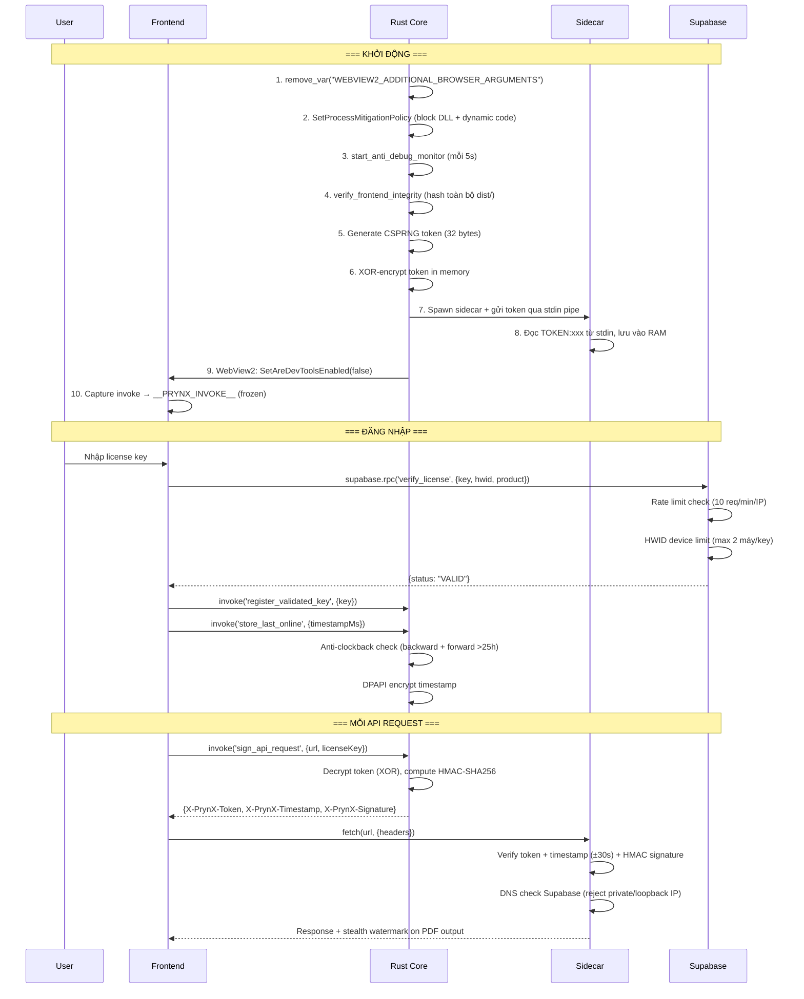

# PrynX Security Architecture — Tài liệu tổng kết

> **Phiên bản:** 3.0 — Sau audit toàn diện 2026-06-12 (xem Mục 8)
> **Cập nhật:** 2026-06-12
> **Mục đích:** Đọc 1 lần hiểu hết, phục vụ tham chiếu lâu dài
>
> ⚠️ **Đọc Mục 8 trước.** Bản 2.0 mô tả thiết kế *dự kiến*; audit 2026-06-12 phát hiện
> nhiều lớp release-only **chưa từng chạy** (release build lỗi) và một **lỗ hổng server
> nghiêm trọng** (anon đọc được toàn bộ bảng license). Mục 8 ghi lại sự thật đã kiểm
> chứng, các bản vá, và lớp **token ký server (Ed25519)** mới bổ sung.
>
> **Phạm vi 2 repo:** phần client/sidecar ở `d:\pdfcompare`; phần **quản lý license + DB +
> edge function** ở repo riêng `d:\printsolutions-main` (Supabase project `ryvyuxjgdcvoxujqmggm`,
> dùng CHUNG cho mọi sản phẩm: prynx, các script .jsx, PrintMonitorApp...).

---

## 1. Kiến trúc tổng quan



### Thành phần

| Thành phần | Ngôn ngữ | Vai trò bảo mật |
|---|---|---|
| **Rust Core** (`security.rs`, `lib.rs`) | Rust (compiled) | Token management, HMAC signing, DPAPI, anti-debug, process mitigation |
| **Frontend** (`main.tsx`, `api.ts`, `useAuthStore.ts`) | TypeScript (bundled) | License UI, invoke freeze, clock checks |
| **Python Sidecar** (`license_guard.py`) | Python (Nuitka compiled) | Request validation, DNS check, API gating |
| **Supabase** | PostgreSQL | License storage, HWID tracking, rate limiting |
| **Build Pipeline** (`build_production.ps1`) | PowerShell | Integrity hash generation |

---

## 2. Luồng xác thực (Authentication Flow)



---

## 3. Bảng 15 lớp phòng thủ

### Layer 1 — Giao tiếp (Communication Security)

| # | Tấn công | Phòng thủ | File | Dòng | Chi tiết |
|---|---|---|---|---|---|
| **1** | Gọi API từ bên ngoài | CSPRNG token (32 bytes) mỗi phiên | [security.rs](file:///d:/pdfcompare/desktop/src-tauri/src/security.rs) | L221+ | Token sinh bằng `rand::thread_rng()`, truyền qua stdin |
| **2** | Replay request cũ | HMAC-SHA256 + timestamp ±30s | [security.rs](file:///d:/pdfcompare/desktop/src-tauri/src/security.rs) | L210-220 | `sign_payload = "{timestamp}:{url_path}"` |
| **3** | Đọc token từ env var | Stdin pipe, không file/env | [lib.rs](file:///d:/pdfcompare/desktop/src-tauri/src/lib.rs) | L615-640 | `child.write("TOKEN:xxx\n")` |

### Layer 2 — License Validation

| # | Tấn công | Phòng thủ | File | Dòng | Chi tiết |
|---|---|---|---|---|---|
| **4** | MITM Supabase response | DNS check: reject loopback/private IP | [license_guard.py](file:///d:/pdfcompare/backend/app/core/license_guard.py) | L170-185 | `ipaddress.ip_address(resolved).is_loopback` |
| **5** | Hosts file redirect | DNS check (vector 4 covers) + public IP required | [license_guard.py](file:///d:/pdfcompare/backend/app/core/license_guard.py) | L170-185 | VPS public IP vẫn cần valid TLS cert |
| **6** | Chia sẻ key nhiều máy | HWID device limit (max 2) | [supabase_migration.sql](file:///d:/pdfcompare/backend/supabase_security_migration.sql) | L50-120 | `COUNT(DISTINCT machine_id) >= max_devices` |
| **7** | Brute-force Supabase RPC | Rate limit 10 req/min/IP | [supabase_migration.sql](file:///d:/pdfcompare/backend/supabase_security_migration.sql) | L70-80 | + `REVOKE ALL ON licenses FROM anon` |
| **21** | Client tự phong "đã hợp lệ" | **Token ký Ed25519 do server cấp** (xem Mục 8.3) | [license_guard.py](file:///d:/pdfcompare/backend/app/core/license_guard.py) `verify_license_token()` | — | Edge function ký bằng private key (Supabase secret); sidecar verify bằng public key nhúng. Client crack không giả được. |

### Layer 3 — Offline / Clock Manipulation

| # | Tấn công | Phòng thủ | File | Dòng | Chi tiết |
|---|---|---|---|---|---|
| **8** | Lùi clock bypass grace | Anti-clockback: `new_ts + 5min < old_ts` → reject | [security.rs](file:///d:/pdfcompare/desktop/src-tauri/src/security.rs) | L320-325 | DPAPI encrypted timestamp |
| **9** | Tiến clock dần dần | Anti-forward-jump: `delta > 25h` → force online | [security.rs](file:///d:/pdfcompare/desktop/src-tauri/src/security.rs) | L330-340 | + [useAuthStore.ts](file:///d:/pdfcompare/desktop/src/stores/useAuthStore.ts) L307-320 |
| | | | [useAuthStore.ts](file:///d:/pdfcompare/desktop/src/stores/useAuthStore.ts) | L297-305 | `lastOnline > now + 60_000` = backward detected |

### Layer 4 — Code Integrity

| # | Tấn công | Phòng thủ | File | Dòng | Chi tiết |
|---|---|---|---|---|---|
| **10** | Sửa sidecar binary | SHA-256 hash at build time | [lib.rs](file:///d:/pdfcompare/desktop/src-tauri/src/lib.rs) | L476-502 | `option_env!("PRYNX_SIDECAR_HASH")` |
| **11** | Sửa frontend JS/CSS | SHA-256 recursive hash toàn bộ `dist/` | [lib.rs](file:///d:/pdfcompare/desktop/src-tauri/src/lib.rs) | L505-595 | `sha256_directory()` hash mọi file + relative path |
| **12** | Python source reverse | Nuitka compile → native C binary | [build_production.ps1](file:///d:/pdfcompare/build_production.ps1) | L60-84 | `python -m nuitka --standalone --onefile` |

### Layer 5 — Runtime Protection (Anti-Tamper)

| # | Tấn công | Phòng thủ | File | Dòng | Chi tiết |
|---|---|---|---|---|---|
| **13** | WebView2 DevTools mở | `SetAreDevToolsEnabled(false)` + kill env var | [lib.rs](file:///d:/pdfcompare/desktop/src-tauri/src/lib.rs) | L588-596, L645-665 | `remove_var("WEBVIEW2_ADDITIONAL_BROWSER_ARGUMENTS")` |
| **14** | Ghi đè `invoke()` qua JS | Freeze `__TAURI__` + capture `__PRYNX_INVOKE__` | [main.tsx](file:///d:/pdfcompare/desktop/src/main.tsx) | L8-38 | `Object.freeze()` + `Object.defineProperty(writable:false)` |
| **15** | DLL injection (Frida) | `SetProcessMitigationPolicy` MicrosoftSignedOnly | [lib.rs](file:///d:/pdfcompare/desktop/src-tauri/src/lib.rs) | L640-685 | `ProcessSignaturePolicy` + `ProcessDynamicCodePolicy` |
| **16** | Debugger attach (x64dbg) | Anti-debug monitor mỗi 5s | [security.rs](file:///d:/pdfcompare/desktop/src-tauri/src/security.rs) | L130-220 | `IsDebuggerPresent` + `NtQueryInformationProcess(ProcessDebugPort)` |
| **17** | Hook DPAPI (Detours) | IAT hook detection | [security.rs](file:///d:/pdfcompare/desktop/src-tauri/src/security.rs) | L195-220 | Check `CryptUnprotectData` first byte ≠ `0xE9`/`0xFF`/`0xCC` |
| **18** | Scan RAM tìm token | XOR-masked token in memory | [security.rs](file:///d:/pdfcompare/desktop/src-tauri/src/security.rs) | L228-270 | `EncryptedToken { cipher, mask }`, decrypt chỉ khi `sign_api_request()` |

### Layer 6 — Truy vết (Forensics)

| # | Tấn công | Phòng thủ | File | Dòng | Chi tiết |
|---|---|---|---|---|---|
| **19** | Phát tán PDF crack | Stealth watermark: XMP + invisible text | [watermark.py](file:///d:/pdfcompare/backend/app/core/watermark.py) | L1-80 | Render mode 3 (invisible) + XMP prynx namespace |
| **20** | Hành vi đáng ngờ | Silent telemetry → Supabase `security_logs` | [useAuthStore.ts](file:///d:/pdfcompare/desktop/src/stores/useAuthStore.ts) | L121-140 | `logSecurityEvent('clock_manipulation', ...)` |

---

## 4. Ma trận tấn công → phòng thủ

```
Hacker biết dùng Fiddler (10 phút)
  └→ Chặn bởi: DNS check (#4) + cert mismatch

Hacker sửa hosts file (15 phút)
  └→ Chặn bởi: DNS check reject private IP (#5)

Hacker chỉnh clock lùi (2 phút)
  └→ Chặn bởi: Anti-clockback DPAPI (#8) + frontend check

Hacker chỉnh clock tiến (5 phút)
  └→ Chặn bởi: Forward-jump >25h → force online (#9)

Hacker mở DevTools (5 phút)
  └→ Chặn bởi: SetAreDevToolsEnabled(false) (#13) + env var killed (#13)

Hacker set WEBVIEW2_ADDITIONAL_BROWSER_ARGUMENTS (2 phút)
  └→ Chặn bởi: remove_var() trước WebView2 init (#13)

Hacker inject JS ghi đè invoke (10 phút)
  └→ Chặn bởi: Object.freeze + __PRYNX_INVOKE__ (#14)

Hacker sửa file JS trong dist/ (20 phút)
  └→ Chặn bởi: SHA-256 recursive hash toàn bộ dist/ (#11)

Hacker share key trên forum (0 phút)
  └→ Chặn bởi: HWID limit 2 máy/key (#6)

Hacker gọi Supabase RPC trực tiếp (15 phút)
  └→ Chặn bởi: Rate limit + REVOKE table access (#7)

Hacker dùng Process Monitor bắt token (30 phút)
  └→ Chặn bởi: Stdin pipe, token không chạm disk (#3)

Hacker dùng Cheat Engine scan RAM (30 phút)
  └→ Chặn bởi: ProhibitDynamicCode policy (#15) + XOR token (#18)

Hacker dùng Frida hook (2 giờ)
  └→ Chặn bởi: MicrosoftSignedOnly DLL policy (#15)

Hacker dùng x64dbg (1 giờ)
  └→ Chặn bởi: Anti-debug monitor 5s (#16) + ProcessDebugPort

Hacker hook DPAPI (2 giờ)
  └→ Chặn bởi: IAT hook detection (#17)

Hacker ReadProcessMemory (1 giờ)
  └→ Chặn bởi: XOR-masked token (#18), phải reverse XOR logic

Hacker viết kernel driver (10+ giờ)
  └→ ⚠️ KHÔNG CHẶN ĐƯỢC — giới hạn vật lý Ring 3
```

---

## 5. File map

```
d:\pdfcompare\
├── desktop\
│   ├── src\
│   │   ├── main.tsx                    ← __TAURI__ freeze + __PRYNX_INVOKE__
│   │   ├── lib\
│   │   │   ├── api.ts                  ← authenticatedFetch + captured invoke
│   │   │   └── supabase.ts             ← Supabase client (env-based URL)
│   │   └── stores\
│   │       └── useAuthStore.ts         ← License flow + clock checks + telemetry
│   └── src-tauri\
│       └── src\
│           ├── lib.rs                  ← Setup: env cleanup, mitigation, integrity, sidecar
│           └── security.rs             ← Token (XOR), HMAC, DPAPI, anti-debug, IAT check
├── backend\
│   ├── app\
│   │   ├── core\
│   │   │   ├── license_guard.py        ← Request validation + DNS check
│   │   │   └── watermark.py            ← Stealth PDF watermark
│   │   ├── workers\
│   │   │   ├── nup_engine.py           ← Watermark integration
│   │   │   ├── vdp_engine.py           ← Watermark integration
│   │   │   └── sticker_engine.py       ← Watermark integration
│   │   └── api\routes\
│   │       ├── imposition.py           ← License info passthrough
│   │       └── vdp.py                  ← License info passthrough
│   └── supabase_security_migration.sql ← Device limit + RLS + rate limit
└── build_production.ps1                ← Nuitka + integrity hash pipeline
```

---

## 6. Giới hạn đã biết

| Giới hạn | Lý do | Giải pháp lý thuyết |
|---|---|---|
| Kernel driver bypass | App chạy ở Ring 3, driver ở Ring 0 | Viết anti-cheat kernel driver (cần MS ký, $$$) |
| VPS + public IP giả Supabase | DNS check chỉ reject private IP | TLS certificate pinning trong Rust (cần `reqwest` crate) |
| ES module deep patch | `__PRYNX_INVOKE__` chỉ bảo vệ `invoke`, không bảo vệ toàn bộ Tauri API surface | Compile-time inline tất cả IPC calls |

---

## 7. So sánh với industry

| Tính năng | PrynX | Adobe CC | JetBrains | Game (Valorant) |
|---|---|---|---|---|
| Token-based auth | ✅ CSPRNG+HMAC | ✅ | ✅ | ✅ |
| Code integrity check | ✅ SHA-256 | ✅ | ✅ | ✅ |
| Anti-debug | ✅ Ring 3 | ✅ Ring 3 | ❌ | ✅ Ring 0 |
| DLL injection block | ✅ Mitigation Policy | ✅ | ❌ | ✅ Kernel driver |
| Memory encryption | ✅ XOR mask | ✅ VMProtect | ❌ | ✅ |
| Offline grace | ✅ 24h + clock check | ✅ 30 ngày | ✅ | N/A |
| Device limit | ✅ HWID | ✅ 2 máy | ✅ | N/A |
| Stealth watermark | ✅ XMP + invisible | ✅ | ❌ | N/A |
| Kernel driver | ❌ | ❌ | ❌ | ✅ |

**Kết luận (cập nhật 3.0):** Thiết kế đạt tầm sản phẩm thương mại. **Nhưng điểm thực tế = điểm thực thi.** Audit 2026-06-12 cho thấy nhiều lớp ở bảng trên là *thiết kế đúng nhưng từng không chạy* (release build lỗi `webview2_com` → toàn bộ lớp release-only chưa kích hoạt) và một lỗ server phá vỡ toàn bộ mục tiêu. Sau khi vá (Mục 8): **client-side ~7.5/10, server-side ~7/10 (sau khi vá RLS), tổng thể ~6.5–7/10.** Trần cố hữu của license cài máy khách là ~8 (kẻ có binary luôn lách được); cột "ngang Adobe/JetBrains" ở bảng so sánh là *về ý tưởng tính năng*, không phải mức kháng-crack thực tế.

---

## 8. Audit toàn diện 2026-06-12 — Phát hiện, bản vá & lớp mới

> Audit theo `.kiro/steering/audit-rules.md` (verify-to-ground-truth). Mọi mục dưới đây
> đều đã kiểm chứng bằng đọc code / chạy thử / test, không phỏng đoán.

### 8.1. Phát hiện nghiêm trọng (đã vá)

| # | Mức | Phát hiện (đã VERIFIED) | Bằng chứng | Trạng thái |
|---|---|---|---|---|
| A | 🔴 | **Release build KHÔNG biên dịch** — `lib.rs` dùng `webview2_com::...` nhưng crate không khai báo trong `Cargo.toml`. Hệ quả: TẤT CẢ lớp release-only (#10,#11,#13,#15,#16,#17,#18) **chưa từng chạy** trên bản đóng gói. | `cargo check --release` → `E0433 unresolved crate webview2_com` | ✅ Vá: thêm `webview2-com = "=0.38.2"` vào `[target.'cfg(windows)'.dependencies]`; build release sạch. |
| B | 🔴 | **Server: anon đọc được TOÀN BỘ bảng `licenses`** (mọi key + email khách của MỌI sản phẩm). RLS policy `"Anyone can verify licenses" USING(true)`. Xác nhận live: 45 dòng đọc được bằng anon key. | `GET /rest/v1/licenses` → `Content-Range: */45` | ✅ Vá: migration `20260212_fix_licenses_rls_critical.sql` (printsolutions-main). Sau vá: `*/0`. |
| C | 🟠 | **WebSocket không xác thực** — `ws.py` check biến env `_PRYNX_SIDECAR_TOKEN` không bao giờ được set → chấp nhận mọi kết nối. | `routes/ws.py` | ✅ Vá: dùng chung `verify_sidecar_signature()` (token + HMAC) qua query param. |
| D | 🟠 | **`write_debug_log` ghi file tuỳ ý** (vượt phạm vi capability fs); **shell `allow-execute`** cấp dư. | `lib.rs`, `capabilities/default.json` | ✅ Vá: confine vào `%APPDATA%\PrynX\logs`; gỡ `shell:allow-execute`, thêm `shell:allow-open`. |
| E | 🟠 | **Integrity checks vô hiệu**: `verify_sidecar_integrity` định nghĩa nhưng KHÔNG được gọi; cả 2 check no-op nếu không set hash lúc build. | `lib.rs` | ✅ Vá: wire `verify_sidecar_integrity` (an toàn, chỉ chặn khi hash lệch) + `build.rs` thêm `rerun-if-env-changed`. |
| F | 🟠 | **Edge function `license-verify` hỏng trên live** (gọi `verify_license` bản 5 tham số không tồn tại → HTTP 500). Ảnh hưởng PrintMonitorApp (sản phẩm dùng edge function này). | `PGRST202` khi gọi RPC 5-param | ✅ Vá: sửa edge function gọi RPC 3 tham số (đang tồn tại). Live: 500 → 200. |
| G | 🟢 | `DEV_MODE` tắt token/chữ ký (chỉ dev; bản đóng gói Tauri ép `DEV_MODE=false`). Dead code Rust (`generate_watermark`, `validate_license_local`). | `config.py`, `security.rs` | ✅ Vá: thêm cảnh báo khởi động backend; gỡ dead code. |

### 8.2. Đính chính (rút lại theo audit-rules)
- Ban đầu nghi bảng `orders` cũng lộ qua `USING(true)` → **SAI**: migration `021/002` đã thay bằng `"Owner or admin can read orders"`. Rút lại.
- `product_id='prynx'` nghi không tồn tại → **SAI**: `license_products` có `{"id":"prynx"}`. Rút lại.

### 8.3. Lớp mới #21 — Token license ký Ed25519 (server-authoritative)

**Vấn đề gốc:** trước đây client tự quyết hợp lệ (`register_validated_key` tin lời frontend; sidecar không re-verify vì không có Supabase creds). Patch JS là qua.

**Giải pháp (không đổi kiến trúc, dùng Supabase sẵn có, $0 hạ tầng):**
```
Frontend → edge function license-verify (Supabase)
            → RPC verify_license (3-param) → nếu VALID:
            → ký token Ed25519 bằng PRIVATE key (secret LICENSE_SIGNING_KEY)
            → trả {status, token}
Frontend lưu token → gắn header X-License-Token mỗi request
Sidecar (require_license) → verify_license_token():
            verify chữ ký bằng PUBLIC key NHÚNG SẴN + exp + ràng buộc machine/key
```
- **Token:** `<payload_b64url>.<sig_b64url>`; payload `{k:sha256(key)[:16], m:hwid, p:product, exp}`; ký trên chuỗi `payload_b64url`. TTL 2 giờ.
- **Bất khả giả:** private key chỉ ở Supabase secret; client chỉ có public key (verify). Client crack bỏ qua validate Supabase → không có token hợp lệ.
- **Files:** `backend/app/core/license_guard.py` (`verify_license_token`, `_LICENSE_PUBLIC_KEY_B64`, cờ `PRYNX_ENFORCE_LICENSE_TOKEN`); `desktop/src/stores/useAuthStore.ts` (lưu `licenseToken`); `desktop/src/lib/api.ts` (gắn header); `printsolutions-main/supabase/functions/license-verify/index.ts` (ký, noble ed25519).
- **Rollout 2 pha:** mặc định cờ TẮT → verify-nếu-có, KHÔNG chặn (client cũ không gãy). Sau khi ship client mới + thấy token chạy, đặt `PRYNX_ENFORCE_LICENSE_TOKEN=true` trong spawn sidecar (`lib.rs`) → bắt buộc.
- **Test:** 7 unit test (`tests/test_license_token.py`) + kiểm tra liên thông khóa thật (ký bằng private thật → verify bằng public nhúng) đều PASS. Token giả mạo (ký bằng khóa khác) bị từ chối.

### 8.4. Server-side (repo printsolutions-main) — đã kiểm chứng
- Mọi sản phẩm verify qua **RPC `verify_license` (SECURITY DEFINER, 3-param)** — script .jsx + LicenseBridge.ps1 + prynx gọi RPC trực tiếp; PrintMonitorApp gọi edge function. **Không sản phẩm nào đọc bảng `licenses` trực tiếp** → bản vá RLS an toàn cho tất cả.
- `verify_license` ký SECURITY DEFINER + chỉ `GRANT EXECUTE TO anon` (không cho đọc bảng) — mẫu đúng. Tự ghi `license_logs` trong context definer (không cần anon-insert policy).
- **KHÔNG** lộ `service_role` key ở client/repo (chỉ dùng trong edge function qua `Deno.env`). ✅

### 8.5. Trạng thái đã kiểm chứng (live + test)

| Hạng mục | Kết quả |
|---|---|
| RLS bảng licenses (anon) | 🔒 `*/0` (trước `*/45`) |
| RPC verify_license 3-param | ✅ chạy (`INVALID` cho key giả) |
| Edge function license-verify | ✅ HTTP 200 (trước 500); secret + deploy xong |
| Sidecar verify token Ed25519 | ✅ 7 test + liên thông khóa thật pass |
| Frontend gắn X-License-Token | ✅ typecheck sạch (best-effort, không gãy) |
| Backend test suite | ✅ 154 passed |
| `cargo check` release | ✅ sạch (sau vá webview2-com) |

### 8.6. Việc còn lại để token "có răng"
1. Đóng gói bản desktop mới (`build_production.ps1` — đã thêm `externalBin` để nhồi sidecar + tính 2 hash integrity) → ship cho khách.
2. Sau khi xác nhận token chạy: thêm `("PRYNX_ENFORCE_LICENSE_TOKEN","true")` vào spawn sidecar trong `lib.rs` → đóng gói lại.
3. **Rotate 45 key** đã từng phơi nhiễm (trong thời gian lỗ RLS mở).
4. (Tùy chọn, tốn phí) Code signing Authenticode (~$10/tháng Azure) để hết cảnh báo SmartScreen.
5. CI chặn `USING(true)` trên bảng nhạy cảm (ngăn lỗ RLS tái diễn).

### 8.7. Lưu ý vận hành
- **Private key** `LICENSE_SIGNING_KEY` chỉ nằm trong Supabase secret; file `.SECRET.txt` đã xóa. Mất secret này → phải sinh lại cặp khóa + cập nhật public key trong `license_guard.py` + deploy lại.
- Anon key bị hardcode trong mọi script (.jsx/PS1/Python) — bình thường với anon key public, **nhưng** đó là lý do bản vá RLS tối quan trọng: anon key ở khắp nơi.
- Tự động hóa triển khai: `printsolutions-main/TRIEN_KHAI_TOKEN.bat` (set secret + deploy + xóa file khóa).
