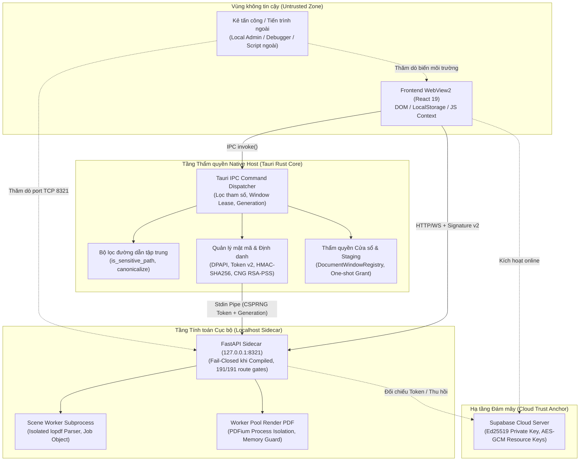

# Báo Cáo Rà Soát Bảo Mật Hệ Thống (Defensive Security Audit) — PrynX 2.0.4

> **Thời điểm:** 25/09/2026  
> **Phiên bản ứng dụng:** PrynX Prepress Platform 2.0.4 (Current Workspace / Git Revision `HEAD`)  
> **Chế độ rà soát:** Đánh giá mã nguồn phòng thủ (Defensive Code Audit & Threat Model Verification per `prynx-security-review`)  
> **Quyền hạn & Cam kết:** **CHỈ ĐỌC (READ-ONLY)** — Giữ nguyên trạng 100% mã nguồn dự án, không sửa code, không nới lỏng kiểm tra, không tạo exploit payload.

---

## 1. Mục tiêu & Phạm vi rà soát (Scan Context & Scope)

### 1.1. Phạm vi khảo sát (Included Scope)
1. **Tauri Host Authority (Rust Core):**
   - Bộ quản lý thẩm quyền và bộ lọc đường dẫn: `desktop/src-tauri/src/lib.rs` (`is_sensitive_path`, `is_sensitive_write_path`, `canonicalize`, `strip_path_prefix_aliases`).
   - Quản lý mã khóa, DPAPI và thực thi tiến trình: `desktop/src-tauri/src/security.rs`.
   - Cơ chế cấp quyền mở ứng dụng bên ngoài: `desktop/src-tauri/src/external_app.rs` (`launch_external_app`, allowlist).
   - Thẩm quyền cấp quyền lưu file và staging: `desktop/src-tauri/src/document_window_registry.rs`.
   - Bề mặt tính năng mới: `desktop/src-tauri/src/viewport/` (Native GPU Viewport IPC commands, Window Lease, Scene Worker).
2. **Localhost Sidecar Authority (FastAPI / Nuitka Compiled):**
   - Middleware xác thực chữ ký và kiểm soát bản quyền: `backend/app/core/license_guard.py`.
   - Khởi tạo tiến trình, cờ môi trường và CORS: `backend/app/main.py`.
   - Độ phủ kiểm soát tính năng Pro: `backend/app/core/feature_entitlements.py`, `backend/tests/test_pro_feature_enforcement_coverage.py`.
3. **Mã hóa Tài nguyên & Engine Native (Rust/PyO3):**
   - Cơ chế giải mã AES-256-GCM gói khuôn bế: `native/src/dieline_engine.rs` (`PRYNXENC1`).
   - Xác thực Ed25519 token và định danh phần cứng CNG TPM: `native/src/dieline_license.rs`.

### 1.2. Phần ngoài phạm vi (Excluded / External Scope)
- Hạ tầng Cloud Supabase production (PostgreSQL RLS, Edge Functions private key) — chỉ đối chiếu theo thiết kế tài liệu `docs/audit/SECURITY_ARCHITECTURE.md` và mã kiểm chứng cục bộ.
- Kernel-mode drivers (không thuộc kiến trúc PrynX).

---

## 2. Ranh giới tin cậy & Mô hình Đe dọa (Trust Boundaries & Threat Model)



---

## 3. Đánh giá Chuyên sâu: Cơ chế Bảo vệ Bản quyền & Chống Crack

### 3.1. Các chốt chặn phòng thủ cốt lõi đã được kiểm chứng
1. **Chữ ký Bất đối xứng Ed25519 (Asymmetric Cryptography):**
   - Private key ký token được giữ độc quyền trên Secret của Supabase Edge Function (`service_role`).
   - Host Native và Sidecar chỉ giữ **Public Key** (`AxpiZnEFXady9wI01spdMRrTNtEthMD30W/90gi27Zk=`) được nhúng cứng vào nhị phân khi biên dịch (`_LICENSE_PUBLIC_KEY_B64`).
   - Khi chạy ở dạng binary compiled (`_is_compiled_runtime() == true`), hệ thống **tuyệt đối không nhận biến môi trường để ghi đè public key**. Do đó, **về mặt toán học, kẻ tấn công không thể tạo keygen offline**.
2. **Khóa tài nguyên động AES-256-GCM (Resource Key Encryption):**
   - Mã nguồn JavaScript của engine khuôn bế không nằm dưới dạng plaintext trong bộ cài đặt mà được mã hóa AES-256-GCM với tiền tố `PRYNXENC1`.
   - Khóa giải mã `resource_key` (32 bytes) chỉ được server gửi về trong claim `rk` của token hợp lệ, gắn liền với phiên bản ứng dụng (`AAD = version`).
   - **Hiệu quả phòng thủ:** Nếu kẻ tấn công dịch ngược và patch rẽ nhánh nhị phân (`if (!is_valid) return true;`), engine vẫn **không thể hoạt động** vì thiếu khóa giải mã AES 256-bit của gói mã nguồn.
3. **Ràng buộc thiết bị phần cứng qua CNG v3 (Windows TPM / Software KSP):**
   - Định danh `d3_` sử dụng Windows CNG (`MS_PLATFORM_CRYPTO_PROVIDER` dựa trên TPM phần cứng hoặc fallback Software KSP non-exportable) để thực hiện challenge-response ký RSA-PSS, ngăn chặn copy file cấu hình sang máy khác.
4. **Lưu trữ Offline qua Windows DPAPI:**
   - Token ngoại tuyến được lưu tại `%APPDATA%\PrynX\prynx_token.dat`, mã hóa bằng Windows DPAPI (`DataProtectionScope::CurrentUser`), cô lập dữ liệu theo tài khoản Windows đang đăng nhập.

### 3.2. Giới hạn vật lý tầng Ring-3 (Accepted Residual Risk - §SEC.27.6)
- **Thực tế kỹ thuật:** Trên hệ điều hành Windows, mọi phần mềm thương mại chạy trong không gian người dùng (Ring-3 User Mode) đều chịu giới hạn: **Nếu người dùng nắm quyền Local Administrator hoặc dùng Debugger (x64dbg, IDA Pro, Cheat Engine), họ có thể đọc và sửa đổi bộ nhớ RAM của tiến trình.**
- Tài liệu kiến trúc của PrynX (`SECURITY_ARCHITECTURE.md` §27.6) đã ghi nhận đây là **rủi ro tồn lưu được chấp nhận (Accepted Risk)**:
  > *PrynX không tuyên bố chống crack tuyệt đối trước người dùng có quyền Admin trên máy họ. Mục tiêu kiến trúc là "Tạo bất đối xứng chi phí" (Cost Asymmetry): Triệt tiêu hoàn toàn khả năng patch rẽ nhánh rẻ tiền hoặc tạo keygen hàng loạt, buộc kẻ tấn công phải trả giá rất cao (phải có token bản quyền hợp lệ để lấy khóa AES và dịch ngược RAM thủ công cho từng bản release riêng biệt).*

---

## 4. Đánh giá Bề mặt Tính năng mới: Native GPU Viewport

Đợt bổ sung Native GPU Viewport (`desktop/src-tauri/src/viewport/`) được thiết kế với tư duy an toàn:

1. **Quản lý Thẩm quyền Cửa sổ & Lease HWND:**
   - Các lệnh IPC (`open_native_gpu_viewport`, `resize_native_gpu_viewport`, `load_native_gpu_scene`...) sử dụng cấu trúc `Lease` liên kết chặt với `window.label()` và `generation`.
   - Cửa sổ này không thể can thiệp hoặc chiếm quyền điều khiển HWND của cửa sổ khác.
2. **Cô lập Tiến trình Biên dịch Scene (Process Isolation):**
   - Parser PDF và compiler scene chạy trong tiến trình con riêng (`SceneWorker`, cờ `--prynx-scene-worker`), giao tiếp qua Stdio có kiểm soát độ dài frame (`HEADER_BYTES = 64KB`).
   - Nếu gặp file PDF dị dạng gây crash hoặc tràn bộ nhớ trong thư viện `lopdf`, chỉ tiến trình worker bị đóng; tiến trình chính Tauri và GPU Context hoàn toàn không bị ảnh hưởng, worker tự phục hồi ở request tiếp theo.
3. **Giải phóng Tài nguyên Đồ họa Win32:**
   - Module `window_region.rs` kiểm tra chặt chẽ biên tọa độ và gọi `DeleteObject(region)` khi gặp lỗi, ngăn chặn rò rỉ GDI handle trên Windows.

---

## 5. Danh mục Phát hiện & Khuyến nghị Phòng thủ (Findings Catalog)

---

### ⚠️ PHÁT HIỆN 1: Nguy cơ kế thừa cờ môi trường WebView2 cho phép mở cổng Debug
- **Mã định danh:** `§SEC.28` (Đề xuất)
- **Mức độ nghiêm trọng:** 🟠 **Trung bình (Medium)** | Độ tin cậy: **95%**
- **Vị trí mã nguồn:** [`desktop/src-tauri/src/lib.rs:8179–8190`](file:///d:/pdfcompare/desktop/src-tauri/src/lib.rs#L8179-L8190) đối chiếu với [`lib.rs:8330–8338`](file:///d:/pdfcompare/desktop/src-tauri/src/lib.rs#L8330-L8338).
- **Mô tả kỹ thuật:**
  Tại đầu hàm `run()`, mã nguồn thực hiện:
  ```rust
  let existing = std::env::var("WEBVIEW2_ADDITIONAL_BROWSER_ARGUMENTS").unwrap_or_default();
  let flags = "--force-color-profile=srgb --disable-features=CalculateNativeWinOcclusion ...";
  let merged = if existing.trim().is_empty() {
      flags.to_string()
  } else {
      format!("{} {}", existing, flags) // <-- Kế thừa giá trị từ môi trường ngoài
  };
  std::env::set_var("WEBVIEW2_ADDITIONAL_BROWSER_ARGUMENTS", merged);
  ```
  Trong khi đó, ở đoạn callback `setup()` phía dưới (dòng 8332):
  ```rust
  #[cfg(not(debug_assertions))]
  {
      std::env::remove_var("WEBVIEW2_ADDITIONAL_BROWSER_ARGUMENTS");
      ...
  }
  ```
- **Phân tích rủi ro:**
  1. Nếu một tiến trình bên ngoài khởi chạy `PrynX.exe` với biến môi trường `WEBVIEW2_ADDITIONAL_BROWSER_ARGUMENTS="--remote-debugging-port=9222"`, cờ này sẽ được nối vào `merged` và chuyển cho WebView2 lúc khởi tạo.
  2. Nếu WebView2 Environment đọc biến trước khi callback `setup()` chạy `remove_var`, WebView2 có thể mở cổng remote debugging trên cổng 9222.
  3. Khi cổng mở, một script nội bộ hoặc tiến trình local khác có thể kết nối qua Chrome DevTools Protocol (CDP) để đọc DOM, localStorage, trích xuất token hoặc inject script vào WebView.
  4. Ngược lại, nếu `remove_var` chạy trước khi cửa sổ render, nó lại vô tình xóa mất cờ `--force-color-profile=srgb` mà dòng 8190 muốn thiết lập.
- **Khuyến nghị phòng thủ:** Trong bản release (`#[cfg(not(debug_assertions))]`), không nối chuỗi với `existing`; ghi đè hoàn toàn bằng chuỗi cờ an toàn đã được kiểm duyệt.

---

### ⚠️ PHÁT HIỆN 2: Lệch chuẩn (Contract Drift) trong bộ lọc đường dẫn `is_sensitive_path`
- **Mã định danh:** `§SEC.29` (Đề xuất)
- **Mức độ nghiêm trọng:** 🟡 **Thấp (Low - Defense-in-Depth)** | Độ tin cậy: **90%**
- **Vị trí mã nguồn:** [`desktop/src-tauri/src/lib.rs:5123`](file:///d:/pdfcompare/desktop/src-tauri/src/lib.rs#L5123) đối chiếu với [`desktop/src-tauri/src/pdf_engine/render_worker.rs:1035`](file:///d:/pdfcompare/desktop/src-tauri/src/pdf_engine/render_worker.rs#L1035).
- **Mô tả kỹ thuật:**
  - Trong `render_worker.rs:1035`, worker kiểm tra rất chặt chẽ:
    ```rust
    if normalized_path.starts_with("\\\\.\\")
        || normalized_path.starts_with("\\\\?\\globalroot\\")
        || normalized_path.starts_with("\\\\?\\pipe\\")
        || has_windows_alternate_stream(path)
    {
        return Err("Device namespace/ADS không được phép trong render worker.".to_string());
    }
    ```
  - Tuy nhiên, trong hàm tập trung `is_sensitive_path` (`lib.rs:5123`) dùng cho toàn bộ Tauri IPC (như `load_native_gpu_scene`, `read_system_file`, `stat_system_file`), logic chỉ bóc tiền tố verbatim và kiểm tra `\\.\` cùng UNC admin share kết thúc bằng `$`.
  - Hàm dùng chung này chưa có kiểm tra tường minh cho:
    - Ký tự Windows Alternate Data Stream (ADS): `path.contains(':')` phía sau ký tự ổ đĩa.
    - NT Object Manager namespaces như `\\?\globalroot\` hoặc `\\?\pipe\`.
- **Phân tích rủi ro:**
  Các API nhận `file_path` từ renderer nếu chỉ dựa vào `is_sensitive_path` có thể bị kẻ tấn công thăm dò luồng dữ liệu ẩn NTFS hoặc thiết bị ảo NT.
- **Khuyến nghị phòng thủ:** Đồng bộ logic kiểm tra `has_windows_alternate_stream` và danh sách chặn `globalroot`, `pipe` từ `render_worker.rs` vào hàm dùng chung `is_sensitive_path_text`.

---

### ⚠️ PHÁT HIỆN 3: Bề mặt mạng Localhost TCP 8321 đối với các tiến trình cùng máy
- **Mã định danh:** `§SEC.30` (Đề xuất)
- **Mức độ nghiêm trọng:** 🟡 **Thấp (Architectural Consideration)** | Độ tin cậy: **85%**
- **Vị trí mã nguồn:** [`backend/app/main.py:328`](file:///d:/pdfcompare/backend/app/main.py#L328), [`backend/app/core/license_guard.py:500`](file:///d:/pdfcompare/backend/app/core/license_guard.py#L500).
- **Mô tả kỹ thuật:**
  - FastAPI sidecar lắng nghe trên cổng TCP `127.0.0.1:8321`.
  - Mặc dù 100% route (191/191 route đã có test bảo mật ratchet) đều yêu cầu HMAC-SHA256 signature v2 với `sidecar generation` và nonce dùng một lần, việc mở cổng TCP loopback vẫn cho phép các tiến trình khác trên cùng máy gửi gói tin thăm dò tới cổng này.
- **Khuyến nghị phòng thủ:**
  - Trong lộ trình dài hạn, cân nhắc chuyển kênh giao tiếp Host ⇄ Sidecar từ TCP Socket (`127.0.0.1:8321`) sang **Windows Named Pipes** (`\\.\pipe\PrynX-Sidecar-...`) với DACL chỉ cấp quyền duy nhất cho Current User SID, triệt tiêu hoàn toàn bề mặt quét cổng mạng nội bộ.

---

## 6. Ma trận Tổng hợp Trạng thái Bảo mật (Security Posture Matrix)

| Thành phần | Lớp phòng thủ | Trạng thái | Đánh giá kiến trúc |
|---|---|---|---|
| **License Keygen** | Asymmetric Ed25519 (Private key on Cloud) | 🟢 **VỮNG CHẮC** | Không thể giả mạo chữ ký offline. |
| **Bảo vệ Mã nguồn Khuôn** | Mã hóa AES-256-GCM (`PRYNXENC1`) | 🟢 **VỮNG CHẮC** | Patch boolean không mở được tính năng vì thiếu key AES. |
| **Khóa Thiết bị** | Windows CNG TPM RSA-PSS v3 | 🟢 **VỮNG CHẮC** | Khóa phần cứng chống copy cấu hình sang máy khác. |
| **Sidecar API** | HMAC-SHA256 v2 + Nonce + Generation | 🟢 **VỮNG CHẮC** | 191/191 route được che chắn, chống replay request. |
| **Parser Cách ly** | Subprocess Worker + Stdio Framed | 🟢 **VỮNG CHẮC** | Crash từ PDF dị dạng không làm sập tiến trình chính. |
| **Kiểm soát Đường dẫn** | Canonicalize + Strip Prefix + Deny-list | 🟡 **CẦN ĐỒNG BỘ** | Cần bổ sung kiểm tra ADS và NT namespace vào `is_sensitive_path`. |
| **Môi trường WebView2** | Process Flags & Anti-DevTools | 🟠 **CẦN GIA CỐ** | Cần loại bỏ việc kế thừa `existing` args từ môi trường ngoài. |

---

## 7. Kết luận & Khuyến nghị Hành động

1. **Về tính toàn vẹn của mã nguồn:** Trong đợt rà soát này, **không có bất kỳ file code nào bị thay đổi**. Hệ thống và working tree giữ nguyên trạng 100%.
2. **Về tính năng bảo vệ bản quyền:** Kiến trúc hiện tại của PrynX 2.0.4 đạt chuẩn phòng thủ cao cấp cho phần mềm desktop thương mại, kết hợp xuất sắc giữa mật mã học hiện đại (Ed25519, AES-GCM) và bảo mật nền tảng Windows (CNG TPM, DPAPI).
3. **Về các bước tiếp theo (Kế hoạch hành động khi được duyệt):**
   - Nếu được người dùng phê duyệt, sẽ lên kế hoạch tạo Patch Proposal theo quy trình 2 chốt của PrynX cho 2 hạng mục phòng thủ cụ thể:
     - Khóa biến môi trường `WEBVIEW2_ADDITIONAL_BROWSER_ARGUMENTS` ở release build (§SEC.28).
     - Đồng bộ kiểm tra Alternate Data Stream (ADS) vào `is_sensitive_path` (§SEC.29).
