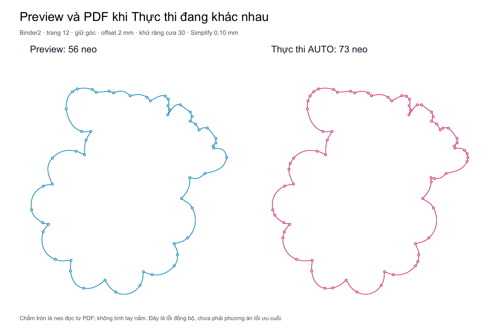

# Audit chất lượng và hiệu năng đường cắt Bù xén — 24/09/2026

**Đây là báo cáo baseline trước sửa.** Người dùng đã duyệt “sửa hết đi”; CUT24.01–08, CUT24.D01 và NODE.1 đã được xử lý, xem [nhật ký sửa và kiểm chứng](CHAT_LUONG_DUONG_CAT_FIXES_2026-09-24.md). Nội dung bên dưới giữ nguyên bằng chứng trước sửa. Chưa nghiệm thu GUI Tauri, bản cài, Illustrator/Corel hoặc máy bế. Phạm vi chính là Bù xén → tạo CUT, thêm một lỗi hạ nguồn riêng ở công cụ Máy cắt.

## 1. Kết luận cho yêu cầu “mượt, ít node, vẫn đúng quỹ đạo”

Hiện chưa thể nghiệm thu yêu cầu này. Nền tảng đã có cubic Bézier, tối ưu neo/tay nắm, kiểm sai số liên tục và kiểm lại sau lượng tử PDF. Nhưng có ba trở ngại quan trọng:

1. **Đường đã xem trước có thể khác PDF khi Thực thi.** Binder2 trang 12: preview 56 đoạn, Execute AUTO 73 đoạn dù truyền memo thật. Đây là lỗi P1, phải sửa trước khi tối ưu chất lượng.
2. **Khả năng giảm node phụ thuộc số đoạn biểu diễn.** Ring hơn 100 cubic bị bỏ fairing; graph gộp chỉ xét tối đa 12/24 đoạn liền nhau. Các đối chứng giữ cùng nguồn/dung sai tìm được đường ít node hơn qua cùng verifier.
3. **Liền tiếp tuyến chưa đồng nghĩa chuyển tiếp độ cong mượt.** Nhánh live vẫn có thể lấy G1 đầu tiên dù còn ứng viên C2 hợp lệ phía sau. Bộ tối ưu cũng chưa bảo đảm tìm số node tối thiểu toàn cục.

Về hiệu năng, một lượt preview lạnh của ca trên mất **16,77 s**, lặp đúng frame **0,0052 s**. Một lượt engine có đo từng nhánh mất 35,38 s: fairing dùng 34,12 s rồi bị loại, global fallback dùng 0,56 s mới giảm 73→56. Đây là số đo từng lượt trên máy dùng chung, có tải nền; không phải benchmark độc lập hay cam kết speedup. Bỏ kiểm chứng hoặc bỏ tối ưu sẽ nhanh hơn nhưng không đáp ứng chất lượng người dùng yêu cầu.

## 2. Baseline và phạm vi bằng chứng

- HEAD lúc bắt đầu: `2dfa2f9cb3779379597bfc348cab9c145af3c5e9`. Worktree có thay đổi Viewer/Settings và master matrix của công việc khác; không ghi đè chúng.
- Nguồn: `test/Binder2.pdf`, SHA-256 `4c2a730ba4f0857847b46faf2e798f78c001f1615a8cd946686bcc53aa508c10`, 759.172 byte. Các lượt kiểm hash nguồn không đổi.
- Đã đối chiếu audit/fixes giảm node 09/09, fairing 10/09, hiệu năng CUT 11/09 và bù xén → bình tem/CNC 23/09. Không dùng số liệu lịch sử 122/364 đoạn làm kết quả source hiện tại: hiện ca giữ góc/round tương ứng là 73/51 đoạn.
- Đếm **lệnh line/cubic/neo của ring kín**, không cộng tay nắm thành node. Sai số có đơn vị mm sau CTM; không đo pixel screenshot làm quỹ đạo.
- “0,10 mm Simplify” là dung sai **bổ sung so đường baseline**, không phải tổng sai số so ảnh nguồn. Detect/denoise/offset/fit có ngân sách riêng.
- UI classic hiện hardcode AUTO=true, requested scalar=0 rồi hook chọn 0,10 mm cho nguồn phù hợp; slider Simplify đã bị bỏ (`StickerTool.tsx:488–493`, `:1400`). Không khuyên người dùng thao tác một slider hiện không còn.

Thư mục bằng chứng: `docs/audit/CUTLINE_QUALITY_2026-09-24/`. PDF root ở `output/pdf/Cutline-quality-audit-2026-09-24/`; fixture Máy cắt nằm trong thư mục `flow/` của bằng chứng.

## 3. Trace đang chạy

`main.py:386–387` đăng ký routes PDF Tools/Sticker Sheet.

| Công đoạn | Mắt xích chính | Hợp đồng cần giữ |
|---|---|---|
| UI classic | `StickerTool.tsx:505`, `useClassicCutlinePreview.ts:950–968`, `stickerSheetApi.ts:452–468` | Trang/file/revision, denoise, góc, scalar Simplify; preview chưa mang AUTO |
| Preview toàn trang | `sticker_classic_page_preview.py:392–458` → `:298` engine → `:306` parse CUT PDF | geometry, source digest, fingerprint, memo cùng frame |
| Execute | `pdf_tools.py:1768–1784`, `:1828–1831`, `:1918–1920` | Snapshot cả trang trả memo; canonical một vùng trả path override |
| Fit và giảm node | `sticker_engine.py:5354–5407`, `:11384–11418`; `cutline_cubic_simplify.py:585–658` | Nguồn bất biến, mm/pt, góc/lỗ, kiểm sau writer |
| PDF writer | `sticker_engine.py:11438–11443` | Giữ lệnh cubic và đúng tọa độ xuất |
| Đọc lại | `_pdf_cut_svg`, parser CUT độc lập trong test + Poppler | So đường thật trong PDF, không suy từ số đoạn response |

Nhánh một vùng có canonical path override không bị gán lỗi whole-page một cách máy móc. SVG frontend dùng thẳng `path.d`; không có bằng chứng frontend tự biến cubic thành polyline. N-Up cũng giữ cubic gốc (`nup_diecut.py:451–459`, `nup_artwork.py:2037–2040`).

## 4. Bảng phát hiện

| Mã | Mức / effort | Phát hiện | Bằng chứng |
|---|---|---|---|
| CUT24.01 | **P1 / M** | Preview whole-page và Execute AUTO khác policy, khác CUT | ARTIFACT, root tái hiện |
| CUT24.02 | P2 / M | Hard gate hơn 100 cubic bỏ fairing trên máy mạnh lẫn yếu | AUTO, A/B cùng quỹ đạo, root kiểm lại |
| CUT24.03 | P2 / M | Cap span + phase/seam khiến bỏ lỡ nghiệm ít node hợp lệ | AUTO, public dispatcher và đối chứng |
| CUT24.04 | P2 / M | Chọn G1 trước C2, còn bước nhảy độ cong lớn | AUTO, tái xác minh §NODE.2 cũ |
| CUT24.05 | P2 / M | Cold Simplify tốn phần lớn thời gian ở ứng viên cuối cùng bị loại | Đo engine từng nhánh, nút thắt hiệu năng; không coi fallback an toàn là sai |
| CUT24.06 | P2 / M | Worker đặt env BLAS sau import nên cấu hình thread không được áp dụng | AUTO qua native getter, chưa đo slowdown thực |
| CUT24.07 | P3 / S | Digest cache không chạy vì `os` chưa import | AUTO, tác động nhỏ trên corpus này |
| CUT24.08 | P2 / S | Verifier thiếu checkpoint hủy giữa việc nặng | AUTO, không phải lỗi publish kết quả cũ |
| CUT24.D01 | **P1 / M–L** | Máy cắt flatten trước CTM, sai số vật lý phụ thuộc cách mã hóa PDF | ARTIFACT hạ nguồn riêng, root kiểm lại |

### CUT24.01 — preview 56 đoạn, Execute AUTO 73 đoạn

**[CONFIRMED][ARTIFACT]**

- `StickerTool.tsx:492` luôn AUTO; Execute gửi flag tại `:802/:839` → `pdf_tools.py:1920`.
- Preview geometry ở `sticker_classic_page_preview.py:406–410` không chứa `cutline_simplify_auto`; engine dùng mặc định false (`sticker_engine.py:8792`).
- Execute AUTO ở `sticker_engine.py:11384–11397` gán `baseline_paths=None` nếu đã fit cubic hoặc góc round/alpha_smooth, bỏ bước Simplify.
- Snapshot whole-page chỉ mang memo (`sticker_sheet_export.py:396–397`), không khóa final CUT. Memo không được đọc vì Execute bỏ qua lời gọi simplifier.

Root gọi worker whole-page thật, thu memo, truyền vào Execute và parse PDF:

| Đại lượng | Preview | Execute AUTO có memo |
|---|---:|---:|
| Đoạn cubic | 56 | 73 |
| Lượt lạnh / Execute | 16,7656 s | 0,7126 s |
| Lặp preview cùng frame | 0,00524 s | — |
| Memo | 1 entry | Đã truyền vào |
| Lời gọi Simplify khi Execute | — | **0** |

SVG từ hai file khác nhau. PDF AUTO có hash CUT **trùng baseline tắt Simplify**, không phải chỉ metadata khác. Khoảng lệch hai chiều lấy mẫu độc lập giữa đường preview và baseline/Execute khoảng **0,09803 mm**; cận reducer báo 0,099376 mm. Phép đo này không có nghĩa quỹ đạo tự nhiên nên khác khi nhấn Thực thi.

Nguồn: `preview_auto_parity.json`, `root_verification.json`, `probe_preview_parity.py`, `flow/flow_review.md`. Worker chạy inline để kiểm logic/artifact; không gọi đây là thao tác Tauri hay benchmark ProcessPool.

**Sửa đề nghị:** một policy hình học chung và cùng đường canonical cho preview/Execute. Không “sửa parity” bằng cách hạ preview về đường nhiều node; nhu cầu của người dùng vẫn là giữ kết quả tốt đã duyệt. Nếu cần preview nháp, phải phân biệt trạng thái và chốt bản cuối trước xuất. Test cần AUTO thật, đường đã fit, whole-page, memo hit/miss và PDF đọc lại.

### CUT24.02 — cùng quỹ đạo nhưng hơn 100 đoạn thì mất fairing

**[CONFIRMED][AUTO]**

`cutline_fair_simplify.py:240–247` có `len(values) > 100` rồi trả nguồn; không có RAM gate. Caller public được cả preview (`sticker_cutline_preview.py:1394`) và writer (`sticker_engine.py:11418`) dùng.

Probe tạo đường G1, chia chính xác bằng de Casteljau, giữ nguyên quỹ đạo. Chỉ thay biểu diễn số đoạn:

- 16 cubic → Simplify 0,10 mm → **7 cubic**.
- Cùng đường chia thành 128 cubic → **giữ 128**.
- A/B chỉ bỏ guard >100 trong hàm nạp vào RAM, không thay source file/solver/verifier → **7 cubic**, cận sau writer **0,068406 mm**, sai lệch mẫu độc lập **0,066002 mm**.

Đối chứng tránh nguồn đoạn ngắn: phóng đường 3×, 128 đoạn đều ≥0,456 mm, không đoạn dưới 0,25 mm. Hiện giữ 128; bỏ guard duy nhất → **15 đoạn**, cận **0,098875 mm**, đo mẫu **0,096509 mm**, không thêm mối nối gãy/hở. Root đã chạy lại ca này trong `root_verification.json`.

Giải pháp cần dựa trên hình học/seed thực, tái gộp các phép chia dư và giữ oracle với nguồn bất biến. Không đề nghị xóa giới hạn rồi chạy mọi bài toán vô hạn; cũng không chấp nhận công tắc số node làm giảm chất lượng mọi máy. Số đo thời gian fixture không đại diện file sản xuất.

### CUT24.03 — cap span và seam làm giảm chưa hết node dư

**[CONFIRMED][AUTO]**

`cutline_global_simplify.py:237–238` chỉ xét span12 khi fast, còn lại24. Execute hiện luôn truyền fast, nên đường đi tối ưu chỉ là tối ưu trong graph đã bị cắt. Comment rằng một cubic chỉ thay được khoảng12–24 đoạn không phải bất biến: có thể chia một cubic thành tùy ý nhiều đoạn mà không đổi hình.

| Cùng nguồn trong mỗi A/B, tolerance 0,05 mm | Hiện tại | Xét mọi span, cùng verifier | Cận |
|---|---:|---:|---:|
| Polygon đều 128 đoạn, bán kính30 mm | 11 cubic | 4 cubic | 0,049177 mm |
| Polygon đều 256 đoạn, bán kính30 mm | 22 cubic | 4 cubic | 0,048391 mm |

Nghiệm4 có sai lệch/bước nhảy độ cong lớn hơn nghiệm hiện tại nhưng vẫn qua guard; không gọi nó tốt hơn mọi tiêu chí. Toàn span tốn thời gian hơn rõ: ca256 khoảng1,32→12,71s có cả đo metric. **Không đề nghị brute force O(N²)**; dùng pruning có cận hình học, gộp chính xác và đo trade-off.

Seam: vòng tròn cùng4 cubic được chia32; thay điểm bắt đầu theo chu kỳ khiến kết quả4→8. Có nghiệm **5 cubic giữ đúng start** được dựng bằng phép chia chính xác từ4 cubic gốc, qua verifier và ít lệch hơn. Đây là dư địa optimizer, không phải đường hở. Vị trí liên quan: pair merge `cutline_cubic_simplify.py:318–320`, cuts/DAG `cutline_global_simplify.py:200/:238`. Xem `geometry/span_limit.json`, `geometry/seam.json`.

### CUT24.04 — G1 trước C2: backlog độ mượt còn mở

**[CONFIRMED][AUTO, tái xác minh §NODE.2 ngày09/09]**

`sticker_engine.py:5354–5355` lặp strength rồi C2/G1; `:5399` nhận candidate đầu tiên đạt band. Oracle `:5081–5087` chưa dùng jump độ cong làm điều kiện machine_safe.

Hoa tổng hợp12 cánh: hiện **104 cubic**, Δκ max **6,150379/mm**; C2 hợp lệ phía sau **101 cubic**, Δκ xấp xỉ0. Độ lệch nguồn mẫu tương ứng **0,152423 / 0,245316 mm**, cùng budget fit hiện tại **0,29718 mm**. C2 lệch nguồn hơn: không được đơn giản xóa G1 hoặc dùng budget này làm dung sai giảm node0,10 mm.

Đề nghị xếp hạng ứng viên đạt hình học theo chất lượng chuyển tiếp độ cong rồi số đoạn, giữ góc thật. G1 bảo đảm hướng tiếp tuyến, G2/C2 kiểm thêm độ cong; tên `machine_safe` hiện không phải chứng nhận tốc độ/jerk của máy cắt. Xem `geometry/flowers.json`.

### CUT24.05–08 — hiệu năng, cache và hủy

**CUT24.05 / P2 — chi phí thử thất bại.** Ca giữ góc73 đoạn, Simplify0,10: fair branch34,123s không đổi, global0,560s giảm56. `cutline_fair_simplify.py:255–290` vẫn có full fallback sau quick; dispatcher `cutline_cubic_simplify.py:611–628` đổi thứ tự tại0,075 mm và lấy nhánh thành công đầu tiên. Cần profile theo ca và chia sẻ dữ liệu nguồn bất biến/metric/verifier; không giảm sai số/độ sâu kiểm để có số đo nhanh. Lịch sử đã tối ưu seed/Jacobian một phần, không đề nghị làm lại phần đó. Bằng chứng: `Binder2_p12_original_s0.100.json`.

**CUT24.06 / P2 — BLAS cấu hình muộn.** NumPy đã import ở đầu `sticker_engine.py`; worker mới đặt env tại`:8677–8681`. Probe worker thật với engine stub, yêu cầu1 thread: native getter OpenBLAS vẫn **16→16**, OpenCV setter đổi **16→1**. Xác nhận cấu hình không áp dụng, chưa chứng minh mọi kernel dùng16 thread hoặc chậm bao nhiêu. Sửa bootstrap trước import hoặc scope runtime setter, kiểm cả NumPy/SciPy, vẫn giữ tổng công suất toàn máy. `performance/worker_threads_evidence.json`.

**CUT24.07 / P3 — digest cache dead code.** `sticker_classic_page_preview.py:367` gọi `os.stat` nhưng chưa import os; Exception rộng nuốt NameError. Ba lần gọi cùng file:3 hash,3 NameError,0 cache entry. Chỉ khoảng0,47–0,73ms trên Binder2, không giải thích chậm hàng chục giây. **Không chỉ thêm import os:** cache path+mtime float+size đang có thể bỏ sót đổi nội dung giữ stat; phải giữ source identity guard/lifecycle. `performance/digest_evidence.json`.

**CUT24.08 / P2 — độ trễ hủy.** `cutline_fair_verify.py:338–399` và vòng hình học bên dưới không có checkpoint cancel. Hủy trong metric đầu tiên vẫn chạy tiếp2 metric + distance bound và trả accepted sau khoảng125ms ở fixture nhỏ. Caller còn kiểm token/generation nên chưa có lỗi publish stale. Thêm checkpoint trước/sau khối lớn/vòng lặp, giữ mọi phép kiểm; chưa đo worst-case. `performance/verifier_cancel_evidence.json`.

### CUT24.D01 — phát hiện thêm ở Máy cắt, riêng với PDF Bù xén

**[CONFIRMED][ARTIFACT] P1**

Router `main.py:400` → `cut_export/api.py:231/:310` → extractor. `cut_layer_extractor.py:254–256` lấy mẫu cubic trước CTM; `:290–303` chọn2…60 bước theo độ dài trong tọa độ cục bộ. `CutPath` chỉ chứa points; PDF/SVG emitter chỉ ghi line dù định dạng hỗ trợ cubic.

Hai PDF cùng hình4 cubic, bán kính100mm:

| Cách mã hóa nguồn | PDF reexport Máy cắt | Khoảng lệch nguồn→polyline lấy mẫu |
|---|---:|---:|
| Tọa độ vật lý | 240 line | 0,009303 mm |
| Tọa độ chuẩn hóa + CTM scale | 12 line | **3,494355 mm** |

Root đo lại8193 mẫu/cubic khớp. Đây là số đo mẫu, không phải chứng chỉ liên tục; đã đủ chứng minh sai lệch lớn. Không gán lỗi này cho writer CUT Bù xén hoặc N-Up.

Đề nghị model giữ line/cubic cho PDF/SVG; protocol chỉ hỗ trợ polyline thì flatten thích ứng theo **mm sau CTM** với cận hình học, kể cả scale không đều/rotate/UserUnit. Số node trong PDF đầu ra không phải số lệnh driver cuối cùng. Evidence `flow/downstream_ctm_evidence.json`, `root_verification.json`.

## 5. Số đo artifact hiện tại

Binder2 trang12;300 DPI; auto_safe/adaptive; denoise30. Giữ góc: offset2 mm; Round: bleed2 mm, curve_tension100. Mỗi hàng một lượt engine riêng, không so tốc độ ngang các hàng như benchmark A/B ổn định.

| Mode | Simplify / AUTO | Đoạn PDF | Engine s | Sai lệch mẫu so baseline cùng mode | Cận reducer |
|---|---|---:|---:|---:|---:|
| Giữ góc | 0 / false | 73 | 1,446 | 0 | — |
| Giữ góc | 0,05 / false | 71 | 1,008 | 0,045383 mm | 0,046422 mm |
| Giữ góc | 0,10 / false | 56 | 35,377 | 0,098029 mm | 0,099376 mm |
| Giữ góc | 0,10 / true | 73 | 0,787 | CUT trùng baseline | Không chạy |
| Round | 0 / false | 51 | 2,357 | 0 | — |
| Round | 0,10 / false | 45 | 2,310 | 0,090178 mm | 0,092625 mm |
| Round | 0,10 / true | 51 | 0,913 | CUT trùng baseline | Không chạy |

Ảnh raster artwork giữa các mức Simplify cùng mode có hash pixel giống nhau. Đã render/soi source, PDF AUTO hai mode và hình đối chiếu neo. PDF có góc/hõm thật trong thiết kế “Great Job”; không gán mọi góc nối >1° thành lỗi và không tự làm tròn mọi góc để có metric đẹp. “Ít node” phải đi cùng sai số, góc khóa, độ cong và topology.

## 6. Test đã chạy và khoảng trống

- Memo/cancel/jobs/core reuse: **87 passed**, một warning Pydantic có sẵn.
- Geometry/cubic/global/fair verifier/tuning/classic preview: **155 passed, 4 failed, 1 skipped**,67,71s. Đây là baseline hiện tại chưa sửa, không báo xanh.
- Một failure ban đầu là WinError5 do sandbox tạo named pipe. Chạy riêng ngoài sandbox thành công tạo ProcessPool, nhưng test vẫn **fail số đoạn73 thay vì122**. Không còn quy lỗi cuối cùng này cho sandbox.
- Bốn assertion cuối chưa khớp: global reducer **48 >46**; classic page12 **73 ≠122**; round **51 ≠364**; ProcessPool whole-page **73 ≠122**. Cần đối chiếu hình học/source thay đổi để phân loại regression hay expectation cũ, **không cập nhật số/golden chỉ để xanh**.
- Vitest Windows StickerTool/API-hook/UI: **3 file,95 passed**. Các test xanh chưa phủ AUTO whole-page→memo→actual CUT.
- Probe geometry6 chế độ; probe digest/BLAS/cancel;7 PDF case chính +1 PDF Execute memo;4 fixture PDF Máy cắt; root kiểm chéo gate/CTM/sai lệch và hình đối chiếu neo. Các probe xác nhận lỗi không được tính thành “test sản phẩm đều đạt”.
- Không chạy full suite, typecheck toàn frontend, build/release vì audit không sửa production. Không đổi snapshot, không commit.
- Chưa có file/thông số mới từ người dùng trong lượt này; chưa thử máy yếu vật lý, wall-time đủ tài liệu với BLAS đã sửa, GUI Tauri hoặc máy cắt.

Test log: `geometry_tests.txt`, `process_test_unsandboxed.txt`, `flow/frontend_tests.txt`; ghi chú lệnh87 test ở `performance/NOTES.md`. Chi tiết trace trong `flow/flow_review.md`, bằng chứng optimizer trong `geometry/findings.md`.

Backlog riêng “Tách nhiều tem”: §NODE.1 vẫn thiếu denoise phía frontend export (`stickerSheetApi.ts:140–150/:570–604`), dù backend A1 đã có. Đây là việc cũ chưa khép end-to-end; chưa chạy lại artifact sheet mới nên giữ mức TRACED, không gán sang classic.

## 7. Phương án sửa và nghiệm thu đề nghị

### Thứ tự lô, mỗi lô tối đa5 file

1. **Đồng bộ kết quả trước:** sửa CUT24.01, thêm regression actual UI flags→whole-page→memo→PDF. Quyết định canonical/policy chung trước, bảo toàn chất lượng đường được duyệt. Lô ưu tiên cao nhất.
2. **Chất lượng ring dày:** thay guard số đoạn bằng chuẩn hóa/gộp chia dư có kiểm chứng; kiểm cùng quỹ đạo ở nhiều mức chia. Giữ source bất biến, không nới dung sai. Đánh giá cùng cap span/seam nhưng tách lô nếu vượt5 file.
3. **Chọn đường mượt và ít node:** xếp hạng ứng viên hợp lệ theo góc thật/G1/độ cong rồi số đoạn; tìm span bằng cận hình học thay cap tùy số chia. Không buộc C2 xuyên góc thật; không hứa tối thiểu toàn cục nếu chưa chứng minh.
4. **Hiệu năng có đối chứng:** profile ca cold thất bại, tái dùng chuẩn bị nguồn, sửa BLAS setup và checkpoint hủy. Hash cache là việc nhỏ sau identity. Đo CPU/wall-time, quality và cancellation cả process; máy ≥16GB giữ đầy đủ chất lượng/công suất.
5. **Hạ nguồn Máy cắt:** sửa CUT24.D01 theo lô riêng; giữ primitive khi format hỗ trợ, flatten sau CTM có cận mm khi máy cần line.
6. **Phản hồi UI và test:** hiển thị node trước/sau, sai số bổ sung và trạng thái đường cuối; làm rõ giữ góc/bo có chủ đích. Khép backlog sheet denoise; xử lý các baseline test sau khi đối chiếu hình, không thay số máy móc.

### Tiêu chí kỹ thuật

- Preview và PDF xuất cùng CUT theo mm, kể cả memo hit/miss, đổi trang, AUTO, round, multi-component và file đã có CutContour.
- Dung sai bổ sung giữ trong giá trị đã chọn (kiểm0,02/0,05/0,10mm); kiểm hai chiều và sau tọa độ đã lượng tử. Báo riêng sai số tổng so nguồn, không lẫn với tolerance Simplify.
- Biên vốn trơn không thêm mối nối gãy/cusp; đo góc nối, jump/peak/dao động độ cong. Giữ góc thật, lỗ, số component, winding, khoảng hẹp và không self-intersection.
- Kiểm cùng quỹ đạo chia ít/nhiều đoạn và seam khác nhau; không hard cap node đầu ra. Node tối thiểu là mục tiêu tối ưu **dưới ràng buộc hình học/độ mượt**, không phải một con số chung cho mọi hình.
- Circle/ellipse, chữ có góc, hoa hữu cơ, đườngS, notch/hole, ảnh72/150/300DPI cùng kích thước vật lý, CTM scale không đều; đọc lại PDF và output máy.
- Đo cold/warm, hủy/retry và tài liệu nhiều trang trên cùng chất lượng đầu ra. Không dùng việc bỏ fairing hoặc bỏ verifier làm “tăng tốc”.

## 8. Thẻ audit và chốt duyệt

| Unit | Entry → artifact/consumer | Mức đạt | Khoảng trống |
|---|---|---|---|
| W2-CUT24-PARITY | Classic whole-page → engine/memo → PDF → SVG parser | **ARTIFACT** | Tauri/installed runtime |
| W2-CUT24-QUALITY | Shared fit → fair/global → writer guards → cubic | **AUTO + ARTIFACT theo case Binder2** | Corpus rộng, góc thật theo ý khách, thiết bị thực |
| W7-CUT24-PERF | Job/scheduler → worker → solver/verifier/cache | **AUTO + số đo engine** | Benchmark cô lập, full-document, GUI, máy yếu vật lý |
| W2-CUT24-DOWNSTREAM | Cut-export route → extractor → CutModel → PDF emitter | **ARTIFACT** | Driver/máy vật lý, các protocol còn lại |

Báo cáo hoàn tất phạm vi audit đã nêu. Đề nghị duyệt lô1 trước, rồi lô2–4 theo kết quả nghiệm thu; lỗi Máy cắt làm lô độc lập. Quy trình dự án yêu cầu **“Dừng lại chờ user duyệt danh sách — không tự sửa trước khi duyệt.”** Nguồn: `.agents/skills/prynx-audit-workflow/SKILL.md`, Giai đoạn2. Chưa áp dụng các thay đổi thuật toán trong báo cáo này.
