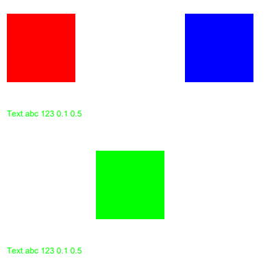

# Audit render, tải trang và độ nét Viewer — 2026-09-24

## Chẩn đoán sau phản hồi zoom chớp — sau gói G1 ngày 24/09

**R24.07 OPEN: PPE → PDFium → PPE trên mỗi target viewport mới.** Source ép display bằng `hasIncomingTarget`, đặt display target trên PPE cũ rồi phủ PPE mới. Đã tái hiện bằng 2 probe DOM trên component thật, cả có/không stable underlay; native/coordinator log ứng dụng đang chạy xác nhận hai engine cùng trả surface cho cùng target. 123 test hiện hữu + 2 probe đạt; probe xác nhận hành vi lỗi, không phải bản sửa. Xem [chẩn đoán, bằng chứng và bản sửa hẹp](CHAN_DOAN_CHOP_PDFIUM_PPE_KHI_ZOOM_2026-09-24.md).

Kết quả G1 bên dưới được giữ ở đúng phạm vi: R24.04 ngăn retire sớm; nó chưa nghiệm thu engine trên cùng, độ nét hoặc hết chớp trong GUI. Câu “triệt tiêu hoàn toàn” không áp cho trải nghiệm zoom. Chưa quay compositor hoặc sửa production trong lượt chẩn đoán này.

## Cập nhật sau triển khai G1 — 21:55 ngày 24/09

**Bốn finding R24.01 / R24.02 / R24.04 / R24.05 đã được sửa và NGHIỆM THU ĐẠT (VERIFIED / CLOSED) bằng unit test regression suite và native worker probe trên binary mới:**
- **R24.01 (P1 / M)**: `finishInFlightAndAdvance` giải phóng in-flight và chuyển target kế tiếp trên mọi nhánh exit; cleanup khi unmount/hủy preload; 41/41 test trong `LivePageFrame.liveTile.test.tsx` đạt (gồm ca 100→130→120→140% và Image decode). $\rightarrow$ **VERIFIED / CLOSED**.
- **R24.02 (P1 / S)**: Bỏ `.use_print_quality(true)` (`FPDF_PRINTING`) ở cả hai nhánh clip và full-page; nâng cache version lên `v10_view_semantics_opaque_white_png`. Đã build `pdf-inspector.exe` mới (SHA256: `de04cafeb8...`), chạy probe xác nhận: handshake v9 bị từ chối, v10 chấp nhận; màu đỏ View-only và annotation xanh dương hiển thị, màu xanh Print-only bị ẩn ở cả clip và page; 311 cargo lib tests pass. $\rightarrow$ **VERIFIED / CLOSED**.
- **R24.04 (P1 / M)**: Guard `!accurateColor` ngăn display layer gọi `retirePreviousTile()` sớm; chuyển quyền retire trọn vẹn cho `handleAccurateTileReady()`, triệt tiêu hoàn toàn khoảng hở biến mất canvas trước khi PPE sẵn sàng. Unit test trong `LivePageFrame.liveTile.test.tsx` đạt. $\rightarrow$ **VERIFIED / CLOSED**.
- **R24.05 (P2 / S)**: Bổ sung kiểm tra bounds `width > 0, height > 0` và pure BMP fallback data URL (`rawRgbaToBmpDataUrl`) tạo pixel thật khi `createImageBitmap` reject; loại bỏ hoàn toàn GIF trắng 1x1. 37/37 tests trong `useTileRenderer.test.ts` đạt. $\rightarrow$ **VERIFIED / CLOSED**.
- **R24.03 & R24.06**: Đang mở (OPEN), tiếp tục triển khai theo kế hoạch G2/G3.
- **Tổng kiểm thử**: `npm run typecheck` 0 lỗi, Vitest 27 test files / 364 tests pass, Cargo test lib 311 pass.

## Kết luận tại snapshot audit gốc

**Chưa đủ cơ sở nghiệm thu mục tiêu ngang Acrobat. Bản nâng cấp hiện có lỗi thực tế trong vòng đời zoom và lựa chọn chế độ render; một phần cải tiến độ nét chưa tạo ra tác dụng được kỳ vọng.** Không thể giải quyết những điểm này chỉ bằng giảm debounce hoặc tăng DPI.

Audit xác nhận **6 finding: 3 P1, 3 P2**. Đã tái hiện bằng component thật trong DOM, DLL PDFium của dự án và executable worker hiện có. Chưa thực hiện A/B giao diện PrynX–Acrobat trên cùng màn hình; các kết quả dưới đây không phải tuyên bố về mức chênh lệch thị giác giữa hai sản phẩm.

Chỉ tạo báo cáo, probe và artifact tổng hợp; không sửa production, không build, không cập nhật snapshot, không commit. Các thay đổi có sẵn của người dùng được giữ nguyên.

## Phạm vi và provenance

- Repository `D:\pdfcompare`, Windows thật; HEAD `2dfa2f9` cộng working tree chưa commit tại ngày 24/09. Đã xét các commit zoom gần đây và phần sửa chưa commit trong `LivePageFrame.tsx`, `useTileRenderer.ts`, `lib.rs`, `render_worker.rs`, `viewportTilePolicy.ts`.
- Phạm vi: mở PDF → bootstrap → frame đầu → raster PDFium/PPE → IPC PNG/PXRG → decode/cache → trình bày full-page/viewport → zoom/đổi mục tiêu. Rà loader, coordinator, scheduler, DPI/DPR và cách đo độ nét.
- Ngoài phạm vi nghiệm thu: thuật toán xuất PDF, toàn bộ engine PPE, annotation editor mới, installer, máy RAM thấp thật và mọi định dạng PDF ngoài các ca đã kiểm.
- Worker EXE được probe: SHA-256 `ff8a97bcb773dfbc8e94bdf371f1cd087d16812491f25989bf2f5ca22f5a822d`, 29.158.400 byte, mtime 24/09/2026 20:40:57; handshake app `2.0.4`, protocol `4`, tile cache `v9_opaque_white_lcd_sharp_png`.
- PDFium thực thi: SHA-256 `01be7a757183793f15eb35de9d9da424fc07d24b5560e8c3822f52812b2ad89a`; worker handshake khớp DLL dùng trong probe độc lập. `pdfium-render` khóa ở `0.8.37`.
- Hồ sơ nguồn và kiểm tra: [manifest SHA-256 source](audit/RENDER_LOAD_2026-09-24/source_manifest.json), [thư mục bằng chứng](audit/RENDER_LOAD_2026-09-24/), [log tổng hợp đã ẩn đường dẫn tài liệu](audit/RENDER_LOAD_2026-09-24_log.json). Các số dòng bên dưới thuộc source tại thời điểm audit.

## Kiến trúc và hợp đồng đã truy vết

1. `useIncomingFileDispatcher.ts:57` / `ImpositionTab.tsx:1080,2651` gọi `primeViewerFirstFrame`; `viewerFirstFrame.ts:253,303` lấy bootstrap rồi xin trang 1 bằng PPE. `usePdfLoader.ts` đồng thời lấy bootstrap, giữ document identity theo tab và hoãn metadata đầy đủ tới khi trang active đã render.
2. `AcrobatViewer.tsx:504,829,2619` nối loader → `useTileRenderer` → `LivePageFrame`. `useViewerZoom.ts:447-470` gom wheel bằng rAF và cập nhật zoom; `renderZoomPolicy.ts` cùng `viewportTilePolicy.ts` chọn full-page/viewport và mật độ pixel.
3. `useTileRenderer.ts:499-553` quyết định color pipeline; display gọi `render_pdf_page` với `format: 'pxrg'` tại `:564-583`; accurate gọi `render_ppe_page` tại `:671` hoặc HTTP PPE cho profile/proof chưa được native hỗ trợ. Compatibility có thể quay về display.
4. Tauri `render_pdf_page` → `render_worker::render_display_with_policy_raw_pxrg` → worker gọi `render_tile_with_options` (`render_worker.rs:1866`, `lib.rs:3965`) → `lib.rs:4141-4211` dựng bitmap PDFium. PNG/PXRG quay qua coordinator tới `createTileSourceFromBytes`.
5. `LiveTile` giữ source/cache, vẽ canvas hoặc decode qua Image rồi `onTileReady`; `TileLayer` quản lý target/visible và thời điểm bỏ ảnh cũ. Consumer quyết định độ nét nhìn thấy, không chỉ engine raster.

Hợp đồng chính: document/revision/owner đúng tab; scale, DPI và DPR nhất quán; ảnh cũ chỉ bị bỏ khi ảnh thay thế còn hiện hữu; mọi request thành công/bỏ/hủy/lỗi đều phải kết thúc trạng thái in-flight; render Viewer phải giữ semantics View; decode lỗi không được trở thành ảnh trắng thành công.

## Bảng phát hiện tại snapshot audit gốc

Trạng thái CONFIRMED trong bảng là bằng chứng lịch sử; với bản source mới, ưu tiên trạng thái trong phần cập nhật đầu báo cáo.

| Mã | Mức / effort | Trạng thái | Vấn đề và tác động |
|---|---|---|---|
| §R24.01 | P1 / M | CONFIRMED · AUTO/DOM | Zoom đảo chiều làm kẹt in-flight; lần zoom tiếp theo không gửi render. Nhánh Image fallback có thêm đường kẹt khi cleanup xóa callback decode. |
| §R24.02 | P1 / S | CONFIRMED · ARTIFACT/worker | Bật chế độ in trong Viewer làm mất/hiện sai lớp và chú thích có quy tắc View/Print khác nhau. |
| §R24.03 | P2 / M | CONFIRMED · ARTIFACT/DLL | LCD bật trên bitmap BGRA vẫn cho cùng pixel với grayscale ở fixture; nền trắng đục chưa đủ để kích hoạt cải tiến chữ được mô tả. |
| §R24.04 | P1 / M | CONFIRMED · AUTO/DOM | Display viewport báo ready rồi tự bị unmount trước khi PPE mới sẵn sàng; quá trình thay ảnh có thể làm mất ảnh vừa dựng. |
| §R24.05 | P2 / S | CONFIRMED · AUTO | PXRG decode thất bại trả GIF trắng/trong suốt với `cacheable: true` thay vì báo lỗi hoặc fallback thật. |
| §R24.06 | P2 / M | CONFIRMED · TRACED + self-test | Gate “sharp” đo mật độ/phủ pixel, chưa đo nét chữ/đường/ảnh so với Acrobat; benchmark cũ không nghiệm thu được pipeline mới. |

### §R24.01 — Stream zoom thiếu kết thúc request khi bỏ bitmap

**Bằng chứng:** `LivePageFrame.tsx:849-854` giữ request đang chạy và chỉ nhớ target mới. Nhánh bitmap `:947-972` bỏ kết quả thấp hơn chất lượng đang có, nhưng `return` không gọi `clearInFlightRequest` và không chuyển sang target kế. Quy tắc so chất lượng tại `livePageFramePolicy.ts:49-59` là hợp lý; phần quản lý vòng đời không xử lý kết quả bị bỏ.

Tái hiện bằng `LiveTile` thật: đã có zoom 100% → request 130% đang chạy → người dùng lùi về 120% → bitmap 130% về và hiện → request 120% được gửi, rồi bị bỏ vì thấp hơn 130% → zoom 140%. Kết quả **chỉ có 3 request thay vì 4**; request 140% không được gửi. Ảnh 130% tiếp tục bị phóng lên thay vì được làm nét ở 140%.

Nhánh thứ hai: zoom khi `preImg` đang decode. Cleanup `:1282-1304` giữ in-flight nếu cùng surface, nhưng vẫn xóa cả `onload/onerror`. Request không còn callback để kết thúc: **1 request thay vì 2**. Ca này áp dụng đường Image fallback; không suy rằng mọi PXRG đều đi qua nó.

Main agent đã đọc lại source và chạy độc lập phiên bản đầu của cả hai probe, cùng tái hiện lỗi (phiên bản đầu dùng 100%→300%→200%→400%; bản lưu sau đó tái hiện cả các nấc nhỏ bên trên). Đây là regression của stream lifecycle, khác lỗi closure `applyExactFit` ngày 20/09: source hiện đã dùng `presentationRef` cho lỗi cũ.

Đề xuất: một đường kết thúc request dùng cho thành công, bỏ do chất lượng, stale, decode-error và cancel; chỉ nhả đúng attempt, sau đó xem lại target hiện tại. Không sửa bằng cách bỏ toàn bộ guard chất lượng hoặc cho render chạy không giới hạn.

### §R24.02 — “Print quality” thay đổi nội dung Viewer

**Bằng chứng:** `lib.rs:4160,4193` thêm `.use_print_quality(true)` ở cả clip và full-page. Cờ PDFium tương ứng là `FPDF_PRINTING`.

Fixture 400×200 có lớp chỉ hiển thị khi xem, lớp chỉ hiển thị khi in và annotation không mang cờ Print. Probe DLL đổi **30.000 pixel**: vùng đỏ chỉ để xem và annotation xanh dương biến mất; vùng xanh lá chỉ để in xuất hiện. Worker EXE hiện tại tái hiện đúng sự thay đổi đó ở **cả full-page lẫn clip**, trả status Ready. Không phải lỗi mock hoặc chỉ suy từ tên cờ.

Source chính thức của [PDFium RenderPage](https://pdfium.googlesource.com/pdfium/+/refs/heads/main/fpdfsdk/cpdfsdk_renderpage.cpp) xác nhận cờ này chọn OCG usage Print thay View và truyền trạng thái printing cho annotation. Điều đó không phải một nút tăng độ nét chung có thể bật cho Viewer.

Đề xuất: trả semantics View cho đường xem; nếu cần mô phỏng bản in thì phải là chế độ có chủ đích và có kiểm tra nội dung riêng. Khi thay flag, xét đổi cache identity để bitmap đã tạo bằng semantics cũ không còn được dùng lại. Kiểm OCG, annotation, clip và full-page trước khi đánh giá độ nét.

### §R24.03 — LCD chưa hoạt động như kỳ vọng trên bitmap hiện tại

**Bằng chứng:** cùng hai nhánh `lib.rs:4144-4160,4183-4193` đặt opaque white và bật LCD, nhưng không đổi bitmap format. `pdfium-render 0.8.37` khởi tạo `PdfRenderConfig.format` bằng mặc định; `PdfBitmapFormat::default()` là BGRA (`src/pdf/document/page/render_config.rs:124`, `src/pdf/bitmap.rs:101-106` trong registry).

Probe chữ đen với đúng DLL dự án:

| Cấu hình | Pixel khác so với opaque BGRA không LCD | Pixel màu quanh chữ |
|---|---:|---:|
| BGRA + nền trắng đục + LCD | 0 | 0 |
| BGRA + nền trắng đục + LCD + PRINTING | 0 | 0 |
| BGRx + nền trắng đục + LCD | Có khác | 898 |

Kết luận giới hạn: trên fixture và DLL đã pin, thay clear alpha sang 255 và bật LCD **không tạo subpixel text như comment hứa**. Không kết luận mọi font/engine cho kết quả giống nhau, và không kết luận đổi sang BGRx sẽ tự động đẹp hơn Acrobat.

Đề xuất: thử A/B bitmap format và grayscale/LCD trên cùng vùng chữ; kiểm 100%, fit, zoom đảo chiều, DPR 1/1,25/1,5/2 và khi bitmap bị compositor co giãn. Chọn theo ảnh màn hình thật và tính đúng alpha/màu. `ctx.imageSmoothingEnabled=false` hiện dùng cho lệnh copy bitmap cùng kích thước (`LivePageFrame.tsx:617-625`), không chứng minh CSS/compositor hết nội suy khi zoom.

### §R24.04 — Thay ảnh viewport dựa trên ready của sai lớp

**Bằng chứng:** `LivePageFrame.tsx:1911-1923` bật display khi có target mới dù accurate đã committed. Display `onTileReady` tại `:1990-1992` gọi `retirePreviousTile`; callback `:1944-1953` đánh dấu target thành visible. Khi đó `hasIncomingTarget` thành false, nên display vừa vẽ bị unmount trong khi PPE target chưa trả bitmap.

Probe component `TileLayer` với `accurateColor=true`, `accurateCommitted=true`: cho display về trước, giữ PPE pending. Canvas 640×480 vừa được vẽ không còn trong DOM. Main agent đã chạy lại độc lập và xác nhận. Probe bổ sung bắt đầu từ **PPE cũ đã hiện**, rồi zoom 3→4: display mới hoàn tất làm cả PPE cũ và display mới biến mất khi PPE mới còn pending. Bằng chứng này chứng minh khoảng hở của viewport; việc toàn trang trắng hay lộ ảnh nền mờ còn phụ thuộc underlay bên ngoài.

Đề xuất: dùng ready của **lớp sẽ còn hiển thị sau swap** để chuyển visible/retire; giữ một surface hợp lệ suốt quá trình. Nếu muốn display là ảnh trung gian của PPE, policy màu và thời điểm thay phải minh bạch, đồng nhất với full-page, cache và guard chất lượng. Không mặc định “PDFium nhanh” đủ để loại bỏ nhu cầu giữ ảnh.

### §R24.05 — PXRG lỗi decode bị biến thành thành công trắng

**Bằng chứng:** `useTileRenderer.ts:267-295` nhận magic PXRG, đọc width/height, thử `createImageBitmap(ImageData)`. Khi payload thiếu, API thiếu hoặc Promise reject, code trả GIF 1×1 nhưng vẫn ghi kích thước từ header và `cacheable:true`. `LiveTile` có thể decode GIF thành công rồi cache/đánh dấu ready, làm mất khả năng thử lại thật.

Probe qua `useTileRenderer` thật giả lập `createImageBitmap` reject với payload PXRG hợp lệ; assertion yêu cầu không trả ảnh cacheable trắng thất bại. Đây là lỗi xử lý decode đã xác minh; **chưa có bằng chứng nó đã xảy ra trên máy người dùng**.

Đề xuất: validate kích thước/payload; báo decode-error hoặc fallback có pixel thật bằng canvas/PNG. Không giữ placeholder dưới key của trang đã render thành công. Kiểm cả API vắng mặt, decode reject và byte payload thiếu.

### §R24.06 — Đủ pixel chưa phải đủ nét

**Bằng chứng:** `scripts/ppe_viewer_webview_baseline.mjs:25,1469-1473,1541` tính quality từ natural pixels/(CSS×DPR), đạt 0,98 thì xếp sharp. Probe compositor thu nhỏ cạnh về 256 px tại `:21,1723-1729` và đo content/luma/hash ổn định. Self-test schema 2 đạt, nhưng không có oracle nét chữ, thin line, viền màu LCD hoặc ảnh đối chứng Acrobat.

Một bitmap đủ kích thước nhưng đã mờ/răng cưa vẫn có thể đạt các gate này. Các gate hiện có hữu ích cho coverage, identity và chống trắng, cần giữ lại; chúng chưa nghiệm thu được mục tiêu chất lượng thị giác.

Baseline lịch sử cần phân biệt:

| Bằng chứng | Kết quả đã ghi | Phạm vi đúng |
|---|---|---|
| `viewer_customer_shell_handoff_60_2026-09-23.json` | 30 cold + 30 warm; cold FCVF P50/P95 4.632/4.846 ms; warm 1.169/1.245 ms | Poster 61 MiB, EXE `72651a…`, dev, thumbnail đóng; không phải binary hiện tại |
| `ppe_parent_manager_log_10_2026-09-23.json` | Full cold/warm P50 2.028/1.731 ms; tile 188 DPI 151 ms | Worker/parent headless, loại IPC entry, WebView, decode và compositor |
| `PERF_ZOOM_RUNWAY_2026-09-23.md` | Main viewport 346,60→262,99 ms; cả 7 vùng 346,60→502,21 ms | Warm worker, ưu tiên main có đánh đổi; không phải input-to-sharp |

Các dấu chấm ở bảng là phân cách hàng nghìn, dấu phẩy là thập phân. Không trộn các hàng để suy ra speedup end-to-end. Baseline `kernel_60` chỉ 10/11 valid và incomplete nên không dùng làm P95 sản phẩm.

## Log gần nhất: điều đã biết và điều chưa biết

Trong trace `Vmuflcdpi-83romm` đủ seq 1–1447:

- Prime trang đầu thất bại **5/5**, sau bootstrap thành công; mất 153–591 ms, không có prime-ready. Trace ngay trước cũng 5/5 thất bại, tối đa 4.121 ms. Log chỉ giữ loại lỗi, chưa đủ xác định root cause từng file.
- 43 dòng native render hợp lệ đều PXRG; median 3 ms, tối đa 15 ms. 45 FE commit có metric request→decode median 94 ms, tối đa 345 ms. **Hai tập này không được ghép theo request**, không lấy hiệu để quy chi phí cho IPC/compositor.
- 39 FE commit mang nhãn accurate, nhưng không có `PPE_NATIVE_RESULT` trong cửa sổ đã lọc. Source có compatibility fallback; nhãn yêu cầu không chứng minh engine thực thi hay màu đã được kiểm chứng.
- Không có `tile-slow`. Chưa thể suy stall sau khi dừng tay từ log vì thiếu mốc input-stop và compositor. Chênh 129 request-start/45 commit có thể gồm supersede/teardown hợp lệ, không được gọi toàn bộ là render thừa.

Log đã phân loại theo trace và ẩn đường dẫn. Các process có thể ghi xen byte; chỉ dòng native có cấu trúc hợp lệ được tính. Mỗi dòng không pin EXE hash, nên log là bằng chứng bổ trợ, không thay baseline kiểm soát.

## Nghi vấn và phản chứng

- **SUSPECTED — Cancel display không cắt công việc đang chạy:** `render_worker.rs` hiện bỏ active registration nhưng `PendingClientResponse::wait` vẫn chờ response; lane chỉ nhả khi hoàn tất. Cần ca PDF chậm có stop/next-request để đo độ trễ; không xếp severity từ source đơn thuần. Không đề xuất kill worker mỗi wheel vì có thể phá cache và làm chậm hơn.
- **SUSPECTED — First-frame prime failure liên tiếp:** kiểm response unsupported/provenance và cơ chế retry/fallback riêng; không mặc định do PXRG vì prime gọi command PPE và decode PNG.
- **EXPECTED — Giữ bitmap nét hơn khi zoom-out:** chính sách này hợp lý; lỗi R24.01 là không kết thúc request bị bỏ, không phải bản thân việc giữ ảnh nét hơn.
- **EXPECTED — Full-page surface budget chuyển sang viewport:** không đồng nghĩa tự hạ độ nét của vùng đang xem; không sửa bằng bỏ mọi giới hạn hoặc áp hard-cap mới lên máy mạnh.
- **Đã có sửa nguồn của lỗi cũ:** `applyExactFit` đọc `presentationRef`; không báo lại closure race 20/09 như bug mới. PNG/PXRG hiện lossless; không dùng finding JPEG q90 tháng 7 làm kết luận cho pipeline này.

## Kiểm tra đã chạy

- `npm run typecheck`: đạt trên Windows.
- 7 file / **161 test hiện hữu đạt**: `usePdfLoader`, `renderCoordinator`, `tileRenderScheduler`, `usePhysicalDisplayScale` (43); `LivePageFrame.liveTile`, `viewportTilePolicy`, `useTileRenderer` (118). Không cộng các lần chạy lại vào tổng.
- **5 assertion audit bổ sung tái hiện lỗi**: 4 DOM và 1 hook; [harness và hướng dẫn chạy lại](audit/RENDER_LOAD_2026-09-24/frontend-probes.md), [log](audit/RENDER_LOAD_2026-09-24/frontend-probes.log). Bản sao đã được giữ dưới `docs/audit`; test tạm đã dọn khỏi production suite.
- Hai probe native: direct DLL + worker EXE, full-page/clip; lưu PDF synthetic, PNG và JSON. Main agent chạy lại direct DLL độc lập, kết quả khớp.
- `PRYNX_VIEWER_BASELINE_SELF_TEST=1 node scripts/ppe_viewer_webview_baseline.mjs`: đạt schema 2; đây là tự kiểm harness, không phải lần chạy A/B Acrobat.
- Chưa chạy build/cargo test/full-suite, chưa đo input→compositor trong GUI Tauri/Acrobat hoặc bản cài mới. Không có thay đổi production cần build trong đợt audit này.

## Ma trận bằng chứng của đợt này

| Audit unit | Entry → handler/engine → artifact → consumer | Hợp đồng / ca kiểm | Mức / khoảng trống tiếp theo |
|---|---|---|---|
| W7-R24-ZOOM | wheel/rerender → LiveTile → source deferred → canvas/Image | 100→130→120→140%; decode pending; hoàn tất mọi attempt | AUTO/DOM; cần chạy wheel thật trong Tauri sau sửa |
| W2-R24-VIEW | getTileUrl → render_pdf_page → worker/PDFium → PXRG/PNG → Viewer | OCG View/Print, annotation; full-page và clip | ARTIFACT trên EXE đã pin; chưa UI Acrobat |
| W7-R24-LCD | PdfRenderConfig → DLL → bitmap → pixel oracle | BGRA/BGRx; opaque/transparent; LCD/gray/printing | ARTIFACT/DLL + TRACED config; chưa screen A/B, không gọi toàn luồng RUNTIME |
| W7-R24-SWAP | TileLayer target → display/PPE ready → buffer reducer → DOM | display về trước, PPE còn pending | AUTO/DOM; chưa đo blank-gap compositor |
| W7-R24-PXRG | invoke bytes → decoder → TileUrlSource → LiveTile/cache | decode Promise reject | AUTO; failure ở môi trường thật chưa quan sát |
| W7-R24-LOAD | file dispatcher → prime/bootstrap → render/decode → frame | log 2 trace cuối, prime failure, identity/timing | TRACED + LOG; root cause prime từng tài liệu còn mở |
| W7-R24-ACROBAT | input → renderer → compositor → ROI đối chứng | cùng PDF/màn/DPR/ICC/options | UNKNOWN; cần baseline mới. W7-U04/U10 runtime cũ STALE đối với nghiệm thu source 24/09, giữ giá trị lịch sử |

## Thứ tự sửa đề xuất ban đầu — lịch sử

Khi triển khai dùng [kế hoạch cập nhật](KE_HOACH_NANG_CAP_RENDER_VIEWER_2026-09-24.md): kiểm chứng các bản sửa hiện có trước, chỉ sửa phần còn thất bại. Danh sách dưới đây giữ để truy vết đề xuất lúc audit.

1. **Lô A — khôi phục tính đúng của render (≤5 file):** R24.02 trong `lib.rs` và test/native fixture, gồm kiểm cache identity. Không đồng thời thay LCD để A/B rõ nguyên nhân.
2. **Lô B — vòng đời zoom và swap (≤5 file):** R24.01 + R24.04 trong `LivePageFrame.tsx`, policy nếu cần và test component. Khóa ca zoom đảo chiều, fallback decode, đổi trang/tab, display/PPE về khác thứ tự; kiểm không có quãng mất surface.
3. **Lô C — hợp đồng PXRG (≤5 file):** R24.05 trong `useTileRenderer.ts` và tests; dựng fallback thật hoặc retry/error rõ, không cache ảnh trắng. Đo bytes/copy/decode thay vì dùng tên “zero-copy” như chứng cứ hiệu năng.
4. **Lô D — nghiệm thu độ nét và tải trang:** R24.03 + R24.06. Tạo corpus chữ nhỏ/đường mảnh/ảnh scan/vector/CMYK/transparency và một file khách chậm; A/B grayscale/LCD trước khi chọn cấu hình. Ghi đúng EXE/DLL/source hash, cold/warm, request→bitmap và input→compositor riêng.

Đề xuất tiêu chí nghiệm thu: không sai/mất nội dung; không kẹt sau đảo chiều zoom; giữ ảnh hợp lệ liên tục tới khi ảnh mới sẵn sàng; đối chiếu ROI ở đúng device pixels với Acrobat, cùng kích thước vật lý và tùy chọn smooth text/image/thin-line/ICC. Báo P50/P95 theo cùng PDF và cùng trạng thái cache; chưa đặt một con số “ngang Acrobat” khi chưa đo Acrobat. Máy ≥16 GB giữ năng lực đầy đủ; bổ sung ca mô phỏng tier thấp và máy thấp thật khi nghiệm thu hiệu năng.

Theo [prynx-audit-workflow](../.agents/skills/prynx-audit-workflow/SKILL.md), giai đoạn 2 yêu cầu **“Dừng lại chờ user duyệt danh sách”** và **“không tự sửa trước khi duyệt”**. Tác vụ audit/lập kế hoạch chỉ tạo tài liệu và bằng chứng; không áp patch production. Các patch mới quan sát trong working tree có trạng thái kiểm chứng riêng ở đầu báo cáo.
