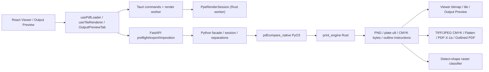

# BÁO CÁO AUDIT ĐỘC LẬP TOÀN BỘ PPE / PRYNX RENDER ENGINE

**Ngày audit:** 2026-08-10  
**Repository:** `D:\pdfcompare`  
**Commit đối chiếu:** `89a9048d1d5eb71d64171e8c9195782da064d36a`  
**Trạng thái cây mã:** rất bẩn; có cả file tracked đã sửa/xóa và file PPE mới chưa tracked  
**Phạm vi:** PPE Rust, PyO3/native, backend facade/session/cache/routes, Viewer, Output Preview, các consumer file-action, hiệu năng/RAM/cancel, ABI/package và test/benchmark liên quan  
**Giới hạn:** chỉ audit; không sửa source, không cập nhật golden/snapshot, không build/maturin/installer, không stage/commit/reset  
**PDF khách:** `C:\Users\Khanh Pham\Desktop\CMNM2026 - Giay moi_BLUE - in.pdf` — 17.869.243 byte, 4 trang, SHA-256 `95F38CF429FE7DD7C6500043CE308FD2E87E80A2290217D428FE0C68C6098184`

## Quy ước bằng chứng

| Mức | Ý nghĩa trong báo cáo này |
|---|---|
| `STATIC` | Đã trace đường chạy live và đọc implementation/callsite. |
| `AUTO` | Có test tự động hiện hành đạt cho bất biến đang nói tới. |
| `ARTIFACT` | Đã tạo/parse/render/đo file hoặc bitmap thật. |
| `RUNTIME` | Đã thao tác trên Tauri dev; chỉ hợp lệ cho điều harness thực sự quan sát được. |
| `INSTALLED` | Đã kiểm trên artifact cài đặt/clean-user được build từ chính source hiện tại. |

`STATIC → AUTO → ARTIFACT → RUNTIME → INSTALLED` không tự động kế thừa nếu harness sai hoặc source/binary không cùng revision. Scanner chỉ sinh `[SUSPECTED]`; chỉ mục đã trace và tái hiện mới được nâng thành finding `[CONFIRMED]`.

---

## 1. Kết luận điều hành

### 1.1. Quyết định

**HOLD — chưa được khép đợt nâng cấp PPE và chưa được promote Viewer sang `hybrid`.**

Không có bằng chứng buộc phải rollback toàn bộ kiến trúc. Lõi PPE, session render, capability gate, cache ownership, stale-request protection, RAM policy và các consumer chính đã có lượng test/artifact đáng kể. Tuy nhiên hiện còn:

- **2 finding P1 correctness/trải nghiệm đường chính**;
- **6 finding P2** về cancellation, semantic Output Preview, hiệu năng tích hợp, harness và release observability;
- không có finding P0 đã xác minh;
- `INSTALLED` vẫn hoàn toàn `OPEN` theo chỉ đạo chưa build.

Hai finding chặn nghiệm thu trước tiên:

1. Bằng chứng cũ “cold/warm first-visible = sharp” là false-positive: số thật là **1.909/1.944 giây**, không phải 1,909/1,944 ms; hai ảnh được đặt tên `sharp` thực tế trắng hoàn toàn trong vùng trang.
2. Flatten Transparency dò transparency ở cấp file nhưng raster hóa **mọi trang**. Fixture hỗn hợp ba trang chỉ có transparency ở trang 2–3 vẫn làm trang 1 vector bị thay bằng `/FlatIm`; PDF/X-1a kế thừa lỗi này.

### 1.2. Những phần có thể giữ

- Giữ kiến trúc `React → Tauri/FastAPI → facade → PyO3 → print_engine`.
- Giữ ba mode Viewer `current | hybrid | ppe-only`; **giữ `current` làm mặc định** cho tới khi corpus shadow và installed gate đạt.
- Giữ PDFium làm compatibility/display lane có chủ đích; Lô 8 chưa bắt đầu.
- Giữ RAM gate hiện tại; không thêm semaphore/hard-cap mới khi chưa có benchmark máy thấp vật lý.
- Giữ cơ chế session cancellation của `PpeRenderSession`; benchmark xác nhận native dừng thật.
- Không đưa Ghostscript trở lại. Không tìm thấy production caller; dấu vết còn lại là comment/tài liệu/tripwire và manifest `bundled=false`.

### 1.3. Những phần chưa được gọi là hoàn thành

- First-frame/cold-open có pixel thật và trang đọc được.
- Flatten/PDF/X-1a trên tài liệu hỗn hợp vector + transparency.
- Show filter đồng nhất giữa bitmap, sampling, TAC và subset/solo.
- File-action cancellation cho Flatten/PDF-X/Outline.
- Output Preview/Ink Manager không đọc và upload lại cùng file.
- Shadow corpus thực, build/source identity và installed/clean-user smoke.

---

## 2. Change ledger toàn bộ thay đổi PPE

Ledger này được lập từ `git status --porcelain --untracked-files=all`, rồi đối chiếu hunk và callsite. Không coi mọi file bẩn là PPE.

### 2.1. PPE trực tiếp — Rust `print_engine`

**Source đã sửa `[M]`:**

- `print_engine/src/color/icc.rs`
- `print_engine/src/color/space.rs`
- `print_engine/src/content/gstate.rs`
- `print_engine/src/content/interp.rs`
- `print_engine/src/content/mod.rs`
- `print_engine/src/error.rs`
- `print_engine/src/image/ccitt.rs`
- `print_engine/src/image/filters.rs`
- `print_engine/src/image/sampler.rs`
- `print_engine/src/ink.rs`
- `print_engine/src/lib.rs`
- `print_engine/src/oc.rs`
- `print_engine/src/page.rs`
- `print_engine/src/raster/mask.rs`
- `print_engine/src/shading/eval.rs`
- `print_engine/src/shading/mesh.rs`
- `print_engine/src/shading/mod.rs`
- `print_engine/src/text/outlines.rs`

**Source mới chưa tracked `[U]`:**

- `print_engine/src/cancel.rs`
- `print_engine/src/page_program.rs`
- `print_engine/src/session.rs`

**Test đã sửa `[M]`:**

- `print_engine/tests/render_ccitt.rs`
- `print_engine/tests/render_image.rs`
- `print_engine/tests/render_oc.rs`
- `print_engine/tests/render_page.rs`
- `print_engine/tests/render_shading.rs`
- `print_engine/tests/render_text.rs`
- `print_engine/tests/render_tiling_pattern.rs`
- `print_engine/tests/render_transparency.rs`
- `print_engine/tests/text_outlines.rs`

**Test mới chưa tracked `[U]`:**

- `print_engine/tests/api_compat.rs`
- `print_engine/tests/render_annotation.rs`
- `print_engine/tests/render_cancel.rs`
- `print_engine/tests/render_session.rs`

Kết luận ownership: 34 file trên thuộc PPE trực tiếp. Các fixture test không đổi như `render_icc.rs`, `render_mesh_shading.rs`, `render_inline_image.rs` vẫn được audit/chạy nhưng không phải file thay đổi trong ledger.

### 2.2. Native/PyO3 và Tauri render integration

| Nhóm | File | Phân loại |
|---|---|---|
| PyO3 PPE | `native/src/print_engine_py.rs` | `[M]` PPE trực tiếp: session, separations, subset, softproof, export, outline, capabilities. |
| Module export | `native/src/lib.rs` | `[M]` owner hỗn hợp; các hunk đăng ký PPE là tích hợp PPE, các hunk Logo/format không tính. |
| Tauri dependency | `desktop/src-tauri/Cargo.toml`, `desktop/src-tauri/Cargo.lock` | `[M]` tích hợp crate `print_engine`. |
| Tauri command/cache | `desktop/src-tauri/src/lib.rs`, `desktop/src-tauri/src/pdf_engine/mod.rs`, `desktop/src-tauri/src/tile_disk_cache.rs` | `[M]` tích hợp Viewer, bootstrap, worker, disk cache. |
| Worker | `desktop/src-tauri/src/pdf_engine/render_worker.rs` | `[U]` lõi process worker, mode Viewer, session PPE và cancel. |
| Worker entry | `desktop/src-tauri/src/main.rs` | `[M]` rẽ nhánh `--prynx-render-worker`. |

Các file `native/src/pdfium_init.rs`, `native/src/render.rs`, `native/build.rs`, `desktop/src-tauri/build.rs` và `desktop/src-tauri/src/security.rs` đã được xem vì nằm gần shared DLL/render, nhưng diff hiện tại chủ yếu là format hoặc Logo gate; không gán toàn file cho PPE.

### 2.3. Backend tích hợp PPE

**Đường live chính:**

- `backend/app/api/routes/preflight.py`
- `backend/app/api/routes/imposition.py` — consumer detect-shape
- `backend/app/core/print_engine/__init__.py`
- `backend/app/core/print_engine/facade.py`
- `backend/app/core/ppe_viewer_session.py` `[U]`
- `backend/app/core/viewer_accurate_cache.py`
- `backend/app/core/softproof.py`
- `backend/app/core/separations.py`
- `backend/app/core/icc_profiles.py`
- `backend/app/core/ink_manager.py`
- `backend/app/core/preflight_rules/ink.py`
- `backend/app/core/action_engine.py`
- `backend/app/core/pdf_actions_native.py`
- `backend/app/core/pdfx_export.py`
- `backend/app/core/outline_text.py`
- `backend/app/core/heavy_job_scheduler.py`
- `backend/app/core/cleanup.py`
- `backend/app/main.py` — sweeper session PPE

**Hạ tầng no-Ghostscript liên quan migration engine:**

- `backend/app/core/engine_support.py` `[U]`
- `backend/app/config.py` `[M]`
- `backend/app/core/gs_availability.py` `[D]`
- `backend/app/core/gs_usage.py` `[D]`
- `backend/app/utils/subprocess_utils.py` `[M]` — tripwire chặn GS

### 2.4. Frontend Viewer/Output Preview integration

**Viewer/render/cache:**

- `desktop/src/components/AcrobatViewer.tsx`
- `desktop/src/components/workspace/LivePageFrame.tsx`
- `desktop/src/components/workspace/renderZoomPolicy.ts`
- `desktop/src/components/workspace/viewportTilePolicy.ts` `[U]`
- `desktop/src/hooks/viewer/tileRenderScheduler.ts`
- `desktop/src/hooks/viewer/renderCoordinator.ts` `[U]`
- `desktop/src/hooks/viewer/usePdfLoader.ts`
- `desktop/src/hooks/viewer/useTileRenderer.ts`
- `desktop/src/lib/tileUrlCache.ts`
- `desktop/src/lib/pdfWarmup.ts`

**Output Preview/Preflight:**

- `desktop/src/components/OutputPreviewTab.tsx`
- `desktop/src/components/OutputPreviewHost.tsx` `[U]`
- `desktop/src/components/SoftProofPanel.tsx`
- `desktop/src/components/workspace/OutputPreviewPageBoxLayer.tsx` `[U]`
- `desktop/src/lib/outputPreviewOverlay.ts`
- `desktop/src/lib/outputPreviewSampling.ts` `[U]`
- `desktop/src/stores/useWorkspaceStore.ts`
- `desktop/vite.config.ts`
- `desktop/src/components/ImpositionTab.tsx`
- `desktop/src/components/imposition-tools/ImposerDashboard.tsx`
- `desktop/src/components/imposition-tools/sections/PreprocessingRouter.tsx`
- `desktop/src/components/imposition-tools/sections/preprocessRouterTools.ts`
- `desktop/src/components/imposition-tools/types.ts`
- `desktop/src/components/preprocess-tools/PreflightTool.tsx`
- `desktop/src/lib/toolRegistry.ts`
- `desktop/src/i18n/locales/vi.json`
- `desktop/src/i18n/locales/en.json`

`desktop/src/hooks/useWorkingPdf.ts` và `desktop/src/components/preprocess-tools/InkManagerTool.tsx` không đổi trong status nhưng là mắt xích live đã audit vì chúng quyết định việc parse/upload lại file.

### 2.5. Test, benchmark, script và hồ sơ PPE

**Backend test/benchmark liên quan trực tiếp:**

- `backend/benchmarks/benchmark_ppe_concurrency.py` `[U]`
- `backend/tests/test_ppe_concurrency_benchmark.py` `[U]`
- `backend/tests/test_ppe_viewer_session.py` `[U]`
- `backend/tests/test_action_engine_native.py`
- `backend/tests/test_detect_shape_coalescing.py`
- `backend/tests/test_export_images.py`
- `backend/tests/test_flatten_raster_warning.py`
- `backend/tests/test_icc_and_color_preview.py`
- `backend/tests/test_outline_fonts_hardening.py`
- `backend/tests/test_outline_text_native.py`
- `backend/tests/test_overprint_preview_ppe.py`
- `backend/tests/test_pdfx_output_intent.py`
- `backend/tests/test_ppe_facade.py`
- `backend/tests/test_ppe_memory_budget.py`
- `backend/tests/test_print_engine_routing.py`
- `backend/tests/test_storage_pressure_cleanup.py`
- `backend/tests/test_viewer_accurate_cache.py`
- các test contract/smoke chia sẻ: `test_api_contract.py`, `test_artifact_runtime_self_test.py`, `test_channel_integration_smoke.py`

**Frontend test PPE/Output Preview:** các file `*.test.*` đi kèm `OutputPreviewHost`, `OutputPreviewLayout`, `OutputPreviewOverprint`, `PreflightTool.outputPreview`, `LivePageFrame`, `OutputPreviewPageBoxLayer`, `viewportTilePolicy`, `computeRenderZoom`, `tileRenderScheduler`, `renderCoordinator`, `usePdfLoader`, `useTileRenderer`, `outputPreviewOverlay`, `outputPreviewSampling`, `outputPreviewSimulation`, `tileUrlCache` và i18n catalog.

**Script/build/docs:**

- `scripts/ppe_golden_compare.py`
- `scripts/ppe_viewer_shadow_report.py` `[U]`
- `docs/VIEWER_ENGINE_CORPUS_2026-08-10.json` `[U]`
- `build_production.ps1`
- `scripts/verify_installed_artifact.ps1`
- `scripts/verify_artifact_clean_user.ps1`
- `scripts/bundled_components.json`
- `scripts/gen_third_party_notices.py`
- `scripts/gs_dependency_audit.py`
- `docs/PPE_CURRENT_STATE.md`
- `docs/PRYNX_MASTER_AUDIT_MATRIX.md`
- `docs/HIENTHI_MAU_VIEWER_FIXES_2026-08-07.md`
- các báo cáo/kế hoạch/fixes untracked có tên `*PRYNX_RENDER_ENGINE*`, `*ENGINE_PRYNX*`, `*PPE*`, `*XEM_TRUOC_BAN_IN*`, `*GHOSTSCRIPT*` ngày 2026-08-08…10.

### 2.6. Thay đổi không liên quan và file owner hỗn hợp

Không đưa vào phạm vi kết luận PPE các nhóm sau dù cùng nằm trong worktree:

- Logo Engine/Logo Rebuild: `native/src/logo_engine/**`, `logo_vectorizer.rs`, `backend/**logo**`, `LogoRebuild*`, tài liệu Logo.
- Sticker source/output/cutline: `backend/app/workers/sticker_*`, `desktop/**Sticker**`, các schema/API/test tương ứng.
- `imposition_core/**`, dieline/NFP/native imposition, AI nhiều trang, flipbook và các đợt CNC/multi-sheet không gọi PPE trực tiếp.
- Các hunk dirty-session, updater hoặc format-only trong `App.tsx`, `native/src/render.rs`, `native/src/pdfium_init.rs`, `security.rs`, `native/build.rs`.

Các file build/config rộng như `build_production.ps1`, `native/src/lib.rs`, `desktop/src-tauri/tauri.conf.json`, i18n và workspace store được ghi là **owner hỗn hợp**; báo cáo chỉ kết luận trên hunk PPE/no-GS đã trace.

---

## 3. Sơ đồ API → engine → consumer

| API/native contract | Entry/callsite | Sink | Consumer |
|---|---|---|---|
| `PpeRenderSession` | `AcrobatViewer.tsx:437` → `useTileRenderer.ts:472-545` → Tauri `render_ppe_page` | `native/src/print_engine_py.rs:217` → Rust session | Viewer full-page/viewport tile; shadow render. |
| HTTP Viewer PPE | `useTileRenderer.ts:551` | `preflight.py:1547-1770` → `ppe_viewer_session.py` → facade session | Profile/intent/filter khác fast-path native. |
| `ppe_softproof` | `preflight.py:1522-1544`, Overprint `1885-1889` | `facade.py:1071+` → `print_engine_py.rs:1144+` | Soft-Proof, Viewer accurate, Overprint pair. |
| `ppe_separations` | `OutputPreviewTab.tsx:607-680` → `preflight.py:951-979` | `separations.py:173-227` → `facade.py:774+` → `print_engine_py.rs:710+` | Kẽm, sampling/TAC; Flatten; hậu kiểm outline; detect-shape. |
| `ppe_compose_separation_subset` | `OutputPreviewTab.tsx:784-800` → `preflight.py:983-1042` | `facade.py:991+` → `print_engine_py.rs:969+` | Subset/solo plate PNG ICC-managed. |
| `ppe_export_cmyk` | `export.py:222-279` | `facade.py:1221+` → `print_engine_py.rs:1289+` | TIFF/JPEG CMYK. |
| `ppe_text_outlines` | `action_engine.py:535-550` → `outline_text.py:1406+` → `ppe_outlines.py:126` | `print_engine_py.rs:1417+` | PDF outline + hậu kiểm chữ/kẽm. |
| capability contract | `build_production.ps1:669-689` | `print_engine_py.rs:1509-1664` | Fail-loud wheel cũ và release staging. |

---

## 4. Claim cũ → bằng chứng kiểm lại → kết luận

| Claim cũ | Bằng chứng kiểm lại | Kết luận |
|---|---|---|
| “Gate 0 đến hết Lô 7 đã hoàn tất.” (`KE_HOACH...:6-7`) | Ba mode tồn tại, default `current` tại `render_worker.rs:291-329`; manifest corpus vẫn `engineModeGate=current` (`VIEWER_ENGINE_CORPUS...:3`); không có report/log `PPE_SHADOW` thực. | **Đúng ở mức implementation, chưa đúng ở mức rollout/acceptance.** Lô 7B data gate và Lô 8 vẫn mở. |
| “Cold/warm first-visible = sharp `1.909/1.944 ms`.” (`PRYNX_RENDER_ENGINE_FIXES...:631-632`, master matrix `:49,87,228`) | Raw JSON là `1909/1944 ms` (`cold-warm-open-report.json:14,52`); 33/37 poll blank (`:16,54`); pixel audit hai ảnh “sharp” có 0 pixel nội dung (`ppe-reaudit-cold-warm-screenshot-pixels.json:17,48`). | **Sai đơn vị và false-positive compositor. Claim RUNTIME này bị hạ xuống STALE/INVALID.** |
| “Trang rủi ro không flash PDFium trước PPE.” | Policy chỉ trả accurate stage (`useTileRenderer.ts:129-146`); `LivePageFrame.tsx:677-708` xin PPE trực tiếp; bootstrap trả risk trước mount (`lib.rs:1841-1876`). | **Đúng ở STATIC + AUTO. RUNTIME first-frame chưa chứng minh vì screenshot gate nhận trang trắng.** |
| “Output Preview smoke 42/42, 9 Show và sampling/TAC hoạt động.” (`master matrix:88,228`) | UI filter đổi bitmap; nhưng request separations không gửi `showFilter` (`OutputPreviewTab.tsx:607-624`), sampling dùng toàn bộ `plateDataRef` (`:715-754`). Artifact synthetic: vùng CMYK bị ẩn thành trắng nhưng sampling vẫn Cyan 255. | **Wiring đạt; semantic parity Show ↔ sampling/TAC/subset chưa đạt.** |
| “PDF/X-1a transparency 7/7 và Flatten có cảnh báo.” | Fixture cũ đạt; fixture hỗn hợp mới có transparency trang 2–3 nhưng `flattened=3`, vector trang 1 mất. Source loop mọi trang tại `pdf_actions_native.py:1908-1984`; PDF/X gọi lại tại `pdfx_export.py:365-378`. | **Partial. Compliance fixture đơn không phủ preservation tài liệu hỗn hợp.** |
| “Default Output Preview mới không rò sang consumer khác.” | Facade giữ default và các artifact/checksum benchmark ổn định; source PDF hash trước/sau không đổi (`ppe-concurrency...json:19-20`). | **Xác nhận AUTO + ARTIFACT cho mặc định.** Finding Show chỉ xảy ra khi user chọn filter. |
| “High-tier production slowdown tối đa 10,4%, không cần cap mới.” | Raw report: Viewer 1,104×, Export 1,059×, Preview 1,060×, Flatten 1,021×; peak RSS 851,961 MiB (`ppe-concurrency-production-medium-high...json:693-917`). | **Xác nhận BENCH/ARTIFACT trên máy audit 32 GB.** |
| “Low-tier 256–640 MiB; medium/high giữ nguyên.” | Source `facade.py:207-242`; test policy đạt; hai lượt 6/3 GiB mô phỏng giữ artifact/cleanup. | **Đúng AUTO + policy simulation. Máy `<8 GB` vật lý vẫn OPEN.** |
| “Session cancellation dừng native thật; file-action chỉ hủy caller.” | 15/15 session kết thúc `PpeRequestSuperseded`; file-action 15/15 tiếp tục và tạo output (`ppe-concurrency-benchmark...json:653-806,1328-1438,1960-2070`). | **Xác nhận. File-action cancellation vẫn là finding mở.** |
| “Native cũ thiếu capability fail-loud.” | Build gate kiểm 7 symbol, capability, 9 filter và OC config (`build_production.ps1:669-689`). | **Đúng STATIC + AUTO.** Nhưng capability chỉ báo version `0.1.0`, chưa có source/build hash. |
| “Không còn Ghostscript runtime.” | Không tìm thấy production caller; subprocess tripwire chặn GS; build/verifier từ chối payload; manifest `scripts/bundled_components.json:13-23` là `bundled=false`. | **Đúng STATIC + AUTO.** Installed payload từ source hiện tại vẫn OPEN vì chưa build. |
| Runtime report Background Color `40116 ms` | Harness đổi màu trước rồi mới chụp `backgroundBefore` (`tauri-runtime-smoke.mjs:732-742`), sau đó đợi identity đổi lần hai và nuốt timeout (`:585-602`). | **Số 40,116 giây là lỗi harness, không phải latency app.** |

---

## 5. Findings P0–P3

### §PPE.REAUDIT.1 — `[CONFIRMED]` P1 / effort M — Cold-open “sharp” là trang trắng và tài liệu ghi sai đơn vị

**Sink/đường chạy:** mở file → `usePdfLoader.ts:522-580` → `get_pdf_viewer_bootstrap` → `lib.rs:1841-1876` → đọc/parse toàn file `lib.rs:1256-1312` → quét risk mọi trang `pdf_color_risk.rs:259-323` → mới mount Viewer/render.

**Bằng chứng:**

- Harness chỉ kiểm `img.complete`, `naturalWidth`, CSS visibility và quality ratio (`.tmp/runtime-smoke/cold-warm-open-smoke.mjs:77-106`), rồi screenshot ngay khi điều kiện DOM đạt (`:121-150`). Nó không kiểm pixel WebView compositor.
- Raw: cold `1909 ms`, warm `1944 ms`, lần lượt 33/37 poll ở workspace chưa có tile (`cold-warm-open-report.json:14-16,52-54`).
- Pixel audit vùng trang 562.034 pixel: cold/warm có `0` pixel khác nền; baseline có `493.055` pixel khác nền (`ppe-reaudit-cold-warm-screenshot-pixels.json:17,48,79`).
- Tài liệu ghi `1.909 ms`/`1.944 ms` tại `PRYNX_RENDER_ENGINE_FIXES_2026-08-08.md:631-632` và master matrix `:49,87,228`.

**Tác động:** tại mốc khoảng 1,9 giây vùng trang trong ảnh vẫn trắng nhưng gate hiện hành đã tự báo “sharp”; thời gian tới pixel đọc được thật sự hiện chưa đo được và có thể còn dài hơn. Điều này khớp phản hồi thực tế “mở file loading lâu” và làm mất giá trị nghiệm thu first-frame.

**Tái hiện:** chạy `cold-warm-open-smoke.mjs` với PDF khách, crop theo `pageRect`, đếm pixel khác màu nền. So ảnh `09-cold-open-sharp.png`/`10-warm-reopen-sharp.png` với `01-viewer-baseline.png`.

**Hướng sửa:** thay ready gate bằng kiểm compositor/pixel ổn định qua ít nhất hai frame; sửa đơn vị thành ms/giây; sau đó mới tối ưu bootstrap bằng scan trang đầu ưu tiên và defer metadata/risk các trang còn lại mà vẫn không cho PDFium sai màu xuất hiện.

### §PPE.REAUDIT.2 — `[CONFIRMED]` P1 / effort M — Flatten raster hóa mọi trang nếu chỉ một trang có transparency

**Sink/đường chạy:** Preflight Flatten → `action_engine.py:414-435` → `pdf_actions_native.flatten_transparency`; PDF/X-1a → `pdfx_export.py:351-396` → cùng hàm.

**Bằng chứng:**

- Docstring nói “Trang CÓ trong suốt” (`pdf_actions_native.py:1864-1876`).
- Implementation gọi `detect_transparency(input_path)` cấp file (`:1880`) rồi lặp toàn bộ `range(n_pages)` (`:1908-1917`) và thay `/Contents` mọi trang bằng `/FlatIm` (`:1960-1984`).
- Artifact `.tmp/ppe-reaudit-mixed-flatten-vector-result.json:11-18`: transparency chỉ ở trang `[2,3]`, kết quả `flattened=3`, trang 1 trước có vector operator nhưng output không còn; source SHA trước/sau giống nhau và output hết transparency.

**Tác động:** trang không cần flatten mất vector/chữ/path, giảm khả năng chỉnh sửa và phụ thuộc DPI; với PDF/X-1a, mất mát lan sang output chuẩn in dù transparency chỉ nằm ở trang khác.

**Tái hiện:** tạo PDF 3 trang, trang 1 vector đục, trang 2–3 có `/SMask`; gọi `flatten_transparency(..., dpi=72)`, parse `/Contents` và `/XObject` từng trang.

**Hướng sửa:** dùng `_detect_transparency_by_page()` làm source of truth; chỉ raster trang có dấu hiệu; giữ nguyên object/page resources của trang sạch; thêm mixed-page regression cho cả action và PDF/X-1a.

### §PPE.REAUDIT.3 — `[CONFIRMED]` P2 / effort M — File-action cancellation không dừng worker và vẫn tạo output

**Sink/đường chạy:** Flatten `action_engine.py:419-424`, Outline `:548-550`, PDF/X `pdfx_export.py:327-331` chạy bằng `asyncio.to_thread()`.

**Bằng chứng:**

- Session cancel: ack P95 `0,043 ms`, drain P95 `57,644 ms`, 15/15 render dừng bằng `PpeRequestSuperseded` (`ppe-concurrency-benchmark...json:653-716`).
- Cancel coroutine Flatten: ack P95 `0,073 ms`, worker chạy thêm tới P95 `1.840,251 ms`; 15/15 output vẫn được tạo và hợp lệ (`:739-806`, các tier tiếp theo `:1413-1438,2045-2070`).

**Tác động:** client disconnect/task cancel không giải phóng CPU/RAM và có thể để artifact mồ côi hoặc hoàn thành một tác vụ mà caller tin đã hủy. UI hiện không có nút cancel trực tiếp nên chưa chứng minh hồi quy thao tác người dùng, nhưng contract server không đúng nghĩa.

**Tái hiện:** bọc Flatten trong task async, cancel sau khi worker bắt đầu, chờ drain rồi kiểm tồn tại/parse output.

**Hướng sửa:** truyền cooperative token xuống vòng trang/codec khi khả thi; với file-action không có checkpoint an toàn, dùng process isolation và xóa output staging khi cancel; chỉ atomic-rename sau khi hoàn tất/hậu kiểm.

### §PPE.REAUDIT.4 — `[CONFIRMED]` P2 / effort M — Show filter chỉ lọc bitmap, không lọc sampling/TAC/subset plane

**Sink/đường chạy:** Output Preview gửi filter cho Viewer softproof, nhưng separations được fetch riêng tại `OutputPreviewTab.tsx:607-624` không có `showFilter`; effect dependencies `:693-702` cũng không có filter; sampling đọc toàn bộ arrays `:715-754`; subset composite gửi toàn bộ plates `:784-800`.

**Bằng chứng:** fixture synthetic nửa trái DeviceCMYK Cyan, nửa phải DeviceRGB đỏ. Khi `Show=device-rgb`, bitmap trái thành trắng nhưng separation sampling trái vẫn Cyan `255` (`.tmp/ppe-reaudit-show-filter-result.json:17-31`). `degraded=false`, `ink_unsound=false`, nên đây không phải fail-soft.

**Tác động:** UI có thể hiển thị một vùng đã bị lọc ra nhưng vẫn báo phần trăm mực/TAC của vùng đó; người dùng có thể đọc sai kênh hoặc phán đoán sai vùng quá mực. Subset/solo cũng không cùng tập object với Show.

**Tái hiện:** mở fixture hai nửa, chọn DeviceRGB, hover nửa CMYK và đọc Cyan/TAC.

**Hướng sửa:** truyền `output_preview_filter` xuyên route → facade → `ppe_separations`, dùng cùng filtered plane cho sampling/TAC/subset; thêm test khẳng định bitmap trắng đồng nghĩa các plate vùng đó bằng 0. Tài liệu Adobe mô tả Show là lọc object theo source color space và ink percentage được đọc tại vùng hover: <https://helpx.adobe.com/in/acrobat/using/previewing-output-acrobat-pro.html>.

### §PPE.REAUDIT.5 — `[CONFIRMED]` P2 / effort M — Output Preview/Ink Manager chậm chủ yếu ở integration và upload lại

**Bằng chứng runtime/source:**

- Panel Output Preview hiện sau `1.926 ms` (~1,93 giây) và content sẵn sau `3.947 ms` (~3,95 giây) (`tauri-runtime-smoke-report.json:467-468`).
- `OutputPreviewHost.tsx:39-68` không mount panel cho tới khi upload/register trả `selectionFileId`.
- Ink Manager runtime mất `26.928 ms` (~26,93 giây) (`tauri-runtime-smoke-report.json:1087`). Khi chuyển tool, `InkManagerTool.tsx:30-53` reset `fileId`, gọi `useWorkingPdf`, rồi upload lại.
- `useWorkingPdf.ts:41-66` còn đọc toàn file/PDF-lib để đếm trang trước khi xác nhận không có edit.
- Đo trực tiếp inventory trong process venv mới: `264,358 ms` cold, `0,282/0,247 ms` warm (`.tmp/ppe-reaudit-ink-manager-core-timing.json:4`).

**Tác động:** người dùng cảm thấy panel nặng dù core inventory nhanh; cùng file bị đọc/parse/upload lặp, tăng I/O và RAM.

**Tái hiện:** mở Output Preview lần đầu trên PDF khách, đo panel/content; chuyển sang Ink Manager, đo tới khi đủ 7 kênh; so với gọi `analyze_ink_inventory` trực tiếp.

**Hướng sửa:** dùng một document/file identity chung cho Viewer → Output Preview → Ink Manager; truyền `selectionFileId` hiện có qua route; chỉ materialize Working PDF khi thật sự có page-order/rotation edit; mount shell/panel ngay và stream trạng thái nội dung.

### §PPE.REAUDIT.6 — `[CONFIRMED]` P2 / effort S — Phép đo Background Color 40,116 giây là lỗi harness

**Bằng chứng:** harness bật toggle và fill màu tại `tauri-runtime-smoke.mjs:732-738`, sau đó mới chụp `backgroundBefore` (`:739`) và gọi `waitRenderIdentity` (`:742`). Hàm này chờ identity đổi thêm lần nữa tới timeout rồi nuốt lỗi (`:585-602`). Raw report ghi `40116 ms` tại `tauri-runtime-smoke-report.json:850`.

**Tác động:** số đo sai có thể dẫn tới tối ưu nhầm hoặc tuyên bố app chậm 40 giây; đồng thời test vẫn pass dù identity không đổi.

**Tái hiện:** chạy smoke hiện tại và quan sát `identityChanged=false` sau đúng timeout.

**Hướng sửa:** lấy signature trước thao tác; không nuốt timeout đối với assertion bắt buộc; xác nhận hash/pixel đổi sau đúng một action.

### §PPE.REAUDIT.7 — `[CONFIRMED]` P2 / effort M — Capability gate tốt nhưng không có build/source identity

**Bằng chứng:** `ppe_capabilities()` trả `CARGO_PKG_VERSION` (`print_engine_py.rs:1509-1512`), trong khi `native/Cargo.toml:1-4` vẫn `0.1.0`. Benchmark biết SHA binary `A5FC...DA88` (`ppe-concurrency-production-medium-high...json:27`) nhưng không ánh xạ được binary đó tới commit/source. Build gate tại `build_production.ps1:669-689` kiểm symbol/capability đầy đủ nhưng không kiểm source revision.

**Tác động:** có thể chạy test/benchmark với một `.pyd` cùng version nhưng không phải bản được sinh từ worktree đang audit; Installed smoke sau này khó chứng minh provenance.

**Tái hiện:** so `ppe_capabilities()['version']`, binary SHA và `git rev-parse HEAD`; capability không có commit/build hash.

**Hướng sửa:** embed source revision + dirty flag + build timestamp/profile vào native capability; production gate từ chối dirty/unknown revision và ghi mapping hash vào manifest artifact.

### §PPE.REAUDIT.8 — `[CONFIRMED]` P2 / effort M — Lô 7B chưa có dữ liệu shadow/corpus thực để promote

**Bằng chứng:** manifest `VIEWER_ENGINE_CORPUS_2026-08-10.json:3-4` vẫn gate `current`, MAE tối đa 5. Script chỉ đọc log marker `PPE_SHADOW` (`ppe_viewer_shadow_report.py:3,31`); `--self-test` đạt nhưng không tìm thấy report/log shadow thực cho corpus hiện hành. `render_worker.rs:316-329` vẫn default `current`.

**Tác động:** chưa biết tỷ lệ unsupported, MAE, P50/P95/RSS và stability khi PPE chạy mặc định trên tập tài liệu đại diện. Promote `hybrid` lúc này là vượt gate đã tự đặt.

**Tái hiện:** chạy reporter không có `--log` thực chỉ có thể self-test/prepare; không có dataset summary để đánh giá gate.

**Hướng sửa:** thu log shadow theo manifest với hash khớp, đủ mọi trang/mẫu; bắt missing pair là fail; khóa threshold MAE/unsupported/crash/perf; sau đó mới smoke `hybrid` và `ppe-only` trên Tauri/installed.

---

## 6. Ma trận correctness và màu sắc

| Hạng mục | Bằng chứng hiện có | Trạng thái | Ghi chú/rủi ro |
|---|---|---|---|
| DeviceCMYK | Rust tests + separations/export artifact; PDF khách | `AUTO + ARTIFACT` | Giá trị mực không round-trip ICC. |
| DeviceRGB | Rust ICC/filter tests + synthetic Show artifact | `AUTO + ARTIFACT` | Quy mực cần ICC; semantic sampling khi Show đang lỗi §PPE.REAUDIT.4. |
| DeviceGray | Unit/render tests | `AUTO` | Chưa có Acrobat corpus rộng ở runtime. |
| DeviceN/Spot | PPE plates + PDF khách đủ 7 kênh; tint alternate | `AUTO + ARTIFACT + RUNTIME wiring` | Inventory đúng; installed còn mở. |
| OutputIntent/ICC/profile | Facade/native tests; profile/intent đổi bitmap runtime | `AUTO + ARTIFACT + RUNTIME wiring` | Chưa pixel-parity mọi profile/intent với Acrobat. |
| Rendering intent | Relative/Absolute artifact và runtime control | `AUTO + ARTIFACT` | Background harness không dùng làm latency. |
| Overprint/knockout | Positive fixture + PPE pair tests | `AUTO + ARTIFACT` | Runtime PDF khách trang dùng smoke không chứng minh positive overprint; transparency knockout group được capability khai `false` tại `print_engine_py.rs:1625-1632`. |
| Transparency group/soft mask | Rust tests, customer gradient/soft-mask, flatten artifact | `AUTO + ARTIFACT` | Core Viewer có coverage; file-action mixed-page đang lỗi. |
| Blend modes | 12 separable mode; 4 non-separable được khai approximated ở CMYK/Other (`print_engine_py.rs:1633-1663`) | `AUTO` | Không được gọi 4 mode này là exact ngoài DeviceRGB ICC-managed. |
| Shading 1–7/mesh | Capability + Rust shading/mesh tests | `AUTO` | Cần shadow corpus thực và Acrobat artifacts đa dạng. Comment `:1577-1579` đã stale so với capability `:1581-1582`, nên nên dọn khi sửa. |
| Tiling/shading pattern | Rust tests, max 1024 tile fail-loud | `AUTO` | Chưa installed. |
| Annotation | Appearance stream test | `AUTO` | Dynamic appearance và XFA khai `false` (`:1621-1623`), phải compatibility/fail-loud. |
| Optional Content | Print/View config + tests | `AUTO` | Cần runtime file OCG thật trong shadow corpus. |
| PageBox/Rotate/UserUnit | Backend/Tauri/Rust tests và runtime control | `AUTO + ARTIFACT + RUNTIME wiring` | First-frame compositor gate vẫn hở. |
| Full-page ↔ viewport tile | clip/session parity tests | `AUTO + ARTIFACT` | Cold first-frame không được nâng RUNTIME. |
| Không fast frame sai màu | Stage policy chỉ PPE cho trang risk | `STATIC + AUTO` | Chưa có runtime pixel timeline đạt. |
| Banding/gom màu/tối màu | PPE→Acrobat artifact cũ MAE khoảng 4,663 trên PDF khách | `ARTIFACT` | Chưa có installed/full corpus và chưa chứng minh temporal first-frame. |

**Kết luận correctness:** lõi màu không có bằng chứng hồi quy rộng bắt buộc rollback. Hai lỗi correctness đã tái hiện nằm ở **artifact file-action** và **semantic Output Preview**, còn first-frame là lỗi trải nghiệm/gate runtime. Những capability chưa hỗ trợ được khai tường minh; không được âm thầm gắn nhãn color-verified.

---

## 7. Ma trận Viewer và Output Preview

| Audit unit | Kết quả | Mức bằng chứng | Kết luận |
|---|---|---|---|
| Mở trang đầu đọc được ngay | Ảnh “sharp” vẫn trắng tại mốc 1,9 giây; thời gian pixel đọc được chưa đo | `ARTIFACT` | **FAIL — §PPE.REAUDIT.1** |
| Không flash PDFium trên trang rủi ro | Accurate-only policy đã khóa | `STATIC + AUTO` | Đúng trong code; runtime pixel timeline chưa đạt. |
| Default engine | `current`; `hybrid` fallback chỉ `PPE_NATIVE_UNSUPPORTED`; `ppe-only` cấm fallback | `STATIC + AUTO` | Đúng kế hoạch, không phải bug PDFium còn tồn tại. |
| Scroll/zoom/pan/rotate không stale/blank | Smoke cũ có metrics và nhiều screenshot sau khi trang đã ổn định | `RUNTIME-PARTIAL` | Không dùng để chứng minh first-frame; cần pixel gate lặp lại cho từng action. |
| Zoom-out giữ bitmap nét | DPI bucket/cache tests | `AUTO` | Chưa re-run temporal pixel quality độc lập trong audit này. |
| Cache key profile/intent/filter/rotation/generation | Coordinator/session/cache tests | `AUTO` | Không thấy contract drift đã xác minh. |
| Request cũ không ghi đè request mới | Session generation/cancel tests | `AUTO + BENCH` | Đạt cho session. |
| Output Preview lần đầu không reload | Tauri dev smoke 42/42 | `RUNTIME` | Functional đạt; panel/content vẫn 1,926/3,947 s. |
| UI không bị cắt | Screenshot/runtime sau sửa | `RUNTIME-PARTIAL` | Không có installed DPI/scaling matrix. |
| Profile/intent/PageBox | Điều khiển đổi state/bitmap | `AUTO + RUNTIME` | Đạt wiring; parity Acrobat corpus rộng còn mở. |
| 9 Show mode | Bitmap đổi theo filter | `AUTO + ARTIFACT + RUNTIME wiring` | Sampling/TAC/subset sai semantic khi filter ≠ All. |
| 2 Preview mode | Separations/Color Warnings đổi state | `AUTO + RUNTIME wiring` | Chưa pixel-parity Acrobat mọi case. |
| Paper Color/Black Ink | Identity/hash đổi nhanh trong smoke | `AUTO + RUNTIME` | Đạt contract. |
| Background Color | State/RGB truyền đúng | `AUTO + RUNTIME wiring` | Latency 40,116 s vô hiệu do harness §PPE.REAUDIT.6. |
| Ink Manager | Đủ 7 kênh trên PDF khách | `RUNTIME` | Correct inventory; integration mất 26,928 s. |
| Subset/solo plate | Hash đổi, composite ICC | `AUTO + ARTIFACT + RUNTIME` | Không cùng Show filter hiện tại. |
| Sampling/TAC | All-mode trả số và sample diameter | `AUTO + RUNTIME` | **FAIL semantic với Show filter — §PPE.REAUDIT.4.** |
| Overprint | PPE pair và UI toggle | `AUTO + ARTIFACT + RUNTIME wiring` | Cần runtime positive fixture, không chỉ trang không dùng overprint. |

---

## 8. Ma trận consumer ngoài Viewer

| Consumer | Trace/artifact | Source giữ nguyên | Cleanup | Kết luận |
|---|---|---:|---:|---|
| Export TIFF/JPEG CMYK | `export.py:222-279` → `ppe_export_cmyk`; checksum ổn định trong benchmark | Có | Đạt | `AUTO + ARTIFACT + BENCH`; không thấy đổi default ngoài ý muốn. |
| Flatten Transparency | Action → PPE separations → ảnh CMYK `/FlatIm` | Có | Đạt khi hoàn tất | **FAIL mixed-page**: raster mọi trang; cancel vẫn tạo output. |
| PDF/X-1a có transparency | `pdfx_export.py:365-395` gọi Flatten rồi X-4 path/1.3 | Có | Temp flat được xóa | Fixture đơn đạt 7/7 nhưng kế thừa mixed-page loss. Chưa validator độc lập. |
| Outline Fonts + hậu kiểm kẽm | `action_engine.py:535-550` → `outline_text.py:1406+` → PPE instructions | Có | Test đạt | `AUTO + ARTIFACT + BENCH`; file-action cancel chưa cooperative. |
| Detect-shape/biên tem | `imposition.py:243-283,400+` → `SeparationEngine` → PPE plates → classifier | Có | Không thấy orphan | `AUTO + ARTIFACT + BENCH`; checksum ổn định. |
| Consumer shared `pdfcompare_native` nhưng không gọi PPE | N-Up, VDP, Compare, Dieline, layer/object, Logo, print | N/A | N/A | Không thấy thuật toán bị PPE gọi chéo; vẫn có coupling ABI/DLL/package. `INSTALLED` mở. |

Mọi benchmark file khách ghi SHA source trước/sau giống nhau (`ppe-concurrency-production-medium-high...json:16-21`). Artifact có `degraded=false`, `ink_unsound=false` ở các case được báo đạt; engine fail-loud khi không đủ tin cậy. Không dùng preview để suy artifact file đúng.

---

## 9. Hiệu năng, RAM và cancellation

### 9.1. Benchmark tải production trên máy audit

Host thật: Windows, 16 logical CPU, khoảng 32 GB RAM. Medium/low chỉ là policy simulation trên cùng host; không mô phỏng băng thông CPU/RAM, swap hoặc page fault của máy yếu.

| Tier/pair | P95 task khi chạy chồng | Slowdown P95 | Peak RSS P95 | CPU P95 | Artifact/cleanup |
|---|---:|---:|---:|---:|---|
| High Viewer + Export | 368,140 ms / 3.467,524 ms | 1,104× / 1,059× | 756,449 MiB | 1,669 core | Đạt |
| High Preview + Flatten | 941,830 ms / 3.495,580 ms | 1,060× / 1,021× | **851,961 MiB** | 1,892 core | Đạt |
| High Outline + Detect | 369,518 ms / 64,182 ms | 1,006× / 1,082× | 155,961 MiB | 1,841 core | Đạt |
| Medium simulated — max | Viewer 368,529 ms; Export 3.400,645 ms | max 1,131× | 847,602 MiB | 1,985 core | Đạt |
| Low simulated 6/3 GiB — lượt 1 | Viewer 370,938 ms; Export 3.966,995 ms | 1,027× / 1,170× | 755,754 MiB cho cặp Viewer/Export; 849,691 MiB max toàn bộ | 2,037 core max | Đạt |
| Low simulated 6/3 GiB — recheck | Viewer 372,188 ms; Export 3.200,895 ms | 1,171× / 1,017× | 756,129 MiB cặp Viewer/Export | — | Đạt |

Số raw high-tier tại `.tmp/ppe-concurrency-production-medium-high-2026-08-10.json:693-917`. Kết luận đúng là **không có bằng chứng cần hard-cap mới trên máy mạnh**. Low-tier có biến thiên giữa hai lượt; cần máy thật trước khi gọi policy an toàn ngoài simulation.

### 9.2. RAM policy

Source `backend/app/core/print_engine/facade.py:207-242`:

| Mô phỏng | Budget |
|---|---:|
| 6 GiB total / 3 GiB available / 1 slot | 640 MiB |
| 6 / 2 | 512 MiB |
| 6 / 1,5 | 384 MiB |
| 6 / 0,5 | 256 MiB |
| Low-tier không biết available | 384 MiB |
| 8–15 GiB | 512–1.024 MiB theo available/slot |
| ≥16 GiB | co theo available/slot, **không hard ceiling cố định** |

`AUTO + BENCH simulation` đạt. Chưa có `RUNTIME` trên máy `<8 GB` hoặc `8–15 GB`; không được coi policy simulation trên máy 32 GB là bằng chứng swap/page-fault thực.

### 9.3. Cancellation

| Đường | Ack P95 xấu nhất | Drain/worker P95 xấu nhất | Kết quả |
|---|---:|---:|---|
| `PpeRenderSession.cancel` | 0,043 ms | 57,644 ms | 15/15 native render dừng, `PpeRequestSuperseded`, cleanup đạt. |
| Cancel coroutine `to_thread(Flatten)` | 0,073 ms | 1.840,251 ms | 15/15 caller hủy nhưng worker hoàn tất và tạo output hợp lệ. |

Do đó cancellation **đúng nghĩa ở session**, **chưa đúng nghĩa ở file-action**. Không được lấy `Task.cancel()` làm bằng chứng worker đã dừng.

### 9.4. PDFium thread/process safety

- Scanner `[SUSPECTED_ONLY]` hiện có `PDFIUM_THREAD_WITHOUT_GUARD = 0` trong phạm vi cùng-file.
- PDFium Python lock vẫn là process-local; Tauri/display worker tách process là đúng hướng.
- Scanner không chứng minh được mọi wrapper/cross-file path; `W7-U01` vẫn chưa được nâng thành coverage toàn dự án.

---

## 10. ABI, package và shared DLL

### 10.1. Điểm đạt

- Build staging kiểm đủ symbol/capability, 9 Show filter và OC config; native cũ thiếu contract fail-loud (`build_production.ps1:669-689`).
- `pdfcompare_native` export đầy đủ `PpeRenderSession`, separations, subset, softproof, export và outlines.
- Không tìm thấy fallback Ghostscript âm thầm; subprocess guard chặn executable trước spawn.
- PDFium vẫn là compatibility/display lane theo mode, không phải bằng chứng PPE thất bại. Lô 8 chưa làm.

### 10.2. Khoảng trống/rủi ro

- Native capability không có source revision/build hash (§PPE.REAUDIT.7).
- Nhiều source PPE quan trọng còn `[U]`, gồm `render_worker.rs`, `ppe_viewer_session.py`, session/cancel/page_program Rust và test. Một checkout sạch ở HEAD không đại diện cho cây đang audit.
- `cargo check` dev không chứng minh Nuitka sidecar, Tauri resource, DLL search path, CSP, anti-DLL mitigation hay installer.
- Shared DLL import/ABI có thể làm hỏng consumer không dùng PPE dù thuật toán độc lập; chỉ installed smoke mới đóng được.
- `§RENDER.11`, clean-user smoke và payload no-GS từ source hiện tại phải giữ `OPEN`.

**Release gate:** không phát hành từ trạng thái hiện tại. Trước build phải chốt source ownership/commit, embed provenance, rồi mới chạy build/installed smoke theo một revision cố định.

---

## 11. Test và kiểm chứng đã chạy

| Lớp | Kết quả |
|---|---|
| TypeScript | `npm.cmd run typecheck` — đạt. |
| Frontend tập trung Viewer/Output Preview | 14 file Vitest, **146/146 đạt**. |
| Backend tập trung PPE/consumer | 19 file pytest, **362/362 đạt**, 1 warning Pydantic. |
| Rust `print_engine` | **641 passed, 4 ignored**, 0 failed; log `.tmp/ppe-reaudit-print-engine-tests.txt`. |
| Native compile | `cargo check --manifest-path native/Cargo.toml` — đạt với `PYO3_PYTHON=backend\venv\Scripts\python.exe`. |
| Tauri compile | `cargo check --manifest-path desktop/src-tauri/Cargo.toml` — đạt, 7 warning dead-code. |
| Tauri lib tests | **126 passed, 5 ignored**. |
| Native lib test executable | `NOT RUN`: hai target đều bị Windows loader `0xc0000022`; không quy thành source failure. |
| Contract scanner self-test | **17/17 ca đạt**. |
| Contract scan IncludeUntracked | 1.383 file enumerated, 1.273 scanned, 935 candidate `[SUSPECTED]`, 0 read failure, 3 tracked path đang thiếu do worktree; `PDFIUM_THREAD_WITHOUT_GUARD=0`. |
| Shadow reporter | `--self-test` PASS; không có log corpus thực. |
| Artifact mới | Mixed-page Flatten và Show-filter synthetic đã tái hiện finding. |
| Runtime cũ | Tauri dev report 42/42 được dùng có chọn lọc; cold-open và Background timing bị hạ vì harness sai. |

Không chạy build, maturin, installer, release, không update snapshot/golden. Các test xanh không phủ được §PPE.REAUDIT.1, §PPE.REAUDIT.2 và §PPE.REAUDIT.4 vì test/harness tương ứng thiếu bất biến semantic/pixel.

---

## 12. Khoảng trống runtime/installed còn mở

1. Pixel-based first-frame timeline cho cold/warm open, scroll, zoom, pan, rotate; ảnh phải có nội dung thật, không chỉ `.complete`.
2. Tauri runtime lại sau khi sửa mixed-page Flatten và Show filter.
3. Corpus shadow thực có PDF khách + RGB/text/image/spot/transparency/OCG/annotation; report MAE, unsupported, crash, P50/P95/RSS và missing pair.
4. `hybrid` runtime trên corpus; `ppe-only` QA fail-loud cho JPX/JBIG2, knockout group, dynamic annotation/XFA.
5. Máy vật lý `<8 GB` và `8–15 GB`: tổng RSS app + sidecar, swap/page fault, responsiveness và cancel.
6. Installed/clean-user smoke từ revision cố định: open/zoom/rotate/profile/intent/Output Preview/Ink Manager/file-action/shared DLL.
7. PDF/X-1a qua validator độc lập, đặc biệt mixed-page vector + transparency + spot/OCG.
8. Acrobat pixel comparison rộng cho gradient/mesh/pattern/blend/overprint/profile/intent, không chỉ một PDF/trang.
9. File-action cooperative cancel và rollback atomic.
10. DPI/scaling UI matrix cho Output Preview để đóng hẳn lỗi cắt panel.

---

## 13. Kế hoạch sửa theo lô tối đa 5 file

Mỗi lô dừng verify trước khi sang lô kế; không build trong các lô source cho tới khi được duyệt riêng.

### Lô 1 — P1 Flatten/PDF-X mixed-page (5 file)

1. `backend/app/core/pdf_actions_native.py`
2. `backend/app/core/pdfx_export.py`
3. `backend/tests/test_flatten_raster_warning.py`
4. `backend/tests/test_pdfx_output_intent.py`
5. `backend/tests/test_action_engine_native.py`

Mục tiêu: chỉ raster trang có transparency; trang sạch giữ vector/resources/content; fixture mixed-page khóa source SHA, page count, vector operator, transparency-after và PDF/X version/compliance.

### Lô 2 — P1 first-frame thật + bootstrap ưu tiên trang đầu (5 file)

1. `desktop/src-tauri/src/lib.rs`
2. `desktop/src-tauri/src/pdf_color_risk.rs`
3. `desktop/src/hooks/viewer/usePdfLoader.ts`
4. `desktop/src/hooks/viewer/usePdfLoader.test.tsx`
5. `.tmp/runtime-smoke/cold-warm-open-smoke.mjs`

Mục tiêu: gate bằng pixel/compositor; ưu tiên risk/page dimensions trang đầu, defer scan toàn tài liệu nhưng vẫn cấm PDFium frame trên trang risk; báo số đúng đơn vị. Chưa sửa docs cho tới khi runtime mới đạt.

### Lô 3 — P2 file-action cooperative cancel/atomic output (5 file)

1. `backend/app/core/action_engine.py`
2. `backend/app/core/pdf_actions_native.py`
3. `backend/app/core/pdfx_export.py`
4. `backend/app/core/outline_text.py`
5. `backend/tests/test_ppe_concurrency_benchmark.py`

Mục tiêu: cancel token/process isolation, staging + atomic rename, xóa output dở/orphan; benchmark phải chứng minh worker dừng chứ không chỉ caller nhận `CancelledError`.

### Lô 4A — P2 Show filter đi tới plane PPE (5 file)

1. `native/src/print_engine_py.rs`
2. `backend/app/core/print_engine/facade.py`
3. `backend/app/core/separations.py`
4. `backend/tests/test_ppe_facade.py`
5. `print_engine/tests/render_page.rs`

Mục tiêu: thêm `output_preview_filter` cho `ppe_separations`, giữ default `all` byte-identical, fail-loud native cũ.

### Lô 4B — P2 đồng nhất UI/sampling/TAC/subset (5 file)

1. `backend/app/api/routes/preflight.py`
2. `backend/app/schemas/preflight.py`
3. `desktop/src/components/OutputPreviewTab.tsx`
4. `desktop/src/lib/outputPreviewSampling.test.ts`
5. `backend/tests/test_icc_and_color_preview.py`

Mục tiêu: filter là dependency/request identity; sampling/TAC/subset dùng đúng filtered plates; synthetic DeviceCMYK/DeviceRGB khóa vùng ẩn = 0% mực.

### Lô 5 — P2 reuse file/document identity cho Output Preview và Ink Manager (5 file)

1. `desktop/src/components/OutputPreviewHost.tsx`
2. `desktop/src/components/preprocess-tools/InkManagerTool.tsx`
3. `desktop/src/hooks/useWorkingPdf.ts`
4. `desktop/src/stores/useWorkspaceStore.ts`
5. `desktop/src/components/OutputPreviewHost.test.tsx`

Mục tiêu: không upload/parse lại file chưa edit; dùng `selectionFileId`/document identity chung; panel mount ngay; benchmark cold/warm trên PDF khách.

### Lô 6 — P2 harness runtime đáng tin (tối đa 4 file)

1. `.tmp/runtime-smoke/tauri-runtime-smoke.mjs`
2. `.tmp/runtime-smoke/cold-warm-open-smoke.mjs`
3. `docs/PRYNX_RENDER_ENGINE_FIXES_2026-08-08.md`
4. `docs/PRYNX_MASTER_AUDIT_MATRIX.md`

Mục tiêu: signature lấy trước action, timeout bắt buộc fail, pixel gate hai frame, sửa đơn vị và hạ mọi claim cũ không còn bằng chứng. Chỉ cập nhật docs sau runtime mới.

### Lô 7 — P2 provenance + corpus rollout gate (5 file)

1. `native/build.rs`
2. `native/src/print_engine_py.rs`
3. `build_production.ps1`
4. `scripts/ppe_viewer_shadow_report.py`
5. `docs/VIEWER_ENGINE_CORPUS_2026-08-10.json`

Mục tiêu: capability có revision/dirty/build identity; report shadow bắt missing pair; corpus data đủ threshold. Sau khi Lô 1–7 xanh và được duyệt build mới chạy Lô 8 installed/clean-user — không gộp vào lượt sửa source.

---

## Trả lời các câu hỏi nghiệm thu bắt buộc

### Những thay đổi PPE nào đã đúng và đủ bằng chứng?

- Core render/separations/session/cancel có `AUTO`; nhiều đường có `ARTIFACT`.
- Session cancellation dừng native thật.
- High-tier contention nằm trong số đo hiện có và không cho thấy cần cap mới.
- RAM policy đúng source/test và giữ máy mạnh không hard-cap.
- Export CMYK, Outline và detect-shape giữ checksum/artifact trong corpus đã chạy.
- Capability gate fail-loud và no-Ghostscript source/runtime contract đúng ở `STATIC + AUTO`.

### Những thay đổi nào mới có test nhưng chưa runtime?

- Exact coverage của nhiều shading/mesh/pattern/annotation/OCG và capability fail-loud trên app.
- Cache/session ownership ở installed build.
- Low/medium RAM vật lý.
- Lô 7B shadow corpus và `hybrid` default.
- Shared DLL/package/installer.

### Có hồi quy màu, độ nét, tải trang, zoom, Output Preview hay consumer khác không?

- Không xác minh được hồi quy màu rộng trong lõi PPE; artifact màu hiện có vẫn tốt.
- Có lỗi first-frame/tải trang: tại mốc khoảng 1,9 giây gate đã báo nét nhưng trang vẫn trắng; thời gian đọc được thật sự chưa đo.
- Có lỗi semantic Output Preview khi dùng Show filter.
- Có lỗi artifact Flatten/PDF-X mixed-page làm mất vector trang sạch.
- Zoom/pan sau khi trang ổn định có test/runtime cũ, nhưng temporal pixel gate cần chạy lại; không được tuyên bố hoàn tất từ harness cũ.
- Output Preview/Ink Manager đúng chức năng cơ bản nhưng integration còn chậm.

### Policy RAM mới có thực sự an toàn không?

An toàn ở mức `AUTO + BENCH simulation`; chưa đủ để kết luận cho máy `<8 GB` thật. Không thay policy hoặc thêm cap cho máy mạnh trước số đo vật lý.

### Cancellation đã đúng nghĩa chưa?

Đúng với `PpeRenderSession`; chưa đúng với Flatten/PDF-X/Outline chạy qua `asyncio.to_thread`.

### Còn phụ thuộc PDFium hoặc Ghostscript ngoài chủ đích không?

- **PDFium:** còn có chủ đích ở default `current`, compatibility lane và nhiều consumer không thuộc kế hoạch PPE. Đây là đúng kế hoạch; Lô 8 chưa bắt đầu.
- **Ghostscript:** không tìm thấy production caller/fallback. Chỉ còn comment, tài liệu, golden/dev reference, verifier/tripwire và manifest `bundled=false`. Installed payload hiện tại chưa được tái build nên vẫn `OPEN`, không phải bằng chứng runtime dependency.

### Giữ kiến trúc hay rollback?

**Giữ kiến trúc, không rollback toàn bộ.** Sửa tiếp có thứ tự: Flatten → first-frame/gate → cancellation → Show semantic → file identity/performance → provenance/corpus. Giữ default `current`; không promote `hybrid`, không phát hành và không tuyên bố hoàn thành trước khi các gate này đạt.

---

## Chốt audit

Báo cáo này hoàn thành vòng **khảo sát/phát hiện**, không phải vòng sửa. Mọi source finding đã dừng ở đề xuất lô. Chờ chủ dự án duyệt trước khi triển khai bất kỳ lô nào.
