# Báo cáo khảo sát & kế hoạch phát triển — Tái dựng logo từ ảnh chụp

**Ngày:** 2026-07-29  
**Trạng thái:** Chờ duyệt — chưa triển khai mã tính năng  
**Tên UI đề xuất:** **Phục hồi & Vector hóa Logo**  
**Tên code đề xuất:** `logo_rebuild`  
**Feature entitlement đề xuất:** `util.logo_rebuild`

---

## 1. Kết luận điều hành

### Phán quyết

**GO có điều kiện** cho phiên bản đầu tiên, với phạm vi:

- logo phẳng hoặc gần phẳng;
- 1–12 màu chính;
- ảnh còn đủ nét để nhận biết biên và chữ;
- nghiêng phối cảnh, ánh sáng không đều và nhăn nhẹ;
- xuất SVG/PDF vector hoặc PNG/TIFF nền trong suốt.

**Không cam kết tự động chính xác** trong phiên bản đầu tiên đối với:

- vải nhăn mạnh tạo biến dạng phi tuyến;
- logo bị che, rách, mất nét hoặc chỉ còn rất ít pixel;
- hình thêu cần tái tạo cấu trúc sợi;
- logo dạng ảnh chụp, chuyển sắc phức tạp hoặc tram;
- nhận diện chính xác font thương hiệu chỉ từ ảnh.

Phần “vector hóa” đã là công nghệ trưởng thành. Rủi ro lớn nhất không nằm ở việc sinh
SVG, mà nằm ở việc khôi phục hình học logo trước khi vector hóa: sửa phối cảnh, giảm
texture vải, xử lý bóng sáng và phân biệt thiết kế thật với nếp nhăn.

### Hướng kỹ thuật khuyến nghị

1. Làm **engine CPU/offline trước**, không bắt buộc API AI hoặc GPU.
2. Dùng OpenCV/Pillow/scikit-image đã có để chuẩn hóa ảnh và phục hồi hình học.
3. Dùng **VTracer** làm ứng viên vectorizer chính sau một spike đóng gói/benchmark.
4. Tesseract chỉ đưa ra **gợi ý nội dung chữ**; bản vector mặc định vẫn giữ chữ dưới
   dạng outline để không thay sai font.
5. Real-ESRGAN và tách nền hiện có chỉ là bước tùy chọn, không chạy mặc định trên logo
   vì có thể làm sai nét chữ hoặc tách nhầm logo với bề mặt áo.
6. Xây workspace chỉnh kết quả riêng; không ép tính năng vào preview raster dùng chung
   của Tách nền/Upscale.

### Ước lượng

Với một kỹ sư làm toàn thời gian:

- spike + corpus chuẩn: **3–5 ngày**;
- MVP có sửa phối cảnh, palette, vector hóa và xuất SVG: **12–18 ngày**;
- bản v1 đủ chuẩn in, có PDF/ICC/QC/editor cơ bản: **23–35 ngày công** tổng cộng;
- tự động sửa nhăn phi tuyến và tái dựng chữ/font nâng cao: thêm **15–30 ngày R&D**.

Ước lượng chưa gồm thời gian xin/chuẩn hóa bộ ảnh khách có bản vector gốc để làm ground truth.

---

## 2. Phạm vi khảo sát và nguồn đã đọc

### Mã nguồn PrynX

Đã trace các vùng:

- routing/tool registry/workspace:
  - `desktop/src/lib/toolRegistry.ts`
  - `desktop/src/components/imposition-tools/types.ts`
  - `desktop/src/components/imposition-tools/sections/preprocessRouterTools.ts`
  - `desktop/src/components/imposition-tools/sections/PreprocessingRouter.tsx`
  - `desktop/src/components/ImpositionTab.tsx`
- nền batch ảnh:
  - `desktop/src/components/preprocess-tools/imageBatch/store.ts`
  - `desktop/src/components/preprocess-tools/imageBatch/helpers.ts`
  - `desktop/src/components/preprocess-tools/imageBatch/ImageBatchPreview.tsx`
- engine ảnh:
  - `backend/app/api/routes/pdf_tools.py`
  - `backend/app/workers/image_postprocessor.py`
  - `backend/app/workers/isnet_engine.py`
  - `backend/app/workers/birefnet_engine.py`
  - `backend/app/workers/realesrgan_engine.py`
- OCR/màu/phần cứng:
  - `backend/app/core/ocr_engine.py`
  - `backend/app/core/icc_profiles.py`
  - `backend/app/core/system_memory.py`
  - `backend/app/core/heavy_job_scheduler.py`
- xuất vector:
  - `backend/app/workers/cut_export/emitters/svg.py`
  - `backend/app/workers/cut_export/emitters/pdf_spot.py`
  - `backend/app/workers/cut_export/geometry.py`
- license/build:
  - `backend/app/core/feature_entitlements.py`
  - `desktop/src/lib/license/features.ts`
  - `backend/requirements.txt`
  - `native/Cargo.toml`
  - `build_production.ps1`
  - `scripts/bundled_components.json`
  - `THIRD_PARTY_NOTICES.md`

### Tài liệu nội bộ

- `audit-rules.md`
- `docs/BAO_CAO_AUDIT_TACH_NEN_2026-07-28.md`
- `docs/TACH_NEN_FIXES_2026-07-28.md`
- `docs/BAO_CAO_AUDIT_UPSCALE_2026-07-28.md`
- `docs/BAO_CAO_AUDIT_UPSCALE_TREO_2026-07-28.md`
- `docs/UPSCALE_FIXES_2026-07-28.md`
- `docs/audit/PREFLIGHT_COLOR_AUDIT_2026-07-24.md`
- `docs/PRYNX_FEATURE_UPGRADE_PLAN.md`

### Nguồn kỹ thuật bên ngoài

- VTracer, MIT, Rust/Python/WASM:
  <https://github.com/visioncortex/vtracer>
- Potrace, GPL-2.0-or-later / dual license:
  <https://potrace.sourceforge.net/>
- LIVE Layer-wise Image Vectorization, Apache-2.0, hướng nghiên cứu:
  <https://github.com/Picsart-AI-Research/LIVE-Layerwise-Image-Vectorization>
- Adobe Image Trace:
  <https://helpx.adobe.com/illustrator/desktop/manage-objects/traces-mockups-symbols/trace-images-to-convert-raster-into-vector-artwork.html>

---

## 3. Kiến trúc hiện tại và đường chạy đã trace

### 3.1 Công cụ ảnh độc lập

```text
Home/Tool Registry
  → payload.focusFeature
  → ImpositionTab
  → WORKSPACE_TOOL_PANEL = preprocess
  → PreprocessingRouter
  → BgRemoverTool hoặc UpscaleTool
  → authenticatedFetch multipart
  → /api/pdf-tools/remove-background hoặc /api/pdf-tools/upscale
  → heavy_job_scheduler
  → engine ONNX/OpenCV/Pillow
  → PNG FileResponse
  → resultBlob/resultUrl trong Zustand
  → ImageBatchPreview
  → saveBatch ghi PNG
```

Bằng chứng:

- tập tool preprocess có SSOT tại
  `desktop/src/components/imposition-tools/sections/preprocessRouterTools.ts:10-20`;
- map panel được type-check đầy đủ tại
  `desktop/src/components/imposition-tools/types.ts:341-397`;
- router mount Tách nền/Upscale tại
  `desktop/src/components/imposition-tools/sections/PreprocessingRouter.tsx:254-264`;
- preview riêng phủ workspace tại `desktop/src/components/ImpositionTab.tsx:2414-2423`;
- backend route đi vào scheduler/engine tại
  `backend/app/api/routes/pdf_tools.py:1585-1703` và `1755-1857`.

### 3.2 Năng lực đã có thể tái sử dụng

| Năng lực | Trạng thái | Bằng chứng |
|---|---|---|
| Đọc PNG/JPG/WebP/BMP/TIFF | Có | `imageBatch/helpers.ts:13-20,24-81`; `file_handler.py:17-29` |
| File Tauri ngoài scope | Có transport riêng | `imageBatch/helpers.ts:38-64` |
| EXIF orientation | Có trong 2 route AI | `pdf_tools.py:1637-1639,1808-1813` |
| ICC → sRGB có quản lý | Có | `pdf_tools.py:1648-1668,1814-1835`; `icc_profiles.py:175-202` |
| Tách nền cục bộ | Có | ISNet/BiRefNet ONNX |
| Upscale cục bộ | Có | Real-ESRGAN ONNX |
| OpenCV/scikit-image/Pillow | Đã pin runtime | `backend/requirements.txt:31-36` |
| OCR Việt + Anh | Có | `ocr_engine.py:84-141`; Tesseract được bundle |
| Xuất SVG 1:1 mm | Có mẫu emitter | `cut_export/emitters/svg.py:28-80` |
| Xuất PDF vector/spot | Có mẫu emitter | `cut_export/emitters/pdf_spot.py:23-65` |
| Đơn vị nội bộ mm | Có convention | `cut_export/cut_model.py:1-5` |
| RAM detection | Có | `system_memory.py:12-49` |
| Feature gating hai đầu | Có | `feature_entitlements.py:18-33`; `license/features.ts:4-39` |

### 3.3 Những phần chưa có

- không có engine đang chạy để biến raster màu thành vector;
- không có mô hình dữ liệu cho vùng fill, màu, Bézier, layer và text candidate;
- không có editor vector;
- không có export logo SVG/PDF theo kích thước vật lý;
- không có corpus/golden dành cho logo trên vật liệu;
- không có metric đánh giá đường biên, palette và độ phức tạp path;
- không có luồng chỉnh phối cảnh bốn góc hoặc mesh warp.

---

## 4. Phát hiện và khoảng trống

### §LR.01 — [VERIFIED] P0: nền preview batch hiện tại chỉ biểu diễn kết quả raster

`BatchItem` chỉ giữ `resultBlob`, `resultUrl`, `resultInfo` và trạng thái tại
`imageBatch/store.ts:8-19`. `ImageBatchPreview` chỉ render hai thẻ `` với slider
trước/sau tại `ImageBatchPreview.tsx:171-205`.

**Ảnh hưởng:** không thể chọn vùng vector, đổi màu từng shape, khóa layer, hiển thị node,
gợi ý OCR hoặc lưu project chỉnh sửa.

**Quyết định:** tái sử dụng helper nhập file và hành vi zoom/pan, nhưng tạo
`LogoRebuildWorkspace` + store riêng. Không mở rộng `BatchItem` thành một “siêu type”
chứa cả ảnh lẫn document vector.

### §LR.02 — [VERIFIED] P0: đường lưu dùng chung luôn ghi PNG

`saveBatch` dựng tên `.png` và ghi blob trực tiếp tại
`imageBatch/helpers.ts:111-127`.

**Ảnh hưởng:** không đáp ứng SVG/PDF/project JSON và không thể xuất nhiều artifact từ một
lần xử lý.

**Quyết định:** tính năng mới dùng export manifest riêng; không sửa hành vi saveBatch của
Tách nền/Upscale.

### §LR.03 — [VERIFIED] P1: OCR nhận chữ được nhưng không xác định font

`OCREngine.extract_text_blocks` trả text, bbox, confidence gián tiếp và gán
`fontname="OCR_Guessed_Font"` tại `ocr_engine.py:121-138`. Tool OCR searchable PDF hiện
đang bị ẩn do hạn chế nhúng Unicode, được ghi rõ tại `toolRegistry.ts:564-572`.

**Ảnh hưởng:** có thể dùng OCR để cảnh báo “đọc được chữ X”, nhưng không được tự thay outline
bằng một font đoán rồi gọi đó là logo gốc.

**Quyết định MVP:** chữ được trace thành outline; OCR chỉ là suggestion. Chế độ “chữ editable”
chỉ bật sau khi người dùng chọn/duyệt font.

### §LR.04 — [VERIFIED] P1: Potrace đã có trong repo nhưng không nằm trên đường chạy live

Repo đang track:

- `backend/bin/potrace-1.16.win64/potrace.exe`;
- `backend/bin/potrace-1.16.win64/mkbitmap.exe`;
- `backend/test.svg`.

Không tìm thấy import/call/build reference tới Potrace ngoài chính thư mục binary và
file mẫu. Potrace phát hành theo GPL-2.0-or-later; upstream có chương trình dual-license
riêng cho tích hợp proprietary.

**Ảnh hưởng:** binary này không phải “engine có sẵn” để bật lên. Việc kích hoạt hoặc bundle
vào sản phẩm phải qua duyệt bản quyền/phân phối riêng.

**Quyết định:** không dùng Potrace cho tính năng mới. Đề xuất VTracer MIT sau spike. Việc
xử lý binary Potrace tồn tại trong repo là hạng mục bản quyền riêng, không tự xóa trong đợt này.

### §LR.05 — [VERIFIED] P1: VTracer phù hợp nhất về tính năng và license, nhưng tích hợp release chưa được chứng minh

VTracer hỗ trợ ảnh màu, fixed palette, giới hạn số màu, cutout không khe, curve simplification
và có Rust/Python/WASM. License MIT phù hợp chính sách dự án hơn Potrace.

Tuy nhiên repo PrynX chưa có dependency này, chưa có test Nuitka/maturin và VTracer 1.0
hiện có API alpha.

**Trạng thái:** ứng viên mạnh, chưa phải quyết định đóng gói cuối.

**Spike bắt buộc:** so ba đường:

1. crate Rust gắn vào `pdfcompare_native`;
2. Python native extension của VTracer;
3. WASM phía frontend.

Tiêu chí chọn: chất lượng path, thời gian, RAM, kích thước artifact, khả năng pin phiên bản,
build dev/release và license/NOTICE. Khuyến nghị ban đầu là **crate Rust trong native** vì
PrynX đã có PyO3/maturin và tránh thêm một `.pyd` độc lập vào Nuitka.

### §LR.06 — [VERIFIED] P1: Tách nền và Upscale không thể thay engine tái dựng logo

Tách nền hiện tại phân đoạn **chủ thể khỏi nền**, không hiểu vùng “mực in trên áo”.
Real-ESRGAN có thể suy đoán chi tiết; UI hiện cũng cảnh báo cần kiểm tra chữ/logo ở 100%
(`toolRegistry.ts:609-617`).

**Ảnh hưởng:** chạy tách nền có thể giữ cả chiếc áo thay vì lấy logo; chạy upscale trước
vectorization có thể làm nét chữ sai trở nên “thuyết phục”.

**Quyết định:** hai engine chỉ là tùy chọn có preview A/B. Pipeline mặc định dùng ảnh gốc +
CV xác định; metric luôn so với ảnh gốc đã hiệu chỉnh hình học.

### §LR.07 — [VERIFIED] P1: hủy request hiện tại không đồng nghĩa hủy engine backend

Frontend Upscale/Tách nền dùng `AbortController`, nhưng backend chạy hàm đồng bộ trong
threadpool và trả FileResponse sau khi hoàn tất (`UpscaleTool.tsx:24-105`;
`pdf_tools.py:1802-1857`). Abort fetch không tạo cancellation token trong engine.

**Ảnh hưởng:** nếu thêm mesh/dewarp/AI nặng theo mô hình cũ, nút Hủy chỉ ngừng chờ ở UI
nhưng CPU/GPU vẫn chạy.

**Quyết định:** MVP CPU nhanh có thể chạy đồng bộ ở giai đoạn spike. Trước khi bật AI hoặc
batch, phải chuyển sang job có `job_id`, progress và cancel flag thật, theo pattern N-up/VDP.

### §LR.08 — [VERIFIED] P1: scheduler hiện có hard-cap toàn cục 2 job

`heavy_job_scheduler.py:17-21` tạo `BoundedSemaphore(2)` mặc định cho mọi tác vụ nặng
`pdf-tools`; `acquire()` tại dòng 45 không có timeout. Báo cáo Upscale treo đã ghi nhận
việc job dài giữ slot.

**Ảnh hưởng:** không được thêm pipeline nhiều stage giữ slot hàng chục phút; cũng không được
hạ thêm cap trên máy mạnh.

**Quyết định:** vector hóa CPU ngắn chạy như job “trung bình” sau khi đo. Stage AI dùng
scheduler nhưng phải admission theo RAM và model/session; máy ≥16 GB không bị hard-cap
chất lượng hay số worker vô điều kiện.

### §LR.09 — [VERIFIED] P1: màu lấy từ ảnh chụp không phải màu thương hiệu đáng tin

PrynX có ICC registry và chuyển nguồn về sRGB, nhưng ảnh chụp áo chịu ánh sáng, cân bằng
trắng, bóng và gamut camera. Không thể suy ra CMYK/spot gốc chỉ bằng sample pixel.

**Quyết định:** palette tự động là **màu ước lượng**. Trước khi xuất file in, người dùng
được:

- giữ RGB ước lượng;
- nhập CMYK;
- chọn spot color/tên mực;
- snap theo palette đã biết.

Không gắn nhãn “màu gốc” nếu không có file/palette tham chiếu.

### §LR.10 — [VERIFIED] P1: feature mới phải đồng bộ entitlement/routing ở cả hai đầu

Backend chỉ cho feature đã khai trong `feature_entitlements.py:18-33`; frontend map
`focusFeature → FeatureId` tại `license/features.ts:73-87`. Tool routing còn được test
khớp chính xác giữa `WORKSPACE_TOOL_PANEL` và `PREPROCESS_ROUTER_TOOLS`.

**Quyết định:** `logo_rebuild` đi cùng một lô routing/entitlement có test, không thêm lẻ
một phía.

---

## 5. Định nghĩa sản phẩm v1

### 5.1 Ba chế độ đầu vào

1. **Logo phẳng / ít màu** — mặc định, mục tiêu SVG sạch.
2. **Nét đơn sắc / chữ** — threshold thích ứng, ưu tiên đường cong và góc.
3. **Ảnh / chuyển sắc** — phục hồi raster; chỉ vector hóa nếu người dùng xác nhận chấp
   nhận nhiều layer/path.

App tự gợi ý chế độ bằng số màu, entropy, edge density và gradient coverage; người dùng
luôn được override.

### 5.2 Quy trình người dùng

```mermaid
flowchart LR
    A["Chọn ảnh"] --> B["Khoanh vùng logo"]
    B --> C["Đặt 4 góc / xoay"]
    C --> D["Khử bóng và texture nhẹ"]
    D --> E["Chọn loại logo + số màu"]
    E --> F["Tạo bản vector nháp"]
    F --> G["So sánh gốc / vector"]
    G --> H["Sửa màu, xóa vùng rác, duyệt chữ"]
    H --> I["Nhập kích thước mm"]
    I --> J["Xuất SVG / PDF / PNG-TIFF"]
```



### 5.3 Công cụ chỉnh sửa MVP

- kéo bốn góc vùng logo;
- xoay/cắt;
- chọn số màu tối đa;
- gộp hai màu gần nhau;
- đổi màu một region hoặc toàn bộ màu cùng palette;
- ẩn/xóa region;
- chỉnh độ mượt/độ bám góc;
- bật/tắt vùng nền;
- xem gốc/vector bằng slider và chế độ overlay;
- xem cảnh báo OCR, vùng mờ, vùng bị suy đoán;
- undo/redo ở mức thao tác.

### 5.4 Ngoài phạm vi MVP

- node editor Bézier đầy đủ như Illustrator/CorelDRAW;
- tự tìm chính xác font thương hiệu;
- tự vẽ phần bị che;
- multi-view reconstruction;
- mesh dewarp tự động cho vải nhăn mạnh;
- batch hàng trăm ảnh;
- cloud API bắt buộc.

---

## 6. Kiến trúc đề xuất

### 6.1 Phân tầng

```text
desktop / React
  LogoRebuildTool          — tham số, palette, OCR suggestion, export
  LogoRebuildWorkspace     — crop/quad, SVG overlay, chọn region, A/B
  useLogoRebuildStore      — source + document vector + history
  logoRebuildApi           — job/status/result/export
              │ HTTP multipart + JSON
              ▼
backend / FastAPI
  api/routes/logo_rebuild.py
  core/logo_rebuild/
    models.py              — schema versioned
    preprocess.py          — EXIF/ICC/crop/warp/illumination
    analyze.py             — phân loại, palette, quality warnings, OCR
    vectorize.py           — adapter VTracer/native
    cleanup.py             — sanitize, merge/simplify/validate path
    export.py              — SVG/PDF/raster/project JSON
              │ PyO3 (khuyến nghị sau spike)
              ▼
native / Rust
  logo_vectorizer.rs       — VTracer adapter, không chứa UI/business rules
```

### 6.2 Vì sao route/module riêng

`pdf_tools.py` đã chứa nhiều utility và route AI ảnh. Logo reconstruction có:

- job lifecycle;
- document schema;
- nhiều artifact;
- editor round-trip;
- export vector;
- bộ test riêng.

Gộp tiếp vào `pdf_tools.py` sẽ tăng coupling và khó giới hạn lỗi. Route mới vẫn dùng
license guard, upload helper, ICC helper và scheduler chung.

### 6.3 Mô hình dữ liệu nội bộ

`LogoDocument` versioned, đơn vị hình học là viewBox chuẩn hóa; kích thước in tách riêng:

```json
{
  "schemaVersion": 1,
  "source": {
    "widthPx": 1800,
    "heightPx": 1200,
    "quadNormalized": [[0.1, 0.2], [0.9, 0.2], [0.9, 0.8], [0.1, 0.8]],
    "iccPolicy": "converted_to_srgb"
  },
  "canvas": {"width": 1000, "height": 600},
  "physicalSizeMm": {"width": 120, "height": 72},
  "palette": [
    {"id": "c1", "srgb": "#112233", "cmyk": null, "spotName": null, "confidence": 0.81}
  ],
  "shapes": [
    {"id": "s1", "path": "M ... Z", "fillId": "c1", "confidence": 0.94, "visible": true}
  ],
  "textCandidates": [
    {"text": "PRYNX", "confidence": 0.88, "shapeIds": ["s3", "s4"], "mode": "outline"}
  ],
  "warnings": ["estimated-colors", "light-wrinkle", "font-not-identified"]
}
```

Quy tắc:

- không lưu raw `<svg>` không kiểm soát làm source of truth;
- chỉ chấp nhận subset path/fill cần thiết;
- không script, event handler, external URL, foreignObject hoặc embedded HTML;
- mọi shape có ID ổn định để undo/redo và export tái lập.

### 6.4 API đề xuất

| Endpoint | Chức năng |
|---|---|
| `POST /api/logo-rebuild/jobs` | Upload ảnh + quad + options, trả `job_id` |
| `GET /api/logo-rebuild/jobs/{id}` | Trạng thái, stage, progress, warning |
| `POST /api/logo-rebuild/jobs/{id}/cancel` | Hủy thật bằng cancel flag |
| `GET /api/logo-rebuild/jobs/{id}/result` | Trả `LogoDocument` + preview |
| `POST /api/logo-rebuild/export` | Nhận document đã chỉnh + options, trả artifact manifest/ZIP |

Stage progress:

```text
validate → normalize → rectify → analyze → segment → vectorize → cleanup → preview
```

Job có TTL và cleanup file tạm. Không dùng tên file khách trong URL/path nội bộ.

---

## 7. Pipeline xử lý đề xuất

### Stage A — Validate và chuẩn hóa

1. kiểm extension, magic bytes, kích thước pixel và ước lượng RAM trước decode đầy đủ;
2. áp EXIF orientation;
3. đọc ICC, chuyển có quản lý về sRGB cho phân tích;
4. giữ metadata nguồn và warning;
5. không giảm độ phân giải âm thầm trên máy ≥16 GB.

Tái sử dụng bài học đã sửa ở Tách nền/Upscale, nhưng gom thành helper dùng chung thay vì
copy lần thứ ba.

### Stage B — Rectification

MVP:

- crop;
- xoay;
- perspective warp từ bốn điểm bằng `cv2.getPerspectiveTransform` /
  `cv2.warpPerspective`;
- giữ transform matrix trong document để audit/replay.

v1.1:

- lưới điều khiển 4×4 hoặc 5×5 cho người dùng sửa nhăn phi tuyến;
- thin-plate spline/piecewise affine;
- preview realtime ở độ phân giải thấp, apply full-res ở backend.

Không làm automatic dense dewarp trong MVP.

### Stage C — Giảm ảnh hưởng vật liệu

Các bước xác định, có slider và có thể tắt:

- cân bằng trắng cục bộ;
- tách illumination chậm bằng bilateral/guided-like filtering;
- giảm texture cao tần có bảo toàn cạnh;
- morphology nhỏ để loại hạt vải;
- mask vùng tin cậy / vùng nghi ngờ.

Không dùng denoise mạnh mặc định trên chữ nhỏ.

### Stage D — Phân tích nội dung

Tính:

- số màu hiệu dụng;
- entropy;
- tỷ lệ vùng gradient;
- edge density;
- kích thước logo sau crop;
- độ mờ;
- coverage vùng bị cháy sáng/tối;
- OCR word/confidence.

Kết quả phân loại:

- `flat_color`;
- `line_art`;
- `photo_or_gradient`;
- `uncertain`.

### Stage E — Palette

1. phân cụm trong Lab/OKLab thay vì khoảng cách RGB thô;
2. số màu do người dùng chọn hoặc auto-gợi ý;
3. cho khóa màu nền/màu thương hiệu;
4. lưu màu ước lượng và confidence;
5. ΔE00 chỉ dùng khi có ground truth/palette đã biết.

### Stage F — Vectorization

Ứng viên VTracer:

- `cutout` cho mosaic không khe;
- `max_colors` theo palette;
- `palette` khi người dùng khóa màu;
- `spline` cho logo cong;
- `polygon` cho hình học cạnh thẳng;
- adaptive B/W cho line-art ánh sáng không đều;
- simplify tolerance theo kích thước đầu vào, không magic number cố định cho mọi ảnh.

Sau vectorizer:

- parse SVG an toàn;
- chuẩn hóa winding/holes;
- xóa speckle theo kích thước vật lý và preview warning;
- merge vùng cùng màu khi không đổi silhouette;
- giới hạn node theo sai số nhìn thấy, không giảm node chỉ để đạt một con số đẹp;
- validate path kín, finite coordinates, bounds và self-intersection.

### Stage G — OCR và chữ

MVP:

- OCR `vie+eng`;
- highlight vùng chữ;
- hiện text/confidence;
- giữ output là outline.

v1.1:

- so khớp font hệ thống theo render distance;
- cho người dùng chọn font;
- chỉnh tracking/scale;
- outline font trước export nếu muốn file độc lập.

Chỉ thay outline bằng text sau xác nhận của người dùng.

### Stage H — QC và export

Trước export:

- render vector trở lại raster cùng kích thước;
- overlay với ảnh đã rectify;
- đo boundary/SSIM/ΔE tham khảo;
- cảnh báo vùng sai lớn, màu ước lượng, text không chắc và chi tiết bị loại;
- bắt nhập kích thước vật lý mm.

Artifact:

1. **SVG** — path/fill sạch, `width/height` bằng mm, viewBox xác định;
2. **PDF vector** — kích thước 1:1, RGB/CMYK/spot theo lựa chọn;
3. **PNG/TIFF** — nền trong suốt, DPI người dùng chọn;
4. **`.prynx-logo.json`** — project chỉnh sửa/versioned;
5. tùy chọn ZIP chứa toàn bộ + báo cáo cảnh báo.

---

## 8. Màu và tiêu chuẩn in

### Chính sách màu

- phân tích/vector preview làm trong sRGB có profile;
- không gắn ICC CMYK nguồn lên output RGB;
- SVG mặc định dùng sRGB;
- PDF cho chọn:
  - RGB có profile;
  - CMYK qua profile output đã chọn;
  - spot color do người dùng nhập tên;
- palette lấy từ ảnh chụp luôn mang nhãn “ước lượng từ ảnh”.

### Kích thước

- UI bắt nhập rộng/cao mm hoặc khóa tỷ lệ;
- output SVG/PDF phải có kích thước vật lý 1:1;
- PNG/TIFF tính pixel từ mm × DPI;
- không dùng metadata DPI để “tạo chi tiết” không tồn tại.

### Preflight logo

- path ngoài canvas;
- path không kín;
- self-intersection;
- shape quá nhỏ so với công nghệ in;
- số node quá cao;
- màu gần trùng;
- transparency;
- RGB trong job yêu cầu CMYK;
- text candidate confidence thấp;
- độ phân giải raster fallback dưới ngưỡng theo kích thước in.

Ngưỡng “quá nhỏ” phải là preset theo công nghệ in (offset/flexo/in kỹ thuật số/in lụa),
không hardcode một giá trị cho mọi khách.

---

## 9. Hiệu năng và phần cứng

### Mục tiêu

- logo phẳng thông thường chạy CPU, không cần GPU;
- GPU chỉ dùng khi người dùng bật tách nền/upscale/AI nâng cao;
- không gửi ảnh ra cloud trong luồng mặc định;
- kết quả xác định: cùng input/config/version cho cùng document.

### Gate theo RAM

| RAM | Chính sách |
|---|---|
| `<8 GB` | preview nhỏ hơn, xử lý tuần tự, tile khi cần, cảnh báo ảnh quá lớn |
| `8–<16 GB` | preview trung bình, ít job song song |
| `≥16 GB` | không hard-cap chất lượng/worker vô điều kiện; dùng đầy đủ tài nguyên an toàn |

Mọi giới hạn dựa trên:

- pixel count;
- số buffer trung gian;
- số màu/layer dự kiến;
- RAM khả dụng tại thời điểm chạy.

Không kiểm sau khi ảnh đã giải nén toàn bộ.

### Benchmark bắt buộc

Đo ít nhất:

- CPU 4 nhân/RAM 8 GB;
- CPU 6–8 nhân/RAM 16 GB;
- máy mạnh 32 GB;
- DirectML GPU 4–6 GB VRAM cho stage AI tùy chọn.

Chỉ số:

- thời gian từng stage;
- peak RAM/VRAM;
- số path/node;
- kích thước SVG/PDF;
- sai số render;
- batch throughput sau MVP.

---

## 10. Bản quyền, riêng tư và an toàn

### Bản quyền thư viện

- ưu tiên VTracer MIT;
- không kích hoạt/bundle Potrace GPL trong kế hoạch này;
- dependency mới phải vào `scripts/bundled_components.json` và NOTICE;
- pin version/commit + checksum/provenance;
- build release phải smoke-test đúng engine đã bundle.

### Quyền sử dụng logo

UI cần nhắc người dùng chỉ tái dựng nội dung mà họ có quyền sử dụng. PrynX không tự xác minh
quyền sở hữu thương hiệu.

### An toàn SVG

SVG là định dạng có thể chứa nội dung hoạt động. Output/parser chỉ cho phép:

- `svg`, `g`, `path`, `rect`, `circle`, `ellipse`;
- fill/stroke/transform số hợp lệ;
- metadata do PrynX tạo.

Loại bỏ:

- `script`;
- `foreignObject`;
- `on*` event;
- URL ngoài;
- CSS/import;
- embedded HTML;
- entity/DOCTYPE từ nguồn không tin cậy.

### Riêng tư

- xử lý local mặc định;
- file tạm theo job ID, cleanup TTL;
- log không ghi nội dung/logo/tên file đầy đủ;
- nếu sau này thêm cloud AI, phải là opt-in riêng kèm thông báo upload và chi phí.

---

## 11. Corpus và cổng chất lượng

### Corpus tối thiểu trước khi viết engine chính

Khoảng 40–60 ca, có quyền sử dụng:

| Nhóm | Số ca gợi ý | Ground truth |
|---|---:|---|
| Logo raster sạch | 10 | SVG/PDF gốc |
| Phối cảnh trên bề mặt phẳng | 10 | SVG + transform đã biết |
| Áo nhăn nhẹ/ánh sáng không đều | 10–15 | ảnh + vector gốc |
| Chữ Việt/chữ nhỏ | 8–10 | text/font/vector gốc |
| Chuyển sắc/ảnh không nên vector hóa | 5–8 | nhãn phân loại |
| Hình thêu/che khuất ca khó | 5–8 | nhãn “giới hạn/không đạt” |

Nên tạo thêm corpus synthetic:

```text
SVG gốc
→ raster
→ projective warp
→ illumination gradient
→ fabric texture
→ blur/JPEG
```

Synthetic giúp biết ground truth chính xác và khóa regression.

### Metric

- sai số bốn góc/transform;
- silhouette IoU;
- boundary F-score ở tolerance xác định;
- SSIM/render diff;
- ΔE00 với ca có màu ground truth;
- OCR character/word accuracy;
- số path/node;
- file size;
- kích thước vật lý output;
- thời gian/RAM.

### Gate đề xuất để bắt đầu hiệu chỉnh

Các ngưỡng dưới đây là baseline đề xuất, phải hiệu chỉnh sau spike:

- raster sạch: boundary F-score ≥0,98;
- synthetic phối cảnh/texture nhẹ: boundary F-score ≥0,95;
- màu ground truth phẳng: median ΔE00 ≤3 sau color-managed normalization;
- SVG/PDF kích thước 1:1 sai lệch ≤0,05 mm;
- không path NaN/Inf, không external reference;
- SVG render lại không có khe trắng giữa vùng cutout ở 100–400%;
- text confidence thấp luôn hiện cảnh báo, không âm thầm thay font.

Không dùng một điểm SSIM cao để che việc sai chữ/logo. Golden phải so artifact render thật,
không chỉ JSON trung gian.

---

## 12. Lộ trình triển khai theo lô ≤5 file

### Chốt 0 — Corpus, spec và spike (3–5 ngày)

**Mục tiêu:** quyết định engine vectorizer và khóa phạm vi.

1. tạo `docs/` spec schema/API/QC;
2. tạo fixtures synthetic + script sinh biến dạng;
3. benchmark VTracer Rust/Python/WASM;
4. kiểm build dev/release và license;
5. trình kết quả spike để duyệt engine.

**Gate:** chưa sửa UI sản phẩm trước khi có ít nhất 10 ca ground truth và bảng benchmark.

### Lô A — Lõi native vectorizer (3–5 file)

Nếu spike chọn Rust:

1. `native/Cargo.toml`;
2. `native/src/logo_vectorizer.rs` mới;
3. `native/src/lib.rs`;
4. test Rust trong module/fixture;
5. lockfile/NOTICE liên quan theo quy trình build.

**Gate:** PNG/RGBA → SVG/JSON deterministic; test bw/color/palette/cutout; cargo check/test.

Nếu spike chọn Python extension, thay lô này bằng dependency + adapter + Nuitka smoke test,
không làm cả hai đường.

### Lô B — Preprocess và mô hình dữ liệu backend (≤5 file)

1. `backend/app/core/logo_rebuild/models.py`;
2. `backend/app/core/logo_rebuild/preprocess.py`;
3. `backend/app/core/logo_rebuild/analyze.py`;
4. `backend/app/core/logo_rebuild/__init__.py`;
5. `backend/tests/test_logo_rebuild_preprocess.py`.

**Gate:** EXIF/ICC/quad warp/memory guard; deterministic; unit test ca biên.

### Lô C — Vector cleanup và export (≤5 file)

1. `backend/app/core/logo_rebuild/vectorize.py`;
2. `backend/app/core/logo_rebuild/cleanup.py`;
3. `backend/app/core/logo_rebuild/export.py`;
4. `backend/tests/test_logo_rebuild_vector.py`;
5. golden fixtures/artifact manifest.

**Gate:** SVG/PDF 1:1; sanitize; path validation; render parity.

### Lô D — API/job/license backend (≤5 file)

1. `backend/app/api/routes/logo_rebuild.py`;
2. `backend/app/main.py`;
3. `backend/app/core/feature_entitlements.py`;
4. job lifecycle helper mới hoặc module core tương ứng;
5. `backend/tests/test_logo_rebuild_api.py`.

**Gate:** upload/cancel/TTL/auth/error contract; không rò path; test concurrent/cancel.

### Lô E — Routing/entitlement frontend (≤5 file)

1. `desktop/src/lib/toolRegistry.ts`;
2. `desktop/src/lib/license/features.ts`;
3. `desktop/src/components/imposition-tools/types.ts`;
4. `desktop/src/components/imposition-tools/sections/preprocessRouterTools.ts`;
5. routing tests.

**Gate:** `WORKSPACE_TOOL_PANEL` khớp router, feature Pro đồng bộ hai đầu.

### Lô F — Workspace và store frontend, phần 1 (≤5 file)

1. `desktop/src/components/preprocess-tools/logo-rebuild/useLogoRebuildStore.ts`;
2. `desktop/src/components/preprocess-tools/logo-rebuild/LogoRebuildTool.tsx`;
3. `desktop/src/components/preprocess-tools/logo-rebuild/LogoRebuildWorkspace.tsx`;
4. `desktop/src/lib/logoRebuildApi.ts`;
5. unit tests store/API.

**Gate:** import, quad selection, job progress/cancel, render SVG an toàn.

### Lô G — Tích hợp workspace, editor và export (≤5 file)

1. `PreprocessingRouter.tsx`;
2. `ImpositionTab.tsx`;
3. component palette/region editor;
4. component export dialog;
5. interaction tests.

**Gate:** A/B, chọn/xóa/đổi màu region, undo/redo, xuất artifact.

### Lô H — i18n/help/build/NOTICE (≤5 file mỗi nhánh)

Chia tiếp nếu vượt 5 file:

- `vi.json`, `en.json`, `toolHelp.ts`;
- `build_production.ps1`, `bundled_components.json`, NOTICE generator/output;
- smoke release;
- CSP chỉ sửa nếu spike thực sự thêm origin/protocol mới.

**Gate:** không hardcode text UI; release cài sạch chạy offline; NOTICE đúng.

### Lô I — QA corpus và tối ưu

- backend unit/integration/golden;
- frontend typecheck/vitest trên Windows;
- cargo check/test;
- render SVG/PDF rồi raster so ground truth;
- thử release đã cài;
- đo máy 8/16/32 GB;
- QA tay trên ảnh thật.

**Gate phát hành:** đạt toàn bộ mục 13.

---

## 13. Tiêu chí chấp nhận v1

### Tính đúng

- bốn góc người dùng đặt cho kết quả perspective đúng, replay được từ transform;
- logo ít màu xuất SVG/PDF thực sự là vector path, không phải ảnh raster nhúng;
- gradient/photo bị phân loại đúng hoặc cảnh báo, không sinh hàng nghìn path âm thầm;
- OCR không tự thay font;
- đổi bất kỳ option nào ảnh hưởng output đều invalid kết quả cũ;
- undo/redo không làm mất source hoặc rò object URL;
- hủy job dừng engine ở checkpoint gần nhất.

### Chuẩn in

- kích thước SVG/PDF khớp mm;
- ICC/profile policy rõ;
- CMYK/spot chỉ dùng sau khi người dùng xác nhận;
- PNG/TIFF giữ alpha và DPI;
- preflight cảnh báo path lỗi, chi tiết quá nhỏ và màu ước lượng;
- mở được bằng Illustrator/CorelDRAW/Inkscape trong matrix QA.

### Hiệu năng

- không bắt buộc GPU;
- không decode ảnh cực lớn trước memory guard;
- không hard-cap máy ≥16 GB vô điều kiện;
- job vector thông thường không chặn bình bản lâu;
- có progress/cancel cho stage dài.

### Release

- dependency pin + checksum/provenance;
- build release smoke-test vectorizer;
- NOTICE/license đầy đủ;
- bản cài sạch chạy offline;
- không bundle Potrace GPL ngoài một quyết định pháp lý riêng;
- không để debug artifact/path khách trong installer/log.

---

## 14. Rủi ro và cách giảm

| Rủi ro | Mức | Cách giảm |
|---|---|---|
| Nhăn phi tuyến làm sai chữ/hình | Cao | Giới hạn MVP; quad + manual mesh v1.1; cảnh báo confidence |
| AI/upscale tạo chi tiết giả | Cao | Không chạy mặc định; A/B; metric so ảnh gốc |
| Đoán sai font | Cao | Outline mặc định; OCR chỉ suggestion; user duyệt |
| Màu ảnh chụp lệch màu thương hiệu | Cao | Nhãn “ước lượng”; snap palette/CMYK/spot thủ công |
| SVG quá nhiều node/layer | Trung bình | max colors, simplify theo tolerance, QC node/file size |
| Khe giữa vùng màu | Trung bình | cutout/shared boundary; golden render ở 400% |
| Native dependency hỏng release | Trung bình | spike + Nuitka/maturin smoke test trước chọn |
| GPL Potrace bị bật/bundle nhầm | Cao | không dùng; guard build/NOTICE; audit riêng binary hiện hữu |
| Job dài giữ scheduler | Trung bình | stage timing, job cancel thật, RAM-based admission |
| Người dùng hiểu nhầm “khôi phục nguyên bản” | Cao | wording thận trọng + confidence + vùng suy đoán |

---

## 15. Thứ tự ưu tiên sản phẩm

### MVP nên làm

1. crop + bốn góc;
2. normalize ánh sáng nhẹ;
3. flat-color/line-art classifier;
4. palette 2–12 màu;
5. vectorization;
6. A/B + đổi/xóa region;
7. SVG + project JSON;
8. cảnh báo OCR/màu/độ tin cậy.

### v1 trước phát hành rộng

1. PDF vector + CMYK/spot;
2. PNG/TIFF theo mm/DPI;
3. job progress/cancel;
4. corpus/golden đầy đủ;
5. release offline + license;
6. QA Illustrator/Corel/Inkscape.

### v1.1/v2

1. manual mesh dewarp;
2. font matching có xác nhận;
3. primitive recognition (tròn, chữ nhật, đối xứng);
4. batch;
5. AI inpainting/dewarp opt-in;
6. cloud AI tùy chọn nếu có chính sách riêng tư/chi phí.

---

## 16. Các chốt cần chủ dự án duyệt

1. **Tên và phạm vi:** duyệt “Phục hồi & Vector hóa Logo”, MVP chỉ logo phẳng/nhăn nhẹ.
2. **License/tier:** đề xuất `util.logo_rebuild` thuộc Pro.
3. **Engine:** cho phép làm spike VTracer; chưa khóa Rust/Python/WASM trước benchmark.
4. **Màu:** palette ảnh chụp luôn là ước lượng; spot/CMYK cần người dùng xác nhận.
5. **Chữ:** outline mặc định; không tự thay font.
6. **MVP export:** SVG + project JSON trước; PDF/CMYK/spot ở v1.
7. **Corpus:** cần ảnh có quyền sử dụng và, tốt nhất, có vector gốc đi kèm.
8. **Potrace hiện hữu:** tách thành audit bản quyền riêng; không dùng trong feature.

Sau khi duyệt, bước triển khai đầu tiên phải là **Chốt 0 — corpus + spike**, chưa đi thẳng
vào UI hoặc thêm model AI.

