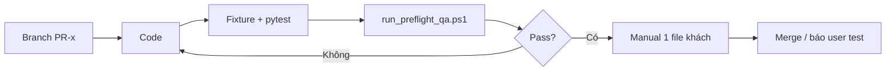

# Kế hoạch chi tiết — Lấp gap PitStop Pro cho PrynX

| Thuộc tính | Giá trị |
|------------|---------|
| **Dự án** | PrynX (`D:\pdfcompare`) |
| **Phiên bản kế hoạch** | 1.0 |
| **Ngày** | 18/06/2026 |
| **Trạng thái** | Draft — chờ duyệt trước khi code |
| **Chuẩn đối chiếu** | Enfocus PitStop Pro — workflow Offset / Catalogue VN |
| **Baseline code** | 16 rule preflight, 8 action, QA harness 46 test |

---

## 1. Mục tiêu

Đưa PrynX từ **~55% “PitStop core”** lên **~70% (Phase 1)**, **~80% (Phase 2)** bằng cách:

1. **Mở rộng Preflight** (rule + fix + profile) — không spam tool menu mới.
2. **Wire UI** cho tính năng backend đã có (Page Boxes, Ink Manager).
3. Giữ **một hub prepress** giống PitStop: kiểm tra → sửa → xem kẽm trong cùng workflow.

**Không nằm trong phạm vi ngắn hạn:** Trapping spread/choke thật, Certified PDF/GTS, Global Change đầy đủ (Phase 3 / R&D).

---

## 2. Nguyên tắc đặt tính năng (bắt buộc)

```
┌────────────────────────────────────────────────────────────────┐
│ Kiểu 1: Tab độc lập (toolRegistry)                             │
│   → Chỉ workflow tách hẳn: Preflight tab, Compare, Dieline     │
├────────────────────────────────────────────────────────────────┤
│ Kiểu 2: Sidebar ImpositionTab (focusFeature + PreprocessingRouter) │
│   → Một bước trên file đang mở: Hairlines, PDF/X, Page Boxes  │
├────────────────────────────────────────────────────────────────┤
│ Kiểu 3: Panel Viewer (không entry menu)                        │
│   → QC song song: Output Preview, Layers, Soft Proof           │
├────────────────────────────────────────────────────────────────┤
│ Kiểu 4: Mở rộng Preflight (rule / action / profile)            │
│   → Lab, Rich black, Fix 1-click — KHÔNG tạo tool menu mới     │
└────────────────────────────────────────────────────────────────┘
```

**File đăng ký tool:** `desktop/src/lib/toolRegistry.ts`  
**Route sidebar:** `desktop/src/components/imposition-tools/sections/PreprocessingRouter.tsx`

---

## 3. Hiện trạng (đã xác minh trong code)

### 3.1 Preflight backend

| Thành phần | Vị trí |
|------------|--------|
| 16 rule | `backend/app/core/preflight_models.py` → `ALL_RULES` |
| Engine 2 phase | `backend/app/core/preflight_engine.py` |
| Rule mixins | `backend/app/core/preflight_rules/{colors,fonts,images,structure,ink}.py` |
| 8 action | `backend/app/core/action_engine.py` → `AVAILABLE_ACTIONS` |
| API | `backend/app/api/routes/preflight.py` (~30 endpoint) |

### 3.2 Preflight frontend

| Màn hình | Rule | Action | Bbox click |
|----------|------|--------|------------|
| `PreflightTab.tsx` | 16 | 6/8 | ❌ |
| `PreflightTool.tsx` (ImpositionTab) | 16 | 6/8 | ✅ |

### 3.3 Tool có code nhưng chưa vào menu

| Tool | File | Backend |
|------|------|---------|
| Page Boxes | `PageBoxesTool.tsx` | `page-boxes`, `add-bleed`, `auto-trim` |
| Ink Manager | `InkManagerTool.tsx` | `inks`, `convert-spot` |

### 3.4 QA & release gate

| Script | Mục đích |
|--------|----------|
| `backend/scripts/run_preflight_qa.ps1` | Pytest + golden trước build |
| `build_production.ps1` bước [0/5] | Tự chạy QA trước Nuitka/Tauri |
| `backend/tests/preflight_fixtures/` | 17 PDF + `expected_rules.json` |

---

## 4. Lộ trình tổng thể

| Phase | Thời gian ước tính | Mục tiêu | % PitStop core |
|-------|-------------------|----------|----------------|
| **Phase 1** | 1–2 tuần | UI wire + Fix wizard + rule mới cơ bản | ~70% |
| **Phase 2** | 2–3 tuần | Depth + profile + báo cáo PDF | ~80% |
| **Phase 3** | 1–2 tháng+ | Trap / Certified / Global Change | ~90%+ |

Mỗi hạng mục dưới đây = **1 PR** (branch riêng, merge sau khi QA pass).

---

## 5. Phase 1 — Chi tiết từng PR

### PR-1.1 — Wire Page Boxes + Ink Manager vào sidebar

**Kiểu:** 2 (sidebar ImpositionTab)  
**Effort:** 0.5 ngày · **Risk:** Thấp · **Phụ thuộc:** Không

#### Việc cần làm

| # | Task | File |
|---|------|------|
| 1 | Import + route `pageboxes`, `inkmanager` | `PreprocessingRouter.tsx` |
| 2 | Thêm `TOOL_HEADERS` (icon, title, desc VI) | `PreprocessingRouter.tsx` |
| 3 | Đăng ký 2 entry HomeTab / sidebar | `toolRegistry.ts` |
| 4 | `focusFeature`: `pageboxes`, `inkmanager` | `toolRegistry.ts` |

#### Entry đề xuất trong `toolRegistry`

```ts
// category: 'print'
{ focusFeature: 'pageboxes', title: 'Trim / Bleed (Page Boxes)', ... }
{ focusFeature: 'inkmanager', title: 'Ink Manager (Kẽm / Spot)', ... }
```

#### Tiêu chí hoàn thành (DoD)

- [ ] Mở ImpositionTab → sidebar thấy 2 tool mới
- [ ] Page Boxes: auto-trim + add-bleed chạy, `onFileFixed` cập nhật viewer
- [ ] Ink Manager: list spot/process, convert-spot tải file mới
- [ ] Không regression test preflight hiện có

#### Test

- Manual: 1 PDF thiếu bleed + 1 PDF có spot
- Auto: không bắt buộc PR này (chỉ wire UI)

---

### PR-1.2 — Fix 1-click theo issue (Fix wizard cơ bản)

**Kiểu:** 4 (mở rộng Preflight)  
**Effort:** 1–2 ngày · **Risk:** Thấp · **Phụ thuộc:** Không

#### Map rule → action (v1)

| `rule_id` | `action_id` | Ghi chú |
|-----------|-------------|---------|
| `COLOR_RGB_DETECTED` | `CONVERT_TO_CMYK` | |
| `COLOR_LAB_DETECTED` | `CONVERT_TO_CMYK` | Sau PR-1.4 |
| `COLOR_GRAY_DETECTED` | `CONVERT_TO_CMYK` | Sau PR-1.4 |
| `FONT_NOT_EMBEDDED` | `EMBED_FONTS` | UI hỏi Outline nếu user muốn |
| `TEXT_DETECTED` | `OUTLINE_FONTS` | |
| `TRANSPARENCY_DETECTED` | `FLATTEN_TRANSPARENCY` | |
| `IMAGE_HIGH_DPI` | `DOWNSCALE_IMAGES` | |
| `BLEED_MISSING` | — | Gợi ý mở Page Boxes (PR-1.1), chưa auto |
| `TAC_EXCEEDED` | — | Chỉ cảnh báo (PR-2.x) |

#### Backend

| # | Task | File |
|---|------|------|
| 1 | `RULE_FIX_MAP: dict[str, str]` | `backend/app/core/preflight_models.py` hoặc `preflight_fix_map.py` mới |
| 2 | `POST /preflight/fix-issue` body: `{ file_id, rule_id, issue_index? }` | `preflight.py` |
| 3 | Gọi `ActionEngine.execute` tương ứng | `action_engine.py` |
| 4 | Trả `FixResponse` giống `/fix` | `preflight.py` |

#### Frontend

| # | Task | File |
|---|------|------|
| 1 | Nút **「Sửa ngay」** trên issue có map | `PreflightTab.tsx`, `PreflightTool.tsx` |
| 2 | Confirm dialog cho `OUTLINE_FONTS` / `EMBED_FONTS` | Cả hai file |
| 3 | Sau fix: gọi lại `inspect` | Cả hai file |

#### Tiêu chí hoàn thành

- [ ] File `02_rgb_colorspace.pdf` → click Sửa → RGB biến mất sau inspect lại
- [ ] `03_live_text.pdf` → Outline → `TEXT_DETECTED` = 0
- [ ] Rule không có map → không hiện nút (hoặc hiện「Mở Page Boxes」cho bleed)

#### Test

```python
# backend/tests/test_preflight_fix_issue.py
def test_fix_issue_rgb_runs_convert_to_cmyk(...)
def test_fix_issue_unknown_rule_returns_400(...)
```

---

### PR-1.3 — PreflightTab: click issue → highlight bbox

**Kiểu:** 4  
**Effort:** 0.5 ngày · **Risk:** Thấp · **Phụ thuộc:** Không

#### Việc cần làm

| # | Task | File |
|---|------|------|
| 1 | State `highlightedIssue` | `PreflightTab.tsx` |
| 2 | `onClick` issue → `setHighlightedIssue({ page, bbox, ... })` | `PreflightTab.tsx` |
| 3 | Truyền `highlightBoxes` vào `AcrobatViewer` | `PreflightTab.tsx` |
| 4 | Copy pattern từ `ImpositionTab` + `PreflightTool` | Tham chiếu |

#### DoD

- [ ] Hành vi PreflightTab = PreflightTool về bbox
- [ ] Cập nhật `QA_CHECKLIST.md` mục D (PreflightTab bbox = ✅)

---

### PR-1.4 — Rule mới: Lab + Gray

**Kiểu:** 4  
**Effort:** 2 ngày · **Risk:** Trung bình · **Phụ thuộc:** PR-1.2 (map fix)

#### Rule mới

| Rule ID | Severity | Detect |
|---------|----------|--------|
| `COLOR_LAB_DETECTED` | warning | `/Lab` trong Resources; stream operator `k`/`K` nếu có |
| `COLOR_GRAY_DETECTED` | warning | `/DeviceGray`; ảnh Gray trong `_get_page_images` |

#### File sửa

| File | Thay đổi |
|------|----------|
| `preflight_models.py` | Thêm 2 rule vào `ALL_RULES` |
| `preflight_rules/colors.py` | `_check_lab_gray()` hoặc mở rộng `_check_page_colorspaces` |
| `preflight_engine.py` | Wire phase A/B |
| `generate_fixtures.py` | `18_lab_color.pdf`, `19_gray_colorspace.pdf` |
| `expected_rules.json` | Golden |
| `PreflightTab.tsx`, `PreflightTool.tsx` | 18 rule trong `INSPECT_RULES` / `RULES` |
| `RULE_FIX_MAP` | Lab/Gray → `CONVERT_TO_CMYK` |

#### DoD

- [ ] Golden test 2 fixture pass
- [ ] `run_preflight_qa.ps1` → 0 failed
- [ ] Frontend parity 18 rule cả 2 tab

---

### PR-1.5 — Rule mới: Rich Black

**Kiểu:** 4  
**Effort:** 2–3 ngày · **Risk:** Trung bình · **Phụ thuộc:** Không

#### Spec rule

| Thuộc tính | Giá trị mặc định |
|------------|------------------|
| `rule_id` | `RICH_BLACK_DETECTED` |
| Điều kiện | K ≥ 95% **và** C+M+Y > `rich_black_cmy_threshold` (mặc định 5%) |
| Severity | warning |
| `auto_fixable` | `false` (chỉ cảnh báo, giống nhiều profile PitStop) |
| API param | `rich_black_cmy_threshold: int = 5` trong `inspect` |

#### Cách detect (đề xuất v1)

1. Quét content stream tìm toán tử `k`/`K` (CMYK fill/stroke) với thành phần K cao và CMY > 0.
2. Fallback: sample qua `SeparationEngine` @ DPI thấp nếu stream parse không đủ.

#### File

| File | Thay đổi |
|------|----------|
| `preflight_rules/colors.py` hoặc `ink.py` | `_check_rich_black()` |
| `preflight_engine.py` | Wire + MP `page_nums` |
| Fixture `20_rich_black.pdf` | ReportLab CMYK đen giàu |
| Tests | Unit + golden |

#### DoD

- [ ] Fixture rich black báo đúng; file CMYK đen thuần (K only) không báo

---

### PR-1.6 — Bổ sung 2 action vào PreflightTab/Tool

**Kiểu:** 4  
**Effort:** 0.5 ngày · **Risk:** Thấp

Thêm vào `ACTIONS` array:

- `FIX_HAIRLINES`
- `SET_BLACK_OVERPRINT`

Cả `PreflightTab.tsx` và `PreflightTool.tsx` → **8/8 action** đồng bộ backend.

---

### PR-1.7 — Đồng bộ tài liệu & QA Phase 1

| File | Cập nhật |
|------|----------|
| `backend/tests/preflight_fixtures/QA_CHECKLIST.md` | 18–19 rule, fix 1-click, bbox PreflightTab |
| `backend/tests/preflight_fixtures/README.md` | Fixture mới |
| `docs/KE_HOACH_GAP_PITSTOP.md` | Đánh dấu Phase 1 done |

**Gate Phase 1:** `run_preflight_qa.ps1` + manual checklist C1 (file khách) ít nhất 1 lần.

---

## 6. Phase 2 — Chi tiết từng PR

### PR-2.1 — Transparency depth (blend, SMask, opacity)

**Effort:** 4–5 ngày · **Risk:** Trung bình-cao

| Rule mới (đề xuất) | Mô tả |
|--------------------|-------|
| `BLEND_MODE_DETECTED` | Multiply, Screen, … trong ExtGState / content |
| `SOFT_MASK_DETECTED` | `/SMask` trên image hoặc form |

**File chính:** `preflight_rules/structure.py`, mở rộng scan content stream.

**Không** gộp vào `TRANSPARENCY_DETECTED` cũ — giữ backward compatible, thêm rule mới.

---

### PR-2.2 — Overprint sai (chữ trắng, knockout)

**Effort:** 2–3 ngày

| Rule mới | Mô tả |
|----------|-------|
| `OVERPRINT_WHITE_TEXT` | Text fill trắng + `/OP true` |
| `OVERPRINT_KNOCKOUT_RISK` | (tùy chọn) CMY overprint trên nền đen |

Cần kết hợp pdfplumber text + màu + ExtGState.

---

### PR-2.3 — Profile Preflight tùy chỉnh (JSON)

**Kiểu:** 4 — section trong Preflight, **không tab mới**  
**Effort:** 3–4 ngày

#### Schema profile (v1)

```json
{
  "name": "Offset VN - Xưởng A",
  "rules": ["COLOR_RGB_DETECTED", "..."],
  "tac_threshold": 300,
  "rich_black_cmy_threshold": 5,
  "low_res_dpi": 200,
  "high_res_dpi": 600
}
```

| # | Task | File |
|---|------|------|
| 1 | Lưu/đọc profile | `desktop/src/lib/preflightProfileManager.ts` (mới) |
| 2 | UI dropdown preset + 「Lưu profile」 | `PreflightTab.tsx`, `PreflightTool.tsx` |
| 3 | Gửi params trong `POST /inspect` | API đã hỗ trợ `tac_threshold`; mở rộng thêm |

**Chưa làm v1:** Import file `.ppp` PitStop.

---

### PR-2.4 — Báo cáo Preflight PDF

**Kiểu:** 4 — nút trong PreflightTab  
**Effort:** 3–5 ngày

| # | Task | File |
|---|------|------|
| 1 | `PreflightReportPdfGenerator` | `backend/app/core/preflight_report_pdf.py` (mới) |
| 2 | `GET /preflight/report-pdf/{file_id}` hoặc POST với report cache | `preflight.py` |
| 3 | Nút 「Xuất báo cáo PDF」 | `PreflightTab.tsx` |

Nội dung báo cáo: tên file, ngày, tóm tắt error/warning/info, bảng issue (rule, trang, mô tả).

Thư viện: ReportLab (đã có trong project cho fixture).

---

### PR-2.5 — Bleed: gợi ý fix từ issue

**Effort:** 1 ngày · **Phụ thuộc:** PR-1.1, PR-1.2

- `BLEED_MISSING` → nút 「Mở Page Boxes」deep-link `focusFeature: pageboxes`
- Tùy chọn v2: action `ADD_BLEED` trong `AVAILABLE_ACTIONS`

---

## 7. Phase 3 — R&D (chỉ lên kế hoạch sơ bộ)

| Hạng mục | Effort | Ghi chú |
|----------|--------|---------|
| Trapping spread/choke | 3–6 tuần | Cần thuật toán riêng hoặc tích hợp GS/Ardith; nâng cấp `TrapPresetsTool` |
| Certified PDF/X (GTS) | 2–4 tuần | OutputIntent, ID, workflow export |
| Global Change | 4+ tuần | Query object + sửa hàng loạt theo điều kiện |
| Type 3 font / JavaScript / Form | 1–2 tuần/rule | Rule đơn giản trong `structure.py` |

**Không bắt đầu Phase 3** cho đến khi Phase 1 gate pass + ít nhất 2 sprint manual QA file khách.

---

## 8. Ma trận file — Phase 1 (quick reference)

```
backend/
  app/core/
    preflight_models.py          ← ALL_RULES, RULE_FIX_MAP
    preflight_engine.py          ← wire rule mới
    preflight_rules/
      colors.py                  ← Lab, Gray, Rich black
    action_engine.py             ← (ít đổi)
  app/api/routes/
    preflight.py                 ← /fix-issue, params inspect
  tests/
    test_preflight_fix_issue.py  ← mới
    preflight_fixtures/          ← fixture 18–20
    preflight_golden/            ← golden update

desktop/src/
  lib/toolRegistry.ts            ← pageboxes, inkmanager
  components/
    PreflightTab.tsx             ← fix 1-click, bbox, 8 action, 18+ rule
    preprocess-tools/
      PreflightTool.tsx          ← đồng bộ PreflightTab
    imposition-tools/sections/
      PreprocessingRouter.tsx    ← wire 2 tool
```

---

## 9. Quy trình làm việc mỗi PR



1. **Không** merge nếu `run_preflight_qa.ps1` fail (trừ skip TAC khi thiếu GS trên CI khác).
2. Rule mới **bắt buộc** có fixture PDF + golden.
3. UI thay đổi **cả** `PreflightTab` + `PreflightTool`.
4. Không đổi `build_production.ps1` trừ khi thêm dependency pip mới.

---

## 10. Quyết định cần bạn chốt trước Phase 1

| # | Câu hỏi | Đề xuất mặc định | Ảnh hưởng |
|---|---------|------------------|-----------|
| 1 | Font lỗi: Fix 1-click **Embed** hay hỏi user? | Embed mặc định + dialog「Outline thay thế?」 | PR-1.2 |
| 2 | Rich black: K≥95%, CMY>5%? | Có | PR-1.5 |
| 3 | Profile JSON lưu ở đâu? | `%APPDATA%/PrynX/preflight-profiles/` | PR-2.3 |
| 4 | Phase 1 có làm hết PR-1.1→1.6 hay chỉ 1.1→1.3 trước? | Full Phase 1 | Timeline |
| 5 | Tên tool Page Boxes trên menu? | 「Trim / Bleed (Page Boxes)」 | PR-1.1 |

Ghi chú quyết định của bạn vào mục **11** bên dưới sau khi duyệt.

---

## 11. Nhật ký duyệt kế hoạch

| Ngày | Người duyệt | Quyết định | Ghi chú |
|------|-------------|------------|---------|
| | | ☐ Đồng ý Phase 1 full | |
| | | ☐ Chỉ PR-1.1 → 1.3 trước | |
| | | ☐ Điều chỉnh: _______________ | |

---

## 12. Thứ tự thực hiện đề xuất (sau khi duyệt)

```
Tuần 1:
  PR-1.1  Wire Page Boxes + Ink Manager
  PR-1.3  PreflightTab bbox
  PR-1.2  Fix 1-click
  PR-1.6  8 action đồng bộ

Tuần 2:
  PR-1.4  Lab + Gray rules
  PR-1.5  Rich black rule
  PR-1.7  QA doc + gate Phase 1
```

---

## 13. Liên kết tài liệu liên quan

| Tài liệu | Đường dẫn |
|----------|-----------|
| Spec preflight depth (đã làm) | `.kiro/specs/preflight-depth-upgrade/` |
| QA checklist | `backend/tests/preflight_fixtures/QA_CHECKLIST.md` |
| Bảng map PitStop (chat) | Tham chiếu khi implement rule mới |
| Kiến trúc desktop | `desktop/ARCHITECTURE.md` |
| Context tổng | `OVERALL CONTEXT.md` |

---

## 14. Tóm tắt cho người duyệt

| Câu hỏi | Trả lời |
|---------|---------|
| Có tạo nhiều tool menu mới không? | **Không** — chỉ 2 wire (Page Boxes, Ink Manager) |
| Phần lớn effort ở đâu? | **Mở rộng Preflight** (rule + fix + profile) |
| Bao lâu thấy kết quả? | **~3–5 ngày** nếu làm PR-1.1→1.3 |
| Rủi ro lớn nhất? | Rich black detect (PR-1.5), Transparency depth (Phase 2) |
| Ai test? | Auto QA + bạn chạy 1 file khách/sprint |

---

*File này là single source of truth cho gap PitStop cho đến khi cập nhật version 1.1.*