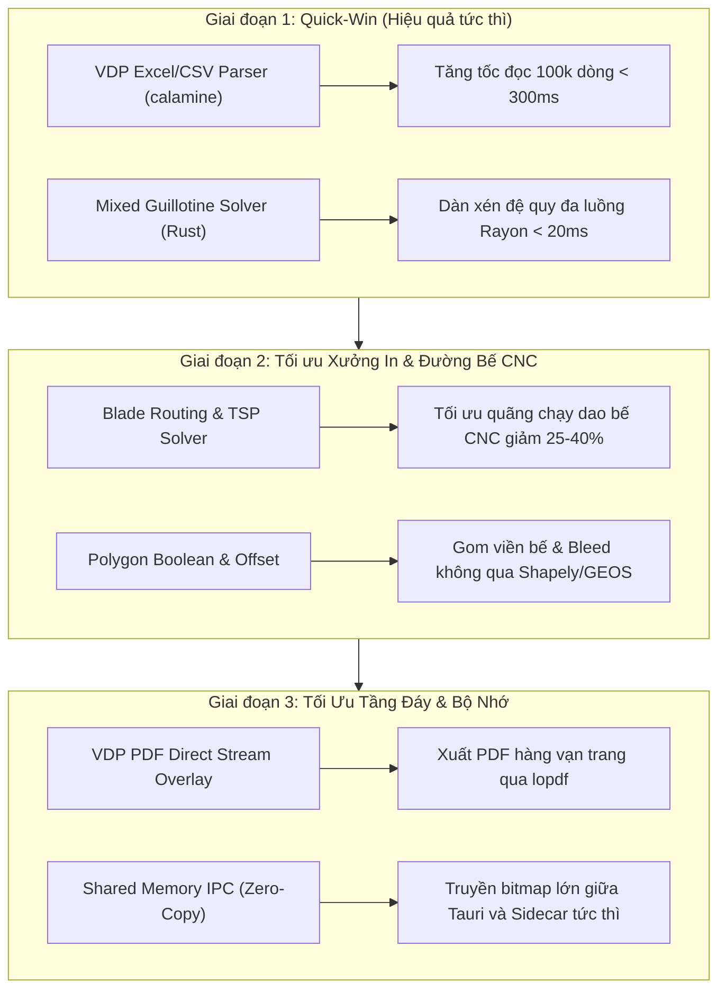

# Kế hoạch Nâng Cấp Hiệu Năng PrynX Bằng Rust & C++

Tài liệu này vạch ra lộ trình kỹ thuật chi tiết để chuyển đổi các điểm nghẽn tính toán (CPU bottlenecks & GIL contention) từ Python sang Rust và C++, dựa trên phân tích trực tiếp từ mã nguồn thực tế của PrynX.

---

## 1. Mục Tiêu & Nguyên Tắc Cốt Lõi

1. **Không viết lại toàn bộ**: Giữ nguyên kiến trúc 3 tầng: **Tauri (UI) + FastAPI Sidecar (Điều phối/AI) + Rust (Toán nặng)**. Chỉ chuyển đổi các module hình học, parser dữ liệu lớn và thuật toán đệ quy.
2. **Bảo toàn 100% hợp đồng dữ liệu**: Các hàm Rust mới trả về dữ liệu tương thích hoàn toàn với schema hiện tại (vd: `RecordTable`, `MixedGuillotinePlan`, `CutModel`), không làm ảnh hưởng đến Frontend React.
3. **Thân thiện phần cứng (Quy tắc PrynX)**: Tận dụng đa luồng Rayon/SIMD khi máy có RAM $\ge 16\text{GB}$, tự động co giãn tài nguyên trên máy yếu ($<8\text{GB}$ hoặc $<16\text{GB}$).
4. **Kiểm thử đối chứng 1:1**: Mọi thuật toán chuyển sang Rust đều phải vượt qua bộ test golden master hiện tại của Python trước khi đưa vào sản xuất.

---

## 2. Lộ Trình Triển Khai 3 Giai Đoạn



---

## 3. Giai Đoạn 1: Quick-Win — Tác Động Lớn, Ít Rủi Ro Nhất

### 3.1. Bộ Đọc Nguồn Dữ Liệu VDP Siêu Tốc (`vdp_datasource`)

* **Điểm nghẽn hiện tại**: [`backend/app/workers/vdp_datasource.py`](file:///d:/pdfcompare/backend/app/workers/vdp_datasource.py) dùng `openpyxl` và `csv` của Python. Khi đọc file Excel dữ liệu biến đổi 50.000 – 100.000 dòng (tem serial, mã trúng thưởng), Python mất từ **8 – 15 giây** và ngốn 400–600MB RAM.
* **Giải pháp kỹ thuật**:
  - Thêm dependency `calamine = "0.26"` và `csv = "1.3"` vào crate [`native/Cargo.toml`](file:///d:/pdfcompare/native/Cargo.toml).
  - Tạo module mới: [`native/src/vdp_parser.rs`](file:///d:/pdfcompare/native/src/vdp_parser.rs).
  - Xuất hàm PyO3:
    ```rust
    #[pyfunction]
    fn parse_vdp_table(file_path: &str, sheet_name: Option<&str>) -> PyResult<PyRecordTable>
    ```
  - Xử lý các quy tắc nghiệp vụ ngành in:
    - Tự động nhận diện encoding: `utf-8-sig`, `utf-8`, `windows-1258` (tiếng Việt TCVN/VNI).
    - Tự động nhận diện delimiter: dấu phẩy, chấm phẩy, tab.
    - Xử lý ô gộp (merged cells): ô góc trên-trái giữ giá trị, các ô còn lại để rỗng theo chuẩn in ấn.
  - Tích hợp vào Python: [`backend/app/workers/vdp_datasource.py`](file:///d:/pdfcompare/backend/app/workers/vdp_datasource.py) ưu tiên gọi hàm native Rust; nếu gặp lỗi fallback an toàn về `openpyxl`.
* **Kết quả dự kiến**:
  - Thời gian parse file Excel 100.000 dòng giảm từ ~12s xuống còn **~250ms** (nhanh gấp ~45 lần).
  - RAM tiêu thụ giảm 70%.

---

### 3.2. Chuyển Đổi Thuật Toán Bình Cắt Xén (`mixed_guillotine`) Sang `imposition_core`

* **Điểm nghẽn hiện tại**: [`backend/app/workers/mixed_guillotine.py`](file:///d:/pdfcompare/backend/app/workers/mixed_guillotine.py) dài gần 2.000 dòng Python thuần. Đây là thuật toán hình học đệ quy, duyệt các nhánh cắt xén (guillotine cuts), tính toán sắp xếp zone, đánh giá candidate theo tiêu chí: ít đường cắt nhất, dư thừa nhỏ nhất, gom bản kẽm tối ưu. Với 30–50 con tem khác kích thước, Python mất vài giây để tìm phương án.
* **Giải pháp kỹ thuật**:
  - Chuyển toàn bộ cấu trúc dữ liệu sang crate [`imposition_core`](file:///d:/pdfcompare/imposition_core/src):
    - `ProductSpec`, `Rect`, `GuillotinePlan`, `Candidate`, `CutLine`.
  - Tạo submodule: `imposition_core/src/guillotine/` gồm:
    - `solver.rs`: Thuật toán nhánh cận tìm vết cắt ngang/dọc đệ quy.
    - `candidate.rs`: Chấm điểm phương án (score, excess tolerance, số lượng nhát dao).
    - `duplex.rs`: Xử lý lật trang (flip_edge long/short) và lề đối xứng 2 mặt.
  - Áp dụng **Rayon**: Cho phép thử nghiệm đồng thời hàng chục hoán vị sắp xếp khác nhau trên tất cả nhân CPU có sẵn.
  - Cung cấp PyO3 wrapper trong [`native/src/imposition/guillotine_py.rs`](file:///d:/pdfcompare/native/src/imposition/mod.rs) trả về JSON plan tương thích 100% với `mixed-guillotine/v1`.
* **Kết quả dự kiến**:
  - Thời gian tính toán dàn xén phức tạp giảm từ 2–4 giây xuống còn **dưới 15 mili-giây**.
  - Tính năng preview trên giao diện phản hồi tức thì theo thời gian thực (real-time 60fps khi kéo slider).

---

## 4. Giai Đoạn 2: Tối Ưu Xưởng In & Gia Công Đường Bế CNC

### 4.1. Bộ Tối Ưu Quãng Chạy Dao Máy Bế CNC (TSP & Blade Routing)

* **Điểm nghẽn hiện tại**: [`backend/app/workers/cut_export/blade_routing.py`](file:///d:/pdfcompare/backend/app/workers/cut_export/blade_routing.py) và [`backend/app/workers/cutline_machine_path.py`](file:///d:/pdfcompare/backend/app/workers/cutline_machine_path.py) xử lý đường cắt cho máy cắt bế phẳng (Zünd, iEcho, JWEI). Khi tờ in chứa 200–500 con tem, việc tìm thứ tự cắt sao cho dao ít nhấc lên nhất và chạy quãng đường không cắt ngắn nhất là bài toán TSP (Người giao hàng). Python hiện chỉ chạy thuật toán tham lam đơn giản vì sợ treo app.
* **Giải pháp kỹ thuật**:
  - Viết module `cut_optimizer` trong Rust:
    - Hiện thực giải thuật tối ưu hóa hành trình (Heuristic 2-Opt / Lin-Kernighan) cho đồ thị các đường bế kín/hở.
    - Phân chia dao tự động cho máy 2 đầu cắt (Dual-head D1/D2/S) theo logic cột và cân bằng tải (load-balancing giữa 2 đầu dao).
    - Tính bù góc xoay tiếp tuyến (tangent knife lead-in / overcut) theo cấu hình từng loại vật liệu (Decal sữa, carton sóng, decal phản quang).
* **Kết quả dự kiến**:
  - Quãng đường dao chạy không tải (nhấc dao chạy trên không) giảm **30% – 50%**.
  - Rút ngắn thời gian máy cắt bế chạy tại xưởng in thực tế từ 10 phút xuống còn 6–7 phút mỗi mẻ hàng.

---

### 4.2. Hợp Nhất Đa Giác & Bù Lề Tràn Viền Native (Clipper2 / Cavalier Contours)

* **Điểm nghẽn hiện tại**: Trong [`backend/app/workers/sticker_engine.py`](file:///d:/pdfcompare/backend/app/workers/sticker_engine.py) và [`backend/app/workers/nup_diecut.py`](file:///d:/pdfcompare/backend/app/workers/nup_diecut.py), các bước: Marching Squares $\rightarrow$ `shapely.ops.unary_union` $\rightarrow$ `polygon.buffer(bleed_offset)` $\rightarrow$ RDP simplification phải luân chuyển qua lại giữa NumPy array, C-GEOS pointer và Python objects.
* **Giải pháp kỹ thuật**:
  - Tích hợp crate `clipper2` (hoặc `cavalier_contours`) vào [native](file:///d:/pdfcompare/native/src).
  - Đóng gói toàn bộ chu trình xử lý hình học đường bế: Nhận mask nhị phân $\rightarrow$ Trích xuất contour $\rightarrow$ Offset bù viền/xén $\rightarrow$ Rút gọn đỉnh (RDP & Arc fitting) $\rightarrow$ Trả về vector cubic Bézier chuẩn trong một lời gọi hàm Rust duy nhất.
* **Kết quả dự kiến**:
  - Loại bỏ hoàn toàn overhead tạo hàng chục ngàn object Python trung gian.
  - Tốc độ sinh đường bế cho cụm tem dày đặc tăng 4–8 lần.

---

## 5. Giai Đoạn 3: Tối Ưu Tầng Đáy & Bộ Nhớ (Zero-Copy Architecture)

### 5.1. Ghép Luồng PDF Biến Đổi VDP Trực Tiếp (PDF Stream-Level Overlay)

* **Điểm nghẽn hiện tại**: [`backend/app/workers/vdp_engine.py`](file:///d:/pdfcompare/backend/app/workers/vdp_engine.py) hiện dùng `reportlab` sinh trang overlay rồi dùng `pikepdf` ghép từng trang vào background. Khi xuất 20.000 trang, Python phải mở, ghi, ghép 20.000 lần qua đĩa hoặc buffer ram.
* **Giải pháp kỹ thuật**:
  - Sử dụng [`print_engine`](file:///d:/pdfcompare/print_engine/Cargo.toml) (đã có sẵn `lopdf`):
    - Đọc file template một lần duy nhất, trích xuất cấu trúc `Form XObject`.
    - Tạo luồng content stream trực tiếp bằng Rust, chèn barcode/text vector dạng toán tử PDF nguyên bản (`Tf`, `Tj`, `re`, `f`).
    - Nối các trang mới vào bảng xref mà không cần giải mã hoặc render lại toàn bộ trang nền.
* **Kết quả dự kiến**:
  - Thời gian xuất file in 10.000 trang tem serial giảm từ 2–3 phút xuống **dưới 15 giây**.

---

### 5.2. Truyền Dữ Liệu Bộ Nhớ Chia Sẻ (Shared Memory / Mmap IPC)

* **Điểm nghẽn hiện tại**: Giao tiếp giữa frontend Tauri (Rust webview) và Sidecar (Python FastAPI) hiện qua HTTP Localhost `127.0.0.1:8321`. Với file in khổ lớn (Decal 1m x 2m hoặc file TIFF 300dpi hàng trăm MB), việc gửi qua HTTP/Base64 tốn RAM gấp 2–3 lần.
* **Giải pháp kỹ thuật**:
  - Thiết lập kênh Shared Memory bằng crate `shared_memory` hoặc file memory-mapped (`memmap2`) trên Windows (`Local\PrynX_IPC_*`).
  - Giao tiếp qua HTTP chỉ gửi metadata (tọa độ, kích thước buffer, handle bộ nhớ); dữ liệu pixel thô được đọc trực tiếp từ RAM chung.
* **Kết quả dự kiến**:
  - Giảm độ trễ truyền dữ liệu preview 500MB từ ~400ms xuống **dưới 1ms** (zero-copy), triệt tiêu hiện tượng lag khi zoom/pan bản vẽ lớn.

---

## 6. Kế Hoạch Kiểm Thử & Kiểm Soát Rủi Ro (Verification Plan)

| Hạng mục | Phương pháp kiểm thử | Tiêu chí đạt |
|---|---|---|
| **VDP Parser** | Property-based testing so sánh song song `calamine` vs `openpyxl` trên 50 file Excel/CSV mẫu | Khớp 100% dữ liệu từng ô, đúng encoding có dấu tiếng Việt |
| **Mixed Guillotine** | Chạy toàn bộ test suites hiện tại: `pytest backend/tests/test_mixed_guillotine*.py` | Toàn bộ snapshot layout, tọa độ nhát cắt và số lượng tem khớp 100% với Python |
| **Blade Routing** | Kiểm tra file xuất DXF/PLT/PDF Spot với các mẫu tem phức tạp | Đường dao liên tục, không phạm góc tem, đúng gán nhãn dao D1/D2 |
| **Hiệu năng & RAM** | Benchmark trước/sau trên máy RAM 8GB và máy RAM 32GB | Đạt mốc thời gian mục tiêu, không có rò rỉ bộ nhớ (memory leak) |

---

## 7. Hành Động Khuyến Nghị Tiếp Theo

Để đảm bảo an toàn tuyệt đối và thấy ngay hiệu quả, đề xuất bắt đầu với **Giai đoạn 1.1: VDP Excel Parser bằng Rust**:
1. Thêm `calamine` vào `native/Cargo.toml`.
2. Viết parser Rust và export qua PyO3.
3. Chạy benchmark so sánh trực tiếp trên file test thực tế của xưởng.
