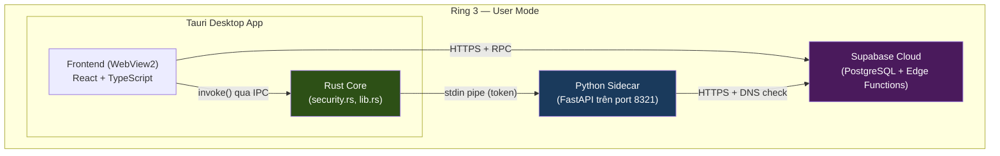
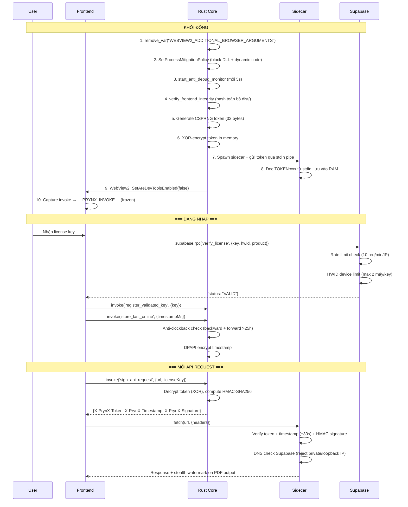

# PrynX Security Architecture — Tài liệu tổng kết

> **Phiên bản:** 3.2 — Hardening hiện hành 2026-09-04 (xem **Mục 27**)
> **Cập nhật:** 2026-09-04
> **Mục đích:** Đọc 1 lần hiểu hết, phục vụ tham chiếu lâu dài
>
> ⚠️ **Đọc Mục 27 trước để lấy trạng thái hiện hành.** Các Mục 1–26 là chuỗi snapshot lịch sử,
> được giữ để truy vết quyết định và có thể chứa lifecycle/test count đã bị supersede. Bản 2.0 mô tả thiết kế *dự kiến*; audit
> 2026-06-12 (Mục 8) phát hiện nhiều lớp release-only **chưa từng chạy** + lỗ hổng server.
> Re-audit 2026-06-17 (Mục 9) trace lại toàn bộ sau khi vá, bổ sung các hardening mới
> (watermark phủ toàn bộ output, fs deny, token persist offline, DEV_MODE fail-closed,
> public-key trust-anchor, security.log) và **làm rõ biên giới bảo mật thật**.
>
> **Phạm vi 2 repo:** phần client/sidecar ở `d:\pdfcompare`; phần **quản lý license + DB +
> edge function** ở repo riêng `d:\printsolutions-main` (Supabase project `ryvyuxjgdcvoxujqmggm`,
> dùng CHUNG cho mọi sản phẩm: prynx, các script .jsx, PrintMonitorApp...).

---

## 1. Kiến trúc tổng quan



### Thành phần

| Thành phần | Ngôn ngữ | Vai trò bảo mật |
|---|---|---|
| **Rust Core** (`security.rs`, `lib.rs`) | Rust (compiled) | Token management, HMAC signing, DPAPI, anti-debug, process mitigation |
| **Frontend** (`main.tsx`, `api.ts`, `useAuthStore.ts`) | TypeScript (bundled) | License UI, invoke freeze, clock checks |
| **Python Sidecar** (`license_guard.py`) | Python (Nuitka compiled) | Request validation, DNS check, API gating |
| **Supabase** | PostgreSQL | License storage, HWID tracking, rate limiting |
| **Build Pipeline** (`build_production.ps1`) | PowerShell | Integrity hash generation |

---

## 2. `[HISTORICAL · SUPERSEDED BY §27]` Luồng xác thực (Authentication Flow)

> Sơ đồ dưới là snapshot thiết kế cũ: direct RPC, payload HMAC đơn giản và trạng thái process
> mitigation không mô tả current source. Luồng hiện hành dùng Edge/token v2, session key theo
> sidecar generation và body commitment; xem §27 cùng threat model trước khi dùng làm authority.



---

## 3. `[HISTORICAL · SUPERSEDED BY §27]` Bảng 15 lớp phòng thủ

> Các dòng/path/count dưới được giữ để truy vết lịch sử, không phải inventory current-source.

### Layer 1 — Giao tiếp (Communication Security)

| # | Tấn công | Phòng thủ | File | Dòng | Chi tiết |
|---|---|---|---|---|---|
| **1** | Gọi API từ bên ngoài | CSPRNG token (32 bytes) mỗi phiên | [security.rs](file:///d:/pdfcompare/desktop/src-tauri/src/security.rs) | L221+ | Token sinh bằng `rand::thread_rng()`, truyền qua stdin |
| **2** | Replay request cũ | HMAC-SHA256 + timestamp ±30s | [security.rs](file:///d:/pdfcompare/desktop/src-tauri/src/security.rs) | L210-220 | `sign_payload = "{timestamp}:{url_path}"` |
| **3** | Đọc token từ env var | Stdin pipe, không file/env | [lib.rs](file:///d:/pdfcompare/desktop/src-tauri/src/lib.rs) | L615-640 | `child.write("TOKEN:xxx\n")` |

### Layer 2 — License Validation

| # | Tấn công | Phòng thủ | File | Dòng | Chi tiết |
|---|---|---|---|---|---|
| **4** | MITM Supabase response | DNS check: reject loopback/private IP | [license_guard.py](file:///d:/pdfcompare/backend/app/core/license_guard.py) | L170-185 | `ipaddress.ip_address(resolved).is_loopback` |
| **5** | Hosts file redirect | DNS check (vector 4 covers) + public IP required | [license_guard.py](file:///d:/pdfcompare/backend/app/core/license_guard.py) | L170-185 | VPS public IP vẫn cần valid TLS cert |
| **6** | Chia sẻ key nhiều máy | HWID device limit (max 2) | [supabase_migration.sql](file:///d:/pdfcompare/backend/supabase_security_migration.sql) | L50-120 | `COUNT(DISTINCT machine_id) >= max_devices` |
| **7** | Brute-force Supabase RPC | Rate limit 10 req/min/IP | [supabase_migration.sql](file:///d:/pdfcompare/backend/supabase_security_migration.sql) | L70-80 | + `REVOKE ALL ON licenses FROM anon` |
| **21** | Client tự phong "đã hợp lệ" | **Token ký Ed25519 do server cấp** (xem Mục 8.3) | [license_guard.py](file:///d:/pdfcompare/backend/app/core/license_guard.py) `verify_license_token()` | — | Edge function ký bằng private key (Supabase secret); sidecar verify bằng public key nhúng. Client crack không giả được. |

### Layer 3 — Offline / Clock Manipulation

| # | Tấn công | Phòng thủ | File | Dòng | Chi tiết |
|---|---|---|---|---|---|
| **8** | Lùi clock bypass grace | Anti-clockback: `new_ts + 5min < old_ts` → reject | [security.rs](file:///d:/pdfcompare/desktop/src-tauri/src/security.rs) | L320-325 | DPAPI encrypted timestamp |
| **9** | Tiến clock dần dần | Anti-forward-jump: `delta > 25h` → force online | [security.rs](file:///d:/pdfcompare/desktop/src-tauri/src/security.rs) | L330-340 | + [useAuthStore.ts](file:///d:/pdfcompare/desktop/src/stores/useAuthStore.ts) L307-320 |
| | | | [useAuthStore.ts](file:///d:/pdfcompare/desktop/src/stores/useAuthStore.ts) | L297-305 | `lastOnline > now + 60_000` = backward detected |

### Layer 4 — Code Integrity

| # | Tấn công | Phòng thủ | File | Dòng | Chi tiết |
|---|---|---|---|---|---|
| **10** | Sửa sidecar binary | SHA-256 hash at build time | [lib.rs](file:///d:/pdfcompare/desktop/src-tauri/src/lib.rs) | L476-502 | `option_env!("PRYNX_SIDECAR_HASH")` |
| **11** | Sửa frontend JS/CSS | SHA-256 recursive hash toàn bộ `dist/` | [lib.rs](file:///d:/pdfcompare/desktop/src-tauri/src/lib.rs) | L505-595 | `sha256_directory()` hash mọi file + relative path |
| **12** | Python source reverse | Nuitka compile → native C binary | [build_production.ps1](file:///d:/pdfcompare/build_production.ps1) | L60-84 | `python -m nuitka --standalone --onefile` |

### Layer 5 — Runtime Protection (Anti-Tamper)

| # | Tấn công | Phòng thủ | File | Dòng | Chi tiết |
|---|---|---|---|---|---|
| **13** | WebView2 DevTools mở | `SetAreDevToolsEnabled(false)` + kill env var | [lib.rs](file:///d:/pdfcompare/desktop/src-tauri/src/lib.rs) | L588-596, L645-665 | `remove_var("WEBVIEW2_ADDITIONAL_BROWSER_ARGUMENTS")` |
| **14** | Ghi đè `invoke()` qua JS | Freeze `__TAURI__` + capture `__PRYNX_INVOKE__` | [main.tsx](file:///d:/pdfcompare/desktop/src/main.tsx) | L8-38 | `Object.freeze()` + `Object.defineProperty(writable:false)` |
| **15** | DLL injection (Frida) | `SetProcessMitigationPolicy` MicrosoftSignedOnly | [lib.rs](file:///d:/pdfcompare/desktop/src-tauri/src/lib.rs) | L640-685 | `ProcessSignaturePolicy` + `ProcessDynamicCodePolicy` |
| **16** | Debugger attach (x64dbg) | Anti-debug monitor mỗi 5s | [security.rs](file:///d:/pdfcompare/desktop/src-tauri/src/security.rs) | L130-220 | `IsDebuggerPresent` + `NtQueryInformationProcess(ProcessDebugPort)` |
| **17** | Hook DPAPI (Detours) | IAT hook detection | [security.rs](file:///d:/pdfcompare/desktop/src-tauri/src/security.rs) | L195-220 | Check `CryptUnprotectData` first byte ≠ `0xE9`/`0xFF`/`0xCC` |
| **18** | Scan RAM tìm token | XOR-masked token in memory | [security.rs](file:///d:/pdfcompare/desktop/src-tauri/src/security.rs) | L228-270 | `EncryptedToken { cipher, mask }`, decrypt chỉ khi `sign_api_request()` |

### Layer 6 — Truy vết (Forensics)

| # | Tấn công | Phòng thủ | File | Dòng | Chi tiết |
|---|---|---|---|---|---|
| **19** | Phát tán PDF crack | Stealth watermark: XMP + invisible text | [watermark.py](file:///d:/pdfcompare/backend/app/core/watermark.py) | L1-80 | Render mode 3 (invisible) + XMP prynx namespace |
| **20** | Hành vi đáng ngờ | Silent telemetry → Supabase `security_logs` | [useAuthStore.ts](file:///d:/pdfcompare/desktop/src/stores/useAuthStore.ts) | L121-140 | `logSecurityEvent('clock_manipulation', ...)` |

---

## 4. Ma trận tấn công → phòng thủ

```
Hacker biết dùng Fiddler (10 phút)
  └→ Chặn bởi: DNS check (#4) + cert mismatch

Hacker sửa hosts file (15 phút)
  └→ Chặn bởi: DNS check reject private IP (#5)

Hacker chỉnh clock lùi (2 phút)
  └→ Chặn bởi: Anti-clockback DPAPI (#8) + frontend check

Hacker chỉnh clock tiến (5 phút)
  └→ Chặn bởi: Forward-jump >25h → force online (#9)

Hacker mở DevTools (5 phút)
  └→ Chặn bởi: SetAreDevToolsEnabled(false) (#13) + env var killed (#13)

Hacker set WEBVIEW2_ADDITIONAL_BROWSER_ARGUMENTS (2 phút)
  └→ Chặn bởi: remove_var() trước WebView2 init (#13)

Hacker inject JS ghi đè invoke (10 phút)
  └→ Chặn bởi: Object.freeze + __PRYNX_INVOKE__ (#14)

Hacker sửa file JS trong dist/ (20 phút)
  └→ Chặn bởi: SHA-256 recursive hash toàn bộ dist/ (#11)

Hacker share key trên forum (0 phút)
  └→ Chặn bởi: HWID limit 2 máy/key (#6)

Hacker gọi Supabase RPC trực tiếp (15 phút)
  └→ Chặn bởi: Rate limit + REVOKE table access (#7)

Hacker dùng Process Monitor bắt token (30 phút)
  └→ Chặn bởi: Stdin pipe, token không chạm disk (#3)

Hacker dùng Cheat Engine scan RAM (30 phút)
  └→ Chặn bởi: ProhibitDynamicCode policy (#15) + XOR token (#18)

Hacker dùng Frida hook (2 giờ)
  └→ Chặn bởi: MicrosoftSignedOnly DLL policy (#15)

Hacker dùng x64dbg (1 giờ)
  └→ Chặn bởi: Anti-debug monitor 5s (#16) + ProcessDebugPort

Hacker hook DPAPI (2 giờ)
  └→ Chặn bởi: IAT hook detection (#17)

Hacker ReadProcessMemory (1 giờ)
  └→ Chặn bởi: XOR-masked token (#18), phải reverse XOR logic

Hacker viết kernel driver (10+ giờ)
  └→ ⚠️ KHÔNG CHẶN ĐƯỢC — giới hạn vật lý Ring 3
```

---

## 5. File map

```
d:\pdfcompare\
├── desktop\
│   ├── src\
│   │   ├── main.tsx                    ← __TAURI__ freeze + __PRYNX_INVOKE__
│   │   ├── lib\
│   │   │   ├── api.ts                  ← authenticatedFetch + captured invoke
│   │   │   └── supabase.ts             ← Supabase client (env-based URL)
│   │   └── stores\
│   │       └── useAuthStore.ts         ← License flow + clock checks + telemetry
│   └── src-tauri\
│       └── src\
│           ├── lib.rs                  ← Setup: env cleanup, mitigation, integrity, sidecar
│           └── security.rs             ← Token (XOR), HMAC, DPAPI, anti-debug, IAT check
├── backend\
│   ├── app\
│   │   ├── core\
│   │   │   ├── license_guard.py        ← Request validation + DNS check
│   │   │   └── watermark.py            ← Stealth PDF watermark
│   │   ├── workers\
│   │   │   ├── nup_engine.py           ← Watermark integration
│   │   │   ├── vdp_engine.py           ← Watermark integration
│   │   │   └── sticker_engine.py       ← Watermark integration
│   │   └── api\routes\
│   │       ├── imposition.py           ← License info passthrough
│   │       └── vdp.py                  ← License info passthrough
│   └── supabase_security_migration.sql ← Device limit + RLS + rate limit
└── build_production.ps1                ← Nuitka + integrity hash pipeline
```

---

## 6. Giới hạn đã biết

| Giới hạn | Lý do | Giải pháp lý thuyết |
|---|---|---|
| Kernel driver bypass | App chạy ở Ring 3, driver ở Ring 0 | Viết anti-cheat kernel driver (cần MS ký, $$$) |
| VPS + public IP giả Supabase | DNS check chỉ reject private IP | TLS certificate pinning trong Rust (cần `reqwest` crate) |
| ES module deep patch | `__PRYNX_INVOKE__` chỉ bảo vệ `invoke`, không bảo vệ toàn bộ Tauri API surface | Compile-time inline tất cả IPC calls |

---

## 7. So sánh với industry

| Tính năng | PrynX | Adobe CC | JetBrains | Game (Valorant) |
|---|---|---|---|---|
| Token-based auth | ✅ CSPRNG+HMAC | ✅ | ✅ | ✅ |
| Code integrity check | ✅ SHA-256 | ✅ | ✅ | ✅ |
| Anti-debug | ✅ Ring 3 | ✅ Ring 3 | ❌ | ✅ Ring 0 |
| DLL injection block | ✅ Mitigation Policy | ✅ | ❌ | ✅ Kernel driver |
| Memory encryption | ✅ XOR mask | ✅ VMProtect | ❌ | ✅ |
| Offline grace | ✅ 24h + clock check | ✅ 30 ngày | ✅ | N/A |
| Device limit | ✅ HWID | ✅ 2 máy | ✅ | N/A |
| Stealth watermark | ✅ XMP + invisible | ✅ | ❌ | N/A |
| Kernel driver | ❌ | ❌ | ❌ | ✅ |

**Kết luận (cập nhật 3.0):** Thiết kế đạt tầm sản phẩm thương mại. **Nhưng điểm thực tế = điểm thực thi.** Audit 2026-06-12 cho thấy nhiều lớp ở bảng trên là *thiết kế đúng nhưng từng không chạy* (release build lỗi `webview2_com` → toàn bộ lớp release-only chưa kích hoạt) và một lỗ server phá vỡ toàn bộ mục tiêu. Sau khi vá (Mục 8): **client-side ~7.5/10, server-side ~7/10 (sau khi vá RLS), tổng thể ~6.5–7/10.** Trần cố hữu của license cài máy khách là ~8 (kẻ có binary luôn lách được); cột "ngang Adobe/JetBrains" ở bảng so sánh là *về ý tưởng tính năng*, không phải mức kháng-crack thực tế.

---

## 8. Audit toàn diện 2026-06-12 — Phát hiện, bản vá & lớp mới

> Audit theo `.kiro/steering/audit-rules.md` (verify-to-ground-truth). Mọi mục dưới đây
> đều đã kiểm chứng bằng đọc code / chạy thử / test, không phỏng đoán.

### 8.1. Phát hiện nghiêm trọng (đã vá)

| # | Mức | Phát hiện (đã VERIFIED) | Bằng chứng | Trạng thái |
|---|---|---|---|---|
| A | 🔴 | **Release build KHÔNG biên dịch** — `lib.rs` dùng `webview2_com::...` nhưng crate không khai báo trong `Cargo.toml`. Hệ quả: TẤT CẢ lớp release-only (#10,#11,#13,#15,#16,#17,#18) **chưa từng chạy** trên bản đóng gói. | `cargo check --release` → `E0433 unresolved crate webview2_com` | ✅ Vá: thêm `webview2-com = "=0.38.2"` vào `[target.'cfg(windows)'.dependencies]`; build release sạch. |
| B | 🔴 | **Server: anon đọc được TOÀN BỘ bảng `licenses`** (mọi key + email khách của MỌI sản phẩm). RLS policy `"Anyone can verify licenses" USING(true)`. Xác nhận live: 45 dòng đọc được bằng anon key. | `GET /rest/v1/licenses` → `Content-Range: */45` | ✅ Vá: migration `20260212_fix_licenses_rls_critical.sql` (printsolutions-main). Sau vá: `*/0`. |
| C | 🟠 | **WebSocket không xác thực** — `ws.py` check biến env `_PRYNX_SIDECAR_TOKEN` không bao giờ được set → chấp nhận mọi kết nối. | `routes/ws.py` | ✅ Vá: dùng chung `verify_sidecar_signature()` (token + HMAC) qua query param. |
| D | 🟠 | **`write_debug_log` ghi file tuỳ ý** (vượt phạm vi capability fs); **shell `allow-execute`** cấp dư. | `lib.rs`, `capabilities/default.json` | ✅ Vá: confine vào `%APPDATA%\PrynX\logs`; gỡ `shell:allow-execute`, thêm `shell:allow-open`. |
| E | 🟠 | **Integrity checks vô hiệu**: `verify_sidecar_integrity` định nghĩa nhưng KHÔNG được gọi; cả 2 check no-op nếu không set hash lúc build. | `lib.rs` | ✅ Vá: wire `verify_sidecar_integrity` (an toàn, chỉ chặn khi hash lệch) + `build.rs` thêm `rerun-if-env-changed`. |
| F | 🟠 | **Edge function `license-verify` hỏng trên live** (gọi `verify_license` bản 5 tham số không tồn tại → HTTP 500). Ảnh hưởng PrintMonitorApp (sản phẩm dùng edge function này). | `PGRST202` khi gọi RPC 5-param | ✅ Vá: sửa edge function gọi RPC 3 tham số (đang tồn tại). Live: 500 → 200. |
| G | 🟢 | `DEV_MODE` tắt token/chữ ký (chỉ dev; bản đóng gói Tauri ép `DEV_MODE=false`). Dead code Rust (`generate_watermark`, `validate_license_local`). | `config.py`, `security.rs` | ✅ Vá: thêm cảnh báo khởi động backend; gỡ dead code. |

### 8.2. Đính chính (rút lại theo audit-rules)
- Ban đầu nghi bảng `orders` cũng lộ qua `USING(true)` → **SAI**: migration `021/002` đã thay bằng `"Owner or admin can read orders"`. Rút lại.
- `product_id='prynx'` nghi không tồn tại → **SAI**: `license_products` có `{"id":"prynx"}`. Rút lại.

### 8.3. Lớp mới #21 — Token license ký Ed25519 (server-authoritative)

**Vấn đề gốc:** trước đây client tự quyết hợp lệ (`register_validated_key` tin lời frontend; sidecar không re-verify vì không có Supabase creds). Patch JS là qua.

**Giải pháp (không đổi kiến trúc, dùng Supabase sẵn có, $0 hạ tầng):**
```
Frontend → edge function license-verify (Supabase)
            → RPC verify_license (3-param) → nếu VALID:
            → ký token Ed25519 bằng PRIVATE key (secret LICENSE_SIGNING_KEY)
            → trả {status, token}
Frontend lưu token → gắn header X-License-Token mỗi request
Sidecar (require_license) → verify_license_token():
            verify chữ ký bằng PUBLIC key NHÚNG SẴN + exp + ràng buộc machine/key
```
- **Token:** `<payload_b64url>.<sig_b64url>`; payload `{k:sha256(key)[:16], m:hwid, p:product, exp}`; ký trên chuỗi `payload_b64url`. TTL 2 giờ.
- **Bất khả giả:** private key chỉ ở Supabase secret; client chỉ có public key (verify). Client crack bỏ qua validate Supabase → không có token hợp lệ.
- **Files:** `backend/app/core/license_guard.py` (`verify_license_token`, `_LICENSE_PUBLIC_KEY_B64`, cờ `PRYNX_ENFORCE_LICENSE_TOKEN`); `desktop/src/stores/useAuthStore.ts` (lưu `licenseToken`); `desktop/src/lib/api.ts` (gắn header); `printsolutions-main/supabase/functions/license-verify/index.ts` (ký, noble ed25519).
- **Rollout 2 pha:** mặc định cờ TẮT → verify-nếu-có, KHÔNG chặn (client cũ không gãy). Sau khi ship client mới + thấy token chạy, đặt `PRYNX_ENFORCE_LICENSE_TOKEN=true` trong spawn sidecar (`lib.rs`) → bắt buộc.
- **Test:** 7 unit test (`tests/test_license_token.py`) + kiểm tra liên thông khóa thật (ký bằng private thật → verify bằng public nhúng) đều PASS. Token giả mạo (ký bằng khóa khác) bị từ chối.

### 8.4. Server-side (repo printsolutions-main) — đã kiểm chứng
- Mọi sản phẩm verify qua **RPC `verify_license` (SECURITY DEFINER, 3-param)** — script .jsx + LicenseBridge.ps1 + prynx gọi RPC trực tiếp; PrintMonitorApp gọi edge function. **Không sản phẩm nào đọc bảng `licenses` trực tiếp** → bản vá RLS an toàn cho tất cả.
- `verify_license` ký SECURITY DEFINER + chỉ `GRANT EXECUTE TO anon` (không cho đọc bảng) — mẫu đúng. Tự ghi `license_logs` trong context definer (không cần anon-insert policy).
- **KHÔNG** lộ `service_role` key ở client/repo (chỉ dùng trong edge function qua `Deno.env`). ✅

### 8.5. Trạng thái đã kiểm chứng (live + test)

| Hạng mục | Kết quả |
|---|---|
| RLS bảng licenses (anon) | 🔒 `*/0` (trước `*/45`) |
| RPC verify_license 3-param | ✅ chạy (`INVALID` cho key giả) |
| Edge function license-verify | ✅ HTTP 200 (trước 500); secret + deploy xong |
| Sidecar verify token Ed25519 | ✅ 7 test + liên thông khóa thật pass |
| Frontend gắn X-License-Token | ✅ typecheck sạch (best-effort, không gãy) |
| Backend test suite | ✅ 154 passed |
| `cargo check` release | ✅ sạch (sau vá webview2-com) |

### 8.6. Việc còn lại để token "có răng"
1. Đóng gói bản desktop mới (`build_production.ps1` — đã thêm `externalBin` để nhồi sidecar + tính 2 hash integrity) → ship cho khách.
2. Sau khi xác nhận token chạy: thêm `("PRYNX_ENFORCE_LICENSE_TOKEN","true")` vào spawn sidecar trong `lib.rs` → đóng gói lại.
3. **Rotate 45 key** đã từng phơi nhiễm (trong thời gian lỗ RLS mở).
4. (Tùy chọn, tốn phí) Code signing Authenticode (~$10/tháng Azure) để hết cảnh báo SmartScreen.
5. CI chặn `USING(true)` trên bảng nhạy cảm (ngăn lỗ RLS tái diễn).

### 8.7. Lưu ý vận hành
- **Private key** `LICENSE_SIGNING_KEY` chỉ nằm trong Supabase secret; file `.SECRET.txt` đã xóa. Mất secret này → phải sinh lại cặp khóa + cập nhật public key trong `license_guard.py` + deploy lại.
- Anon key bị hardcode trong mọi script (.jsx/PS1/Python) — bình thường với anon key public, **nhưng** đó là lý do bản vá RLS tối quan trọng: anon key ở khắp nơi.
- Tự động hóa triển khai: `printsolutions-main/TRIEN_KHAI_TOKEN.bat` (set secret + deploy + xóa file khóa).


---

## 9. Re-audit & Hardening 2026-06-17

> Trace lại ground-truth toàn bộ luồng sau các bản vá ở Mục 8, bổ sung hardening và
> **làm rõ biên giới bảo mật thật**. Mọi mục đều verify bằng đọc code + test (14/14 token
> test pass, `cargo check` sạch, `npm run typecheck` sạch, py_compile sạch).

### 9.1. Làm rõ QUAN TRỌNG: đâu là biên giới bảo mật THẬT

Trace `sign_api_request` (security.rs) + `register_validated_key`:

- "Rust license gate" (Gate 1 trong `sign_api_request`: kiểm key có trong `VALIDATED_KEYS`)
  **KHÔNG phải biên giới bảo mật**. Cache đó do **chính frontend nạp** qua
  `register_validated_key(key)`; Rust **không** tự re-verify với Supabase. Một client bị
  crack chỉ cần gọi `register_validated_key("bất_kỳ")` → `sign_api_request` ký HMAC hợp lệ.
- Tương tự, `X-PrynX-Token` (token sidecar) được trả về cho JS và gửi plaintext qua
  loopback → một local attacker xem được. XOR-mask chỉ chống scan RAM thô.

➡️ **Biên giới bảo mật THẬT DUY NHẤT = token Ed25519 verify ở sidecar** (`verify_license_token`,
Layer #21). Server ký bằng private key (Supabase secret), client không có private key nên
**không giả được token**. Mọi lớp client-side khác (Rust cache gate, HMAC token, XOR, anti-debug,
integrity) là **defense-in-depth** làm chậm/khó kẻ tấn công, KHÔNG phải lớp chặn tuyệt đối.

➡️ Do đó **toàn bộ độ kháng-crack rốt cuộc phụ thuộc vào: edge function `license-verify`
cấp token Ed25519 đều đặn + `PRYNX_ENFORCE_LICENSE_TOKEN=true`.** Cả hai điều kiện này
hiện ĐÃ có (xem 9.3). Đây là điều DUY NHẤT phải xác nhận lại trên mỗi bản release.

### 9.2. enforce flag — ĐÃ BẬT (cập nhật Mục 8.6 #2)

`lib.rs` spawn sidecar (release) đã set cứng `("PRYNX_ENFORCE_LICENSE_TOKEN","true")`.
→ Mục 8.6 #2 ("việc còn lại: bật enforce") **đã hoàn thành**. Sidecar release từ chối
(403) mọi request thiếu token Ed25519 hợp lệ.

### 9.3. Hardening áp dụng trong đợt này

| # | Hạng mục | Thay đổi | File | Verify |
|---|---|---|---|---|
| H1 | **Watermark phủ TOÀN BỘ output** | Trước chỉ nup/vdp/sticker/plan_executor. Thêm `_safe_watermark` cho merge/split (cả ZIP)/resize/shuffle/ocr/optimize **và** toàn bộ luồng edit (delete/transform/text/add) tại chokepoint `_build_output_response`. | `api/routes/pdf_tools.py`, `api/routes/edit.py` | py_compile ✓ |
| H2 | **Token Ed25519 persist (offline-restart)** | Lưu token qua DPAPI (`prynx_token.dat`), nạp lại lúc khởi động + kiểm `exp` → mở app offline vẫn có token gửi sidecar (trước: token chỉ ở RAM → mở lại offline = 403, "grace 24h" thực tế không chạy). | `security.rs` (`store/load/delete_license_token`), `lib.rs` (đăng ký lệnh), `useAuthStore.ts` | cargo ✓, tsc ✓ |
| H3 | **DEV_MODE fail-closed ở binary release** | `_is_dev_mode()` trả `False` ngay nếu chạy dưới binary đã compile (`__compiled__` của Nuitka / `sys.frozen`). Chặn kẻ trích `pdf-inspector-backend.exe` chạy trực tiếp + set `DEV_MODE=true` để tắt verify. Dev (Python thông dịch) không đổi. | `license_guard.py` (`_is_dev_mode`) | 14/14 test ✓ |
| H4 | **Public key = trust anchor** | Production LUÔN dùng key nhúng cứng; env `PRYNX_LICENSE_PUBLIC_KEY` chỉ override khi `DEV_MODE=true`. (Sửa lại lỗ "đọc public key từ env runtime" — vì nếu cho đọc env ở production, kẻ gian đặt env trỏ key của hắn → tự ký token → bypass.) | `license_guard.py` | test ✓ |
| H5 | **fs capability deny vùng nhạy cảm** | Giữ allow rộng (mở/lưu PDF mọi nơi) + thêm `deny` cho `.ssh/.aws/.gnupg/.config/.kube`, Credentials Windows, Startup folder. | `capabilities/default.json` | — |
| H6 | **Lệnh Rust đọc file chặn vùng nhạy cảm** | `read_system_file` + `get_file_size` thêm `is_sensitive_path()` (chặn `.ssh/.aws/...`/Credentials + path traversal `..`). Vá lỗ "lệnh Rust bỏ qua fs deny" (capability deny chỉ ràng plugin-fs). | `lib.rs` | cargo ✓ |
| H7 | **Log kiểm chứng bảo mật** | Log startup `enforce_license_token / dev_mode / sidecar_token / pubkey_source`; log khi token bị reject. Ghi thêm ra file `%APPDATA%\PrynX\logs\security.log` (thầm lặng, KHÔNG hiện cho user, KHÔNG ghi key/token thô) để verify trên bản cài. | `license_guard.py` (`_security_log_to_file`) | test ✓ |
| H8 | **Test mở rộng** | +7 test: `verify_sidecar_signature` (valid/sai token/hết hạn ts/sai sig/sai path/dev-bypass) + override public key. Tổng **14/14 pass**. | `tests/test_license_token.py` | ✓ |

### 9.4. Bề mặt đã trace lại — kết quả TỐT (không đổi)

- **CORS** (`main.py`): allowlist hẹp hardcode (`tauri.localhost` + vite dev), cố ý bỏ qua
  `settings.CORS_ORIGINS`; không dùng `*`. ✓
- **Host binding**: uvicorn + entry Nuitka đều `127.0.0.1` → sidecar chỉ loopback, không lộ LAN. ✓
- **WebSocket** (`ws.py`): enforce `verify_sidecar_signature` qua query param, đóng `4001` nếu sai. ✓
- **`write_debug_log`**: confine `%APPDATA%\PrynX\logs` qua `file_name()` (loại `..`/thư mục). ✓

### 9.5. Rủi ro còn lại (chấp nhận / cố hữu)

| Rủi ro | Mức | Ghi chú |
|---|---|---|
| HWID qua PowerShell (3 nguồn) | 🟡 | Lớp yếu nhất; thay bằng WinAPI native là thay đổi lớn + nguy cơ lệch HWID của license đã kích hoạt → cần migration riêng. |
| Rotate public key cần rebuild | 🟢 | ĐÚNG nguyên tắc trust-anchor (không cho thay runtime). Tùy chọn: sinh file hằng số lúc build để key không nằm trong git. |
| Sidecar Python (Nuitka) | 🟢 | Attack surface lớn hơn Rust thuần; re-architecture ngoài phạm vi. |
| Watermark tích lũy trên edit | 🟢 | Mỗi op edit nhúng 1 chuỗi invisible nhỏ + 1 vòng open/save; vô hại, hơi tốn. |
| Ring 3 | 🟢 | Kernel driver vẫn bypass được — giới hạn vật lý. |

### 9.6. Cách kiểm chứng trên bản release (BẮT BUỘC trước khi ship)

1. `.\build_production.ps1` → cài app (script tự set `PRYNX_SIDECAR_HASH` + `PRYNX_FRONTEND_HASH`).
2. Đăng nhập **license thật**, dùng 1 tính năng gọi backend (merge/imposition):
   - Chạy được → chuỗi token Ed25519 hoạt động end-to-end (edge function CÓ cấp token). ✅
   - Mọi thao tác 403 → edge function chưa trả `token` → sửa ở Supabase (repo printsolutions-main).
3. **Bật diagnostic trước** (security.log mặc định TẮT để không rò posture cho kẻ trinh sát —
   xem Mục 18): tạo file rỗng `%APPDATA%\PrynX\logs\.security_diag` HOẶC đặt env
   `PRYNX_SECURITY_DIAG=1`, mở lại app, rồi mở `%APPDATA%\PrynX\logs\security.log`: phải có
   `STARTUP enforce_license_token=true dev_mode=False sidecar_token=set pubkey=embedded`.
   **Xoá file `.security_diag` sau khi verify** (để máy thật không ghi log nữa).
4. (Tùy chọn) chạy `pdf-inspector-backend.exe` trực tiếp trong terminal → phải thấy
   `dev_mode=False` + `sidecar_token=MISSING` → request bị 403 (đúng fail-closed H3).
5. Sửa 1 byte file đã cài → app báo tamper + thoát (integrity #10/#11).

### 9.7. File map bổ sung (đợt 2026-06-17)

```
backend/app/api/routes/pdf_tools.py   ← _safe_watermark cho merge/split/resize/shuffle/ocr/optimize
backend/app/api/routes/edit.py        ← _safe_watermark tại _build_output_response (mọi op edit)
backend/app/core/license_guard.py     ← _is_dev_mode fail-closed (__compiled__), public-key dev-only,
                                         _security_log_to_file, log enforce + token reject
backend/tests/test_license_token.py   ← +7 test (HMAC sidecar sig + public-key override) = 14 total
desktop/src-tauri/src/security.rs      ← store/load/delete_license_token (DPAPI)
desktop/src-tauri/src/lib.rs           ← đăng ký lệnh token; is_sensitive_path() cho read_system_file/get_file_size
desktop/src-tauri/capabilities/default.json ← fs deny .ssh/.aws/.gnupg/.config/.kube/Credentials/Startup
desktop/src/stores/useAuthStore.ts     ← persist/load/exp-check licenseToken (DPAPI)
```


### 9.8. Phát hiện & vá bổ sung khi dựng ma trận endpoint (2026-06-17)

| # | Mức | Phát hiện (VERIFIED) | Bằng chứng | Trạng thái |
|---|---|---|---|---|
| H9 | 🟠 | **Router `cut_export` KHÔNG gate license** — `app/workers/cut_export/api.py` tạo `APIRouter(prefix="/imposition")` **không** `dependencies=[Depends(require_license)]`. 9 endpoint (cut-export, cut-export-from-file, cut-preview, cut-pages, cut-layers, quản lý profile) callable mà KHÔNG cần sidecar token/license — cùng lớp lỗ với WebSocket (mục C). Đọc `path` PDF client cấp + gửi máy bế (TCP/serial/file). | `api.py` thiếu dependency | ✅ Vá: thêm `dependencies=[Depends(require_license)]` cấp router (verify: router dựng với deps=1). |

> Lưu ý: output của cut_export là **luồng lệnh cắt gửi máy** (DXF/command stream), KHÔNG phải
> PDF phân phối → không áp watermark (không phù hợp). License gate là biện pháp đúng ở đây.

---

## 10. Ma trận bảo vệ endpoint (đã trace 2026-06-17)

Mọi router xử lý đều gate bằng `require_license` (token sidecar HMAC + — khi enforce — token Ed25519).
WebSocket gate bằng `verify_sidecar_signature` qua query param. Output PDF được nhúng watermark.

| Router / Endpoint | Gate license | Watermark output | Ghi chú |
|---|---|---|---|
| `upload` (`/api/upload`) | ✅ per-route | — (input) | |
| `compare` (`/api/jobs/compare`) | ✅ | — | so sánh, không xuất PDF mới |
| `results` (`/api/jobs/*`, `/files/{id}/serve`) | ✅ per-route | — | serve file đã có |
| `report` (`/api/jobs/{id}/report`) | ✅ | — | report PDF (cân nhắc watermark sau) |
| `qc` (`/api/qc/*`) | ✅ per-route | — | trích text/QC |
| `system` (`/api/system/*`) | ✅ per-route | — | |
| `preflight` | ✅ router-level | (qua worker) | |
| `imposition` | ✅ router-level + per-route | ✅ nup/sticker/plan_executor | |
| `vdp` (`/api/vdp/*`) | ✅ per-route | ✅ vdp_engine | |
| `pdf_tools` (merge/split/resize/shuffle/ocr/optimize) | ✅ router-level + per-route | ✅ `_safe_watermark` (H1) | |
| `edit` (delete/transform/text/add) | ✅ router-level + per-route | ✅ `_build_output_response` (H1) | |
| `cut_export` (`/imposition/cut-*`) | ✅ router-level (H9) | N/A (luồng máy cắt) | vá 2026-06-17 |
| `ws` (`/ws/jobs/{id}/progress`) | ✅ `verify_sidecar_signature` | N/A | query param token+ts+sig |

---

## 11. Vòng đời token Ed25519 (online + offline persist — H2)

```mermaid
sequenceDiagram
    participant FE as Frontend
    participant EF as Edge Function (Supabase)
    participant RS as Rust (DPAPI)
    participant SC as Sidecar

    Note over FE,SC: === ONLINE (đăng nhập / heartbeat 30') ===
    FE->>EF: license-verify {key, hwid, product}
    EF->>EF: RPC verify_license → VALID → ký Ed25519 (private key)
    EF-->>FE: {status, token (exp ~2h)}
    FE->>RS: store_license_token(token)  (DPAPI prynx_token.dat)
    FE->>FE: licenseToken = token (RAM)

    Note over FE,SC: === MỖI REQUEST ===
    FE->>SC: fetch + X-License-Token
    SC->>SC: verify_license_token (public key nhúng) + exp + m/k
    alt enforce=true & token hỏng/thiếu
        SC-->>FE: 403 (ghi security.log TOKEN_REJECTED)
    else hợp lệ
        SC-->>FE: 200 + watermark
    end

    Note over FE,SC: === KHỞI ĐỘNG LẠI KHI OFFLINE (H2) ===
    FE->>RS: load_license_token() (DPAPI)
    RS-->>FE: token
    FE->>FE: isLicenseTokenValid(exp)? → còn hạn: dùng tiếp; hết hạn: xóa + chờ online
```

**Hệ quả thiết kế:** offline-grace cho backend = `min(grace 24h, TTL token)`. Muốn grace
24h có nghĩa thì edge function nên cấp token TTL ≥ 24h (hoặc chấp nhận grace = TTL token).

---

## 12. Tham chiếu biến môi trường & file

### Biến môi trường (sidecar)
| Biến | Nguồn | Ý nghĩa | Bảo mật |
|---|---|---|---|
| `PRYNX_TOKEN_SOURCE` | spawn `lib.rs` = `stdin` | Đọc token sidecar từ stdin (không file/env) | Spawn ép giá trị (override inherited) |
| `PRYNX_ENFORCE_LICENSE_TOKEN` | spawn = `true` | Bắt buộc token Ed25519, thiếu → 403 | Spawn ép `true` |
| `DEV_MODE` | spawn = `false`; dev: `.env` = `true` | Bỏ qua verify khi true | Binary compiled (`__compiled__`) **luôn** ép False (H3) |
| `PRYNX_LICENSE_PUBLIC_KEY` | (chỉ dev) env | Override public key để test | Production **bỏ qua** (H4) |
| `PRYNX_SIDECAR_HASH` / `PRYNX_FRONTEND_HASH` | build-time (`build_production.ps1`) | Integrity anchor | `option_env!` baked vào binary Rust |
| `LICENSE_SIGNING_KEY` | Supabase secret (server) | Private key ký token | KHÔNG bao giờ ở client |

### File quan trọng (máy người dùng)
| File | Nội dung | Mã hoá |
|---|---|---|
| `%APPDATA%\PrynX\prynx_license.dat` | License key | DPAPI (user+máy) |
| `%APPDATA%\PrynX\prynx_ts.dat` | Last-online timestamp | DPAPI |
| `%APPDATA%\PrynX\prynx_token.dat` | Token Ed25519 (H2) | DPAPI |
| `%APPDATA%\PrynX\logs\security.log` | Log kiểm chứng (H7) | Plaintext — KHÔNG chứa key/token thô |

---

## 13. Runbook: Rotate khóa ký license (Ed25519)

> Rotate là sự kiện hiếm (lộ private key, định kỳ). Public key là trust-anchor **nhúng cứng**
> → rotate BẮT BUỘC rebuild + redeploy. Đây là đúng nguyên tắc, không phải hạn chế.

1. **Sinh cặp khóa mới** (Ed25519) — giữ private key tuyệt mật.
2. **Cập nhật Supabase secret** `LICENSE_SIGNING_KEY` = private key mới; deploy lại edge
   function `license-verify` (repo `printsolutions-main`).
3. **Cập nhật public key** trong `backend/app/core/license_guard.py` →
   `_LICENSE_PUBLIC_KEY_B64 = "<base64 raw public key mới>"`.
4. **Rebuild sidecar + app** bằng `build_production.ps1` (Nuitka nhồi public key mới vào binary;
   tính lại `PRYNX_SIDECAR_HASH`/`PRYNX_FRONTEND_HASH`).
5. **Ship bản mới** cho khách. Trong giai đoạn chuyển tiếp, client cũ (public key cũ) sẽ
   KHÔNG verify được token mới → cần buộc cập nhật (token cũ còn hạn vẫn chạy tới khi `exp`).
6. (Tùy chọn) Đưa public key ra khỏi git: sinh file hằng số lúc build từ secret/CI rồi để
   `license_guard.py` import — vẫn nhúng cứng (trust-anchor), chỉ khác là không nằm trong source.

---

## 14. Ứng phó sự cố (Incident Response)

| Sự cố | Triệu chứng | Hành động |
|---|---|---|
| **Lộ private key ký** | Key signing key rò rỉ | Rotate ngay (Mục 13) + thu hồi/đánh dấu key bị ảnh hưởng trong DB. |
| **License key bị share** | 1 key chạy >2 máy | HWID device-limit chặn máy thứ 3; kiểm `license_logs`, thu hồi nếu lạm dụng. |
| **RLS lộ bảng** (như mục B) | Anon đọc được bảng | Vá RLS migration; CI chặn `USING(true)`; rotate key đã phơi nhiễm. |
| **Hàng loạt `TOKEN_REJECTED`** trong security.log | Khách báo app 403 | Kiểm edge function có cấp `token` không; kiểm TTL token vs heartbeat. |
| **App báo tamper + thoát** | Integrity hash lệch | File bị sửa hoặc build thiếu set hash; rebuild đúng pipeline. |
| **`sidecar_token=MISSING` trong log (release)** | Mọi request 403 | Tauri host không ghi token qua stdin; kiểm chuỗi spawn `lib.rs`. |

---

## 15. Checklist bảo mật trước khi RELEASE

- [ ] `cargo check --release` sạch (không lỗi `webview2_com` — mục A).
- [ ] `build_production.ps1` set cả `PRYNX_SIDECAR_HASH` **và** `PRYNX_FRONTEND_HASH`.
- [ ] Cài app → (bật diagnostic: tạo `%APPDATA%\PrynX\logs\.security_diag`) → `security.log` hiện `enforce_license_token=true dev_mode=False sidecar_token=set pubkey=embedded` → **xoá `.security_diag`** sau khi verify.
- [ ] Đăng nhập license thật → dùng 1 tính năng backend → **chạy được** (xác nhận edge function cấp token).
- [ ] License sai/không đăng nhập → backend từ chối (403).
- [ ] Chạy `pdf-inspector-backend.exe` trực tiếp → `dev_mode=False` + request bị 403 (fail-closed H3).
- [ ] Sửa 1 byte file đã cài → app báo tamper + thoát.
- [ ] Không có `.env` `DEV_MODE=true` lọt vào bundle; spawn ép `DEV_MODE=false`.
- [ ] Edge function `license-verify` trả `token` (HTTP 200) với TTL phù hợp grace mong muốn.
- [ ] Rotate các key đã phơi nhiễm (nếu có); private key chỉ ở Supabase secret.
- [ ] (Tùy chọn) Code signing Authenticode để giảm cảnh báo SmartScreen.

---

## 16. Hardening 2026-06-26 (audit độc lập theo `audit-rules`)

> Audit verify-to-ground-truth: trace code thật + chạy harness bằng venv dự án.
> Kết luận tổng thể: **không phát hiện 🔴 mới**; các 🔴 trong tài liệu cũ đã vá (đã chứng minh).
> 100% router gate `require_license`, watermark phủ toàn bộ output, deps pinned (30/30 `==`),
> `.env`/`backend/.env` gitignored, không có service_role key trong repo này, CI có pip-audit +
> npm audit + release-integrity-gate.

### 16.1. V3 — Cận trên tuổi thọ token (deletion-proof anti-rollback)
- **Vấn đề:** `_clock_guard` chống lùi đồng hồ dựa trên file `.clkguard`; file này có thể bị
  XOÁ để reset mốc đơn điệu → cho phép một lần lùi giờ replay token đã hết hạn.
- **Vá:** thêm kiểm tra KHÔNG-trạng-thái-trên-đĩa trong `verify_license_token` (Python sidecar —
  biên giới thật) **và** `verify_token_with_pubkey` (Rust — defense-in-depth): từ chối nếu
  `exp - now > _MAX_TOKEN_LIFETIME_SECONDS (+ skew)`. Token TTL 2h nên tuổi thọ hợp lệ luôn ≤ TTL;
  vượt cận ⇒ đồng hồ đã bị lùi xa lúc cấp token. Không thể vô hiệu bằng cách xoá file.
- **Mặc định:** 3h (TTL 2h + 1h dư), chỉnh qua `PRYNX_MAX_TOKEN_LIFETIME_SECONDS`. **Bất biến
  bắt buộc:** giá trị này phải LUÔN ≥ TTL token edge function cấp (nếu đổi TTL token, đổi cận này theo).
- **Verify:** harness ed25519 (venv): token 1h → pass; expired → reject; +10h (giả lập lùi giờ) →
  `lifetime implausible`. Rust `cargo test --lib token_tests` = **8/8 pass**. py_compile sạch.
- **Files:** `backend/app/core/license_guard.py` (`_MAX_TOKEN_LIFETIME_SECONDS`, nhánh V3 trong
  `verify_license_token`); `desktop/src-tauri/src/security.rs` (`MAX_TOKEN_LIFETIME_SECS`).
- **Residual (cố hữu):** lùi giờ NHỎ (chỉ đủ un-expire token vừa hết hạn) + xoá `.clkguard` vẫn
  qua được V3 vì `exp - now` nhỏ. Đòi quyền local admin (đổi clock hệ thống) — cùng mặt phẳng
  Ring-3 mà mô hình đã chấp nhận. Triệt để cần timestamp tin cậy từ server mỗi request (đánh đổi offline).

### 16.2. Watermark cho PDF report
- **Vấn đề:** `report.py` (`/api/jobs/{id}/report`) xuất PDF có thể phát hành ra ngoài nhưng
  trước đây KHÔNG nhúng stealth watermark (chỉ gate license).
- **Vá:** thêm `_safe_watermark()` (đồng nhất `pdf_tools.py`/`edit.py`) — nhúng XMP + invisible
  text khi report MỚI sinh (ghi atomic qua temp + `os.replace`; non-blocking, nuốt lỗi).
  Bản cache giữ watermark từ lần tạo đầu. Bỏ qua khi DEV_MODE/thiếu license.
- **File:** `backend/app/api/routes/report.py`.

### 16.3. Tài liệu lỗi thời
- `SECURITY_AUDIT_TOKEN_2026.md` liệt kê 4 🔴 nay đã vá → thêm banner "ĐÃ KHẮC PHỤC" + bảng đối
  chiếu trạng thái hiện tại ở đầu file (giữ lịch sử). Tránh hiểu nhầm hệ thống còn 4 lỗ chí mạng.

### 16.4. Ma trận endpoint — cập nhật
- Router `export` (`/api/export/images`, thêm sau Mục 10) ĐÃ gate `require_license` ở cấp router.
  Output là ảnh raster → không áp watermark XMP/invisible-text (không phù hợp); gate license là đủ.
- Router `report` nay có watermark (16.2).

### 16.5. Còn lại ngoài tầm code repo này (cần hạ tầng — KHÔNG verify được trong session)
- Edge function `license-verify` (repo `printsolutions-main` + Supabase live) thực sự cấp + ký
  token bằng đúng private key — **[SUSPECTED]**, kiểm bằng checklist Mục 9.6/Mục 15 trên bản release.
- Rotate các key từng phơi nhiễm + code-signing Authenticode — việc vận hành.

---

## 17. Audit đóng gói release + cập nhật phiên bản (2026-06-26)

> Trace toàn chuỗi: `release_update.ps1`/`quanly_phathanh.ps1` → `build_production.ps1 -Release`
> → `tauri build` (ký minisign) → `latest.json` → GitHub Releases → client `UpdateChecker.tsx`
> (`check()` → verify chữ ký pubkey nhúng → `downloadAndInstall` → `relaunch`).

### 17.1. Đã VERIFIED là TỐT
- Verify chữ ký update BẬT: `pubkey` minisign trong `tauri.conf.json`; plugin updater đăng ký
  thật (`lib.rs` `tauri_plugin_updater::Builder`), `Cargo.toml`, capability `updater:default`.
  ⇒ Chiếm GitHub repo KHÔNG đủ đẩy update giả — phải có private key.
- Private key ngoài repo (`~/.tauri/prynx.key`), không git-tracked; password truyền qua env.
- Endpoint HTTPS (GitHub); cài đặt do người dùng bấm (không silent); hash integrity baked thật.

### 17.2. ĐÃ VÁ trong đợt này
| # | Mức | Vấn đề | Vá | Verify |
|---|---|---|---|---|
| U1 | 🟠 | **Endpoint update vs repo phát hành không cùng nguồn chân lý.** Endpoint cố định `liendaobds-sudo/prynx-release` nhưng `-ReleaseRepo` gõ tay → phát hành nhầm repo = client không bao giờ nhận update (kẹt bản cũ, không vá khẩn được). | **Cách A:** `release_update.ps1` + GUI **tự suy repo từ endpoint** trong `tauri.conf.json` (`Get-EndpointRepo`, regex `github.com/<owner/repo>/releases`). Bỏ gõ tay; nếu truyền `-ReleaseRepo` lệch endpoint → **dừng + báo**. GUI hiện repo read-only. | parse OK + derivation trả đúng `liendaobds-sudo/prynx-release` |
| U2 | 🟡 | **Republish xoá rồi tạo lại release** → nếu create lỗi sau delete, client mất "latest". | KHÔNG xoá trước: nếu tag tồn tại → `gh release upload --clobber`; chưa có → `gh release create`. | parse OK |
| U3 | 🟡 | **CSP cho `script-src`/`connect-src` `https://cdnjs.cloudflare.com`** (rủi ro chuỗi cung ứng). | **ĐÃ GỠ** sau khi xác minh là dead path: chuỗi cdnjs chỉ là tính năng viewer của jsPDF (`output('pdfobjectnewwindow')` tải PDFObject từ cdnjs). App **0** lần gọi chế độ đó — jsPDF chỉ dùng `new jsPDF()` + svg2pdf (vector cục bộ) + `doc.save(name)`; không `html()`/`addFont` URL/`fetch`. Gỡ cdnjs khỏi cả `script-src` và `connect-src`. | source: 0 ref cdnjs; jsPDF API thuần (`exportPDF.ts`/`exportNestingPDF.ts`); JSON hợp lệ; grep config = 0 cdnjs |

### 17.3. Residual — CỐ Ý KHÔNG đổi (tránh regression / theo thiết kế)
- 🟡 **`assetProtocol.scope: ["**","**/*"]`** rộng = WebView đọc mọi file. **Theo thiết kế** cho công
  cụ PDF desktop (mở/đọc file người dùng chọn ở bất kỳ đâu). Thu hẹp sẽ vỡ tính năng cốt lõi.
  Lớp bù: frontend integrity check (#11), invoke freeze (#14), CSP `connect-src` hẹp, fs deny (H5).
- 🟢 **`test_pdfium.rs`, `c.txt`, `error.log`** trong `src-tauri/`: cruft dev, **KHÔNG ship** (bundle
  Tauri chỉ gồm `resources` + `externalBin` + `dist`; Rust chỉ compile `src/`). Không phải leak.

### 17.4. Chưa kiểm (ngoài workspace)
- Repo `liendaobds-sudo/prynx-release` trên GitHub có tồn tại + chứa `latest.json` đã ký không;
  private key còn bí mật/đã rotate chưa — kiểm thủ công trên GitHub + máy build.

---

## 18. Giảm rò trinh sát (anti-recon) — 2026-06-26

> Mục tiêu: cắt lợi thế "đọc là hiểu cơ chế" của kẻ tấn công, mà KHÔNG mất khả năng
> dev tự kiểm chứng bản release. Không có 🔴; đây là siết bề mặt trinh sát.

| # | Mức | Trước | Sau | File |
|---|---|---|---|---|
| R1 | 🟡 | `security.log` LUÔN ghi trên máy khách, lộ posture: `enforce/dev_mode/pubkey`, lý do từ chối token... → bản đồ sẵn cho kẻ trinh sát. | `_security_log_to_file` **gated** bởi `_security_diag_enabled()`: mặc định **KHÔNG ghi**. Dev bật khi cần verify bằng env `PRYNX_SECURITY_DIAG=1` HOẶC file `%APPDATA%\PrynX\logs\.security_diag`. Telemetry thật vẫn qua Supabase `security_logs`. | `license_guard.py` |
| R2 | 🟡 | Dòng STARTUP posture ghi `logger.info` → vào `app.log` (đọc được trên máy khách). | Hạ xuống `logger.debug` (không vào file handler INFO). `main.py` "guard active" cũng hạ `debug`. | `license_guard.py`, `main.py` |
| R3 | 🟢 | Vite không chốt `sourcemap` (mặc định off nhưng dễ vô tình bật). | Chốt `build.sourcemap=false` tường minh → chắc chắn không ship source map (không lộ mã nguồn frontend). | `vite.config.ts` |

**Đã VERIFIED bundle KHÔNG kèm nhạy cảm:** `dist/` có 0 file `.map`, 0 `.md/.ts/.py`; bundle Tauri
chỉ gồm `frontendDist` (dist) + `resources` (gs/tesseract) + `externalBin` (sidecar Nuitka đã compile).
Không kèm tài liệu (`*AUDIT*.md`/`*SECURITY*.md`) hay source Python.

**Kiểm chứng:** py_compile sạch; `_security_diag_enabled()` = `False` (mặc định) / `True` (khi bật env);
diagnostics 3 file sạch.

**Lưu ý vận hành:** quy trình verify release (Mục 9.6 #3 + Mục 15) NAY cần bật diagnostic trước khi
đọc `security.log`, và **xoá `.security_diag` sau khi xong** để máy không còn ghi log.

**Residual:** một kẻ tấn công có quyền local vẫn suy ra cơ chế qua quan sát động (bắt traffic loopback,
debugger) — đây là trần Ring-3 cố hữu. R1–R3 chỉ tăng công sức trinh sát, không loại bỏ (đúng kỳ vọng).

---

## 19. CI security guards + verify WebSocket (2026-06-26)

### 19.1. WebSocket gate — VERIFIED (đọc code thật, không chỉ tin doc)
`ws.py` `job_progress_ws`: gọi `verify_sidecar_signature(url_path, token, ts, sig)` (token+HMAC qua
query param, ký trên path `/ws/jobs/{job_id}/progress`) **TRƯỚC** `websocket.accept()`; sai → đóng
`4001` và return. Dev mode bỏ qua (đúng thiết kế). WS chỉ stream tiến độ job (read-only, không xuất
PDF) nên gate sidecar-token là đủ. ⟹ đóng `[SUSPECTED]` trước đây = **[VERIFIED] TỐT**.

### 19.2. CI Security Regression Guards (job `security-guards` trong `.github/workflows/ci.yml`)
Chặn merge nếu TÁI PHÁT các lỗ đã vá (chạy mỗi push/PR vào main). 5 guard, đã chạy thử local = pass:
1. `config.py` `DEV_MODE` default phải = False (chặn fail-open F3 tái diễn).
2. `tauri.conf.json` phải có `pubkey` updater non-empty (verify chữ ký update không bị tắt).
3. `tauri.release.conf.json` phải có `createUpdaterArtifacts=true` (release vẫn sinh `.sig`).
4. CSP KHÔNG được chứa `cdnjs`/`unsafe-eval` (chống mở lại supply-chain/XSS — U3/R-series).
5. `lib.rs` spawn sidecar phải giữ `PRYNX_ENFORCE_LICENSE_TOKEN="true"` + `DEV_MODE="false"`.

> Lưu ý: guard `USING(true)` trên bảng RLS nhạy cảm KHÔNG đặt ở repo này (dễ false-positive với
> SQL dò/cleanup như `printsolutions_security_fix.sql`) — nó thuộc CI của repo `printsolutions-main`.

**Verify:** YAML parse OK (6 job: backend-lint, preflight-qa, desktop-lint, dependency-scan,
security-guards, release-integrity-gate); 5 guard chạy thử trên trạng thái hiện tại → toàn bộ PASS.

---

## 20. Audit ĐÓNG GÓI — đủ thành phần / sót tính năng? (2026-06-26)

> Đối chiếu import thật của `backend/app` vs `requirements.txt` vs `--include-package` (Nuitka)
> + wiring binary ngoài. Verify bằng venv dự án (kiểm package thực cài).

### 20.1. Phát hiện & vá
| # | Mức | Phát hiện (VERIFIED) | Vá |
|---|---|---|---|
| P1 | 🔴 | **Tách nền vỡ trong bản đóng gói.** Route live `remove_background_endpoint` → `isnet/birefnet_engine` **hard-import `onnxruntime`**. onnxruntime cài ad-hoc trong venv (1.24.4) nên chạy lúc dev, NHƯNG **thiếu ở `requirements.txt` + `--include-package`** → bundle sót → ImportError khi bấm tách nền (và máy build sạch còn không cài). | Thêm `onnxruntime==1.24.4` vào requirements; thêm `--include-package=onnxruntime` + `--include-package-data=onnxruntime` (gói native DLL) vào build. |
| P2 | 🟠 | **Kênh cắt Serial không chạy.** `cut_export/transport/serial_port.py` import `serial` (pyserial) — **thiếu cả venv lẫn requirements** → luôn trả "missing pyserial". Spec gui-may-be 5.3/5.5 cần serial. | Thêm `pyserial==3.5` vào requirements. |
| P3 | 🟡 | `pypdf`, `fontTools`, `uharfbuzz` được app import nhưng không khai báo `--include-package` (Nuitka thường tự lần, riêng `fontTools` có dynamic submodule dễ sót → font-subset khi edit PDF). | Thêm 3 `--include-package` tương ứng. |

### 20.2. Đã kiểm là ĐỦ (không phải gap)
- **Tesseract OCR:** `ocr_engine.py` trỏ `tesseract_cmd` tới `binaries/tesseract/tesseract.exe` bundled (fallback Program Files). Build copy nguyên thư mục Tesseract (kèm `tessdata`). ✓ *(SUSPECTED: cần xác nhận `tessdata` máy dev có `vie.traineddata` cho `lang="vie+eng"`.)*
- **Ghostscript:** `config._find_ghostscript` trỏ `binaries/gs/bin/gswin64c.exe` bundled. ✓
- **ICC + fonts:** `app/assets/icc` (FOGRA39, sRGB) + `app/assets/fonts` (DejaVuSans) bundled qua `--include-data-dir=app/assets`. ✓
- **pdfium.dll:** bundled qua `--include-data-files` cho `pdfcompare_native`. ✓
- **Không phải gap:** `rembg`/`pymatting` (engine cũ, route không gọi, không cài), `cupy` (guarded → CPU fallback), `python-barcode` (app không import — dead dep, có thể gỡ sau).

### 20.3. CHƯA kiểm được ở đây (cần build thật) — [SUSPECTED]
- **onnxruntime + Nuitka:** đây là ca khó (native provider DLL + load động). `--include-package(-data)` là công thức ĐÚNG nhưng PHẢI xác minh bằng `build_production.ps1 -Release` rồi bấm "tách nền" trên máy cài sạch. Nếu vẫn lỗi load DLL → cân nhắc `--include-onefile-external-data` hoặc copy thủ công `onnxruntime/capi/*.dll`.
- **Model ONNX (isnet ~178MB / birefnet 224–927MB):** KHÔNG bundle — `birefnet_engine` tải runtime qua httpx về `data/models`/`~/.u2net`. ⇒ lần tách nền ĐẦU cần internet + URL còn sống. Cân nhắc bundle sẵn model nhẹ (isnet) để chạy offline ngay.

---

## 21. Audit Production-Readiness — error handling / data safety (2026-06-26)

> Nhóm B (ngoài license): rà `except: pass` nuốt lỗi, rò stacktrace ra client, ghi đè file
> không atomic. Verify-to-ground-truth trên routes/core/workers.

### 21.1. Kết quả — phần lớn ĐÃ TỐT (không bịa severity)
- **Không rò stacktrace:** toàn bộ 500-error dùng `detail=f"... ({type(e).__name__})"` (chỉ tên loại
  exception, KHÔNG message/path/trace). 4xx dùng message exception DOMAIN có kiểm soát
  (`ObjectMapError`, `GlyphCoverageError`, `ValueError`...). `edit.py` còn xử lý riêng
  `FileNotFoundError` → generic (cố ý tránh lộ path) + `logger.exception` cho log nội bộ.
- **Không mất file input:** mọi chỗ chạm file gốc (`allow_overwriting_input=True`) ở tầng route đều
  atomic (temp + `os.replace`). Output chính ghi file MỚI (không đè input). `edit.py` timeout → HỦY,
  không ghi đè gốc (Yêu cầu 13.4).
- **127 `except…pass`:** gần hết là best-effort hợp lệ (dọn temp `OSError`, rule dò preflight, fallback
  layout, log bảo mật). KHÔNG phải bug hành vi → KHÔNG mass-sửa (rủi ro cao, lợi ích thấp).

### 21.2. Đã vá (🟡 nhỏ)
| # | Vấn đề | Vá |
|---|---|---|
| E1 | `export.py` gộp `(ValueError, FileNotFoundError)` → `str(e)` có thể lộ path server. | Tách `FileNotFoundError` → message generic + log nội bộ; `ValueError` giữ str (controlled). |
| E2 | Watermark **in-place** tầng engine (`nup_engine`, `vdp_engine`, `plan_executor`) ghi `output_path` không atomic → crash giữa chừng làm hỏng output. | Đổi sang ghi temp + `os.replace` (cùng mẫu `_safe_watermark`). Output vốn tái tạo được nên rủi ro thấp, nhưng giờ nhất quán & an toàn. |

**Verify:** py_compile sạch + diagnostics sạch (export.py, nup_engine.py, plan_executor.py, vdp_engine.py).

### 21.3. 🟢 Ghi nhận (không sửa)
- `except…pass` thiếu `logger.debug` ở vài rule dò/transform → khó chẩn đoán hơn nhưng không sai
  hành vi. Có thể bổ sung debug-log dần khi đụng tới từng vùng, không cần đợt sửa hàng loạt.

---

## 22. Audit "Tách nền AI" (background removal) — 2026-06-26

> Route `/pdf-tools/remove-background` → `isnet_engine` (fast) / `birefnet_engine` (lite=default, full=max).

### 22.1. TỐT (verify code) — không có lỗi correctness kiểu OCR
- Chạy inference trong `run_in_threadpool` (không khoá event loop — đã sửa "server đứng hình").
- Validate path client cấp: chặn `..`, symlink, kiểm tồn tại + đuôi cho phép.
- Guard OOM: ảnh > 6000px hạ xuống trước khi xử lý.
- ONNX trực tiếp + GPU→CPU fallback sticky (DirectML OOM/treo → rớt CPU); env `PRYNX_BG_FORCE_CPU=1`.
- Pre/post-processing chuẩn (ImageNet cho BiRefNet, ISNet norm); output PNG RGBA đúng. Có warmup endpoint.

### 22.2. Đã vá
| # | Mức | Vấn đề | Vá |
|---|---|---|---|
| BG1 | 🟡 | Model 'full' (927MB) cache vào `data/models` theo `__file__` → trong Nuitka onefile rơi vào thư mục giải nén TẠM (xoá khi thoát) → tải lại mỗi lần mở / ghi lỗi. | Đổi cache 'full' sang `~/.u2net` (HOME ổn định) như 'lite'/'fast'. py_compile ✓ |
| BG2 | 🟡 | Endpoint `remove-background` trả `detail=f"...{str(e)}"` ra client (lộ path model/URL/deps) — trái chuẩn anti-recon. | **ĐÃ CHỐT & VÁ:** đổi về `type(e).__name__`; chi tiết vẫn log nội bộ (`exc_info=True`). py_compile ✓ |

### 22.3. Cần xác minh / cân nhắc — [SUSPECTED] + recommendation
- **onnxruntime trong bundle:** đã thêm `requirements` + `--include-package(-data)` (Mục 20). Vẫn PHẢI
  verify trên `build_production.ps1 -Release` thật (onnxruntime native DLL là ca khó). Thiếu → feature 500.
- **Model tải runtime (178–927MB từ GitHub):** lần tách nền ĐẦU cần internet + GitHub reachable; không có
  thanh tiến độ cho bản 927MB → user dễ tưởng treo. Cân nhắc: bundle sẵn 1 model nhẹ (isnet 178MB) để
  chạy offline ngay, hoặc thêm UI tiến độ tải.
- 🟡 **Rò chi tiết lỗi:** ✅ ĐÃ VÁ (BG2) — endpoint `remove-background` nay trả `type(e).__name__`
  thay vì `str(e)`, chi tiết vào log nội bộ. Nhất quán anti-recon với toàn backend.

---

## 23. Audit 2026-07-25 — vá bảo mật + rủi ro tồn dư đã chấp nhận

### 23.1. Đã vá
| # | Mức | Vấn đề | Vá |
|---|---|---|---|
| A1 | 🟠 | Replay chữ ký trong cửa sổ 30s: payload HMAC chỉ gồm `ts:path:...`, không có body/nonce → một chữ ký bắt được dùng lại được cho body KHÁC trên cùng path. | Thêm nonce CSPRNG 16 byte: `security.rs::sign_api_request` sinh nonce, đưa vào payload (`ts:nonce:path:key:hwid:token_hash`) + header `X-PrynX-Nonce`; sidecar `verify_sidecar_signature` dựng lại payload y hệt và **chỉ nhận mỗi nonce MỘT lần** (`_consume_nonce`, bảng tự quét sau 65s). Nonce chỉ được tiêu SAU khi HMAC hợp lệ (nếu tiêu trước, kẻ ngoài có thể "đốt" nonce của request thật → DoS). 3 test mới. **BREAKING: Rust host và sidecar phải build/ship CÙNG LÚC.** |
| A2 | 🟠 | Asset protocol `scope: ["**","**/*"]` cho WebView đọc file bất kỳ, **đi vòng** qua deny-list đã cấu hình cẩn thận cho plugin `fs` trong `capabilities/default.json`. | `tauri.conf.json` chuyển sang `scope: {allow, deny}` (deny ưu tiên hơn allow). Giữ `allow: **` vì người dùng mở file ở ổ bất kỳ; deny `.ssh`/`.aws`/`.gnupg`/`.kube`/`.docker`, Microsoft **Protect** (master key DPAPI)/Vault/Credentials, profile Chrome/Edge/Firefox, `PrynX/*.dat`, `**/.env`, `*.pem|pfx|p12`, `id_rsa*`, `id_ed25519*`. Bổ sung cùng danh sách vào `capabilities/default.json`. |
| A3 | 🟠 | `/docs`, `/redoc`, `/openapi.json` là endpoint DUY NHẤT không được license guard che → đưa bản đồ API đầy đủ cho kẻ trinh sát trên bản đóng gói. | `main.py`: bật docs CHỈ khi chạy từ source; binary compiled (`__compiled__`/`sys.frozen`) → `None`. Cùng cờ với `_is_dev_mode` nên không bật lại được bằng env. |
| A4 | 🟠 | Độ trễ thu hồi license khi client offline = TTL token = **7 ngày** (sidecar production không giữ service key nên không gọi RPC được; token là biên giới duy nhất). | `license-verify/index.ts`: `TOKEN_TTL_SECONDS` 7 ngày → **72h**. Cận chống-lùi-giờ CỐ Ý giữ 8 ngày trong giai đoạn chuyển tiếp (token 7 ngày cũ còn hạn; siết ngay sẽ từ chối chúng → khoá oan khách offline). **Việc còn lại: sau ≥7 ngày kể từ deploy, hạ `PRYNX_MAX_TOKEN_LIFETIME_SECONDS` → `345600` (4 ngày) ở `lib.rs`, `license_guard.py`, `security.rs`.** |
| A5 | 🟠 | Test E2E duy nhất chứng minh "Free không gọi được endpoint Pro" bị vô hiệu trong lượt chạy full suite (nhận 200 thay vì 403) — pass khi chạy riêng nên tạo an toàn giả. Nguyên nhân: `test_integration.py` và `test_preflight_download_containment.py` gán `app.dependency_overrides[require_license]` ở MỨC MODULE (chạy lúc pytest *collect*, trước mọi test) và không bao giờ dọn → rò license Pro. | `conftest.py::_auto_pro_license` dọn override trước khi chạy các test dùng chuỗi license thật; hai module trên chuyển sang fixture có teardown. Tái lập 3/3 lần trước khi vá, xanh 3/3 sau khi vá kể cả thứ tự e2e-first. |
| A6 | 🟢 | Process mitigations bị gỡ hẳn (từng làm app chết khi in) → tiến trình không có lớp chặn DLL injection/Frida. | `security::apply_optional_process_mitigations()` chạy SAU warmup pdfium, **mặc định TẮT** (hành vi release không đổi). `PRYNX_MITIGATIONS=dynamiccode\|signed\|all`. Hằng enum theo `PROCESS_MITIGATION_POLICY`: DynamicCode = 2, Signature = 8. QA phải test đường IN (Ctrl+P) trên **bản đã cài** (§15.1). |

### 23.2. Rủi ro tồn dư ĐÃ CHẤP NHẬN — integrity của exe/frontend không được cưỡng chế

**Trạng thái thật (đừng nhầm là đã phủ):** Tauri v2 **nhúng** `dist/` vào trong `PrynX.exe`,
nên `verify_frontend_integrity` không tìm thấy `dist/` trên đĩa và trả `Ok(())`. Nghĩa là
VECTOR #4/#10 ("patch JS bundle") **KHÔNG được phát hiện** trên mọi bản NSIS đã cài.
Phần còn giữ giá trị: nếu kẻ nghịch **thêm** `dist/`/`index.html` ra đĩa để tráo frontend
thì nhánh trên bắt buộc khớp hash → cửa "shadowing" vẫn đóng.

**Vì sao không vá được bằng code:** không thể nhúng hash của exe vào chính exe đó
(chicken-egg), nên runtime **không có neo tin cậy** để tự verify. Cách đúng duy nhất là
ký **Authenticode** rồi gọi `WinVerifyTrust` lúc khởi động. Dự án hiện **không có
certificate ký code** (build script không có `signtool`) → quyết định 2026-07-25: **không
làm**, ghi nhận là rủi ro tồn dư.

**Bù trừ (PHÁT HIỆN, không NGĂN CHẶN):**
- `lib.rs::log_self_exe_hash()` ghi SHA-256 của exe đang chạy vào log; nhánh bỏ qua giờ
  log `[INTEGRITY][POSTURE]` nói thẳng là check không áp dụng, thay vì `warn` mờ rồi `Ok()`.
- `build_production.ps1` phát hành `Ban_Phat_Hanh\release-manifest.txt`: hash exe /
  installer / sidecar / frontend + git commit + cờ `GIT_DIRTY` + `CODE_SIGNED = no`.
- Quy trình khi nghi máy khách chạy binary bị patch: so dòng `[INTEGRITY][SELF] ... sha256=`
  trong `%APPDATA%\PrynX\logs` với `EXE_SHA256` trong manifest của bản đã phát hành.

**Đường crack hiện thực nhất còn lại** (ghi rõ để không tự ru ngủ): patch `PrynX.exe` để vô
hiệu `verify_sidecar_integrity` → patch public key Ed25519 nhúng trong sidecar Nuitka → tự
ký token `plan=pro`. Không có code signing thì không lớp nào chặn được bước đầu.

### 23.3. Dọn harness debug (§15.6)
- `_debug_open.test.ts` — **xoá**: trùng lặp hoàn toàn với `geometry.test.ts:196` và
  `contourValidator.test.ts:264` (đã property-test `validateClosedContours` trên mọi loại
  hộp gồm `auto_bottom`), lại còn nới điều kiện hơn.
- `_debug_pts.test.ts` — **nâng cấp** thành `autoBottomDeepFlap.test.ts`: chứa bất biến
  hình học DUY NHẤT cho `computeDeepBottomKeyPoints`/`buildDeepBottomFlap` (A/B trên fold,
  M sâu hơn & lệch phải C, fillet tại fold, CREASE 45° từ B). Không test nào khác phủ —
  `bleedContours.test.ts:156` chỉ kiểm `outline.length > 8`. Đã bỏ `console.log` (§9).

---

## 24. Re-audit 2026-07-26 — xác minh lại mục 23 + vá phần còn hở

> Toàn bộ kết luận dưới đây được TỰ chạy lại (venv dự án, uvicorn cô lập port 8399,
> probe trên BẢN ĐÃ CÀI), không tin claim của mục 23 (§14.4).

### 24.1. RÚT LẠI / SỬA phát biểu ở mục 23 (§0.4)

| Phát biểu ở mục 23 | Thực tế đo được | Xử lý |
|---|---|---|
| A2: "Bổ sung **cùng danh sách** vào `capabilities/default.json`" | **SAI.** 7 pattern chỉ có ở `assetProtocol.deny`, thiếu ở CẢ 5 permission `fs:*`: `$HOME/.docker/**`, `**/.env`, `**/*.pem`, `**/*.pfx`, `**/*.p12`, `**/id_rsa*`, `**/id_ed25519*` (+ `$DATA/PrynX/*.dat`). Consumer sống: `api.ts:217` `readFile(file.path)` với path tuỳ ý. | ĐÃ VÁ: đồng bộ đủ 3 nơi + ratchet CI `Asset-protocol deny và fs capability deny phải TRÙNG nhau`. |
| 23.2: "`build_production.ps1` **phát hành** `Ban_Phat_Hanh\release-manifest.txt`" | Code có (đã commit) nhưng **0 artifact tồn tại**: `Ban_Phat_Hanh` chỉ có beta.12 (18/07) và beta.13 (22/07), đều **trước** mọi commit vá của 25/07. Lớp bù trừ "đối chiếu hash" chưa dùng được cho bản đang ở tay khách. | Không phải lỗi code — cần BUILD lại (xem 24.4). |
| 23.3: "`contourValidator.test.ts` đã property-test `validateClosedContours` trên mọi loại hộp **gồm `auto_bottom`**" (lý do xoá `_debug_open.test.ts`) | Đúng là có test, nhưng test đó **đang ĐỎ** cho `auto_bottom` (3/3 lượt chạy). Xoá test cũ trong khi test còn lại fail = giảm tín hiệu. | ĐÃ VÁ 3 lỗi hình học thật (24.3). |

### 24.2. Đã xác minh ĐÚNG (không đổi)

- **A1 nonce:** payload Rust `security.rs:892` ≡ Python `license_guard.py:245` **khớp từng ký tự**
  (kể cả `token_hash = hex(sha256(token))`). Nonce chỉ tiêu SAU khi HMAC hợp lệ — harness
  chứng minh kẻ ngoài **không** đốt được nonce của request thật (chữ ký rác → 403, chính
  nonce đó với chữ ký đúng → 200). Bảng `_seen_nonces` có trần: bơm 500 nonce quá hạn →
  còn 11 sau một request hợp lệ.
- **Che guard 100%:** probe HTTP thật **137/137** cặp (method, path) dưới `/api` trả 401/403
  khi không header. Lưu ý kỹ thuật: FastAPI 0.138 KHÔNG flatten router (`_IncludedRouter`),
  đếm bằng `app.routes` không đệ quy sẽ ra **0 route** và tưởng "đã che hết".
- **23/23 ca tấn công bị chặn:** không header, replay nguyên bộ, replay cho body khác,
  thiếu/rỗng nonce, ts quá hạn/tương lai, sidecar token sai, tráo license key sau khi ký,
  trao token khác sau khi ký, token máy khác, token tự ký, token hết hạn, token TTL 30 ngày,
  chữ ký sai path, Free token → endpoint Pro (403 kèm tên feature), WS không chữ ký + WS replay.
- **A3 cơ chế tắt docs:** mô phỏng cờ Nuitka `__compiled__` → `_DOCS_ENABLED=False`,
  `/docs /redoc /openapi.json` = 404, env không bật lại được. Cờ `__compiled__` được chứng
  minh CÓ hiệu lực trong binary thật: chạy sidecar đã cài với `DEV_MODE=true` → guard vẫn 403.
- **A4 bất biến TTL:** TTL 72h (259200) ≤ cận chống-lùi-giờ 8 ngày (691200) ở CẢ BA chỗ
  (`license_guard.py:306`, `security.rs:379`, `lib.rs:1731`).
- **A5 cách ly test license:** 12 lượt / 4 thứ tự × 3 vòng đều xanh; **và** đã kiểm ĐỘ NHẠY
  (tiêm lại override Pro qua hook `pytest_runtest_call` → test ĐỎ) ⇒ không phải test rỗng.
- **A6 fixture preflight:** worktree sạch `HEAD` (0 file pdf) → 18 passed, `git status` sạch
  ⇒ `expected_rules.json` không bị ghi đè.
- **A7 mitigations:** `DynamicCode=2`, `Signature=8` khớp enum `PROCESS_MITIGATION_POLICY`;
  mặc định TẮT.
- **Rủi ro tồn dư vẫn đúng như mô tả:** integrity không cưỡng chế; `/results/**` không auth;
  pyo3 RUSTSEC-2026-0176/0177 **không** trên đường chạy (grep `.nth(`/`nth_back`/`new_closure`
  trên `native/src`, `print_engine/src`, `imposition_core/src` = **0 hit**); gtk-rs là binding
  Linux; sidecar không giữ service key nên `_verify_with_supabase` trả True (lớp DNS là code
  chết ở release), độ trễ thu hồi offline = TTL.

### 24.3. Phát hiện MỚI + đã vá

| # | Mức | Phát hiện (đường chạy → sink) | Vá |
|---|---|---|---|
| B1 | 🟠 | **`read_dir_json` đi vòng CẢ HAI deny-list.** `invoke('read_dir_json', {dir})` → `lib.rs:1098` → `std::fs::read_dir` → trả **nội dung mọi `*.json`** của thư mục BẤT KỲ, không guard, không scope (comment cũ nói rõ "KHÔNG vướng scope plugin-fs"). Renderer bị chèn mã đọc được `.aws\sso\cache\*.json` (bearer token), `.docker\config.json`, `Code\User\settings.json`… ⇒ A2 chỉ bịt đường asset/fs. | Giới hạn đúng nhu cầu thật: chỉ cho phép trong cây `app_data_dir()` (cả 3 consumer — `recipeStore`, `presetManager`, `appSettingsStore` — đều nằm trong đó) + `is_sensitive_path`. Ratchet CI. |
| B2 | 🟠 | **`is_sensitive_path` hẹp hơn cả hai deny-list**: thiếu `Roaming\Microsoft\Protect` (master key DPAPI), `Local\Microsoft\Vault`, profile Chrome/Edge/Firefox, `PrynX\*.dat`, `.docker`. Bảo vệ thực tế chỉ còn **allowlist đuôi file** của `read_system_file` — thêm một đuôi là mở cửa. | Bổ sung đủ danh sách + chặn theo TÊN FILE ở mọi thư mục (`.env`, `*.pem/pfx/p12/key`, `id_rsa*`, `id_ed25519*`). `PrynX\*.dat` chặn theo FILE (không chặn cả thư mục — recipe/preset nằm trong đó). |
| B3 | 🟢 | `get_file_size` (`lib.rs:998`) **không có** allowlist đuôi ⇒ oracle tồn-tại/kích-thước mọi file ngoài vài thư mục bị chặn. | Thêm allowlist đuôi (pdf/ảnh/office/json/txt…) như `read_system_file`. |
| B4 | 🟠 | **Log khởi động báo SAI posture bảo mật.** `main.py` lifespan đọc `settings.DEV_MODE` thay vì `license_guard._is_dev_mode()`. Tái lập trên BẢN ĐÃ CÀI: log ghi `DEV_MODE=ON — checks are DISABLED` trong khi `/api/system/gpu-status` trả **403** (guard vẫn cưỡng chế). Log sai làm lệch hướng điều tra sự cố (§15.6). | Đọc đúng nguồn chân lý của guard; thêm nhánh cảnh báo "DEV_MODE=true bị BỎ QUA vì đang chạy binary compiled". |
| B5 | 🔴 | **Biên ngoài phôi `auto_bottom` KHÔNG khép kín — 3 lỗi hình học độc lập** (Property 4 bắt đúng): (a) `filletedFreeEdgeOnFold` fallback "thêm line cực ngắn" tạo điểm **lơ lửng 0.012mm** (> `SNAP_TOLERANCE` 0.01) vì không kéo endpoint segment trước về; (b) cùng chỗ, điểm chèn tính theo **2% chiều dài** segment → với segment ~75mm là **1.5mm**, méo hình; (c) `filletedPolyline` **bỏ qua** đoạn nối ≤0.05mm mà không hàn hai đầu → khe **0.05mm** giữa hai fillet liền kề (chỉ lộ khi các đỉnh free-edge dồn lại, vd `ABD≥28` với `W=30`). Hệ quả thật: khuôn cắt hở ở góc dán đáy. | Vá cả 3: hàn endpoint (`weldFilletStart`/`weldFilletEnd`), đổi 2% → lệch tuyệt đối 0.05mm. Property 4 xanh cho cả 9 generator. |
| B6 | 🟠 | Luật buddy của `contourValidator` chỉ nhận "trùng **ĐẦU MÚT** CREASE", không phủ phôi có **đường gập liên tục**: `auto_bottom` vẽ CREASE đáy `x1→x5` là MỘT đoạn, còn free-edge cố ý dừng ở B — nằm GIỮA đoạn gập, cách cột góc dán khe `foldGap` (thiết kế theo mẫu 100010-01, §D5). ⇒ báo hở GIẢ. | Thêm `endsOnCreaseBody`: đầu cắt dừng **trên thân** CREASE thẳng = chuyển tiếp nếp gập. Bỏ qua CREASE bezier (points là điểm điều khiển → nội suy sai). KHÔNG nới lỏng phép kiểm biên hở thật (Property 3 / Req 2.1 vẫn xanh). |
| B7 | 🟠 | **CI không có `cargo audit` / `cargo test`** — đúng bài học §14.3 vẫn chưa vào CI. | Thêm job `rust-audit`: quét CẢ BỐN lockfile + `cargo test` cho `imposition_core`, `print_engine`. |
| B8 | 🟠 | `imposition_core/Cargo.lock` **vẫn bị gitignore** (lỗi đã ghi ở `GO_NOGO_2026-06-26`). | Bỏ khỏi `.gitignore`, đã `git add`. |
| B9 | 🟢 | `/ws/jobs/{job_id}/progress` **không có consumer** trong `desktop/src` (0 match `new WebSocket|ws://|wss://`). Guard đúng (đã probe) nhưng là bề mặt tấn công không dùng. | Ghi nhận — quyết định gỡ hay giữ thuộc sản phẩm. |
| B10 | 🟢 | `pip 25.0.1` trong venv có 6 CVE (PYSEC-2026-196/1795/1796/2875/2876). Không bundle (Nuitka chỉ gom package được import) ⇒ chỉ là tooling. | Khuyến nghị `python -m pip install -U pip`. |
| B11 | 🟢 | `cargo audit` mới: **anyhow 1.0.102** unsound RUSTSEC-2026-0190 (`downcast_mut` — grep = **0 hit** ⇒ ngoài đường chạy), **ttf-parser 0.25.1** unmaintained RUSTSEC-2026-0192. | Ghi nhận, không chặn phát hành. |

### 24.4. Còn lại — KHÔNG xác minh/không xử lý được trong phiên này

1. **Chưa có bản cài nào chứa vá.** Mọi mục release-only (asset deny lúc runtime với
   `convertFileSrc`, `/docs` 404 trên binary, đường IN với `PRYNX_MITIGATIONS`, manifest)
   phải QA lại **sau khi build**. CẤM kết luận từ `tauri dev` (§15.1).
2. **Hạ cận chống-lùi-giờ 691200 → 345600 (4 ngày)**: chỉ an toàn **từ 2026-08-02**
   (7 ngày sau commit TTL 72h `b1b40eb` 2026-07-25 20:03, để token 7 ngày cũ hết hạn),
   và cần xác nhận edge function ĐÃ deploy thật ngày đó — repo không chứng minh được.
   Sửa đồng thời 3 chỗ: `license_guard.py`, `security.rs`, `lib.rs`.
3. **pyo3 0.26 → ≥0.29**: hoãn CÓ CHỦ Ý. Đã xác minh 2 CVE không nằm trên đường chạy;
   migration 3 minor version của pyo3 giữa lúc `print_engine`/`native` đang thay đổi là
   rủi ro lớn hơn lợi ích. Làm thành task riêng, có `cargo test` + smoke test render.
4. **`git status` chưa sạch** (đang có WIP của dev). Build phát hành phải từ cây ĐÃ COMMIT
   (§14.7); pytest trên cây đã commit trước phiên này còn 3 đỏ do commit dở.

---

## 25. Anticrack 2026-07-26 — biến việc kiểm license thành "chịu lực" (resource key)

### 25.1. Vấn đề đang giải

Mọi lớp anticrack trước đây đều kết thúc ở một **BOOLEAN**: `authorize_dieline` trả
`Result<(), String>`, `verify_sidecar_integrity` trả `Ok/Err`. Kẻ crack không cần token —
chỉ cần patch chỗ trả về. Đó chính là "đường crack hiện thực nhất" ghi ở §23.2, và **code
signing KHÔNG bịt được nó**: Windows không từ chối chạy exe vỡ chữ ký, việc verify vẫn do
code của ta gọi nên vẫn patch được. Cert trả tiền mua **niềm tin của khách** (SmartScreen,
tên publisher trong UAC), không mua khả năng chống patch.

⇒ Hướng đi: làm cho kết quả kiểm license trở thành **NGUYÊN LIỆU bắt buộc**, không phải
điều kiện. Tài sản được chọn mở màn: `native/src/generated/dieline_engine.bundle.js`
(engine dieline) — vốn đã là tài sản chủ động bảo vệ, có gate sẵn, và **không nằm trên
đường in/render** (nơi từng gây sự cố release, §15.3).

### 25.2. Cơ chế

| Giai đoạn | Cái gì xảy ra |
|---|---|
| Build | `build_production.ps1` sinh khoá AES-256 **mới cho mỗi bản phát hành**, đẩy lên Supabase TRƯỚC khi build (fail-fast nếu đẩy lỗi → không bao giờ ship bản không ai mở được), rồi truyền qua env `PRYNX_DIELINE_KEY_B64`. `native/build.rs` mã hoá bundle (AES-256-GCM, **AAD = app version**) vào `OUT_DIR`. Binary chỉ chứa ciphertext; khoá bị xoá khỏi env ngay sau `maturin` để Nuitka/Tauri/NSIS không thấy. |
| Kích hoạt | Client gửi thêm `app_version`; `license-verify` tra `release_resource_keys` và nhét khoá vào claim **`rk` bên trong payload ĐÃ KÝ** ⇒ client không tự thêm/đổi được. Chỉ cấp khi plan pro/dev hoặc có feature `packaging.dieline`. |
| Chạy | `authorize_dieline` verify token (đủ mọi kiểm tra cũ) rồi trả `DielineGrant { resource_key }`. `dieline_engine` dùng khoá đó giải mã mới eval được. Khoá sai / thiếu / tráo payload bản khác ⇒ AES-GCM fail ⇒ **không bao giờ eval JS rác**. |
| Offline | Không cần cache mới: token đã được `store_license_token` giữ bằng DPAPI, nên trong TTL 72h mọi thứ chạy như cũ. |
| Dev/CI | Không đặt `PRYNX_DIELINE_KEY_B64` → `build.rs` nhúng plaintext (header `PRYNXRAW1`) → `cargo test` và `tauri dev` không đổi. |

### 25.3. Kẻ crack giờ phải làm gì

Trước: patch một hàm, một người làm cả thế giới dùng.
Sau: **buộc phải có token Pro hợp lệ thật** ⇒ cần một khách hàng trả tiền chịu rò token.
Và vì khoá đổi mỗi bản phát hành, khoá rò chỉ mở được đúng bản đó — bản kế tiếp phải làm
lại từ đầu. Đồng thời telemetry thấy một license xuất hiện trên nhiều HWID lạ ⇒ thu hồi.

**Giới hạn (không tự ru ngủ):** khoá vẫn hiện trong RAM lúc giải mã, dump được **trên máy
có license thật đang chạy** — chứ không phải trên file installer tải về. Muốn siết tiếp thì
dùng packer chống debug/dump (VMProtect/Themida), và phải QA đường IN + pdfium (§15.3).

### 25.4. Thay đổi + bằng chứng đã chạy

| Nơi | Thay đổi |
|---|---|
| `native/build.rs` (mới) | Sinh payload `PRYNXRAW1`/`PRYNXENC1` vào `OUT_DIR`; AAD = version. |
| `native/Cargo.toml` | `aes-gcm` (dep + build-dep), `base64`/`sha2` build-dep. |
| `native/src/dieline_engine.rs` | Nhúng payload thay vì bundle; `engine_source(key)`; warmup thành no-op khi đã khoá (chưa có token thì chưa có khoá — không để backend log lỗi mỗi lần khởi động). |
| `native/src/dieline_license.rs` | `authorize_dieline` → `DielineGrant { resource_key }`; đọc `rk` **sau** khi mọi kiểm tra qua. |
| `license-verify/index.ts` | Nhận `app_version` (siết regex SemVer-ish), `lookupResourceKey`, thêm `rk` vào payload ký. Lookup lỗi → **không** chặn kích hoạt (bản cũ vẫn dùng được). |
| `migrations/20260726090000_release_resource_keys.sql` (mới) | Bảng khoá, RLS bật + **không** policy ⇒ chỉ service_role đọc; unique index chống dùng lại khoá cho 2 bản. |
| `useAuthStore.ts` | Gửi `app_version: APP_VERSION`. |
| `build_production.ps1` | Sinh/đẩy khoá, fail-fast, xoá khoá khỏi env, `DIELINE_LOCKED` trong release manifest. |
| `.github/workflows/ci.yml` | Ratchet: cấm nhúng lại bundle trực tiếp, cấm `authorize_dieline` quay về boolean, buộc build script còn khoá. |

**Đã chạy (worktree `HEAD` sạch, vì `print_engine` ở working tree đang lỗi biên dịch do WIP):**
`cargo test --lib` = **9 passed / 0 failed ở CẢ HAI kiểu build** — build khoá và build plaintext.
Test mới: `payload_kind_matches_build_env`, `locked_payload_needs_the_right_key`
(khoá sai/AAD sai đều fail), `locked_build_unlocks_only_with_issued_key` (end-to-end trên
payload thật: khoá đúng mở được, thiếu khoá và khoá sai đều bị từ chối). `tsc --noEmit` sạch.

### 25.5. Việc PHẢI làm khi triển khai (không làm thì khách kẹt)

1. `supabase db push` migration `release_resource_keys`, rồi **deploy lại** `license-verify`.
2. Đặt `PRYNX_SUPABASE_URL` + `PRYNX_SUPABASE_SERVICE_KEY` trên máy build (biến môi
   trường, **không** commit) rồi chạy `build_production.ps1`. Không đặt ⇒ build cảnh báo
   và ship bản KHÔNG khoá.
3. QA trên **BẢN ĐÃ CÀI** (§15.1): kích hoạt online → mở tool Dieline; rồi **rút mạng** và
   mở lại để xác nhận đường offline 72h; và kiểm bản Free **không** mở được Dieline.
4. Bản cũ đã phát hành không bị ảnh hưởng (binary của chúng nhúng plaintext).

---

## 26. `[HISTORICAL]` Audit chống crack 2026-08-28 — vá 12/15 finding

> Báo cáo: `docs/BAO_CAO_AUDIT_CHONG_CRACK_2026-08-28.md`
> Log sửa chi tiết: `docs/CHONG_CRACK_FIXES_2026-08-28.md`
> Bối cảnh: audit theo yêu cầu, lo ngại đối thủ dùng AI để bẻ khoá.
> **Nhãn trạng thái:** số đếm và lifecycle trong Mục 26 là snapshot ngày 2026-08-28;
> Mục 27 supersede trạng thái hiện hành nhưng không xóa lịch sử này.

### 26.1. Kết luận về câu hỏi "AI có bẻ được không"

Phân tách hai loại tấn công vì chúng cần biện pháp khác nhau:

- **Giả mạo license (keygen, tự ký token):** AI không giúp gì. Muốn giả token phải có private key
  Ed25519 (chỉ ở Supabase secret); muốn mở engine dieline phải có claim `rk` nằm trong payload đã ký.
  Đây là toán học, không phải logic. Lớp này đã verify lại và vẫn chắc.
- **Tìm khe trong logic cưỡng chế:** đây mới là chỗ AI tạo lợi thế thật — đọc hết repo trong vài phút
  rồi đối chiếu "quyền này khai Pro ở đâu" với "route này gate bằng gì". Đợt audit tìm được **đúng một
  lỗ loại đó** (§SEC.01) và **một đường đi vòng ở server** (§SEC.02). Cả hai không cần crack gì.

⇒ Ưu tiên đúng: **đóng khe cưỡng chế + thêm ratchet**, không phải thêm obfuscation. Đường crack tốn kém
nhất cho đối thủ vẫn là §26.5 (patch exe), và nó chỉ đóng được bằng code signing.

### 26.2. Đã vá (client + sidecar)

| # | Mức | Vấn đề | Vá |
|---|---|---|---|
| SEC.01 | 🔴 | **Router `cut_export` không cưỡng chế `impo.cnc`.** 10 endpoint xuất luồng cắt + đẩy TCP/serial tới máy bế chỉ đòi `require_license` ⇒ license **Free** hợp lệ dùng được. Quyền khai Pro ở `feature_entitlements.PRO_FEATURES`, `features.ts`, `toolRegistry.ts` nhưng chỉ enforce ở `routes/imposition.py`; module này bỏ trắng. | `dependencies=[Depends(require_license), Depends(require_feature("impo.cnc"))]` ở **cấp router**. Test cũ override `require_license` bằng **bool** nên vô hiệu hoá luôn `require_feature` ⇒ đổi sang context Pro thật + thêm test 403. Kiểm độ nhạy: bỏ gate → 10 test đỏ. |
| SEC.04 | 🟠 | **`is_sensitive_path` so chuỗi thô.** `\\?\C:\Users\<u>\.aws\sso\cache\*.json` (verbatim), `\??\`, tên 8.3, junction/symlink, `\\localhost\C$\...` đều lọt. Sink: `read_system_file` cho đuôi `.json` ⇒ renderer bị chèn mã đọc được bearer token; cùng lỗ áp cho protocol `localfile://`. | Vá tại **gốc** (giữ signature ⇒ mọi call-site được bảo vệ): `strip_path_prefix_aliases()` bóc tiền tố lồng nhau, `is_admin_or_device_share()` chặn `\\.\` + UNC share kết thúc `$`, rồi **canonicalize và so lại**. Share NAS hợp lệ (`\\nas\khuon`) không bị chặn. `is_sensitive_write_path` tách tương tự + bổ sung Startup per-user. |
| SEC.05 | 🟠 | **`launch_external_app` = arbitrary process launch.** Guard chỉ "đuôi `.exe` + tồn tại" ⇒ renderer chạy được `.exe` bất kỳ trong Downloads hoặc `\\attacker\share\evil.exe`. Primitive mạnh nhất renderer có. | Allowlist ba nguồn, **không nguồn nào do renderer quyết**: kết quả `detect_design_apps` (registry, Rust xác minh) / vừa chọn qua hộp thoại native (`fs_scope`) / đã duyệt phiên trước (`design-apps-approved.json`, trần 16). Thêm chặn UNC + symlink. Frontend tự mở lại hộp thoại khi bị từ chối để không kẹt máy đã nhớ localStorage. |
| SEC.07 | 🟠 | **`copy_file_atomic` + staging grant hợp pháp hoá path vượt `fs_scope`.** Đích tên staging của New Window được cấp quyền mở cửa sổ tài liệu mà không cần `fs_scope`, còn `copy_file_atomic` thì không kiểm `fs_scope` ⇒ renderer copy PDF ngoài phạm vi vào `%TEMP%` rồi mở. Phá vỡ tuyên bố ở comment `document_window_registry`. | **Chỉ** đường staging đòi canonical source nằm trong `fs_scope`; kiểm **trước** khi copy. Save As bình thường không đổi. |
| SEC.13 | 🟡 | `FEATURE_GATING_ENABLED` mặc định **TẮT** khi chạy từ source ⇒ test entitlement xanh giả. | Mọi test entitlement mới tự `monkeypatch` gate = True; ghi rõ lý do tại chỗ. |
| SEC.14 | 🟡 | Thiếu test 403; **và CI không chạy test của `cut_export`** (`pytest tests/` không phủ `app/workers/cut_export/tests/`) — đúng module vừa bị phát hiện thiếu gate. | CI đổi thành `pytest tests/ app/workers/cut_export/tests/`. Thêm `test_sticker_sheet_feature_gate.py` (10 endpoint × 403; trước đây `test_sticker_sheet_api.py` 2133 dòng có **0** assert 403). |

### 26.3. Ratchet mới — đóng cả *class* lỗi §SEC.01

`backend/tests/test_pro_feature_enforcement_coverage.py`: mọi quyền trong `PRO_FEATURES` phải xuất hiện
trong ít nhất một `require_feature`/`enforce_feature`/`assert_feature` ở `backend/app`. Thêm quyền Pro mà
không enforce ở đâu ⇒ CI đỏ ngay, thay vì chờ lần audit sau.

Ratchet lập tức bắt `prepress.paper_library`. Đã xác minh là **accepted risk đã ghi** (§6 threat model:
Paper Library chạy hoàn toàn trong WebView, gate ở `PaperLibraryTool.tsx:247`, **0** bề mặt backend) ⇒ đưa
vào `_CLIENT_ONLY_ACCEPTED_RISK` kèm **kiểm hai chiều**: nếu một ngày backend enforce nó thì test đỏ và
buộc xoá khỏi danh sách miễn trừ + cập nhật threat model. Không có chiều ngược này thì danh sách miễn trừ
chỉ phình ra và âm thầm che mất lỗ thật.

### 26.4. Đã vá (server — `printsolutions-main`, CHỜ DEPLOY)

| # | Mức | Vấn đề | Vá |
|---|---|---|---|
| SEC.02 | 🟠 | **Đường activation PrynX công khai.** `verify_license_guarded` GRANT cho `anon` với `p_product_id DEFAULT 'prynx'` ⇒ chỉ cần anon key (công khai trong bundle) là đốt được suất thiết bị của license khách hàng thật, đi vòng hoàn toàn Edge Function. Cộng thêm: `verify_license` đếm activation kiểu **TOCTOU** không lock, và rate-limit tin **hop đầu** của `x-forwarded-for` (spoof được). | Migration `20260828100000`: chặn `product_id='prynx'` cho caller không phải `service_role`; `pg_advisory_xact_lock` quanh ĐẾM→CHÈN; IP lấy từ header hạ tầng, XFF lấy **hop cuối**. **Giữ nguyên quyền `anon` cho mọi sản phẩm khác** — xem 26.6. |
| SEC.08 | 🟠 | `release_resource_keys` không có ràng buộc DB nào chống ghi lại khoá đã phát hành; bất biến chỉ được cưỡng chế ở tầng review migration + một test so **văn bản**. Ai/quy trình nào có `service_role` cũng ghi đè được ⇒ mọi máy khách đang chạy bản đó mất khả năng giải mã engine dieline. | Trigger `prynx_release_resource_key_immutable` chặn `UPDATE resource_key` khi `revoked_at IS NULL`. Đường thu hồi hợp pháp vẫn mở. |
| SEC.06 | 🟠 | Edge `bin-packing` **fail-open hai lần**: kiểm subscription nằm trong `if (authHeader)` không có `else` (kèm comment "allow anonymous access for now"), và `subData` null thì vượt qua. Solver nesting — đúng loại IP mà `HYBRID_ANTICRACK_REPORT.md` khuyên đưa lên server **để giấu** — thành API công khai. Thêm nữa không có trần `quantity`/`items.length`. | Thiếu `Authorization` → 401; `!subData \|\| subData.has_access !== true` → 403; trần input kiểm **trước** khi bung `flatJobList` → 422; error handler trả `error.name` (anti-recon, theo BG2 §22.2). |
| SEC.10 | 🟠 | `license-release` **chỉ verify** nhưng được cấp `LICENSE_SIGNING_KEY` để suy public key ⇒ mở rộng bán kính rò khoá ký của toàn hệ thống vô ích. | Đọc `LICENSE_PUBLIC_KEY` (kiểm 32 byte), fail-closed nếu thiếu. **Cố ý không fallback** về private key. |
| SEC.12 | 🟡 | 32 JWT literal trong repo — chưa xác nhận `role`. | Đã decode: **cả 32 đều `role='anon'`, cùng một khoá**, project `ryvyuxjgdcvoxujqmggm`. **Không có `service_role` bị commit** ⇒ đóng finding. Biến thành gate thường trực trong `src/securityAuditAntiCrack2026_08_28.test.ts` (có test độ nhạy dùng token tự dựng; không bao giờ in token vào log). |

### 26.5. Bài học verify — harness bắt 4 lỗi THẬT trong chính bản vá

Đọc SQL không đủ. Harness Postgres 16 (Docker, `supabase/tests/`) bắt được bốn lỗi trong bản vá đầu của
§SEC.02, **hai trong đó là fail-open làm lớp chặn vô hiệu hoàn toàn**:

1. Nhánh dự phòng `session_user in ('postgres',...)` — `SET ROLE` **không** đổi `session_user`, nên request
   anon của PostgREST vẫn qua. **Fail-open.**
2. `return v_claims_role = 'service_role'` — claims thiếu/rỗng ⇒ NULL; `IF NOT <NULL>` **không** vào nhánh
   chặn. **Fail-open.** (Ba-giá-trị SQL: phải `coalesce(..., false)`.)
3. Chỉ đọc GUC `request.header.*` — PostgREST v10+ dùng **một** GUC `request.headers` dạng JSON; tên GUC hai
   dấu chấm còn không `set_config` được. Rate-limit luôn rơi vào bucket `unknown`.
4. Chỉ revoke `anon`/`authenticated` — `PUBLIC` có EXECUTE **mặc định**, nên `has_function_privilege('anon',…)`
   vẫn TRUE. Thu hồi vô nghĩa.

Chứng minh advisory lock có tác dụng (pgbench 16 client song song, license trần **2** máy):

| | Số máy kích hoạt được |
|---|---|
| Code cũ | **16** |
| Code mới | **2** |

### 26.6. Vì sao KHÔNG revoke `verify_license` khỏi `anon`

Phản xạ đầu tiên là REVOKE. Rà consumer cho thấy làm vậy sẽ **khoá chết toàn bộ tool đang bán**: các script
`.jsx`/`.ps1` gọi RPC trực tiếp bằng anon key và đó là toàn bộ cơ chế license của chúng —
`bexen`, `mecso`, `mecbia`, `dulieu`, `multi_tem_placer`, `print_monitor_app`, `LicenseBridge.ps1`.
**Không tool nào gửi `prynx`.** Nên bản vá siết đúng mặt bị lạm dụng thay vì đóng cả cửa.

Ghi lại vì đây là loại quyết định dễ làm sai trong một đợt "hardening": biện pháp mạnh nhất về bảo mật có
thể là biện pháp tệ nhất về vận hành.

### 26.7. Còn mở

| # | Trạng thái | Cần gì |
|---|---|---|
| SEC.03 | **Còn mở** | Ba migration `20260726*` mất khỏi repo; `verify_license_edge` **không có định nghĩa** trong repo. Bốn control mà §24 ghi là "đã chắc" không tái dựng được từ clean checkout. Cần `supabase db pull` (credential production). |
| SEC.11 | **Accepted risk · cách diễn đạt lịch sử đã hiệu chỉnh** | Integrity exe/frontend không cưỡng chế trên NSIS. Đường crack hiện thực nhất: patch exe → patch pubkey trong sidecar Nuitka → tự ký token `plan=pro`. Authenticode + `WinVerifyTrust` tăng publisher/artifact integrity nhưng không thể ngăn admin patch cả binary lẫn self-check ở Ring-3; xem §27.6. |
| SEC.09 | **Accepted risk** | Cổng `rk` 3 bản/giờ, không trần tổng — đánh đổi có tài liệu. "Kẻ thu gom biết chờ" vẫn qua. |
| SEC.15 | **Còn mở tại 2026-08-28 · `[SUPERSEDED]`** | Snapshot này chỉ có `save_as_only` ở renderer; source/test hiện tại đã có native grant/lease. Xem §27.1. |

### 26.8. Bổ sung vào checklist RELEASE (§15)

- [ ] Mở PDF từ share NAV/NAS (`\\nas\...`) vẫn được — bản vá §SEC.04 chặn admin share (`$`) chứ không chặn share thường.
- [ ] Mở file bằng Illustrator/Corel qua **cả hai** đường: app dò được, và app tự chọn `.exe` (§SEC.05).
- [ ] Máy đã từng nhớ `.exe` tuỳ chọn trong localStorage: lần mở đầu sau cập nhật phải tự hiện hộp thoại chọn lại, không báo lỗi cụt.
- [ ] New Window + Save As vẫn hoạt động (§SEC.07 siết nguồn staging).
- [ ] Đăng nhập license PrynX thật sau khi `db push` migration `20260828100000` (§SEC.02 có thể chặn oan nếu Edge không mang `role=service_role`).

---

## 27. Hardening hiện hành 2026-09-04 — source/test đã verify, release vẫn `HOLD`

> Đây là lớp trạng thái mới nhất, supersede các câu trạng thái cũ ở Mục 1–26. Code/test hiện tại là
> bằng chứng cho control trong source; tài liệu lịch sử chỉ là bản đồ. Không có kết quả nào dưới đây
> được dùng để tuyên bố “không thể crack” hoặc thay thế kiểm chứng trên bản cài/production.

### 27.0. Snapshot verify current-source

- Backend token/body/route/probe: **144/144**; route policy introspection: **191/191 route**
  (coverage inventory, không phải test count).
- Frontend auth/license: **89/89** và typecheck đạt; Edge ratchet: **36/36**.
- Rust Tauri: **227 passed, 5 ignored**; release-lib check và fmt đạt; Save As registry: **23/23**.
- Release tests: **112/112 = 110 trong sandbox + 2 ca ACL/file-lock ngoài sandbox Windows**;
  AST/bare-executable ratchet của 7 release entry script đạt.

Đây là bằng chứng source/test. Nó không đổi `HOLD` thành artifact/runtime/deploy verified.

### 27.1. Save As artifact authority — §SEC.15

§SEC.15 đã chuyển sang **Applied → Verified (source/test)**. Native không còn tin riêng cờ
`save_as_only` của renderer: grant one-shot bind đúng document window, canonical target và TTL; lease giữ
source cùng các ancestor bằng handle không share `DELETE`; timer tự thu hồi grant sau 2 phút. Các đường ghi
native tiêu grant trước khi ghi/publish và giữ identity qua cửa sổ nhạy cảm.

Chưa nâng thành runtime-closed: hành vi UI trên bản cài, share NAS và filesystem không phải NTFS vẫn
`[EXTERNAL]`.

### 27.2. Sidecar generation và replay — §SEC.19 / §ATK.09

Khe replay qua sidecar respawn đã **đóng ở source/test**: host và sidecar derive session key theo từng
`sidecar generation`. Chữ ký hợp lệ của thế hệ cũ không sống lại sau respawn, kể cả khi nonce table của
thế hệ mới còn rỗng. Control này bổ sung nonce one-shot; nó không thay thế nonce.

§SEC.19 tổng thể vẫn chưa `Closed`, vì clock rollback/forward fault-injection trên Windows thật,
packaged-runtime proof và trạng thái deploy vẫn là proof gap.

### 27.3. Request signature v2 — §SEC.21

Signature v2 bind toàn bộ dữ liệu quyết định semantics của request: method, raw path/query, credential
snapshot, content type, body mode và body commitment. JSON/string/binary dùng raw bytes; FormData bind
thứ tự, field trùng và metadata file; request streaming chỉ được chấp nhận sau khi commitment được kiểm
tại EOF trước parse/submit.

Ratchet introspection hiện phủ **191/191 route đã đăng ký**. Đây là coverage của route, **không phải số
test** và không chứng minh packaged runtime; artifact phát hành vẫn cần smoke riêng `[EXTERNAL]`.

### 27.4. Payload provenance — §SEC.23

§SEC.23 đã **Applied → Verified ở source/test mục tiêu** cho các control từng còn thiếu: Tesseract được pin
version, path, size và SHA-256; pipeline/verifier kiểm hardlink hoặc link-count bất thường, ADS, reparse
point và giữ identity lease trước khi dùng payload. Manifest không được tự hợp pháp hóa một binary chỉ vì
nó đã nằm sẵn trong staging.

Clean checkout/build, giải nén installer, install/uninstall residue, đối chiếu provenance xuyên mọi chặng
và fault-injection trên VM sạch vẫn `[EXTERNAL]`; vì vậy không gọi §SEC.23 là runtime/artifact-closed.

### 27.5. Trusted executable authority — §SEC.24-R1/R2/R3

Đợt này không tự gán severity mới; trạng thái là **Applied → Verified (source/test mục tiêu)**:

- Tauri/Rust chọn Windows PowerShell từ System32 thay vì tên executable qua ambient `PATH`.
- Pipeline release resolve, pin và giữ lease cho PowerShell, `cmd`, `gh`, Node, Git, Robocopy, Cargo và
  Rustc; publisher giữ trusted Git lease xuyên preflight, build/recheck và publish.
- npm và Tauri CLI chạy bằng trusted Node cùng entrypoint JS/native binding chính xác, không qua shim tùy ý.
- Các biến ambient Node/NAPI có thể đổi code được xóa hoặc bị từ chối; ngoại lệ NAPI cho Tauri chỉ được đặt
  tới native binding đã pin trong cửa sổ gọi tương ứng.

Hostile-`PATH`/executable replacement trên artifact đã đóng gói vẫn cần runtime proof `[EXTERNAL]`.

### 27.6. Chốt phát hành và residual

**Release tiếp tục `HOLD`.** Các control source/test ở trên nâng chi phí đường crack rẻ nhưng không đóng các
biên ngoài workspace sau:

- production DB/Edge deploy và đối chiếu GRANT/RLS/migration thật;
- rotate/revoke/audit signing key, updater key, service secret và release secret thật;
- Authenticode certificate cùng verify trust trên artifact;
- CNG device-key challenge–proof v3: ưu tiên TPM Platform KSP, fallback Software KSP non-exportable,
  token 15 phút; không hardware attestation nên local admin/Ring-3 vẫn là residual risk;
- clean build/install/uninstall, hostile-environment và clock/process fault-injection trên VM;
- Save As UI trên bản cài, NAS và filesystem không phải NTFS.

Kẻ có quyền admin/debugger trên chính máy mình vẫn có thể patch hoặc đọc memory của tiến trình Ring-3.
Đây là residual accepted risk của mô hình client-side; mục tiêu kiến trúc là giữ private key/server
authority ngoài client, ngăn bypass rẻ và làm tấn công tốn công hơn, không phải hứa chống crack tuyệt đối.
