# Audit toàn diện “Bình Tem Bế” — 2026-07-20

Phạm vi: Electron/React → FastAPI → Python/Rust nesting → render/cut overlay. CNC và guillotine chỉ được xét tại biên parity. Code tại `76a4064` cùng working tree hiện tại là source of truth; working tree đang có thay đổi chưa commit ở `nup_engine.py`, `nup_process_chunk.py`, `useWorkspaceStore.ts` và test single-mold.

## 0. Trạng thái sau khắc phục

Phần này cập nhật kết quả sau yêu cầu xử lý toàn bộ finding. Nội dung từ mục 1 trở đi được giữ lại như bằng chứng audit tại thời điểm phát hiện và không còn đại diện cho trạng thái code hiện tại.

- Trạng thái finding: **9/9 đã xử lý; không còn P0/P1/P2 mở trong danh sách F-01…F-09**.
- Gate code tự động: **GO** cho nhánh Bình Tem Bế.
- Gate phát hành thực tế: vẫn nên reload app và nghiệm thu trực quan PDF fixture thật cho custom die, Rotate/UserUnit và separate-cut/ponts; đây là phần kiểm tra chấp nhận sản phẩm, không phải finding code còn mở.
- Kiểm tra cuối: **137 pytest sticker/imposition pass**, **6 test FE policy pass**, TypeScript typecheck và Python compile pass.

| Finding | Trạng thái | Khắc phục chính | Bằng chứng hồi quy |
|---|---|---|---|
| F-01 | FIXED | Chặn `cluster_tile` xuyên qua `repeat` ở UI, preview và export | Mode guard + test repeat/grouping |
| F-02 | FIXED | Homogeneous fixed quantity luôn phân phối hỗn hợp theo số lượng, không tách S&R từng loại | Integration qty 16/16/8/8 và global 100 |
| F-03 | FIXED | Zone export nhận đủ `cutType`, `dieSizeMode`, `dieOffsetMm` như preview | Cùng bộ input layout ở hai pipeline |
| F-04 | FIXED | FE chỉ nhận single-mold từ `inheritedFromPage`; không suy từ tên shape | Test hai CIRCLE khác kích thước không inheritance |
| F-05 | FIXED | Preview/export cluster dùng geometry/trim/props của genuine master và giữ artwork source | Master context chung, multi-mold vẫn no-op |
| F-06 | FIXED | Batch chọn đúng master ở giữa file và fallback khi metadata/dimension không nhất quán | Test master page 1, same-shape no inheritance, mismatch >2pt |
| F-07 | FIXED | Ratio được rút gọn bằng GCD và chặn tối đa 8 slot/loại | Test 1:10000 không quá 16 slot/4 sheet |
| F-08 | FIXED | Worker không recompute repeat khi đã có precalculated placements | Test `_should_recompute_repeat_layout` |
| F-09 | FIXED | Zone report giữ requested quantity, print cycles và sheet count thật | Metadata report được tính từ quantity/capacity theo source |

Ba regression bắt buộc đã được khóa lại:

1. R1: `repeat` không thể đi vào homogeneous/cluster mixed.
2. R2: single-mold S&R với master ở giữa chỉ nest master một lần và truyền master cut geometry cho content pages.
3. R3: chỉ single-mold có inheritance hợp lệ mới bỏ viewer page khỏi layout key; multi-mold cùng shape vẫn preview theo trang.

---

## 1. Executive summary tại thời điểm audit (lịch sử)

- Kết quả: **NO-GO** cho phát hành Bình Tem Bế ở trạng thái hiện tại.
- Finding: **2 P0, 4 P1, 3 P2, 0 P3**.
- P0-01: `step_repeat` vẫn có thể chạy nhánh `cluster_tile`, làm “Bình trang” trộn nhiều mẫu trên một tờ.
- P0-02: “Dàn nhiều mẫu cùng khuôn” với bất kỳ quantity > 1 bị biến thành mỗi mẫu một tờ S&R, trái nghĩa sản phẩm.
- P1 lớn nhất về parity: preview cluster chuyển đúng tham số 1 Dao nhưng export zone không chuyển `cut_type/die_size_mode/die_offset`.
- P1 lớn nhất về ranh giới khuôn: UI coi mọi trang cùng `shapeType` là một khuôn, dù có nhiều khuôn thật khác kích thước.
- R1 “repeat không gọi homogeneous” đã sửa đúng trong nhánh thường, nhưng bị nhánh cluster đứng trước làm thủng invariant.
- R2 single-mold S&R đã có fix tĩnh đúng ở working tree, nhưng log chạy gần nhất vẫn nest 28 lần theo 60/27 ô; chưa đủ bằng chứng runtime để đóng bug.
- R3 scroll preview đúng với single-mold thật, nhưng sai ở multi-mold cùng loại hình học.
- 162 pytest liên quan đã pass; 13 test FE liên quan đã pass; TypeScript typecheck pass.
- Test hiện hữu có hai oracle nguy hiểm: chấp nhận homogeneous fixed-qty tách theo loại, và mặc định master luôn là page 0.
- Ship gate tối thiểu: đóng 2 P0, sửa parity 1 Dao/cluster, thêm E2E master ở giữa file, chạy lại app/backend đã reload và đối chiếu preview–PDF.

## 2. Phương pháp và bằng chứng

- Đọc toàn bộ các file trong scope và inventory nhánh lớn của engine/render.
- Trace detect → preview/batch → export → chunk → artwork/cut.
- So sánh điều kiện nhánh preview với export, không suy diễn từ comment cũ.
- Chạy test backend chọn lọc: **162 passed, 4 warnings, 19.62s**.
- Chạy test FE policy/store liên quan: **13 passed**; TypeScript `--noEmit`: **pass**.
- Đọc `logs/preview_perf.log` và `backend/rot_audit.log`; không dùng log cho kết luận mà log không chứng minh.
- Probe trực tiếp `zone_ratio`: quantity `1:10000` tạo 10.001 slot và 2.501 unique sheets trên lưới 2×2.

Các test đã chạy bao phủ detect/classifier, inheritance helper, homogeneous layout/parity/render, one-dao, zone partition, preview/export parity, cut reconstruction, single-template autofill và unique-sheet report. Chưa có fixture PDF E2E đủ mạnh cho master không ở trang 0, multi-mold cùng shape khác size và cluster + one-dao.

## 3. Dataflow thực tế

```mermaid
flowchart LR
    A["PDF nhiều trang"] --> B["POST detect-shape"]
    B --> C["die_detection + shape_classifier"]
    C --> D{"Đúng 1 genuine die?"}
    D -- "Có" --> E["apply_master_die_inheritance"]
    D -- "Không / >=2" --> F["Giữ kết quả từng trang"]
    E --> G["FE detectedShapes / params / dimensions"]
    F --> G
    G --> H["GridPreview: preview-layout"]
    G --> I["Batch capacity"]
    G --> J["Execute export"]
    H --> K["compute_sticker_layout_for_page"]
    K --> L["finalize_placements"]
    I --> M["single-mold fast path hoặc nest từng trang"]
    J --> N["run_nup_engine"]
    N --> O{"Nhánh có ưu tiên hiện tại"}
    O -->|"cluster_tile"| P["replicate / zone_per_type / zone_ratio"]
    O -->|"homogeneous"| Q["homogeneous plan"]
    O -->|"repeat"| R["S&R từng trang"]
    O -->|"auto/fixed mixed"| S["mixed imposition"]
    P --> T["process_chunk"]
    Q --> T
    R --> T
    S --> T
    T --> U["place_one_artwork + strip die"]
    U --> V{"Cut output"}
    V -->|"default"| W["Die path overlay"]
    V -->|"one_dao"| X["Rectangular/L-shape segments"]
    V -->|"separateCutPage"| Y["Trang khuôn riêng"]
    W --> Z["Merge PDF + sheet report"]
    X --> Z
    Y --> Z
```

Điểm cần chú ý từ sơ đồ: `cluster_tile` được xét trước `repeat`; đây là nguyên nhân một setting grouping có thể đổi nghĩa task mode.

## 4. Inventory nhánh lớn

### 4.1 `backend/app/workers/nup_engine.py:run_nup_engine`

| Thứ tự | Điều kiện/nhánh | Invariant đúng cần giữ | Kết quả audit |
|---|---|---|---|
| 1 | CNC route | Sticker không rơi vào CNC | PASS |
| 2 | `is_die_cut` | Sticker ép simplex/duplex normal | PASS |
| 3 | scan `page_infos` + `page_has_die` | Genuine die lấy từ vector/spot, không từ label CUSTOM đơn thuần | PASS-CODE |
| 4 | `single_mold_master_idx` | Chỉ đúng 1 genuine die mới inherit trim/layout | PASS-CODE |
| 5 | sort page infos | `repeat` và zone không sort lại thứ tự nguồn | PASS |
| 6 | full-layout precompute | zone skip; single-mold dùng một master layout | PASS-CODE |
| 7 | homogeneous detect | `layout_type == repeat` không được gọi | PASS trong nhánh thường |
| 8 | `cluster_tile` | Không được đổi semantics của repeat | **FAIL: nhánh đứng trước repeat** |
| 9 | homogeneous plan | Multi-sample phải trộn theo quantity | **FAIL khi any qty > 1** |
| 10 | `layout_type == repeat` | Mỗi source page tạo tờ riêng | PASS nếu không bật cluster |
| 11 | single-template auto-fill | Một loại lấp tờ | PASS |
| 12 | mixed auto/fixed | Nhiều loại có thể trộn | PASS-CODE |
| 13 | non-die guillotine cluster | Không leak vào sticker | PASS |
| 14 | report/chunk dispatch | Quantity và print count phải giữ nghĩa | FAIL một phần ở zone report |

### 4.2 `backend/app/workers/nup_process_chunk.py:process_chunk`

| Thứ tự | Nhánh | Invariant | Kết quả audit |
|---|---|---|---|
| 1 | unpack args/master index | Single-mold S&R nhận master ngay cả khi `homogeneous_mode=False` | PASS-CODE, thay đổi chưa commit |
| 2 | seed die geometry/path cache | Content page dùng die rect/path của master | PASS-CODE |
| 3 | repeat local precompute | Không recompute khi đã có precalc | **FAIL-PERF** |
| 4 | native/precalculated placements | Dùng placement đã finalize | PASS |
| 5 | artwork render | Content không map toàn MediaBox nếu có master cache | PASS-CODE |
| 6 | default/one-dao overlay | Đúng loại đường cắt | PASS nhánh thường; FAIL parity zone |
| 7 | separate cut page | Trang in strip die, trang khuôn có path | PASS-CODE/MARK fixture E2E |

## 5. Re-verify ba regression cũ

| Regression | Static code | Test | Runtime/log | Kết luận |
|---|---|---|---|---|
| R1 repeat bị homogeneous | `_allow_homogeneous = layout_type != 'repeat'`; repeat không tạo `homogeneous_plan` | Unit/integration hiện hữu pass | Không thấy homogeneous marker ở repeat thường | **PASS có điều kiện**; `cluster_tile` vẫn vượt qua repeat và gây cùng tác động user |
| R2 single-mold: loại sau nest page size/mất cut | `single_mold_master_idx` reuse layout; worker seed geometry/path cho content page | `test_single_mold_sr_inherit.py` pass nhưng chủ yếu kiểm helper/cache mô phỏng | Log 2026-07-20 11:42 vẫn cho page 0 capacity 60, các page sau 27 và 28 lần nest | **MARK / chưa xác nhận runtime**; working-tree code đúng hướng nhưng chưa được chứng minh trên binary/process đang chạy |
| R3 scroll làm re-nest single-mold | `ignoreViewPage` và fetch key bỏ page index khi UI coi là một family | FE characterization pass, chưa có direct GridPreview integration | Không có log định danh request theo scroll | **PASS cho single-mold thật; FAIL boundary** với ≥2 genuine die cùng shape type khác size |

Các fix gần đây khác:

- Circle classifier/inheritance: PASS qua classifier, coalescing, PBT và log raster tries = 0 sau inherit.
- Raster budget: PASS-CODE; inheritance chạy trước raster fallback.
- Batch single-mold fast path: có code, nhưng FAIL edge master ở giữa file.
- React maximum update depth: setter store đã idempotent và test store hiện hữu pass; chưa có regression test trực tiếp chuỗi selection → effect → selection.
- 1 Dao force RECTANGLE: PASS nhánh thường; FAIL parity ở cluster zone vì tham số export thiếu.

## 6. Mode matrix

Ký hiệu: PASS = có code/test đủ; FAIL = có đường chạy sai đã chứng minh; MARK = thiếu fixture hoặc runtime E2E để kết luận. “P/E” là preview/export.

| Scenario | Expected | Code path | Preview | Export | Parity | Status | Notes |
|---|---|---|---|---|---|---|---|
| A1×B1×C1×D1 | Một source lấp tờ, cut circle/ellipse | repeat → per-page layout | PASS | PASS | PASS | PASS | Classifier/layout tests bao phủ |
| A1×B2×C1×D2 | Custom polygon lấp tờ riêng | repeat + custom die | MARK | MARK | MARK | MARK | Cần PDF custom lõm/phức tạp |
| A1×B3×C1×D1 | 1 Dao dùng die rect, shape RECTANGLE | repeat + one_dao/die | PASS | PASS | PASS | PASS | one-dao tests pass |
| A1×B4×C1×D1 | 1 Dao theo page ± offset | repeat + one_dao/page | PASS | PASS | PASS | PASS | Nhánh thường chuyển đủ params |
| A1×B5×C1×D2 | Tách/không tách cut page đúng | process_chunk cut output | MARK | MARK | MARK | MARK | Cần raster/vector inspect PDF thật |
| **A2×B1×C1×D2** | Mọi loại cùng capacity và master cutline | repeat + single_mold reuse/cache | PASS-CODE | PASS-CODE | MARK | **MARK** | Log runtime gần nhất vẫn 60/27; master phải đặt giữa file khi retest |
| **A2×B3×C1×D2** | Mọi loại cùng die rect, đường cắt 1 Dao | repeat + single_mold + one_dao | MARK | MARK | MARK | **MARK** | Chưa có E2E content pages không die |
| **A2×B4×C1×D2** | Page-mode bỏ ảnh hưởng shape master, offset đúng | repeat + page trim | PASS-CODE | PASS-CODE | MARK | **MARK** | Cần fixture page box khác die box và offset ± |
| A2×B5×C1×D3 | Mỗi sheet/type có cut page đúng, print count đúng | repeat + separate cut | MARK | MARK | MARK | MARK | Quy tắc “mỗi sheet có khuôn” cần oracle sản phẩm |
| **A2×B1×C4×D2** | Repeat vẫn mỗi mẫu/tờ, không trộn | cluster arm trước repeat | FAIL | FAIL | Cùng sai | **FAIL-P0** | UI cho chọn cluster trong step_repeat |
| A2×B3×C5×D2 | Single-mold zone dùng cùng master die | zone helper/master context | FAIL | FAIL | Có thể lệch | **FAIL-P1** | Content page fallback MediaBox; export zone thiếu cut params |
| A3×B1×C1×D2 | Mỗi khuôn nest theo size riêng | repeat per page | FAIL UI | PASS-CODE | FAIL | **FAIL-P1** | Hai circle 30/60 mm bị UI coi cùng family |
| A3×B2×C1×D2 | Custom riêng từng trang, không inherit mù | inheritance no-op khi ≥2 master | MARK | PASS-CODE | MARK | MARK | Cần 2 custom poly khác nhau |
| A3×B3×C1×D3 | Mỗi loại dùng die rect riêng | repeat per page + one_dao | MARK | PASS-CODE | MARK | MARK | Thiếu PDF E2E size khác nhau |
| A3×B4×C1×D3 | Mỗi loại dùng page trim riêng | repeat page mode | MARK | PASS-CODE | MARK | MARK | Rotate/UserUnit chưa được bao phủ |
| **A4×B1×C1×D1** | Một nest geometry, artwork trộn | homogeneous auto-fill | PASS | PASS | PASS | PASS | Khi tất cả qty = 0 |
| **A4×B1×C1×D2** | Artwork trộn đúng fixed qty | homogeneous `_use_per_type` | FAIL | FAIL | Cùng sai | **FAIL-P0** | Chỉ một qty >1 là tách thành S&R từng loại |
| **A4×B1×C2×D4** | Maximize-area vẫn trộn theo qty lệch | homogeneous branch thắng grouping | FAIL | FAIL | Cùng sai | **FAIL-P0** | Deep-dive bắt buộc A4×C2 |
| A4×B2×C3×D4 | Custom master, ratio đúng | inherit + homogeneous/fixed | MARK | MARK | MARK | MARK | Cần custom master + 3 content pages |
| A4×B3×C1×D2 | Homogeneous one-dao die, trộn artwork | homogeneous + one_dao | MARK | MARK | MARK | MARK | Thiếu fixture |
| A4×B4×C1×D2 | Page-mode không bị homogeneous “cướp” | genuine-die guard off | PASS-CODE | PASS-CODE | MARK | MARK | Cần offset ± E2E |
| A4×B5×C1×D3 | Một cut geometry, report print count đúng | homogeneous separate cut | MARK | MARK | MARK | MARK | Unit render pass, chưa inspect output PDF |
| A5×B1×C1×D2 | Multi-mold không copy master | full layouts per page | PASS-CODE | PASS-CODE | MARK | MARK | Cần fixture ≥2 genuine die |
| A5×B1×C4×D2 | Replicate mixed theo cluster tile | cluster replicate | PASS-CODE | PASS-CODE | FAIL single-master edge | MARK | Single-mold content không được chuẩn hóa ở preview cluster |
| **A5×B1×C5×D3** | Zone per type, đúng thứ tự/qty/report | zone_per_type | PASS-CODE | PASS-CODE | MARK | **MARK** | Report ghi requested qty = 0 |
| A5×B3×C5×D2 | 1 Dao zone preview/export cùng trim | preview/export zone helpers | PASS preview | FAIL export | **FAIL** | **FAIL-P1** | Export không truyền 3 cut params |
| A5×B1×C6×D4 | Ratio lớn không nổ số zone/sheet | `_zone_type_slots` | FAIL | FAIL | Cùng sai | **FAIL-P1** | 1:10000 → 10.001 slots, 2.501 sheets |
| A5×B1×C7×D2 | sizing/grid/split và nesting on/off nhất quán | cluster tile engine | MARK | MARK | MARK | MARK | Chưa có matrix test 8 tổ hợp |

### 6.1 Phủ trục B/C/D/E

| Trục | Đã chứng minh | Còn hở |
|---|---|---|
| B1 default circle/ellipse | Detect, repeat thường, mixed thường | multi-mold same-shape UI; cluster single-master |
| B2 custom polygon | Inheritance no-op khi nhiều master | custom lõm/phức tạp + separate cut PDF E2E |
| B3 one_dao/die | Nhánh thường force rectangle | zone export parity |
| B4 one_dao/page ± offset | Nhánh thường và genuine-die guard | zone export; rotate/UserUnit |
| B5 separateCutPage/ponts | Unit render/cut reconstruct | 4 tổ hợp on/off trên PDF thật |
| C1 none | Tốt nhất trong các đường chính | runtime R2 cần reload/retest |
| C2 maximize_area | Mixed thường có code | homogeneous fixed qty sai semantics |
| C3 strict_ratio | Mixed path có code | property test quantity lệch mạnh |
| C4 replicate_mixed | Cluster path chạy | repeat leak; master context preview |
| C5 zone_per_type | Không sort page infos | one-dao params; requested qty report |
| C6 zone_ratio | Chạy đúng ratio nhỏ | ratio không có cap |
| C7 nesting/sizing | Unit cluster hiện hữu một phần | thiếu full cross-product |
| D1 auto-fill | PASS ở 1 loại và homogeneous | cluster variants chưa đủ E2E |
| D2 fixed/unique | PASS ở repeat thường | homogeneous bị tách type |
| D3 multi-sheet/report | unique report tests pass | zone report quantity sai |
| D4 lệch mạnh | mixed thường có đường xử lý | zone_ratio nổ slot; homogeneous policy sai |
| E capacity/strategy/trim/shape/absolute/cut/scroll | `finalize_placements` dùng chung ở nhiều nhánh | cluster helper không dùng cùng input; chưa có parity snapshot cấp PDF |

## 7. Findings

### F-01 — P0 — Cluster setting xuyên thủng mode “Bình trang”

- **User impact:** Thợ chọn “Bình trang” nhưng nếu grouping còn là `cluster_tile`, nhiều mẫu có thể bị trộn trên một tờ. Đây là sai mode, có thể xuất sai bộ khuôn và số lượng.
- **Repro tối thiểu:** PDF 3 trang, mỗi trang một die khác nhau; chọn Bình trang → Advanced → cluster tile/replicate mixed → preview và export.
- **Root cause:** `backend/app/workers/nup_engine.py:run_nup_engine`, nhánh `if is_die_cut and grouping_strategy == 'cluster_tile'` được xét trước `elif layout_type == 'repeat'`. `backend/app/api/routes/imposition.py:preview_layout` có cùng thứ tự. `desktop/src/components/imposition-tools/AdvancedSettingsSection.tsx` vẫn cho chọn cluster ở `step_repeat`; execute gửi nguyên `groupingStrategy`.
- **Điều kiện nhánh:** `isDieCut=true && layoutType='repeat' && groupingStrategy='cluster_tile'`.
- **Why tests missed:** Test R1 chỉ chặn `detect_homogeneous`; chưa test mọi nhánh đứng trước repeat. Không có test UI rằng step_repeat reset/disable cluster.
- **Fix bounded:** Gate cluster bằng `layout_type != 'repeat'` ở cả preview/export, hoặc định nghĩa cluster-repeat per source page; UI reset/disable grouping cluster khi vào step_repeat.
- **Regression risk:** Trung bình; cần giữ cluster cho A4/A5 non-repeat và không đổi `finalize_placements`.

### F-02 — P0 — Homogeneous fixed quantity biến “dàn nhiều mẫu” thành S&R từng mẫu

- **User impact:** Job cần trộn nhiều artwork cùng khuôn trên một tờ lại xuất từng mẫu riêng. Tốn giấy/tờ, sai cách dàn và có thể sai kế hoạch sản lượng.
- **Repro tối thiểu:** 1 page có die + 3 artwork pages, `layoutType=sequential`, quantities `16/16/8/8`, grouping none hoặc maximize_area.
- **Root cause:** `backend/app/workers/nup_engine.py:run_nup_engine`, homogeneous branch đặt `_use_per_type = any(q > 1)` rồi tạo full sheet cho từng source type. `backend/app/api/routes/imposition.py:preview_layout` mirror cùng policy.
- **Điều kiện nhánh:** `layout_type != repeat && homogeneous_plan != None && any(target_quantity > 1)`.
- **Why tests missed:** `test_sticker_homogeneous_integration.py` đang assert chính hành vi tách thành bốn pure sheets; oracle test trái định nghĩa sản phẩm.
- **Fix bounded:** Tách “reuse geometry/cut master” khỏi “distribution policy”. Homogeneous non-repeat phải cấp placement slots theo quantity hỗn hợp; repeat tuyệt đối không dùng homogeneous.
- **Regression risk:** Cao trong phạm vi homogeneous quantity; cần golden test D1/D2/D3/D4 và giữ SSOT `finalize_placements`.

### F-03 — P1 — Preview/export lệch 1 Dao trong zone cluster

- **User impact:** Preview báo lưới chữ nhật theo die/page + offset, nhưng PDF xuất có thể nest/cắt theo detected circle/custom geometry. Vị trí và trim dao có thể khác preview.
- **Repro tối thiểu:** Multi-mold, `cluster_tile + zone_per_type`, `cutType=one_dao`, lần lượt `dieSizeMode=die` và `page`, offset +2 mm/-1 mm.
- **Root cause:** `backend/app/api/routes/imposition.py:preview_layout` zone helper truyền `cut_type`, `die_size_mode`, `die_offset_mm`; `backend/app/workers/nup_engine.py:run_nup_engine` `_zone_layout_fn` không truyền ba tham số này vào `compute_sticker_layout_for_page`.
- **Điều kiện nhánh:** `cluster_tile && combine_strategy in {zone_per_type, zone_ratio} && cut_type='one_dao'`.
- **Why tests missed:** Test one-dao và zone tách rời; parity tests chưa tạo tích B3/B4×C5/C6.
- **Fix bounded:** Chuyển cùng bộ tham số từ export zone helper; thêm assertion cell metadata/trim/shape/absolute placement bằng cùng settings key.
- **Regression risk:** Thấp–trung bình; chỉ mở rộng input của helper zone.

### F-04 — P1 — Multi-mold cùng shape type bị UI coi là single-mold

- **User impact:** Hai khuôn tròn 30 mm và 60 mm có thể hiển thị cùng capacity, scroll không gọi preview theo trang, và capacity của trang này ghi đè trang kia. Export thường vẫn đúng nên người vận hành bị preview đánh lừa.
- **Repro tối thiểu:** PDF hai trang, mỗi trang có genuine CIRCLE die riêng 30/60 mm; detect xong, scroll giữa hai trang và quan sát capacity.
- **Root cause:** `desktop/src/components/imposition-tools/sections/GridPreview.tsx` xác định `_singleMoldFamily` bằng số `shapeType != CUSTOM` duy nhất `<=1`; không xét số genuine die, dimensions hay `inheritedFromPage`. `ImposerDashboard.tsx` dùng cùng tiêu chí để chọn master và broadcast capacity.
- **Điều kiện nhánh:** `>=2 genuine die && same normalized shapeType && different size/trim`.
- **Why tests missed:** Test FE dùng family theo label shape; không có fixture hai circle khác đường kính.
- **Fix bounded:** Dùng identity rõ ràng: genuine master count + dimensions tolerance + inheritance source; chỉ ignore view page/broadcast khi đúng một master thật.
- **Regression risk:** Trung bình; có thể làm tăng request hợp lệ cho multi-mold, nhưng phải giữ no-refetch cho A2 thật.

### F-05 — P1 — Cluster không dùng master context nhất quán cho single-mold

- **User impact:** Với 1 die master + nhiều artwork, bật cluster có thể khiến content page dùng MediaBox, thiếu `diePolylines`, capacity/trim khác master hoặc preview khác export.
- **Repro tối thiểu:** Master die 50 mm ở page giữa, hai content page A4; chạy C4 và C5, so trim/capacity/cutline preview với PDF.
- **Root cause:** `backend/app/api/routes/imposition.py:preview_layout` dựng cluster `page_infos` và geometry theo từng source page; page không die fallback MediaBox. Export `replicate_mixed` có reuse một phần qua single-mold, còn zone skip full layouts và gọi layout per content page.
- **Điều kiện nhánh:** `single_mold_master_idx != None && grouping_strategy='cluster_tile'`.
- **Why tests missed:** Single-mold tests chỉ đi nhánh repeat/worker cache; cluster tests dùng page có die riêng.
- **Fix bounded:** Tạo master context tường minh (trim, die geometry/path, master index) và truyền cho cả preview/export cluster; ≥2 genuine die phải no-op.
- **Regression risk:** Trung bình; cần A2/A4/A5×C4/C5 regression tests.

### F-06 — P2 — Batch fast path chọn page đầu đã inherit thay vì genuine master

- **User impact:** Nếu khuôn nằm ở giữa file, batch capacity có thể nest artwork page 0/MediaBox, trả số ô sai hoặc chậm, dù detect đã biết master thật.
- **Repro tối thiểu:** 28 trang, genuine circle die ở page 13; các page khác artwork có MediaBox lớn hơn die; gọi batch capacity.
- **Root cause:** `backend/app/api/routes/imposition.py:_batch_single_mold_master` suy single mold từ unique non-CUSTOM `shape_type` và chọn non-CUSTOM page đầu. Sau inheritance mọi content page đều non-CUSTOM. `_nest_one_page` tính lại từ page được chọn thay vì dùng master dimension được truyền.
- **Điều kiện nhánh:** đúng một master nhưng `master_idx > 0` và content pages đã inherit label.
- **Why tests missed:** `test_detect_shape_coalescing.py` đang assert master/page dùng page 0; không test `inheritedFromPage` khác 0.
- **Fix bounded:** Chuyển explicit genuine master index/inheritance source vào batch payload hoặc response detect; chọn đúng master page và verify dimension tolerance.
- **Regression risk:** Thấp nếu fallback full nest khi metadata thiếu/mâu thuẫn.

### F-07 — P1 — `zone_ratio` phình slot/sheet không giới hạn với quantity lệch mạnh

- **User impact:** Job tỷ lệ 1:10000 có thể treo preview/export, tốn RAM và tạo hàng nghìn unique sheet thay vì một pattern + print count hợp lý.
- **Repro tối thiểu:** Hai loại, quantities 1 và 10000, grid zone 2×2. Probe hiện tại: 10.001 slots, 2.501 sheets.
- **Root cause:** `backend/app/workers/cluster_tile_engine.py:_zone_type_slots` nhân số slot bằng `round(qty/min_qty)` không cap/normalize; `run_zone_partition_sheets` vật hóa toàn bộ slot thành sheet.
- **Điều kiện nhánh:** `combine_strategy='zone_ratio' && max_qty/min_positive_qty` lớn.
- **Why tests missed:** PBT/zone tests dùng ratio nhỏ; không có performance invariant theo độ lớn ratio.
- **Fix bounded:** Reduce ratio bằng GCD/normalization, đặt max zone slots, tách unique layout pattern khỏi print count; báo lỗi settings vượt trần thay vì vật hóa.
- **Regression risk:** Trung bình; phải xác nhận rounding policy sản lượng.

### F-08 — P2 — Worker repeat recompute layout dù đã nhận precalculated placements

- **User impact:** File 28 trang cùng khuôn vẫn có thể mất vài giây và log hàng chục lần nest không cần thiết; làm người dùng tưởng fast path không hoạt động.
- **Repro tối thiểu:** 28-page single-mold repeat; export và đếm lời gọi layout/nest trong worker.
- **Root cause:** `backend/app/workers/nup_process_chunk.py:process_chunk` precompute repeat per source page trước khi kiểm `chunk_precalc_placements`; kết quả sau đó bị placement precalc ghi đè.
- **Điều kiện nhánh:** `layout_type='repeat' && chunk_precalc_placements != None`.
- **Why tests missed:** Test kiểm correctness, không spy số lời gọi nest/layout. Log gần nhất cho thấy 28 lần nest và 6.7s, dù có khả năng process chưa reload code mới.
- **Fix bounded:** Nếu có precalc hợp lệ thì skip repeat precompute; hoặc truyền master layout cache một lần và chỉ compute khi placement thiếu.
- **Regression risk:** Thấp nếu giữ fallback khi precalc rỗng/invalid.

### F-09 — P2 — Report `zone_per_type` làm mất requested quantity

- **User impact:** PDF có thể dàn đúng nhưng report ghi quantity yêu cầu bằng 0/print count không phản ánh D3/D4, gây nhầm số lần in.
- **Repro tối thiểu:** Ba loại quantities 100/20/5, cluster zone_per_type, export unique sheets và đọc sheet report.
- **Root cause:** `backend/app/workers/nup_engine.py:run_nup_engine`, lúc tạo per-type report gán `requested_qty=0` và xem mỗi unique sheet in một lần, không nối lại `target_quantities_by_page`.
- **Điều kiện nhánh:** `cluster_tile && combine_strategy='zone_per_type' && export_unique_sheets`.
- **Why tests missed:** Unique report tests bao phủ nhánh thường; zone tests không assert quantity semantics.
- **Fix bounded:** Tính print count/requested qty từ target của source type và capacity thực tế; không đổi placements.
- **Regression risk:** Thấp, chủ yếu metadata/report.

## 8. Invariants và test tự động còn thiếu

1. `repeat + cluster_tile` phải route vào repeat semantics hoặc reject/reset cluster; không được có sheet chứa hơn một source page.
2. `repeat` luôn có `homogeneous_plan is None`, bất kể grouping/quantity.
3. Single-mold repeat, master ở page giữa: mọi page có cùng capacity/trim và worker có master die path.
4. Multi genuine dies cùng `shapeType` nhưng khác size: `single_mold_master is None`; scroll đổi capacity đúng trang.
5. Homogeneous non-repeat fixed quantities: một sheet có nhiều artwork type cho tới khi quantity/capacity buộc sang sheet tiếp.
6. Homogeneous auto-fill và fixed-qty dùng chung geometry nhưng khác distribution policy.
7. Preview cells sau `finalize_placements` bằng export cells về count, strategy, trim, shape và tọa độ tuyệt đối.
8. `one_dao × {die,page} × {none,zone_per_type,zone_ratio}` luôn `shapeType=RECTANGLE` và preview/export cùng trim/offset.
9. Single-mold cluster C4/C5/C6: content pages dùng master trim/path; multi-mold no-op.
10. Batch master ở page N/2: chỉ nest master một lần; capacity copy đúng; dimension mismatch >2 pt fallback full nest.
11. `zone_ratio` property test: số unique slots/sheets bị chặn bởi cấu hình, không tăng tuyến tính theo raw quantity ratio.
12. `zone_per_type` report: requested qty, capacity, sheet_count và print_count thỏa `ceil(qty/capacity)`.
13. Separate cut page × ponts on/off: artwork page không còn die stroke; cut page có đúng master path trên mọi content type.
14. Edge PDF matrix: empty artwork bbox, Rotate 90/270, UserUnit khác 1, sheet nhỏ hơn tem, gap/margin 0 và cực lớn.
15. False-positive defense: closed artwork path không spot/không đủ confidence không được thành genuine master; spot name lạ cần fixture policy rõ.

Fixture tối thiểu nên thêm:

- `single_master_middle_circle_28p.pdf`: die thật ở page 13, 27 artwork pages.
- `two_genuine_circles_30_60mm.pdf`: cùng CIRCLE, khác đường kính.
- `single_master_custom_concave_4p.pdf`: custom lõm + ba content pages.
- `one_dao_page_offset_rotated.pdf`: page rotated, die/page box khác nhau, offset ±.
- `closed_artwork_false_positive.pdf`: closed vector artwork giống cut nhưng không spot.
- `userunit_mixed_boxes.pdf`: UserUnit/MediaBox/CropBox khác nhau.

## 9. Edge-case status

| Edge | Status | Bằng chứng/fixture cần |
|---|---|---|
| Master không ở page 0 | **FAIL batch / MARK export** | F-06; cần E2E R2 fixture |
| Trang rỗng / artwork bbox null | MARK | Chưa có fixture trong test chọn lọc |
| Rotate PDF | MARK | Có rot log lớn nhưng chưa có assertion sticker parity |
| Duplex rò từ job trước | PASS-CODE | Sticker ép normal/simplex ở đầu engine |
| Gap/bleed/margin 0/cực lớn | MARK | Cần boundary/property tests |
| Sheet nhỏ hơn một tem | MARK | Cần expected error/no-placement contract |
| Mixed UserUnit | MARK | Chưa có fixture |
| Spot die tên lạ | MARK | Cần whitelist/fallback policy fixture |
| Closed artwork false-positive | MARK | `page_has_die` có score gate nhưng chưa đủ E2E |

## 10. Không phải bug / false alarms

- Repeat giữ nguyên thứ tự source page và không sort theo size là by design.
- One-dao `dieSizeMode=page` bỏ detected CIRCLE/custom và dùng rectangle theo page là by design.
- Detect ban đầu trả CUSTOM cho content page không phải bug nếu sau đó đúng một genuine master được inherit trước preview/export.
- Sticker ép duplex về normal/simplex là boundary bảo vệ, không phải mất tính năng duplex.
- `exportUniqueSheets=true` có thể xuất một unique layout kèm print count thay vì nhân bản PDF; đây là by design nếu report đúng.
- Homogeneous separate-cut có thể chỉ cần một geometry khuôn chung; không nên “fix” thành một khuôn khác nhau cho từng artwork nếu tất cả thật sự cùng master.
- Multi-mold ≥2 genuine die làm `apply_master_die_inheritance` no-op là đúng; không được vá single-mold bằng cách copy master mù.

## 11. Ship gates đề xuất

1. Fix F-01 và F-02, thay các test oracle đang chấp nhận hành vi sai.
2. Fix F-03/F-05 và thêm parity test B3/B4×C5/C6.
3. Fix F-04/F-06 bằng genuine-master identity, không chỉ shape label.
4. Reload/rebuild backend/desktop rồi chạy `single_master_middle_circle_28p.pdf`; log phải chỉ có một layout master, mọi page cùng capacity/cutline.
5. Inspect PDF vector cho default, one-dao die/page và separateCutPage.
6. Chỉ chuyển Go khi toàn bộ deep-dive bắt buộc không còn FAIL/MARK ở luồng phát hành chính C1/C2 và không còn preview/export mismatch.

Kết luận cuối: các sửa gần đây đã cải thiện đúng các helper cốt lõi, nhưng ranh giới mode/grouping và policy quantity còn hai lỗi blocker. Hiện chưa an toàn để ship Bình Tem Bế.
